# CS144

[TOC]

## Lec1

### 1-1 A day in the life of an application

可靠的双向字节流是最常见的网络模型

WWW（World Wide Web）使用HTTP通信，超文本通信。最常见的命令是`GET`，在浏览器输入一个网站的时候就是向该服务器发送`GET`请求，服务器返回response。HTTP用ASCII，人类刻可读

BitTorrent客户请求来自其他用户的文件。BT将文件break成片段pieces，当某个用户在下载pieces的时候他告诉别人他有这个pieces，这些合作的用户称为群swarms。可靠的双向字节流，先找到种子文件，文件里会告知tracker是谁，tracker是一个节点，用于跟踪哪些客户是swarm的成员。先用HTTP向Tracker得到swarm成员，然后连接swarm成员请求文件。

Skype，caller连接recipent，recipient同意后交换数据，这里是两个client，导致出现复杂性。因为里面会使用NAT，client使用NAT可以连接到Internet，但是Internet上的其他用户用NAT无法连接到你。Skype使用Rendezvous集合服务器。

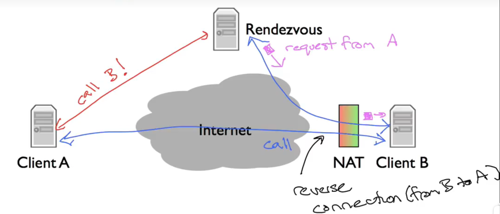

clientB连接到Rendezvous，clientA呼叫B，然后Rendezvous通知B有A的request，如果B同意就连接A，但是A连接B不行，于是A发送message到一台B已经连接上的电脑，告知B打开一个反向连接到A，这个称为reverse connection。

如果两个client都在NAT后面的话，就使用relay服务器互相发送信息

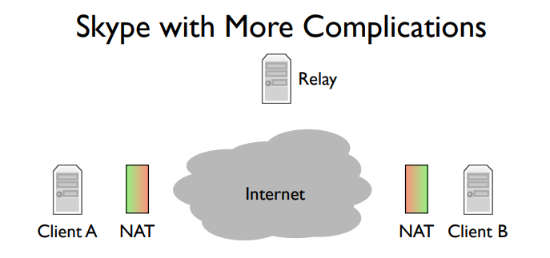

### 1-2 Four Layers

发送和接受数据非常相似：

- 不担心路径route和data
- 正确传递

四层Internet Model：

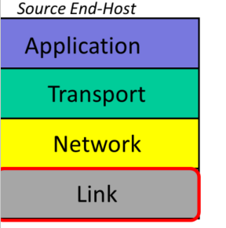

**Link Layer**：

互联网由终端主机、links和路由器组成拓扑网络传递数据

数据传送通过包package，包括data和header（包括来源和去向）

两种不同的Link Layer：以太网和WiFi

**Network Layer**：

端到端地传递数据包

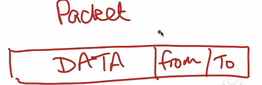

网络层的数据包称为Datagrams

Link Layer为Network Layer提供服务，如果Network传递datagrams来，Link将会传递一个Link到router，router的link接受到给network，network再发送给link并再传递，以此类推

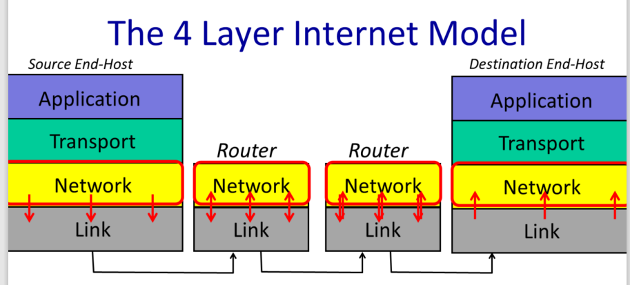

网络层不关心link

网络层必须使用Internet Protocol即IP：

- IP尽力传送datagrams到另一端，但不做保证
- IP datagrams可能会lost, out of order, corrupted，没有保证

**Transport Layer**：

常见传输协议TCP：Transmission Control Protocol，保证正确传递、顺序

如果不需要可靠的传递，可以用UDP：User Datagram Protocol

**Application Layer**：

例如使用HTTP协议发送`GET`

看起来似乎每一层都在互相通信而与其他层无关

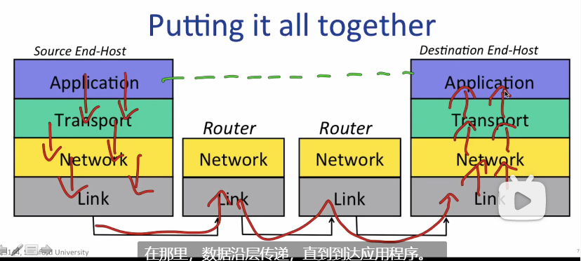

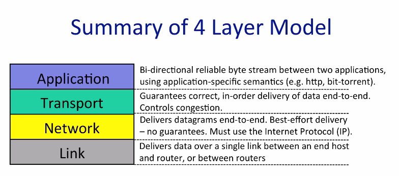

IP被称为瘦腰，因为Network只有IP一种协议

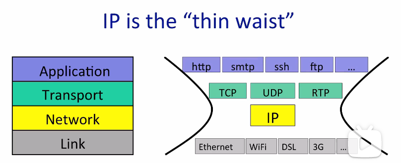

7层网络结构已经被废弃，但是Layer的编号还是遗留下来了

### 1-3 The IP service model

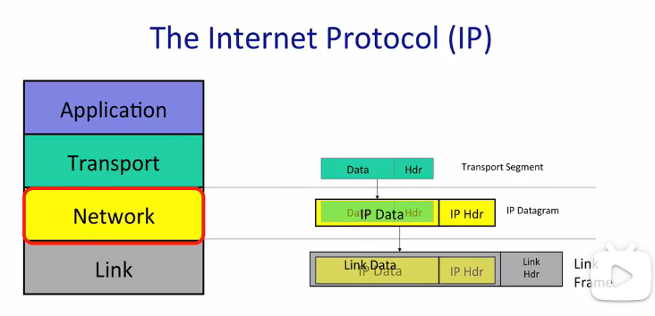

逐层传递加header

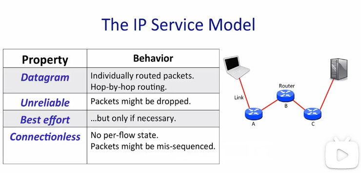

- datagram
  - `data | IPSA(source address) | IPDA(destination address)`
  - 利用路由发送信息，路由包含转发表forwarding table
  - 类似邮递
- unreliable
- best effort
  - 承诺只在必要时丢弃数据包，由于堵塞
  - 不会检测
- connectionless
  - 不是从建立与通信相关的某种状态开始的
  - 没有顺序

IP简单的原因：

- 快速低成本
- 端到端原则：尽量在端点上实现功能
- 允许可靠和非可靠的顶部service
- 对link layer很少assumption，目的是连接现有网络，甚至支持鸽子传输

IP Sevice：

- 阻止数据包无限循环
  - 在header中加入一个跳数字段，生存时间或者TTL字段，从128开始减，到0的时候就丢弃
- 数据包太长，IP会对它分段
  - 以太网<1500byte
- 使用header校验和来减少数据报传递到错误目的地的机会
- 允许IP的新版本
- 允许新字段添加到header中
  - 但是路由器很少支持相关的功能

IPv4 Datagram:

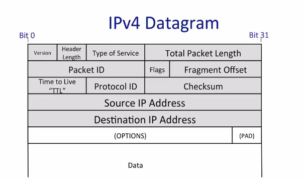

- Protocol ID
  - 如果为6，表示数据包含TCP段，这样可以安全地传递数据报给TCP代码，且可以解析
  - INNA定义了各种Protocol ID
- Version
- Total Packet Length
  - header+data最多64kBytes
- Time to Live, TTL
  - 防止循环，每次递减
- Packet ID, Flags, Fragment Offset
  - 帮助将package分片
- Type of Service
  - 告知数据的重要性
- Header length
- Checksum

### 1-4 A Day in the Life of a Packet

TCP Byte Stream：

- client和server
- 3-way handshake "SYN, SYN-ACK, ACK"
  1. 当client发送同步消息给server，称为SYN
  2. server用一个同步消息回复client，其中承认client同步，被称为SYN_ACK
  3. client回复承认server的同步消息，称为ACK
- 网络层为computer发送数据包，但传输层为application发送数据，因此前者需要知道IP地址，后者需要知道TCP端口

Inside the Stream：

- 路由决定将数据包发送到哪里
- 路由也有IP地址，所以它也可以接收数据包（比如登陆路由器等）

Inside Each Hop（路由如何选择link）：

- 使用forwarding table，包含IP address pattern和不同pattern对应的link
- forwarding table的第一个是default route，match所有IP address，查找longest prefix match

Under the Hood：

使用`wireshark`来查看TCP byte stream

使用`traceroute -w <timelimit> <url> `查看hops，出现`* * *`就是隐藏了

### 1-5 Principle: Packet Switching

packet switching: 独立传递任何一个达到的包，选择一个link，如果free就发送它，否则就等

使用packet switching的好处：

- 简单的packet传递
  - Flow: A collection of datagrams belonging to the same end-to-end communication, e.g. a TCP connection.
  - 每个包都是独立传递的self contained
- 有效的link共享
  - statistical multiplexing: taking a single resource and sharing it across multiple users
  - 谁更需要数据包就多给谁用

### 1-6 Laying principle

Layer的定义：只和上下层通信，利用下层功能和自身处理能力给上层提供service

- Modularity
- Well defined service
- Reuse
- Separation of concerns
- Continuous improvement
- Peer-to-peer communications

### 1-7 Encapslation principle

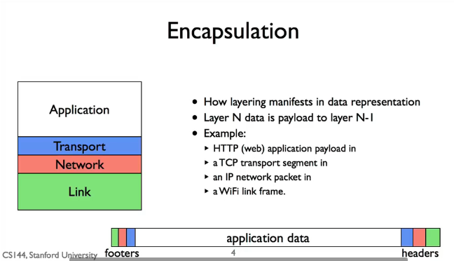

每一层会封装内容，application data是HTTP GET

注意上面的数据顺序，这是网路顺序

而软件顺序是