# 计算机网络：自顶而下方法

[TOC]

参考[计算机网络（自顶向下方法）学习笔记](https://blog.csdn.net/qq_39326472/article/details/88089747)

[计网思维导图文字版 · 语雀 (yuque.com)](https://www.yuque.com/xianyuxuan/coding/gez9yl)

## 第一章：计算机网络和因特网

### 1.1 什么是因特网

#### 1.1.1 具体构成描述

主机host或者端系统end system

端系统通过通信链路（communication link）和分组交换机（packet switch）连接在一起，不同链路有不同的传输速率，单位是bps；传输时信息分段成packet；分组交换机最著名的是路由器（router）和链路层交换机（link-layer switch）

端系统通过因特网服务提供商（Internet Service Provider，ISP）接入因特网，每个ISP本身就是多个分组交换机和多段通信链路组成的网络

端系统、分组交换机和其他因特网部件都要运行一系列协议Protocol

因特网标准Internet Standard由因特网工程任务组Internet Engineering Task Force，IETF研发，IETF的标准文档称为请求文档Request For Comment，RFC

#### 1.1.2 服务描述

分布式应用程序

通过套接字接口socket interface来向其他端系统发送信息

### 1.2 网络边缘

主机划分成为客户端和服务器

#### 1.2.1 接入网

指将端系统物理连接到其边缘路由器的网络。边缘路由器端系统到任何远程端系统的路径上的第一台路由器。

1. 家庭接入：DSL、电缆、FTTH、拨号和卫星

   数字用户线 Digital Subscriber Line，网络连接和电话同一根线

   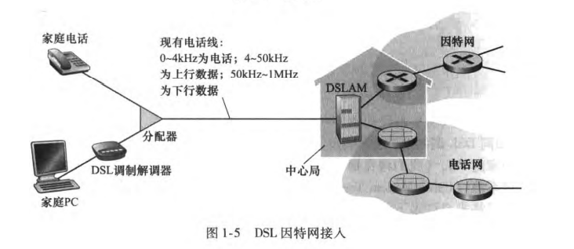

   电缆利用有线电视公司现有的有线电视基础设施，电缆上同时使用下行网络将变慢

   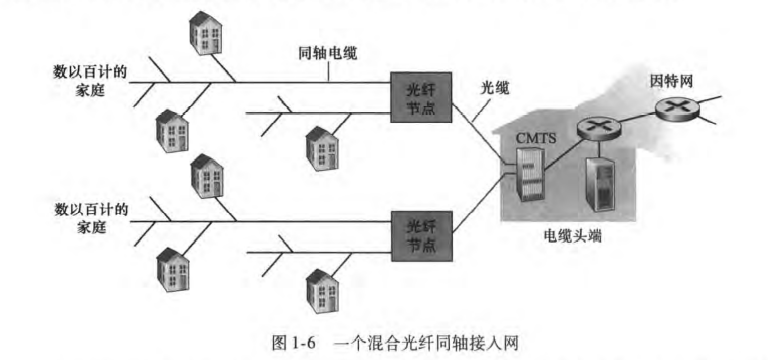

   FTTH（Fiber To The Home）光纤到户。直接光纤给每户设置一根光纤，更常见的是共享一根，分为主动光纤网络（Active Optical Network，AON）和被动光纤网络（Passive Optical Network，PON）。前者本质上是交换因特网

   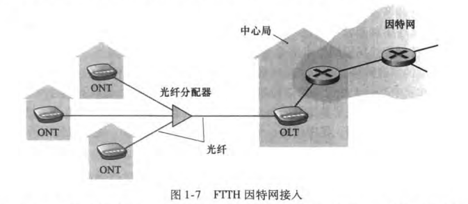

2. 企业或家庭接入：以太网和WiFi

   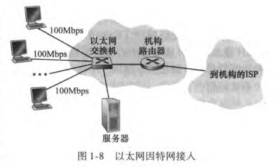

3. 广域无线接入：3G和LTE

#### 1.2.2 物理媒体

- 导引型媒体
  - 固体：光缆、双绞铜线
- 非导引型媒体
  - 无线局域网等

### 1.3 网络核心

#### 1.3 分组交换

分组交换机使用**存储转发传输** (store-and-forward transmission) 机制，表示开始输出packet的之前须接受到整个分组

端到端时延$d_{端到端}=N\frac{L}{R}$，其中$N$是几条链路，$L$是数据量，$R$是速率

每台分组交换机有多条链路与之相连，存在一个**输出缓存**，也称**输出队列**，分组有**排队时延**，如果缓存空间满了，还会出现**分组丢失（丢包）**的现象

路由器采用**转发表**forwarding table来转发，采用**路由选择协议**自动设置转发表

除了分组交换（如因特网），还有**电路交换**（如电话网络），当要通信的时候会建立一条专用的**端到端连接**

#### 1.4 分组网络中的时延、丢包和吞吐量

节点总时延=节点处理时延+排队时延+传输时延+传播时延

传输时延是路由器推出packet所需要的时间

传播时延是一台路由器到了一台路由器所需要的时间

排队时延最复杂：

- 流量强度：$La/R$，$L$是packet大小，单位是bit，$a$是达到队列的平均速率（pkt/s），$R$是传输速率，单位是bit
- 当流量强度大于1的时候，队列无限增加，故必须控制在1以下

瞬时吞吐量是某主机接收文件的速率

平均吞吐量

瓶颈链路：链路上的速率不同，传输速度是最小值

#### 1.5 协议层次及其服务模型

1. 协议分层

   1. 应用层

      如HTTP、SMTP和FTP，借助特定的应用层协议如DNS完成

      应用层信息分组称为报文message

   2. 运输层

      TCP和UDP，TCP将长报文划分成短报文并提供拥塞控制机制，当网络拥塞的时候源抑制其传输速度，UDP提供无连接服务，此层分组称为报文段segment

   3. 网络层

      此层分组为数据报datagram，协议是IP

   4. 链路层

      此层分组称为帧frame，例子包括以太网、WiFi和电缆接入网的DOCSIS协议

   5. 物理层

      物理层将帧中的一个个比特从一个节点移到下一个节点，与实际传输媒体相关，如双绞铜线、同轴光缆、光纤

2. OSI模型

3. 封装

   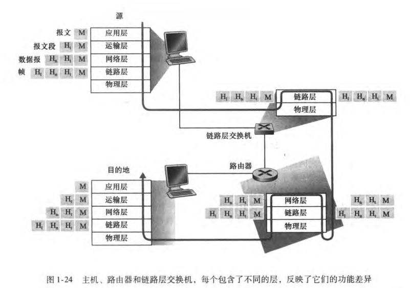

## 第二章：应用层

### 2.1 应用层协议原理

应用体系结构：

- 客户-服务器体系结构
- P2P体系结构

进程通过套接字socket的软件接口向网络发送报文和从网络接受报文，socket也被称为应用程序和网络之间的应用程序编程接口，对运输层基本没有控制权（仅能选择运输层协议、设定几个参数）

运输服务的分类：

- 可靠数据传输，不需要可靠数据传输的应用称为容忍丢失的应用
- 吞吐量，具有吞吐量要求的应用称为带宽敏感的应用，否则称为弹性应用
- 定时
- 安全性

TCP服务：

- 面向连接的服务：在应用层数据报文开始流动之前，TCP让客户和服务器交换运输层控制信息，然后TCP连接在两个进程之间建立了，这条连接是全双工的
- 可靠的数据传送服务

（TCP和UDP都没有加密机制，目前TCP安全加强版SSL（Secure Socket Layer），这种强化是应用层的优化）

UDP服务：

- 无连接，不握手

### 2.2 Web和HTTP

#### 2.2.1 HTTP概述

Web应用层协议是HTTP。Web页面是由对象组成的，一个对象是一个文件且可以通过URL寻址，多数Web页面包含一个HTML基本文件和几个引用对象。

URL地址包括：存放对象的服务器主机名和对象的路径名

HTTP是一个无状态协议，它不保存任何关于客户的信息

#### 2.2.2 持续连接与非持续连接

- 后者每一个请求/响应对是经过一个单独的TCP连接发送的
  - 缺点：为每个请求对象建立和维护一个全新的连接，每一个对象经受2RTT的时延
- 前者是经相同的TCP连接发送的

TCP的三次握手：RTT表示Round-Trip Time指一个短分组从客户到服务器再到客户花费的时间

#### 2.2.3 HTTP报文的格式

请求报文：

第一行是请求行request line，其后是首部行header line

请求行有3个字段：方法字段、URL字段和HTTP版本字段

`Host`是Web代理高速缓存所要求的

`Connection: close`告诉服务器不要使用持续连接，发送完即可关闭连接

`User-agent`指明用户代理，服务器可以为不同类型的用户代理发送相同对象的不同版本

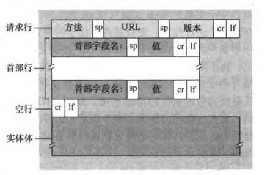

其中实体体entity body是POST方法使用的，Web页面的特定内容依赖于用户的输入

响应报文：

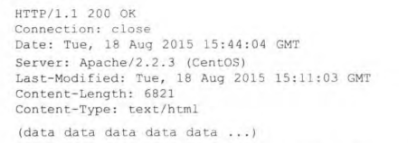

初始行、首部行、实体体

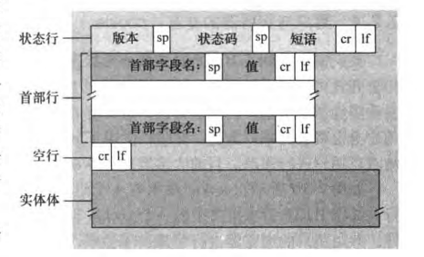

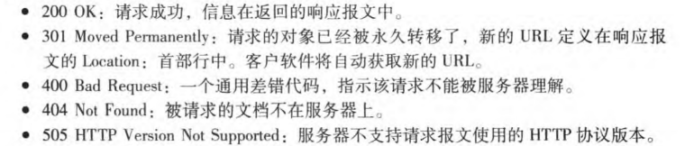

#### 2.2.4 用户与服务器的交互：cookie

- 在HTTP响应报文中的一个cookie首部行 `Set cookie: <cookie id>`
- 在HTTP请求报文中的一个cookie首部行 `Cookie: <cookie id>`
- 在用户端系统中保留有一个coolie文件，并由用户的浏览器进行管理
- 位于Web站点的一个后端数据库

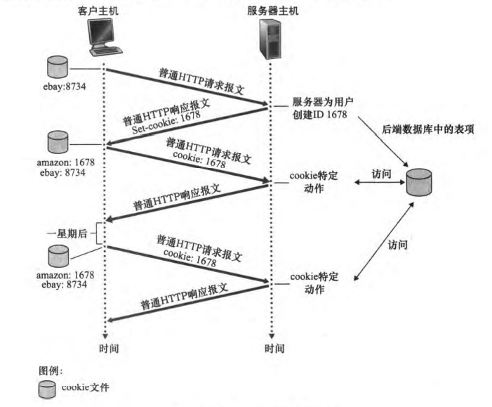

#### 2.2.5 Web缓存（代理服务器）

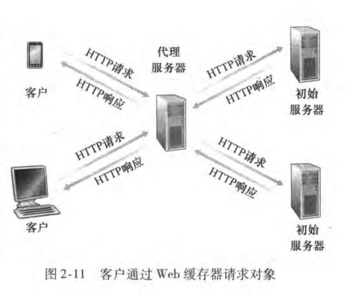

代理服务器先自己查找是否有客户请求的内容，如果存在就直接返回客户，否则打开和原始服务器的连接然后存储在本地，然后返回给用户

内容分发网络Content Distribution Network, CDN公司安装大量分散的缓存器使得流量本地化

#### 2.2.6 条件GET方法

代理服务器里的内容可能是旧的，引入条件GET方法，在请求报文中加一个`If-Modified-Since`。

代理服务器发送给初始服务器条件GET方法来更新数据，Web服务器返回响应报文

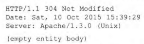

### 2.3 因特网中的电子邮件

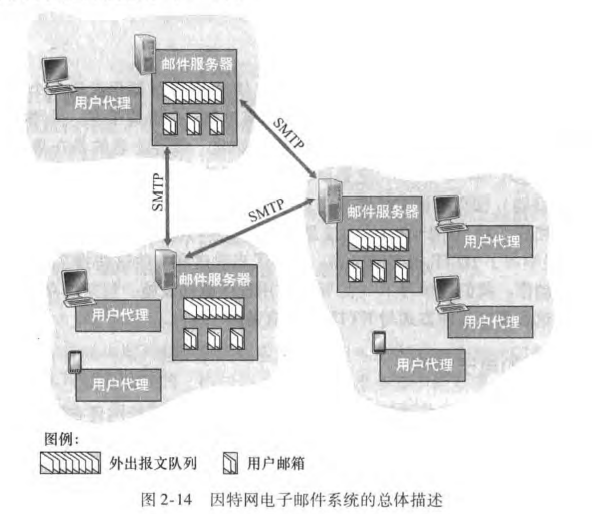

#### 2.3.1 SMTP

SMTP限制所有的邮件报文的体部分只能采用ASCII表示

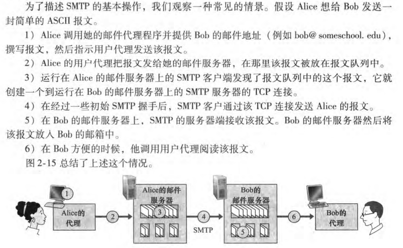

SMTP不使用中间邮件服务器，端口是25，尝试连接`telnet serverName 25`，下面是SMTP握手协议的例子：（S表示Server，C表示Client）

HTTP是拉协议（获取信息），SMTP是推协议（将信息发送出去）

SMTP典型报文如下：

#### 2.3.4 邮件访问协议

注意上图的发送逻辑：Alice通过代理SMTP发送邮件到邮件服务器上，Alice的邮件服务器用SMTP连接到Bob的邮件服务器上，如对方的邮件服务器关机，就会每30min发送一次报文直到对方的邮件服务器变得可以运行为止。此时Bob**不能**用SMTP获得报文，他应该使用第三版的邮局协议Post Office Protocol-Version 3, POP3 / Internet Mail Access Protocol, IMAP以及HTTP

POP3：

- 三个阶段：特许、事务处理以及更新
- 端口：110
- 特许：用户代理发送明文用户名和口令以鉴别用户
  - 两个主要命令：`user <user name>`和`pass <password>`
  - 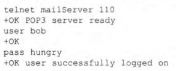
  - 正确返回`+OK`，错误返回`-ERR`
- 事务处理：用户代理取回报文，同时用户代理还能对报文做删除标记、取消删除标记以及获取统计信息
  - 可以发送`list/retr/dele`命令
  - 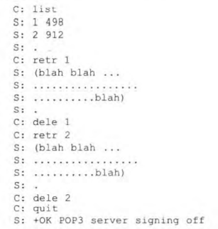
- 更新：用户发出quit之后结束POP3会话并删除被标记删除的报文

IMAP：

- 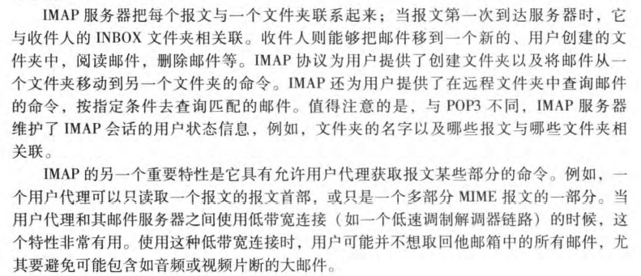

基于Web的电子邮件：

Alice用浏览器发送以及Bob用浏览器接收的时候采用HTTP，中间服务器之间的收发是SMTP

### 2.4 DNS：因特网的目录服务

#### 2.4.1 DNS提供的服务

域名系统Domain Name System, DNS：主机名到IP地址转换的目录服务

DNS：

- 一个由分层的DNS服务器实现的分布式数据库
- 一个使得主机能够查询分布式数据库的应用层协议

- 运行在UDP之上，使用53号端口

解析IP的过程：

- 同一台用户主机上运行着DNS应用的客户端
- 浏览器从URL中抽取主机名，并将这个主机名传给DNS应用的客户端
- DNS客户向DNS服务器发送一个包含主机名的请求
- DNS最终收到一份回答报文，其中含有该主机名的IP地址
- 一旦浏览器接受到来自DNS的该IP地址，它能够向该IP地址80端口的HTTP服务器进程发起一个TCP连接

DNS的其他功能：

- 主机别名、规范主机名
- 邮件服务器别名
- 负载分配

#### 2.4.2 DNS工作机理概述

1. 分布式、层次数据库

   DNS服务器类型：根服务器、顶级域DNS服务器（TLD）和权威DNS服务器。用户先联系根，根返回顶级域名的IP地址（如com），然后用户联系TLD服务器，返回权威服务器的IP地址（如facebook.com）

   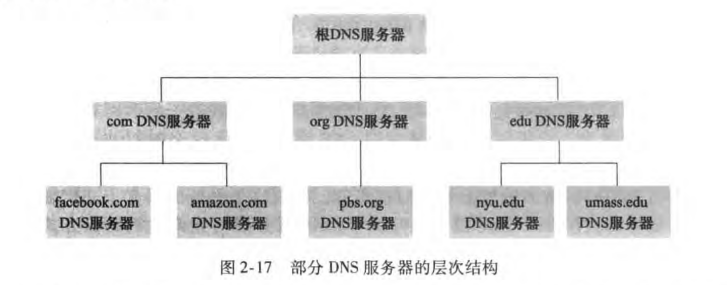

   另外还有本地DNS服务器，先向本地DNS服务器发送请求，然后它转发给根等层级，最后返回给用户（类似代理）

2. DNS缓存

   本地DNS服务器会缓存主机名/IP地址对，DNS服务器在一段时间（通常设置为2天）将丢弃缓存的信息

#### 2.4.3 DNS记录和报文

所有DNS服务器存储了资源记录Resource Record,RR，其中提供主机名到IP地址的映射

RR是一个四元组`(Name, Value, Type, TTL)`

`TTL`是该记录的生存时间，决定资源记录

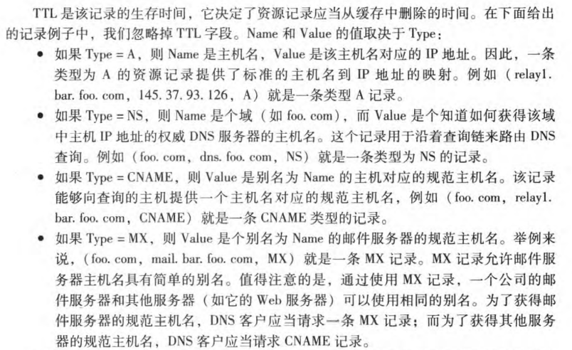

如果一台DNS是权威服务器，那么就会包含一条A记录

如果不是一台权威服务器，那么就会包含一条NS和一条A

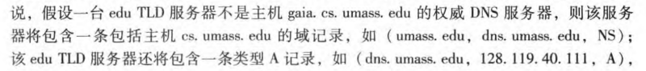

报文：

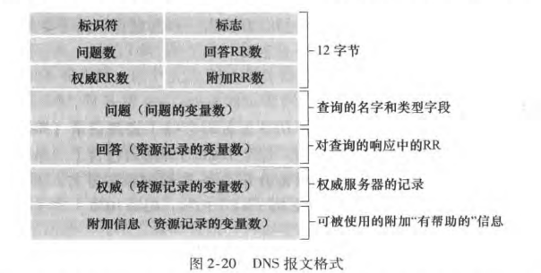

向DNS数据库中插入记录：

在注册登记机构注册域名，注册机构将一个类型NS和一个类型A的记录输入TLD com服务器

### 2.5 P2P文件分发

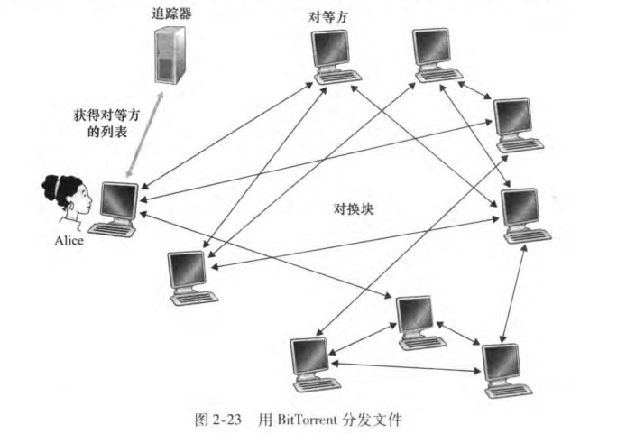

当用户加入torrent的时候，它向tracker周期性注册表明仍然在torrent中，然后tracker随机从参与对等方的集合中选择对等方的一个子集IP地址发给用户。用户与这些其他用户尝试建立TCP连接，成功创建的称为“邻近对等方”。用户周期性地询问每个邻近对等方他们所具有的块（chunk，256KB）列表，然后对它没有的块发出请求

请求：用户采用**最稀缺优先**技术，首先申请最稀缺的块

发送：选择当前能够以最高速率向她提供数据的邻居，给出其优先权

### 2.6 视频流和内容分发网

#### 2.6.2 HTTP流和DASH

看视频时，用户和服务器建立TCP连接并发送GET请求，流式视频应用程序周期性地从用户应用程序缓存中抓取帧并对这些帧压缩并在用户屏幕上展现

对于不同用户以及相同用户的不同时间，用户带宽不同，所以产生**经HTTP的动态适应性流**（Dynamic Adaptive Streaming over HTTP, DASH）。视频编码成不同版本，用户动态请求来自不同版本且长度为几秒的视频段数据块

HTTP服务器有个Manifest File来提供每个版本的URL和比特率

#### 2.6.3 内容分发网CDN

视频流公司在CDN服务器中存储副本

1. CDN操作

   CDN必须根据URL找到适合客户的CDN服务器集群并将请求重定向到该集群的某台服务器上。大多数CDN使用DNS来截取并重定向。

   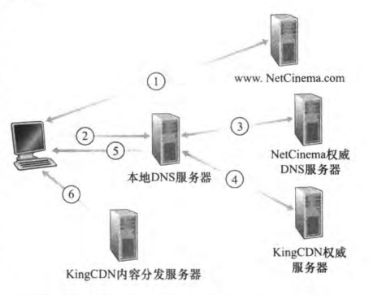

   权威服务器会重定向给本地DNS服务器返回一个CDN的权威服务器

2. 集群选择策略

   地理上最为邻近策略，但是有的时候不是最近，而且永远固定。最好CDN实时测量时延和丢包性能

### 2.7 套接字编程：生成网络应用

#### 2.7.1 UDP套接字编程

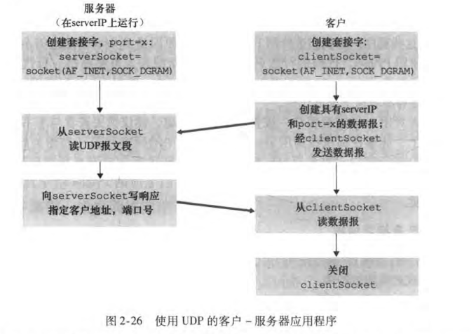

#### 2.7.2 TCP套接字编程

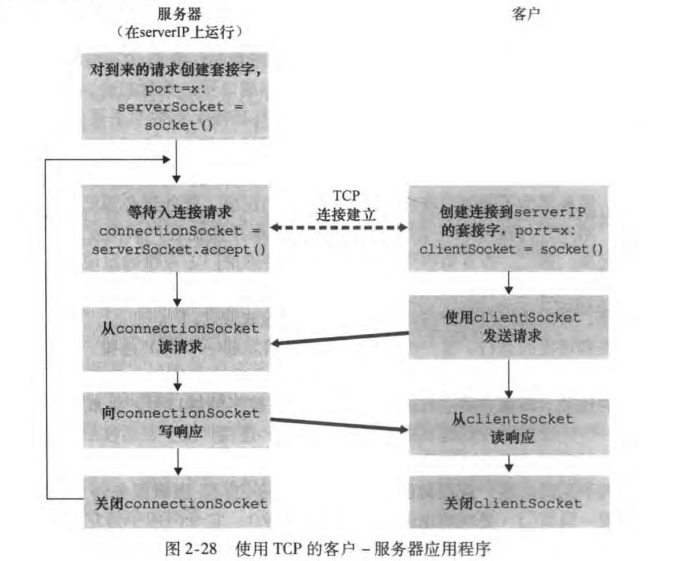

## 第三章：运输层

### 3.1 概述和运输层服务

运输层协议只工作在端系统上

### 3.2 多路复用与多路分解

当运输层得到数据的时候，它将数据交给一个或多个socket之一，socket有唯一标识符

多路分解demultiplexing：将segment的数据交给正确的socket称为多路分解

多路复用multiplexing：从不同socket中收集数据块并封装header生成segment被称为多路复用

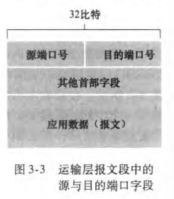

主机给socket分配端口号，得到的segment检查目的端口号送入对应的socket，UDP大体如此，但TCP比较复杂

1. 无连接的多路复用与多路分解

   即UDP，因为UDP不会连接。UDP用（源端口号，目的端口）来标识

   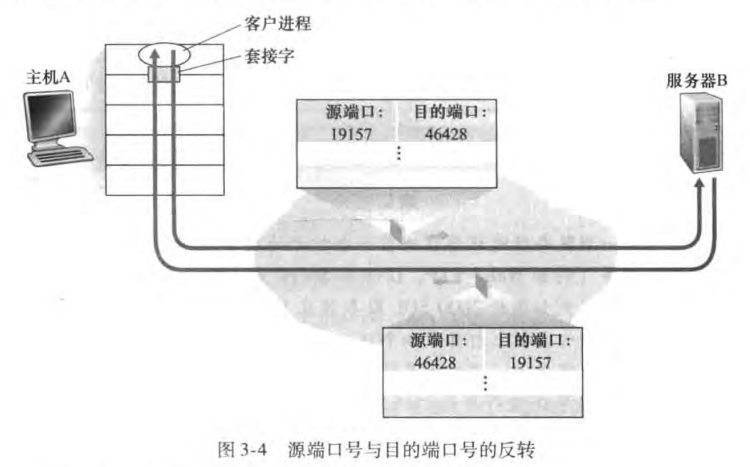

2. 面向连接的多路复用与多路分解

   TCP套接字是由四元组（源IP地址、源端口号、目的IP地址、目的端口号）来标识

   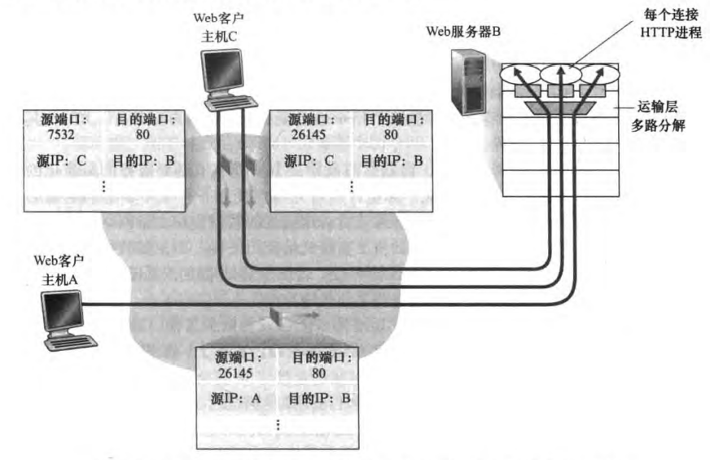

### 3.3 无连接运输：UDP

1. UDP报文段结构

   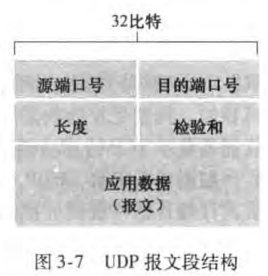

2. UDP校验和

   对报文段所有的16比特字的和进行反码运算，求和时遇到的任何溢出都被回卷（溢出的最高位1和低16位做加法）

   采用**端到端原则**：如果某种功能必须基于端到端实现，那么在较低级上设置功能是冗余没有价值的（即链路上或者路由器上检测没有价值）

### 3.4 可靠数据传输原理

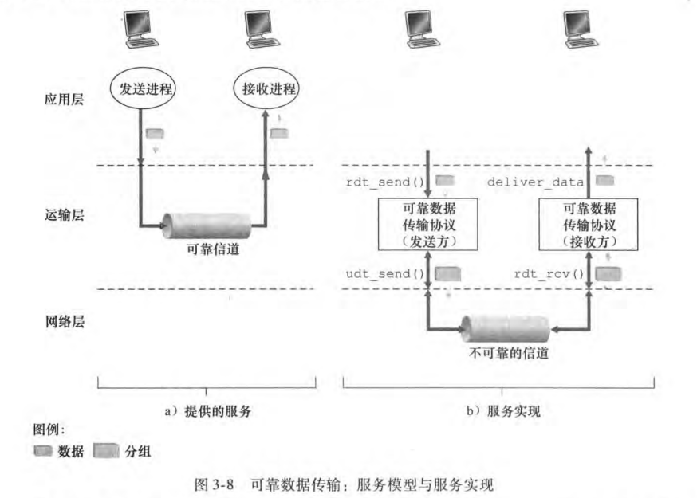

#### 3.4.1 构造可靠数据传输协议

参考

[网络原理自顶向下三可靠数据传输原理实现停等协议](https://blog.csdn.net/Thepatterraining/article/details/111139359)

[rdt1.0,rdt2.0,rdt2.1,rdt2.2,rdt3.0](https://blog.csdn.net/qq_33936481/article/details/53152903)

1. 经完全可靠信道的可靠数据传输

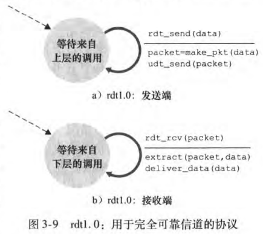

2. 经具有比特差错信道的可靠数据传输：**等停协议**

   自动重传请求（Automatic Repeat reQuest, ARQ）

   - 差错检测：分组校验和
   - 接收方反馈：从接受方向得到ACK与NAK分组，只需要一个比特长（用0表示NAK，用1表示ACK）
   - 重传

   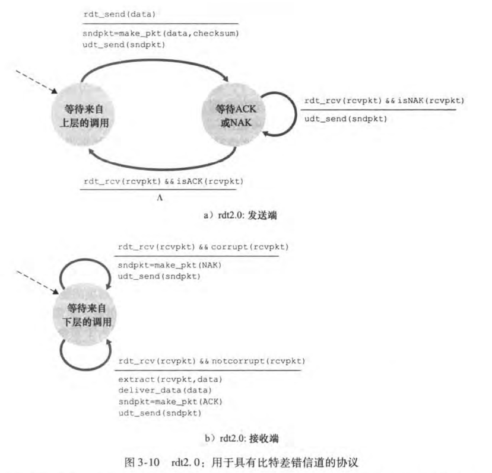

   这里有致命问题：没有考虑ACK或者NAK分组受损的情况。解决的方法：在数据分组中添加一个新字段，让发送方对其数据分组编号。当发送方收到接收方的ACK/NAK的时候，如果序号相同表示接收方在重发ACK/NAK，因为我们认为信道可靠即不会丢包

   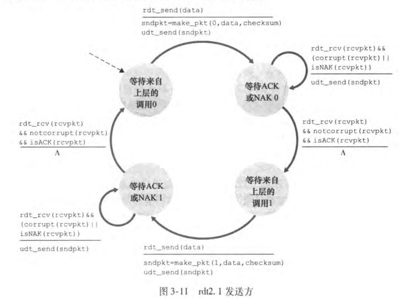

   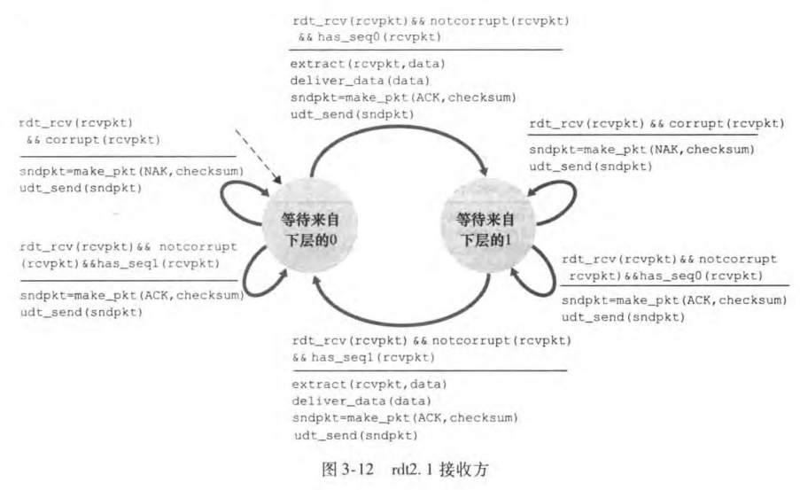

3. 经具有比特差错的丢包信道的可靠数据传输

   增加计时器

   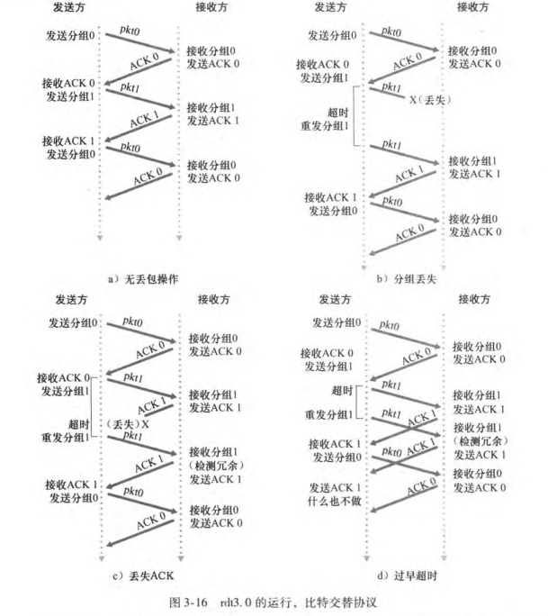

#### 3.4.2 流水线可靠数据传输协议

RTT：往返传播时延

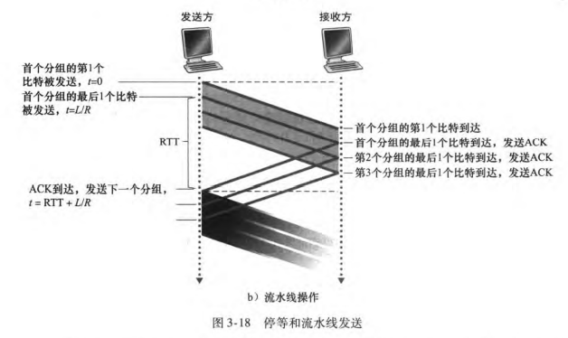

- 增加序号范围
- 接收方得缓存已正确接受的分组
- 回退N步（Go-Back-N, GBN）和选择重传（Selective Repeat, SR）

#### 3.4.3 回退N步

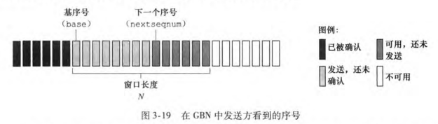

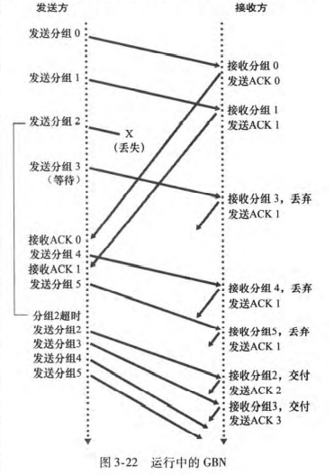

注意接受侧如果没有得到顺序分组就会丢弃

#### 3.4.4 选择重传

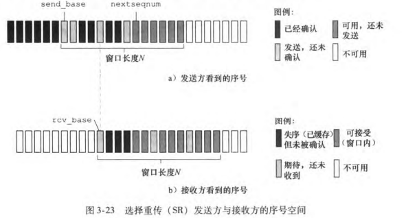

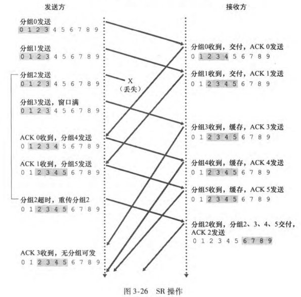

窗口必须小于或者等于序号空间大小的一半

### 3.5 面向连接的运输：TCP

#### 3.5.1 TCP连接

三次握手

发送缓存最大值是**最大报文段长度（MSS）**，本来是根据**最大传输单元（MTU）**来设置的，MTU一般是1500byte，MSS一般是1460byte

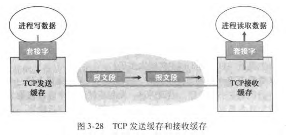

#### 3.5.2 TCP报文段结构

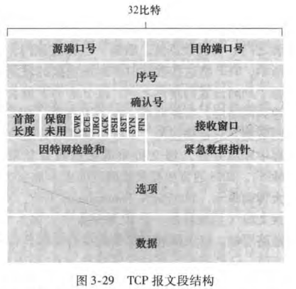

1. 序号和确认号

   当数据按照MSS大小分成多个报文段，每个字节有自己的序号（从0开始）

   主机A填充进报文段的确认号是主机A期望从主机B收到的下一字节的序号

2. Telnet

   Telnet不加密，更好使用SSH。

   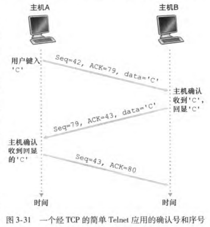

#### 3.5.3 往返时间的估计与超时

1. 估计

   TCP会在任意时刻为一个已发送但是还没被确认的报文段估计SampleRTT，由此计算EstimatedRTT，公式：$EstimatedRTT = (1-\alpha)\cdot EstimatedRTT+\alpha\cdot SampleRTT$，其中$\alpha$一般取0.125，这种平均称为**指数加权平均**（EWMA）

   RTT的偏差DevRTT用于估算SampleRTT偏离EstimatedRTT的程度：$DevRTT=(1-\beta)\cdot DevRTT+\beta\cdot\abs{SampleRTT-EstimatedRTT}$。$\beta$推荐值为0.25

2. 设置和管理重传超时间隔

   $TimeoutInterval=EstimatedRTT+4\cdot DevRTT$，推荐初始值是1秒

#### 3.5.4 可靠数据传输

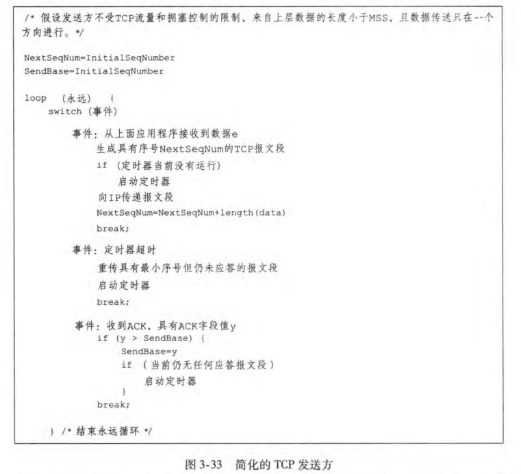

其中第三个事件：

SendBase是最早未被确认的字节的序号，$y$ > SendBase就表示ACK在确认一个或多个先前未被确认的报文段（TCP采用累积确认）

1. 一些有趣的情况

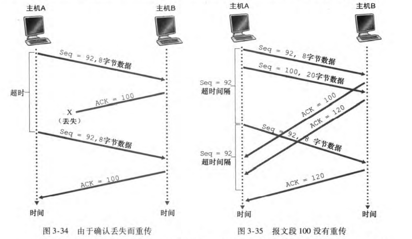

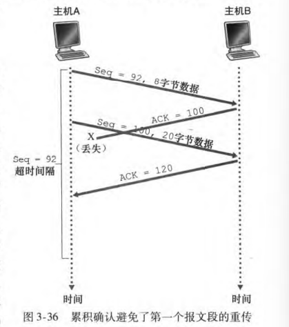

2. 超时间隔加倍

   超时的时候TimeoutInterval会加倍，因为这种情况往往是出现网络拥塞，如果持续重传会造成更加拥挤

3. 快速重传

   发送方可以在超时之前（因为2导致TimeoutInterval很长）得到接收方的冗余ACK来指示重传

   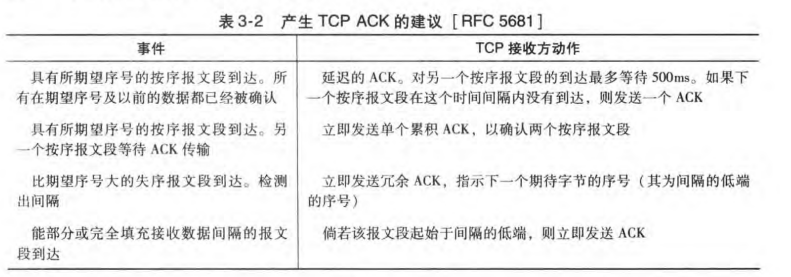

   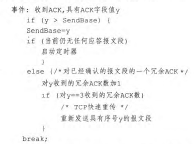

#### 3.5.5 流量控制

流量控制服务：匹配发送方的发送速率与接收方的读取速率

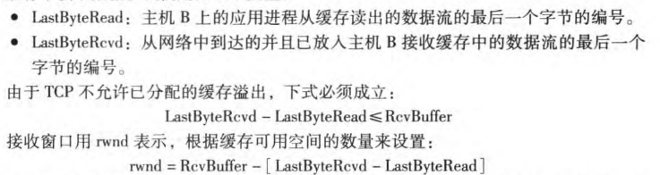

#### 3.5.6 TCP连接管理

第一步：client发送特殊TCP报文段，其中不含应用层数据，SYN标志为1，client还会随机选择一个初始序号 (client_isn)

第二步：服务器从数据报中提取出TCP SYN报文段，分配TCP缓存和变量，并向客户发送SYNACK报文段（SYN置1，首段确认号client_isn+1，server选择自己的初始序号server_isn）

第三步：客户给连接分配缓存和变量，发送一个报文段（确认号server_isn+1，SYN=0）

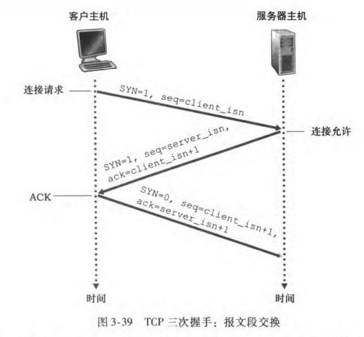

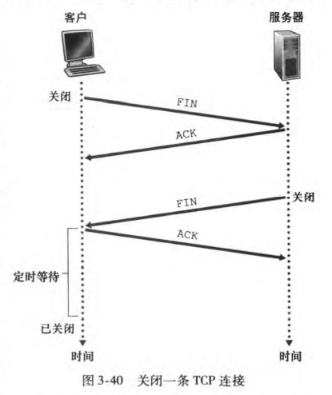

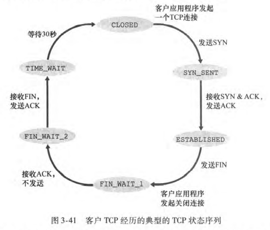

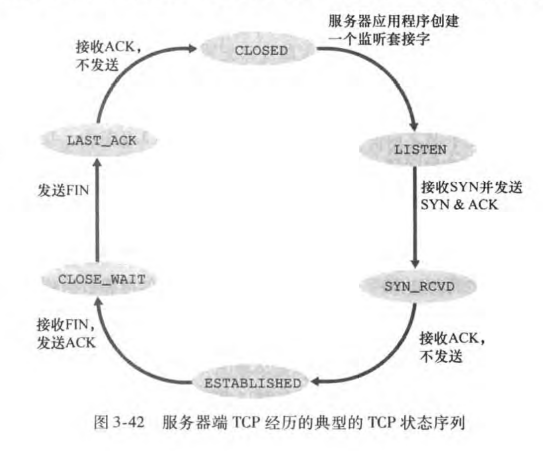

如果server不接受TCP连接，就发送一个RST=1的报文；如果sever接受到UDP分组而不匹配就发送特殊的ICMP数据报

### 3.6 拥塞控制原理

#### 3.6.2 拥塞控制方法

1. 端到端拥塞控制：TCP报文段丢失暗示网络拥塞，TCP会减少窗口长度
2. 网络辅助的拥塞控制：路由器向发送方提供网络中拥塞情况

### 3.7 TCP拥塞控制

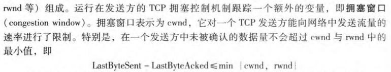

发送方的速率大约是`cwnd/RTT`字节/秒

TCP拥塞控制算法：

- 慢启动：初始cwnd为一个MSS（一次发送1个报文段），之后得到一个ACK拥塞窗口就翻倍（一次发送两倍的报文段）。
  - 结束情况一：当得到一个超时，就将cwnd设置为1并重新开始慢启动，并且将ssthresh设置为cwnd/2
  - 结束情况二：当cwnd等于ssthresh就结束慢启动并且TCP转移到拥塞避免模式
  - 结束情况三：检测到3个冗余ACK并开始快速重传并进入快速恢复状态

- 拥塞避免：

  - 每过一个RTT，cwnd只增加一个MSS

  - 当出现超时的时候，cwnd设置为1个MSS，ssthresh设置为cwnd的一半

  - 出现冗余ACK的时候cwnd减半并且将ssthresh记录为cwnd的一半

- 快速恢复
  - 收到每个冗余的ACK，cwnd增加一个MSS
  - 当丢失报文段的一个ACK到达的时候，TCP降低cwnd之后进入拥塞避免
  - 如果出现超时，采取慢启动和拥塞避免相同的动作并进入慢启动

## 第四章：网络层：数据平面

### 4.1 网络层概述

#### 4.1.1 转发和路由选择：数据平面和控制平面

网络层功能：

- 转发
  - 利用转发表
  - 控制平面：远程控制器计算并分发转发表，方法是**软件定义网络**
- 路由选择
  - 利用路由选择算法

#### 4.1.2 网络服务模型

网络层提供**尽力而为服务**

### 4.2 路由器工作原理

路由器组件：

- 输入端口：输入端与数据链路层交互，并查询转发表
- 交换结构：将输入端口连接到它的输出端口
- 输出端口
- 路由选择处理器：执行控制平面功能。在SDN中负责与远程控制器通信并安装转发表

#### 4.2.1 输入端口处理和基于目的地转发

路由器可以用地址的前缀来进行匹配，使用**最长前缀匹配规则**

#### 4.2.2 交换

- 经内存交换
- 经总线交换
- 经互联网交换：非阻塞式、可并行

#### 4.2.4 何处出现排队

1. 输入排队

   HOL（Head-Of-the-Line, HOL）阻塞现象：输入队伍第一个阻塞之后后面以此被阻塞

2. 输出排队

   输出端口在一个单位时间（该分组的传输时间）内仅能传输一个分组，因此即使$R_{switch}$比$R_{line}$快$N$倍，当同时有$N$个分组分别到达$N$个输入端口的时候，会一下子在输出端口产生$N$个的分组排队

   要么采取**弃尾**策略，要么删除一个或多个已排队的分组来为新的分组腾出空间（**主动队列管理AQM**，其中最广泛的的算法是**随机早期检测**）

   输出端口还需要采用**分组调度**来选择一个分组来传输

#### 4.2.5 分组调度

1. FIFO

2. 优先权排队

   

   

3. 循环和加权公平排队

   简单地循环排队：分组被分类，但是没有优先权，各类依次服务一个然后循环

   加权公平排队Weighted Fair Queuing, WFQ：每个类有权重

### 4.3 网际协议：IPv4、寻址、IPv6及其他

#### 4.3.1 IPv4数据报格式

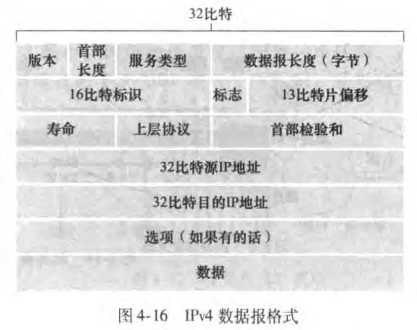

- 服务类型：提供不同类型的IP数据报
- 标识、标志、片偏移：这三个字段与IP分片有关，但是最新的IPv6不允许对分组分片
- 首部校验和：将首部中的每2个字节当做一个数，用反码算术对这些数求和

#### 4.3.2 IPv4数据报分片

链路层帧能承载的最大数据量叫做**最大传送单元MTU**

最后一个片的标志是0，其他所有片的标志位1

偏移字段指定该片应该放在初始IP数据报的哪个位置

#### 4.3.3 IPv4编址

主机与物理链路之间的边界叫**接口**，IP地址与一个接口相关联

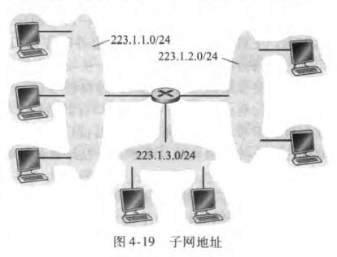

其中`/24`是子网掩码，表示最左侧24比特定义了子网地址

一个子网中又可以划分小的子网

IP广播地址255.255.255.255，当主机发送目的地址为此的数据报时，该报文会交付给同一网络中的所有主机

1. 获取一块地址

2. 获取主机地址：动态主机配置协议DHCP

   DHCP是一个客户-服务器协议。每个子网有一台DHCP服务器或者一个DHCP中继代理（通常是路由器，它知道该网络中的DHCP服务器地址）

   步骤：

   - DHCP服务器发现。使用DHCP发现报文，在UDP分组中向67发送报文，目的地址是广播地址255.255.255.0，源地址是0.0.0.0。
   - DHCP服务器提供。DHCP提供报文对客户做出响应。该报文继续广播所有节点。包含发现报文的事务ID、向客户推荐的IP地址、网络掩码以及IP地址租用期（即IP地址有效的时间量）
   - DHCP请求。客户从多个服务器中选择一个，并向选择的服务器发送DHCP请求报文
   - DHCP ACK。服务器用DHCP ACK对DHCP请求报文进行响应，证实所要求的参数

   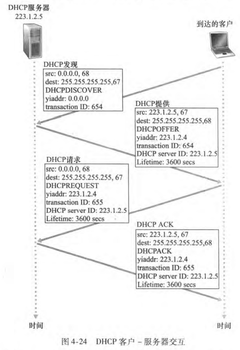

#### 4.3.4 网络地址转换

NAT（Network Address Translation）

专用网络，仅对该网络中的设备有意义的网络

NAT对外界相当于具有单一IP地址的单一设备

NAT路由器上有NAT转换表，家庭网络主机发送一个数据报的时候将LAN地址转换成WAN地址和端口，然后再去访问广域网，NAT将这个entry记录在路由器上

#### 4.3.5 IPv6

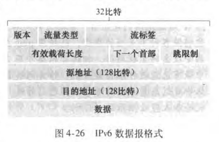

- 流标签：标识一条数据报的流，并给出优先级区分

注意：

- IPv6不允许在中间路由器上进行分片与重新组装，只能在源与目的地执行。如果路由器收到数据报太大的话直接丢弃并且返回一个ICMP的差错报文
- 首部校验和去除，因为TCP/UDP以及数据链路层执行了校验

### 4.4 通用转发和SDN

流表：

- 首部字段值的集合
- 计数器集合
- 当分组匹配流表项时所采取的动作集合

#### 4.4.1 匹配

#### 4.4.2 动作

- 转发：入分组可以转发到一个特定的物理输出端口，广播到所有端口，或通过所选的端口集合进行多播
- 丢弃：没有动作的流表项直接丢弃
- 修改字段：在分组被转发到所选的输出端口之前，分组首部10个字段中的值可以重写

## 第五章：网络层：控制平面

### 5.2 路由选择算法

按照算法是分布式还是集中式来划分：

- 集中式路由选择算法：在计算之前得到全局信息，称为**链路状态LS算法**
- 分散式路由选择算法：路由器以迭代、分布式方法计算最低开销路径，使用**距离向量DV算法那**

按静态和动态分类：

- 静态路由选择算法
- 动态路由选择算法

负载敏感与负载迟钝分类：

- 负载敏感算法
- 负载迟钝算法

#### 5.2.1 链路状态LS算法

Dijkstra算法

缺点：当所有节点都跑LS算法很可能会往同一条路径上发送流量，导致网络拥堵

解决：自同步，初始时以同一周期但在不同时刻执行算法

#### 5.2.2 距离向量DV算法

迭代、异步和分布式的算法

距离向量就是当前$x$到任意一个节点的最短距离，逐次更新距离向量。如果x的距离向量因这个更新步骤而改变，$x$会继而让所有邻居更新它们自己的距离向量。$D_x(y)$收敛到$d_x(y)$

问题：

1. 无穷计数问题

   会出现一种问题，假如$x$要发送信息到$z$，当$x$与$y$之间的cost突然增加，而$x$和$y$之间的距离向量里有之前的老数据，就会导致它会更新$D_y(x)$为$c(y,z)+D_z(x)=1+4=5$，其中后者还没有更新。于是就会导致$x$和$y$一直互传并每次增加$D_y(x)$ 1，最后才会发现。故缺点是：坏消息传输很慢

   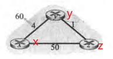

2. 增加毒性逆转

   $D_z(x)$善意撒谎说自己是$\infin$，但多个节点的无穷计数难以解决

与DV的对比：

1. 报文复杂性：LS更多，$O(VE)$
2. 收敛速度：LS $O(V^2)$，而DV收敛慢并且会遇到路由选择环路
3. 健壮性：如果路由器发生故障LS只计算自己的转发表，某种程度上是分离的；而DV会传播错误故障

### 5.3 因特网中自治系统内部的路由选择：OSPF

路由器组织成**自治系统AS**，每个自治系统有个全局唯一的AS号（ASN），在相同的AS中的路由器都运行相同的路由选择算法并且拥有彼此的信息，算法是**自治系统内部路由选择协议**

其中常用的是**开放最短路优先OSPF**。一台路由器构建整个自治系统的完整拓扑图。

优点：

- 安全
- 多条相同开销的路径
- 对单播与多播路由选择的综合支持
- 支持在单个AS中的层次结构

### 5.4 ISP之间的路由选择：BGP

分组跨多个AS进行路由的时候，需要一个**自治系统间路由选择协议**

所有AS运行相同的AS间路由选择协议，称为**边界网关协议**（BGP）

#### 5.4.1 BGP的作用

在BGP中，分组不是路由到一个特定的IP地址，而是如138.16.68/22的子网

BGP给每个路由器提供：

- 从邻居AS中获得前缀的可达性信息
- 确定到该前缀的最好的路由

#### 5.4.2 通告BGP路由信息

在每个AS，每个路由器要么是网关路由器，要么是内部路由器

在BGP中每对路由器通过179端口的半永久TFCP连接交换路由选择信息，每条连接上发送的BGP报文，称为**BGP连接**，跨越两个AS的BGP连接称为外部BGP连接，否则为内部BGP连接

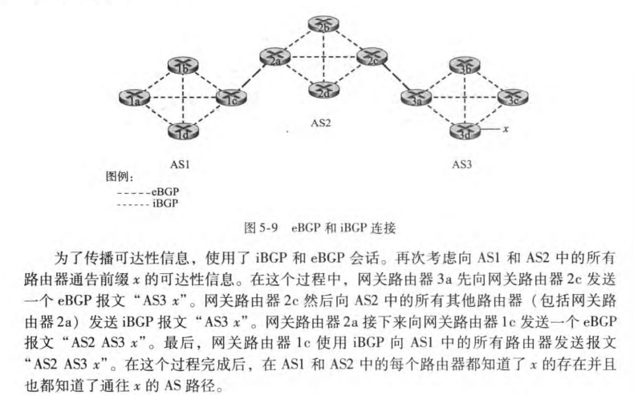

#### 5.4.3 确定最好的路由

路由器通过BGP连接通告前缀的时候会在前缀中包括一些**BGP属性**，前缀及其属性叫做**路由**

两个重要的属性：

- `AS-PATH`：包含已经通过的AS列表（还会以此检测和防止环路）
- `NEXT-HOP`：指AS-PATH起始的路由器接口的IP地址

BGP路由选择算法：

- 热土豆路由选择

  

- 路由选择算法（出现多条路由）

  - 路由被指派一个**本地偏好值**local preference，具有最高本地偏好值的路由将被选择
  - 从余下的路由中选择具有最短AS-PATH的路由，如果该规则是路由选择的唯一规则，则BGP使用距离向量算法决定路径，其中距离测度使用AS跳的跳数而不是路由器跳的跳数
  - 从余下的路由中使用热土豆路由选择，即选择具有最靠近`NEXT-HOP`路由器的路由
  - 如果仍留下多条路由，该路由器使用BGP标识符来选择路由

#### 5.4.4 IP任播

常常用在DNS中。DNS多台遍布全球的根服务器设置成统一的IP地址，当一个DNS请求向某个地址发送的时候，使用IP任播将该请求路由到负责该地址最近的那个DNS根服务器去。

#### 5.4.5 路由选择策略

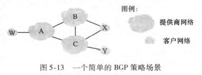

上图中X作为作为客户网络，不想参与提供商网络，所以就不将B—X—C的BGP路由通告出来

#### 5.4.6 拼装在一起：在因特网中呈现

推荐阅读原文。

### 5.5 SDN控制平面

#### 5.5.1 SDN控制平面：SDN控制器和SDN网络控制应用程序

控制器：

- 通信层：SDN控制器和受控网络设备之间的通信
- 网络范围状态管理层
- 对于网络控制应用程序层的接口

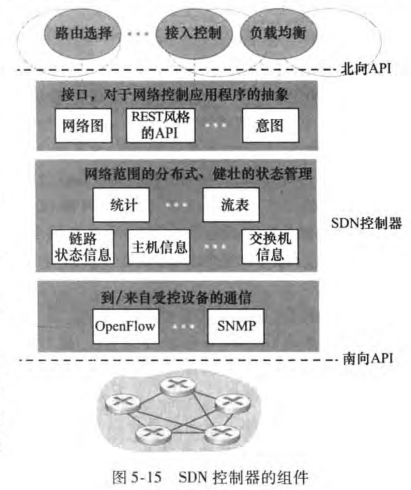

#### 5.5.2 OpenFlow协议

OpenFlow运行在TCP之上，使用6653的默认端口号。从控制器到受控交换机流动的重要报文有下列这些：

- 配置：允许控制器查询并设置交换机的配置参数
- 修改状态：控制器增加或者修改交换机流表中的表项，并且设置交换机端口特性
- 读状态：该报文被控制器用于从交换机的流表和端口手机统计数据和计数器值
- 发送分组：该报文被控制器用于在受控交换机从特定的端口发送一个特定的报文

从受控交换机到控制器的报文：

- 流删除。该报文通知控制器已删除一个流表项
- 端口状态。通知端口状态变化
- 分组入。如果一个分组不能和任何流表项匹配，那么这个分组将被发送给控制器进行额外处理

#### 5.5.3 数据平面和控制平面交互的例子

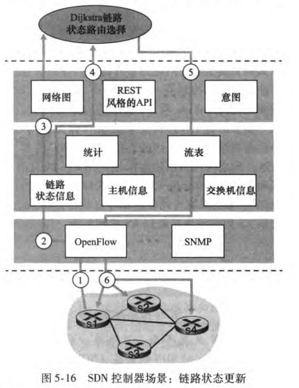

### 5.6 ICMP：因特网控制报文协议

ICMP：主机和路由器彼此沟通网络层信息。典型的用途是差错报告

ICMP报文有一个类型字段和一个编码字段，并且包含引起该ICMP报文首次生成的IP数据报的首部和前8个字节

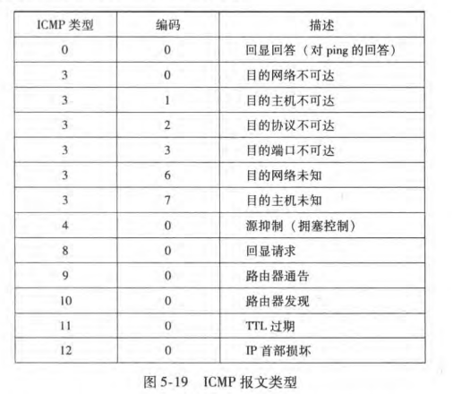

ping发送一个类型8编码0的报文到主机，然后主机返回一个类型0编码0的报文

traceroute使用ICMP报文实现，源主机发送一系列普通的IP数据报，其中携带了一个不可达UDP端口号的UDP报文段，第一个数据报TTL是1，第二个是2，以此类推。源主机为每个数据报启动定时器，当达到某台路由的时候观测到TTL刚好过期就会丢弃并且发送一个ICMP告警报文给源主机（类型11编码0），该告警报文中含有路由器的IP名字和IP地址。当目的主机发送一个端口不可达的ICMP报文（类型3编码3）的报文给源主机就不需要再trace了

### 5.7 网络管理和SNMP

#### 5.7.1 网络管理框架

- 管理服务器：是一个应用程序，通常有人的参与并且运行在网络运营中心的集中式网络管理工作站上
- 被管设备：在一个被管设备中有几个被管对象，例如硬件的实际部分和用于这些硬件和软件组件的配置参数
- 管理信息库MIB：被管对象的关联数据存在MIB中
  - 计数器、DNS软件版本的描述信息、特定设备功能是否正确的状态信息等
- 网络管理代理：运行在被管设备上的进程，和管理服务器通信
- 网络管理协议

#### 5.7.2 简单网络管理协议SNMP

这是一个应用层协议。

- 请求响应模式：SNMP管理服务器向SNMP代理服务器发送请求，代理执行并且回复
- 代理向管理服务器发送的非请求报文，即**陷阱报文**，一般是通知管理服务器一个异常情况导致MIB对象值的变化

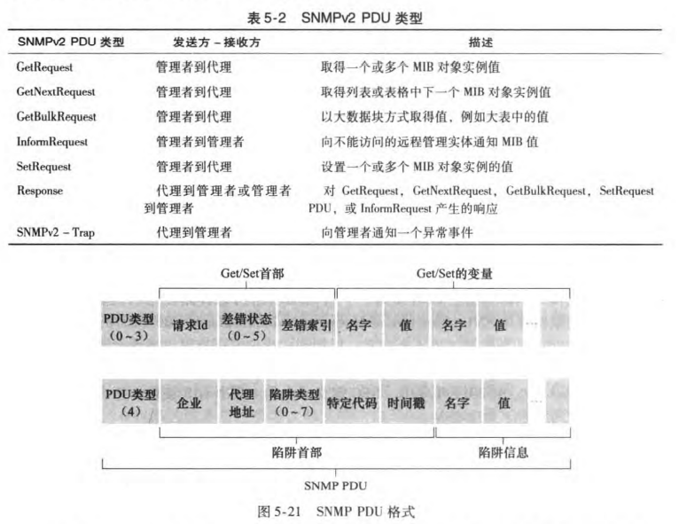

## 第六章：链路层和局域网

### 6.1 链路层概述

运行链路层协议的任何设备叫做节点，沿着通信路径连接相邻节点的通信信道称为**链路**

传输节点将数据报放在**链路层帧**中，并将该帧传送到链路中

#### 6.1.1 链路层提供的服务

- 成帧：一个帧由一个数据字段和若干首部字段组成，其中网络层数据报就插在数据字段中。帧的结构由链路层协议规定。
- 链路接入。**媒体访问控制MAC**规定了帧在链路上传输的规则。

- 可靠交付：提供可靠交付的链路层协议通过确认和重传保证可靠交付，
- 差错检测和纠正：链路层的差错检测通常更复杂并且用硬件实现

#### 6.1.2 链路层在何处实现

链路层的主体部分是在**网络适配器**中实现的，网络适配器有时也称为**网络接口卡NIC**，位于网络适配器核心的是链路层控制器。

在发送端，控制器取得了由协议栈较高层生成并且存储在主机内存中的数据报，在链路层帧中封装该数据报（填写该帧的各个字段），然后遵循链路接入协议将该帧传进通信链路中。

在接收端，控制器接受了整个帧，抽取出网络层数据报，如果链路层执行差错检测，则需要发送控制器在该帧的首部设置差错检测比特，由接收控制器执行差错检测

### 6.2 差错检测和纠正技术

#### 6.2.1 奇偶校验

最简单的方法是单个**奇偶校验位**

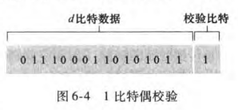

偶校验：使$d+1$比特中1的总数是偶数

二维奇偶校验：可以检测并且纠正

检测并且纠正差错的能力被称为**前向纠错**

#### 6.2.2 检验和方法

因特网检验和（Internet checksum）就基于这种方法。数据的字节作为16bit的整数相加，接收方通过对接收的数据（包括校验和）的和取反码，并且检测其结果是否为全1bit来检测校验和，如果这些bit中有任何bit是0就可以指示出差错

#### 6.2.3 循环冗余检测

循环冗余检测CRC，也称为多项式编码

CRC编码操作如下：考虑$d$比特的数据$D$，发送节点要将它发送给接收节点，发送方和接收方首先协商一个$r+1$比特模式，称为**生成多项式**，表示为$G$，我们将要求$G$的最高有效位的比特（最左边）是1，CRC编码的关键思想如下：

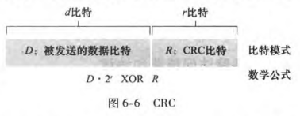

在发送数据后面加上$r$比特，使得这个式子能被$G$整除

所有CRC计算采用模2算术来做，在加法中不进位，在减法中不借位，故加法和减法和异或等价

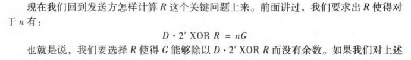

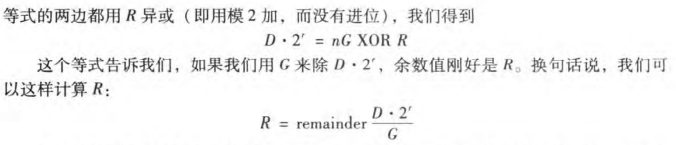

每个CRC标准都可以检测小于$r+1$比特的突发差错

### 6.3 多路访问链路和协议

两种类型的网络链路：点对点链路（point-to-point link）和广播链路。

广播链路：当任何一个节点传输一个帧的时候，信道广播该帧，每个其他节点都收到一个副本。以太网和无线局域网是广播链路层技术的例子

这里先讨论：如何协调多个发送和接收节点对一个共享广播信道的访问，即**多路访问问题**

当所有节点同时接到多个帧，就发生：传输的帧在所有的接收方处**碰撞**

多路访问协议类型：

- 信道划分协议
- 随机接入协议
- 轮流协议

在理想情况下，对于速率为$R$ bps的广播信道，多路访问协议应该具有以下所希望的特性：

#### 6.3.1 信道划分协议

- 时分多路复用TDM
  - TDM将时间划分成**时间帧**，并进一步划分每个时间帧为$N$个**时隙**
  - 传输速率为$R/N$

- 频分多路复用FDM
  - 传输带宽是$R/N$
- 码分多址CDMA
  - 为每个节点分配一种不同的编码

#### 6.3.2 随机接入协议

随机接入协议：一个传输节点总是以信道的全部速率进行发送。但当一个节点经历一次碰撞时，它不必立刻重发该帧，相反，它在重发该帧之前等待一个随机时延

常用的随机接入协议：ALOHA协议和载波侦听多路访问协议CSMA，以太网是一种流行的CSMA协议

1. 时隙ALOHA

   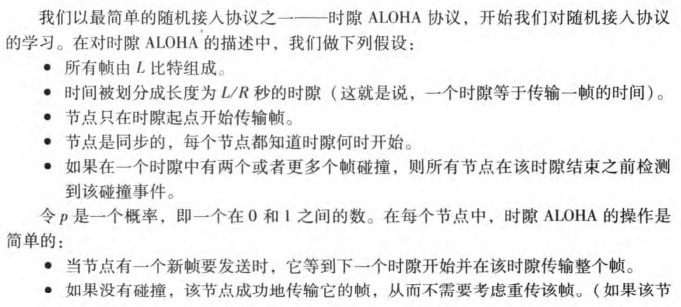

   

   问题：

   - 当有多个节点在传输的时候，时隙因碰撞被浪费掉了
   - 概率传输策略导致一些时隙是空闲的

   当刚好有一个节点传输的时隙称为一个**成功时隙**

   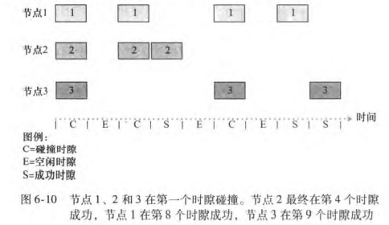

   当有$N$个活跃节点时，时隙ALOHA的效率是$Np(1-p)^{N-1}$，最大效率是$1/e=37\%$

2. ALOHA（非时隙。完全分散）

   当一帧首次达到（即一个网络层数据报在发送节点从网络层传递下来），节点立刻将该帧完整地传输到广播信道。如果一个传输的帧与一个或多个传输经历了碰撞，那么这个节点将立刻以概率$p$重传该帧，否则等待一个帧的传输时间

   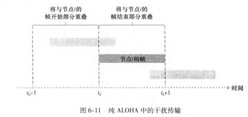

   一个给定节点成功传输一次的概率是$p(1-p)^{2(N-1)}$，最大效率$1/(2e)$，是上面同步版本的一半

3. 载波侦听多路访问（CSMA）

   - 载波侦听：一个节点在传输前先听信道，如果有来自另一个节点的帧正向信道上发送，节点则等待直到检测到一小段时间没有传输，然后开始传输
   - 碰撞检测：当一个传输节点在传输时一直在侦听此信道，如果它检测到另一个节点正在传输干扰帧，它就停止传输，在重复“侦听——当空闲传输”之前等待一段随机时间

   这两个规则包含在载波侦听多路访问CSMA和具有碰撞检测的CSMA/CD协议族中

   出现碰撞的情况：某个节点在信道上传播的时候，信道另一端还没有接收到所以它会以为信道空闲（端到端信道传播时延）

4. 具有碰撞检测的载波侦听多路访问（CSMA/CD）

   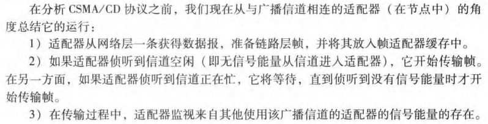

   

   随机时间量：碰撞节点较少，时间间隔较短；当碰撞节点数量较大，时间间隔较长

   关于时间间隔的选择：

   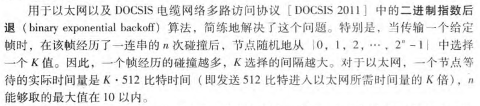

5. CSMA/CD效率

   

   

### 6.3.3 轮流协议

为了实现：当有$M$个节点活跃时，每个活跃节点的吞吐量接近$R/M$ bps

- 轮询协议
  - 节点之一成为主节点，然后主节点以循环的方式轮询每个节点，告知各个节点能够传送帧的数量
  - 轮询消除了协议的碰撞和空时隙，使得轮询取得高得多的效率，但是也存在缺点
    - 引入轮询时延
    - 主节点故障导致整个信道出现问题
  - 例子：WiFi802.15协议和蓝牙协议
- 令牌传递协议
  - 称为**令牌token**的小的特殊帧在节点之间以某种固定的次序进行交换
  - 当一个节点收到令牌时，仅当它有一些帧要发送时，它才持有这个令牌，否则，它立即向下一个节点转发该令牌，如果它确实有帧要传输，它发送最大数目的帧数然后把令牌转发给下一个节点
  - 缺点：一个节点的故障可能会使得整个信道崩溃，节点可能会忘记释放令牌

#### 6.3.4 DOCSIS：用于电缆因特网接入的链路层协议

1.2.1中提到了电缆接入网。

电缆接入网中住宅的Modem和**电缆调制解调器端接系统CMTS**连接，**数据经电缆服务接口DOCSIS**定义数据网络体系及其协议

DOCSIS使用FDM将上行和下行网络段划分成为多个频率信道

下行信道（CMTS到调制解调器）：单个CMTS在传输，广播给所有Modem听到，所以没有多路访问问题

上行信道：划分成时间间隔，每个时间间隔中有一个微时隙序列，CMTS在下行信道上发送称为MAP报文的控制报文，指定哪个Modem可以在微时隙中传输由控制报文指定的时间间隔。没有碰撞传输。

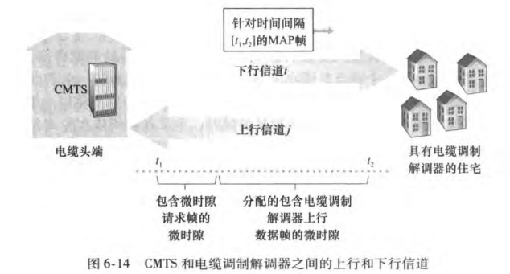

这里的关键是CMTS如何知道哪个modem有数据要发送。CMTS将上行信道的一部分时隙划作请求帧，此时modem可以发送有数据要发送的请求，采用随机接入、二进制数回退。当上行流量较少的时候，modem也可能在请求帧时期发送实际数据。

### 6.4 交换局域网

#### 6.4.1 链路层寻址和ARP

1. MAC地址（又名LAN地址、物理地址）

   主机和路由器的**适配器（网络接口）**有链路层地址。链路层交换机不具有与它们接口相关联的链路层地址，它的任务是在主机与路由器之间传递数据报。主机和路由器不必明确将帧寻址到其间的交换机

   MAC地址共6字节，有$2^{48}$种可能地址。没有两块适配器具有相同的地址。

   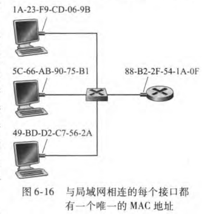

   IP地址具有层次结构，主机移动时主机IP地址会发生改变（类似邮政地址）；而MAC具有扁平结构，在哪里都不会改变

   适配器发送帧时设置目的地址MAC；当收到帧目的MAC和自己不匹配就直接丢弃，否则提出数据报然后沿协议栈上传；当需要广播帧时，设置目的地址为FFFFFFFF

   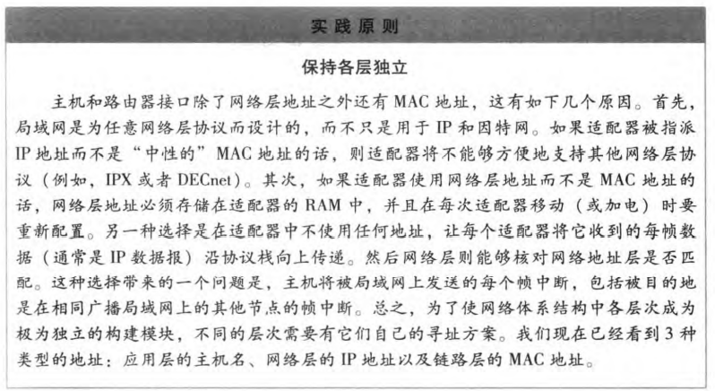

2. 地址解析协议ARP

   ARP：通过IP地址得到MAC地址，只为同一个子网上的主机和路由器接口解析IP地址

   没台主机或路由器在内存中有个ARP表，其中TTL一般过期时间是20min

   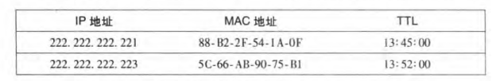

   如果目的IP地址不在，就发送ARP分组给适配器，适配器设置目的地址为FFFFFFFF进行广播，获得MAC值

   查询报文是广播帧，响应报文是标准帧

3. 发送数据报到子网之外

   先广播ARP到当前子网的路由器，然后该路由器再找另一个子网里设备对应MAC

#### 6.4.2 以太网

1. 以太网帧结构

   

   - 数据：IP地址数据报，MTU是1500bytes
   - 类型：网络层协议类型
   - 前同步码（8byte）：前7字节都是10101010，最后一个字节是10101011，前7字节用于唤醒接收适配器并且同步时钟

   特点：

   - 提供无连接服务
   - 提供不可靠服务：如果不通过CRC校验直接丢弃并且不发送否定确认帧

#### 6.4.3 链路层交换机

1. 转发和过滤

   **过滤**决定一个帧应该转发到某个接口还是应当将其丢弃的交换机功能。**转发**决定一个帧应该被导向哪个接口并把该帧移动到那些接口的交换机功能。借助**交换机表**

   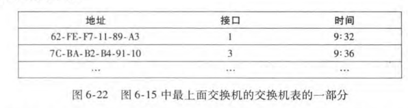

   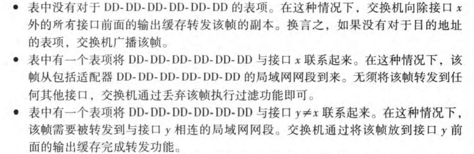

2. 自学习

   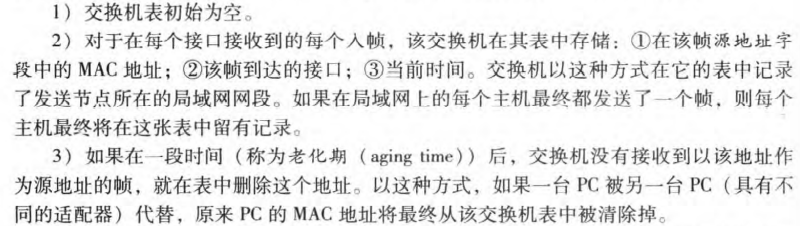

3. 性质

   - 异质的链路
   - 易于管理：例如如果有适配器不断发送数据帧过来，就会断开

4. 交换机和路由器比较

   交换机是第二层的分组交换机，而路由器是第三层的分组交换机

   交换机优点：

   - 即插即用
   - 相对高的分组过滤和转发速率

   交换机缺点：

   - 交换网络限制活跃拓扑结构为生成树
   - 大型交换网络中主机和路由器中有大的ARP表
   - 对广播风暴没有保护措施

   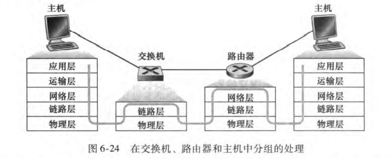

   路由器优点：

   - 出现冗余路径也不会循环
   - 丰富的拓扑结构
   - 提供防火墙

   路由器缺点：

   - 上面交换机优点的反面

#### 6.4.4 虚拟局域网

使用VLAN来进行流量隔离。

在一台交换机上由管理员划分多个VLAN（虚拟局域网）形成独立的广播域

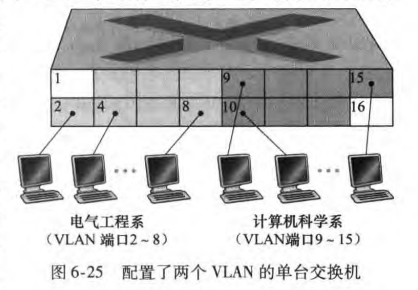

这两个组之间的信息交换：将VLAN交换机的一个端口（配置为属于两个组）与一台外部的路由器相连

对于两台交换机的互联，有以下两个方法：

- 在交换机上为每一个VLAN开一个端口并和另一台交换机互联

- 开一个端口，配置成干线端口，该端口属于所有VLAN，它转发所有经过VLAN的帧到其他交换机 

  - IEEE定义了一种扩展的以太网帧格式——802.1Q，增加VLAN标识符，在VLAN接受侧删除

    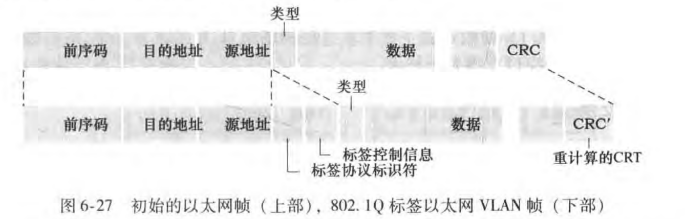

  - 

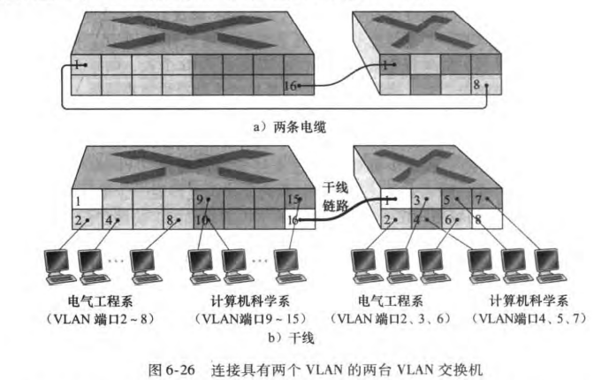

### 6.5 链路虚拟化：网络作为链路层

**多协议标签交换MPLS**

在链路层首部和网络层首部之间插入MPLS首部，之后路由器看到MPLS首部信息就可以直接用自己的转发表转发，而不需要查看IP转发表

### 6.7 回顾：Web页面的请求历程

重点看书！

1. 准备：DHCP、UDP、IP和以太网
2. 仍在准备：DNS和ARP
3. 仍在准备：域内路由选择到DNS服务器
4. Web客户-服务器交互：TCP和HTTP
