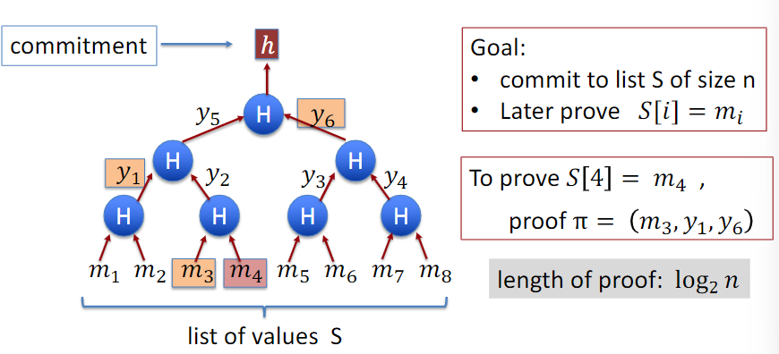
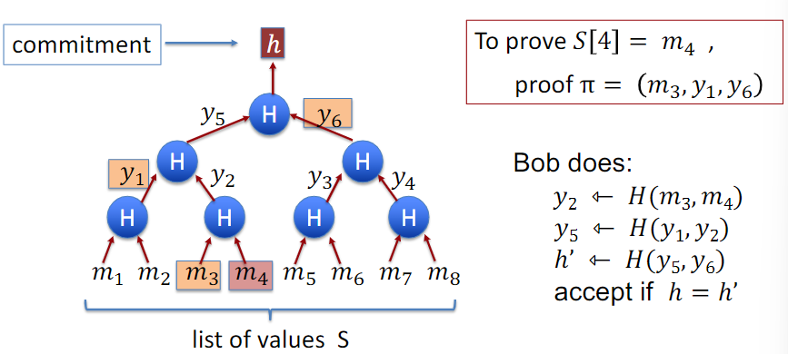
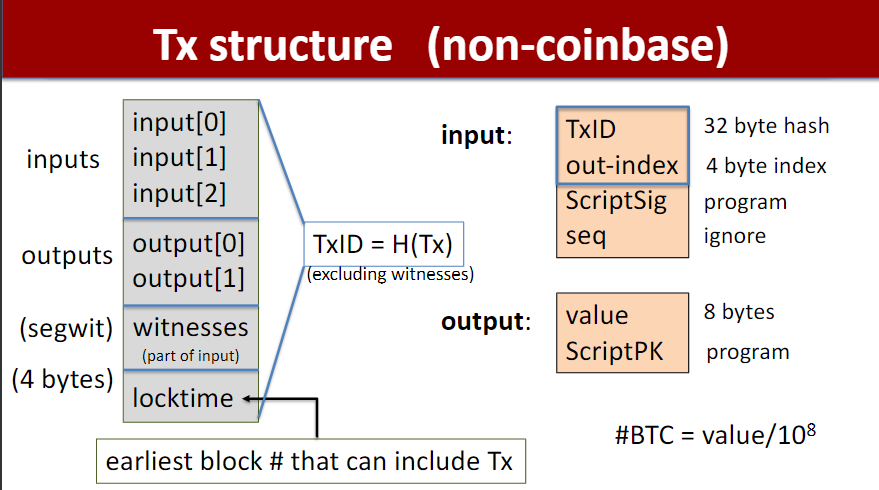
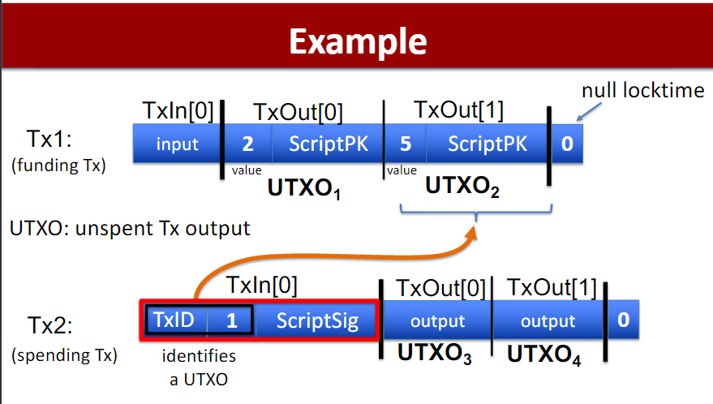
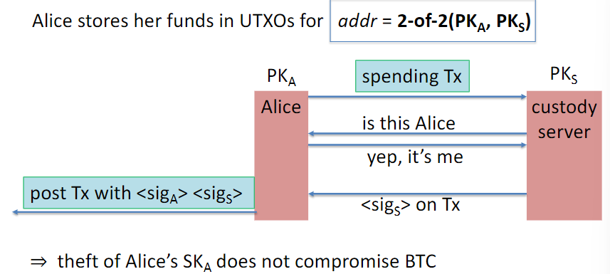
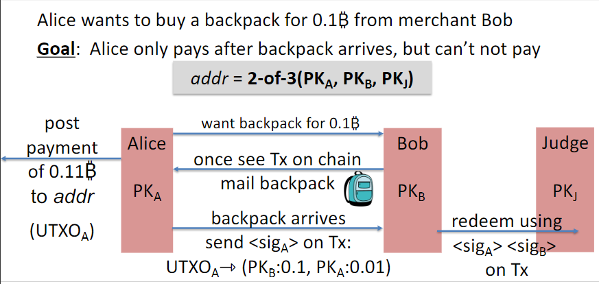
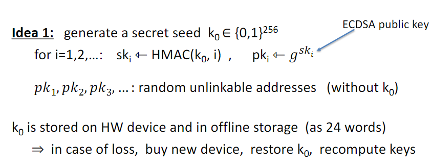
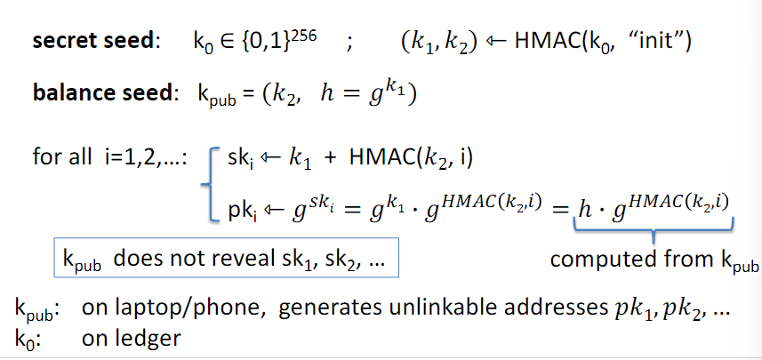
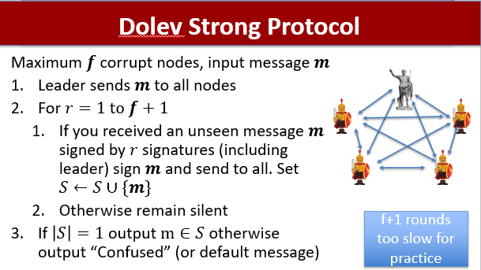

# CS251

[TOC]

部分笔记借鉴知乎[wuwe1](https://zhuanlan.zhihu.com/p/270554031)

## Lecture1

### 密码学背景

Collision Resistance Hash Function: CRHF

对单个数据的承诺commitment： Alice首先hash得到$h=H(m)$，Bob得到$h$并且发现$H(m')=h$，而$H$是CRHF，那么Bob就认为$m'=m$，我们就说$h=H(m)$ is a binding commitment to $m$

对一个list的数据（交易）的承诺commitment：$S=(m_1,m_2,\dots,m_n)$，Alice有一个承诺$h=commit(S)$，Bob得到了$h$，并且$(m_i,proof~\pi_i)$能够检验$S[i]=m_i$，Bob运行$verify(h,i,m_i,\pi_i)$来得到accept/reject。目标就是找不到$(S,i,m,\pi)$使得$m\ne S[i]$并且$verify(h,i,m,\pi)=accept$，其中$h=commit(S)$

### Merkle Tree

Merkle Tree就是对一串数据的commitment

Merkle proofs用来证明某个交易在区块链上

### Proof of Work

目标：找到一个问题，解决的复杂度为$\Omega(D)$，验证复杂度为$O(1)$，其中$D$就是难度

例子：input $x\in X$，output $y\in Y$ s.t. $H(x,y)<2^n/D$

## Lecture 2

### BTC概述

Layer1: consensus Layer

Layer1.5: compute layer (blockchain computer)

Layer2: applications (DAPPs, smart contracts)

Layer3: using facing tools (cloud servers)

### BTC共识层概览

一般来说，矿工会和其他八个矿工相连

矿工在这个P2P网络中广播他们接收到的交易

每一个矿工都会验证交易，并把这些交易存储在`mempool`里（未确认交易 Pending)

> 矿工在交易被写入区块链之前就能看到交易

每十分钟：

- 每一个矿工从`mempool`里的交易里选几个出来组成候选块`candidate block`
- 一个“随机”的矿工被选出来(下一节中讲如何选)，并且把这个区块向网络中广播
- 所有矿工都验证这个新区块

### 交易

比特币中使用的是UTXO，每笔交易中会指定一个未花出的输出作为输入

整个交易大致由4个部分组成

- inputs: 所有的输入
- outputs: 所有的输出
- segwit: 隔离见证
- locktime: 最早可以可以将这个交易作为input的区块

input中的部分

- TxID: 被指定作为输入的output所在的交易的哈希值
- out-index: 被指定作为输入的output的索引
- ScriptSig: bitcoin脚本，一种基于栈的编程语言，这个语言可以完成诸如验证签名之类的工作，其中有一部分数据是Sig签名

output部分

- value: 8个字节的比特币转账数量 $10^8-2^{37}$
- ScriptPK: bitcoin脚本，其中部分数据是公钥

验证Tx2的过程:

1. `ScriptSig|ScriptPK`脚本执行后需要返回true
2. 确认`TxID|index`在现在UTXO集合中，这些集合都存在矿工的内存里
3. 输入和大于等于输出和
4. Tx2发布之后，矿工就可以把UTXO2从UTXO的集合中删除了

如果输入和大于输出和，多出的部分作为交易费支付给矿工

### Bitcoin Script

- 基于堆栈

- 不是图灵完备的

- 没有循环

- 最多只有256个操作码opcode

- OP_DUP（118）: 将栈顶的元素压入栈顶

- 控制

- - 99 OP_IF \<statements> OP_ELSE \<statements> OP_ENDIF
  - 105 OP_VERIFY: abort fail if top = false
  - 106 OP_RETURN: abort and fail，这个操作码有时候用来销毁比特币
  - 136 OP_EQVERIFY: pop, pop, abort fail if not equal

- 算数

- - OP_ADD, OP_SUB, OP_AND, ...: pop two items, add, push

- 加密

- - OP_SHA256: pop, hash, push
  - OP_CHECKSIG: pop sig, pop pk, verify sig. on Tx, push 0 or 1

- 时间

- - OP_CheckLockTimeVerify (CLTV): fail if value at the top of stack > Tx locktime value.

## Lecture3

### Co-signatory

使用用户个人和custody server两者的公钥作为签名，使得Alice的私钥泄漏也没有问题

### Escrow Service

第三方托管（类似淘宝）

- Backpack never arrives: (Bob at fault)

  Alice gets her funds back with help of Judge and a Tx:

  Tx: ( UTXOA ⇾ PKA , sigA, sigJudge ) [2-out-of-3]

- Alice never sends sigA: (Alice at fault)

  Bob gets paid with help of Judge as a Tx:

  Tx: ( UTXOA ⇾ PKB , sigB, sigJudge ) [2-out-of-3]

- Both are at fault: Judge publishes \<sigJudge\> on Tx:

  Tx: ( UTXOA ⇾ PKA : 0.05, PKB : 0.05, PKJ: 0.01 )

  Now either Alice or Bob can execute this Tx.

### Wallets

#### Simplified Payment Verification (SPV)

- 下载所有的block headers (56MB)

- wallet给server发送我的钱包地址（布隆过滤器加速）

  server给wallet：所有涉及这些地址的交易+block header的Merkle proof

问题：

- 安全性：block header是在blockchain上吗？会不会遗漏Tx？
  - 以太坊：从十台机器上下载或者从一个信任节点上下载
- 隐私性：远端server可以检测某个账户是否属于这些wallet

#### Hardware

失去hardware wallet就失去了钱，如何解决？

Idea 1：

在hardware和离线存储中保存一个seed，secret key由seed计算

Idea 2：

为了将check balance和spend fund两种功能对应的seed分开以提高安全性，所以使用如下方式存储两个seed

## Lecture4

### 拜占庭将军问题

[拜占庭将军问题](https://www.jianshu.com/p/26adc88a1f49)

参见上面的签名消息的解决方案

$f$是最多不诚实节点数，$S$是节点当前接受的签名message

为什么是$f+1$轮？$f$个不诚实节点会confuse诚实节点

Validity：诚实节点只有获得leader签名的消息才会更新$S$

Consistency：

- 如果诚实节点在第$r$轮（$r\le f$）有$m\in S$，那么其他的节点在$r+1$轮都会得到$m$
- 如果诚实节点在第$f+1$轮收到了新的$m$，那么它一定是从一个诚实节点得到的（抽屉原理，最多$f$个不诚实节点，那么$f+1$轮收到的一定是诚实的）

结果：所有的honest节点的$S$是相同的

### Sybil Resistance

Sybil是一本讲述多重人格的书，Sybil Attack（女巫攻击）表示使用大量账户来展开攻击

- Permissioned：所有节点是固定的
- Permissionless：任何人可以参与
  - proof of stake
    - ETH2.0
    - 假设2/3的节点是诚实节点
  - proof of work

### Network Model

Dolev Strong假设message是下回合会传递给所有人，但是是不现实的

- 同步
  - **已知**最大延迟$\Delta$（Dolev-Stong任意$f$）
- 半同步
  - 存在最大延迟，但是**未知**（$f< n/3$）
- 异步
  - 共识问题未解决

### Blockchain Consensus

- Consistency：对于所有诚实节点$i,j$以及时间$t,t'$，$L_i(t)$是$L_j(t')$的前缀，或者相反
- $\Delta$-Liveness：存在一个函数使得：当任何一个诚实节点在时间$t$收到交易$tx$，那么对任意$i$，$tx\in L_i(t+T(\Delta, n))$。在时间$t+T(\Delta,n)$的时候，$tx$已经finalized

### Streamlet：A simple Blockchain protocol

[Streamlet: 极简区块链协议](https://zhuanlan.zhihu.com/p/309659540)

## Lecture5

**这节课PPT有些看不太懂，欢迎交流，主要是困惑如下：**

- $P_z$的计算？
- 为何诚实节点需要等待网络delay，而adversary可以直接算下一个？
  - 猜测：需要等待其他节点的确认

### Nakamoto Consensus

假设adversary算力比例为$p<1/2$。分支一开始为0，+1的概率为$p$，-1的概率为$1-p$，那么$P_z=\sum\limits_{n=0}^{+\infty}{2n+z-1\choose n}p^{n+z}(1-p)^{n}=(\frac{p}{1-p})^z$（第二步是我自己列的式子但是感觉有问题，PPT上只放了最后的结果）。$p=1/3$时，$P_6<0.0062$

如果大于$1/2$的话就会触发51%攻击

### Network delay & work difficulty

如果解决问题的时间快于问题传播的时间$\Delta$，诚实节点会在每$\Delta$时间内solve问题剩下时间等待其他诚实节点，而在别人还没有收到这个区块的时候已经可以开始计算下一个。adversary最多能提前$\Delta$=delay，$O(\Delta)$ free hash trials（对此表示疑惑）

> Say Δ is greater than the time it takes the adversary to solve puzzles. In worst case, honest nodes only start working on next puzzle every Δ time steps, after they have heard a block from other honest nodes, whereas the adversary hears blocks immediately, solves the next block in time less than Δ, and starts working on the next one, etc. This adversary is now mining blocks at a faster rate than the honest nodes in the network. 

$$
\frac{\alpha}{1+\alpha\lambda\Delta}>\beta
$$

其中：$\alpha$为诚实矿工比例，$\beta$为恶意节点比例，$\lambda$是mining rate（1 block / 10 min）。意思是$\alpha$比例的诚实矿工实际上存在算力损耗，但是必须保证上面的式子成立才能让诚实节点算力占majority。所以要降低$\Delta$。

中本聪取$\Delta$为10秒，$\frac1{\lambda\Delta}$为60，让上面式子中$\beta$最大值略低于50%

### Chain Quality

表示诚实地挖出block的比例，假设adversary的算力比例为$p$，可以证明chain quality至少为$1-\frac{p}{1-p}$，因此当$p>\frac12$的时候，quality为0

### Chain Growth

blockchain增长的速度，BTC为$1/\Delta$（$p<\frac12$）

### Selfish Mining Attack

论文：https://arxiv.org/pdf/1311.0243v1.pdf
