# CSAPP

[TOC]

## Bits, Bytes, and Integer

补码：最高位权重取负值，其他权重取正相加

最高位为1的二进制串，无符号和有符号相差$2^n$

有符号和无符号处理成两个无符号

安全的loop：

```cpp
unsigned i; // size_t better
for (i = cnt - 2; i < cnt; i--)
    	a[i] += a[i+1];
```

小端序：第一个字节是最低有效位（与视觉倒序）

字符串的存储不管大小端序

```pseudocode
# x, y is signed int; ux, uy is unsigned int

x < 0 -> x * 2 < 0 # false, x = 100...0
ux >= 0 # true
x & 7 == 7 -> (x << 30) < 0 # true
ux > -1 # always false
x > y -> -x < -y # false, y = TMin, x is any number
x * x >= 0 # false
x > 0 && y > 0 -> x + y > 0 # false
x >= 0 -> -x <= 0 # true
(x | -x) >> 31 == -1 # false, x = 0
```

## Floating Point

当exp为0的时候表示非规格化数，即0为前导数，**E=1-Bias** (Bias即127，$2^{k-1}-1$)

规格化数：Exp-Bias

非规格化数到规格化数平滑过渡

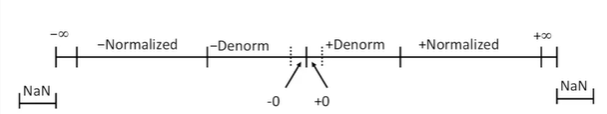

默认舍入方法：向偶数舍入（4舍6入5凑偶）

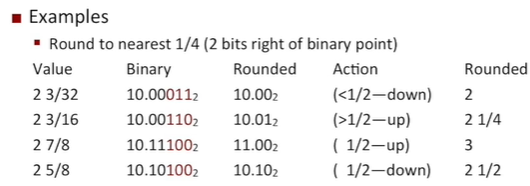

```cpp
int x;
float f;
double d;

x == (int)(float)x; // false
x == (int)(double)x; // true
f == (float)(double)f; // true
d == (double)(float)d; // false
f == -(-f); // true
2/3 == 2/3.0; // false
d < 0.0 -> (d*2) < 0.0 // true
d > f -> -f > -d // true
d * d >= 0.0 // true
(d + f) - d == f // false
```

## Machine-Level Programming

### Basics&Data

`-Og`表示对生成代码进行可读性的优化，`-S`表示stop暂停在汇编代码

反汇编`objdump -d a.out`

gdb中的反汇编`disassemble a.out`

x86寄存器（r开头为64位，e开头为32位）：

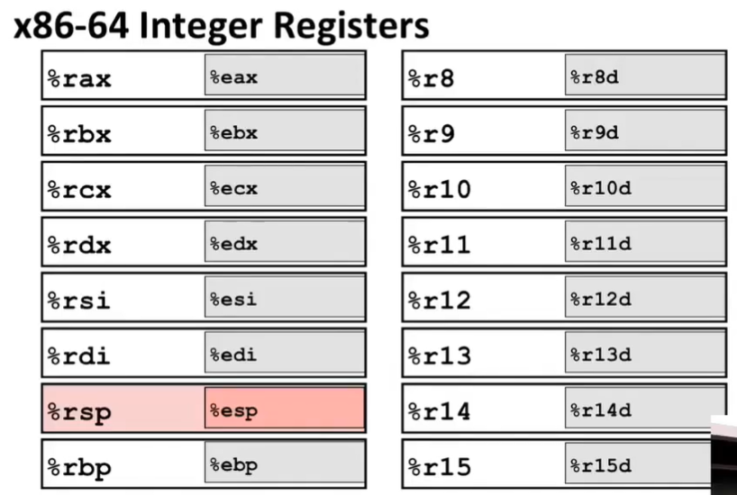

一个字2byte，长字4byte，四字8bytes (64bit)

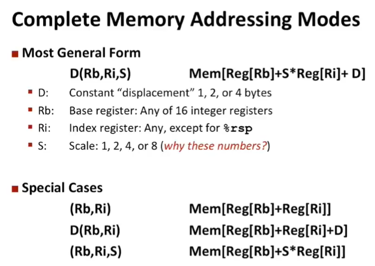

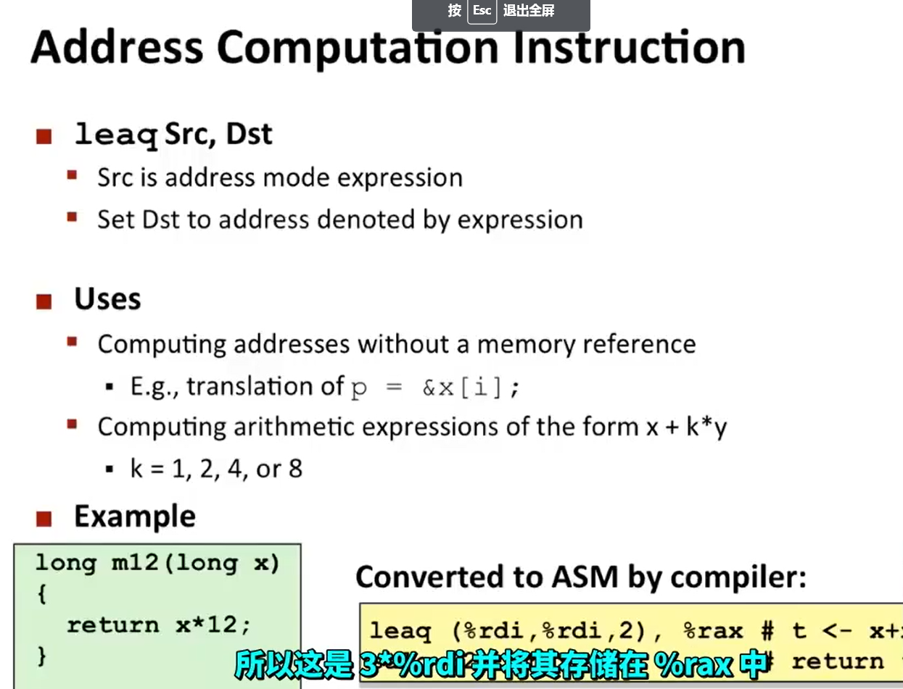

32位计算的结果会将剩下的32位置为0，而8位计算结果不会将剩下的7个字节置为0

conditional move：同时计算then和else来加快流水线速度，只有在两个语句都比较简单的时候才会使用

switch建表：第一个case不为0的时候会加上bias成为0；如果case相差很大会变成if-else，使用二分搜索

### Procedures

ABI: Application Binary Interface

`rep`和`ret`是相同的意思

`call`的时候将`rsp`先减8然后将下一条指令的地址送入stack，最后`rip`放入下一条指令的地址

栈帧stack frame，有两个指针，一个是`rbp`基指针（optional），另一个是`rsp`，当分配的是一段可变长空间的时候会用到`rbp`

### Data

数组下标索引 `movl (%rdi, %rsi, 4), %eax`

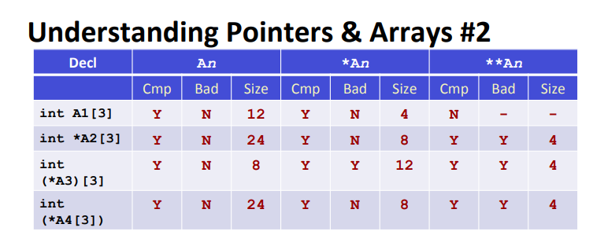

注意上面A4中方括号的等级高于*，实际上和A2相同

当方括号没有数字相当于指针

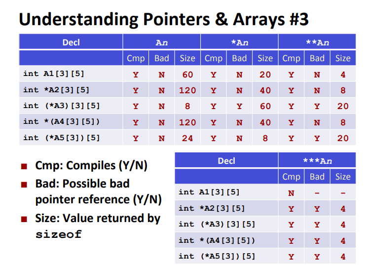

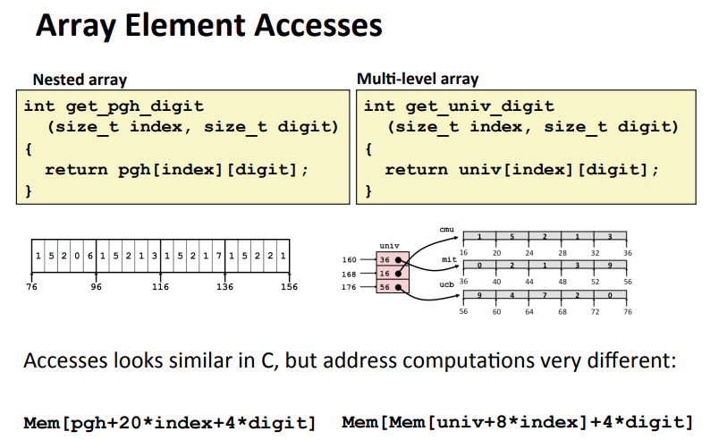

### Advanced Topics

64位使用47位即256TB，0x00007FFFFFFFFFFF

stack一般为8MB，可以通过`limit`命令来查看

内存由低到高：Text/Data/Heap/Shared Libraries/Stack

malloc申请小内存的时候在低地址，大内存在高地址

栈上开空间有时候会预留一段buffer，当你填满buffer之后再写入就会修改return address，此时可能会SEGV也可能正常或非正常运行

防止栈溢出：1. 使用`fgets(buf, 4, stdin)/strncpy/%Ns`; 2. 栈随机化ASLR(Address Space Layout Randomization) ，text和data段数据位置没变，而stack、heap会变；3. 标记堆栈上位置权限（RWX）；4. Canary金丝雀，从fs寄存器中取8字节值放到buffer中。

## Program Optimization

### Generally Useful Optimizations

- Code Motion

  将一段被重复计算的代码放到前面计算一次

- 用左右移和加法来替代乘法和除法

- share common subexpressions（写成不一样的时候编译器不会优化）

  共用相同的表达式

- removing aliasing（编译器不会优化）

  当计算`b[i] = sum(a[n*i+j])`的时候编译器会每次取`b[i]`然后加上一个值再写进去，因为两个指针的地址可能有重合部分，可以用一个局部变量`val`来存循环求后者的和。

### Exploiting Instruction-Level Parallelism

- 循环展开

- Reassociated Computation

  改变括号，得到不一样的计算结构，但是对于float和double不一定得到相同答案

  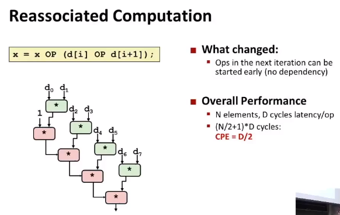

- Multiple Accumulator

  分别计算所有奇数和以及偶数和

  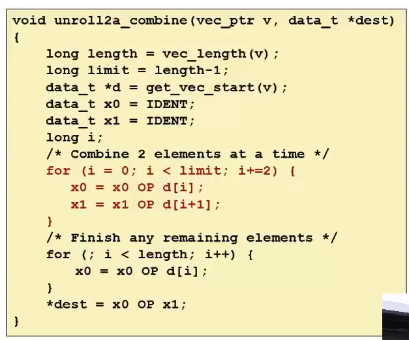

- SIMD Operations

- 对于branch来说，会有寄存器副本，当运行错误的分支之后会取消所有副本的更新

## Memory Hierachy/Cache Memories

- Cache miss的类型

  - cold(compulsory) miss冷启动

  - conflict miss

  - capacity miss

## Linking

- C语言静态链接过程
  - `.c`文件经过`cpp`（C预处理器）变成`.i`，经过`ccl`（C编译器）变成`.s`（汇编语言文件），经过`as`（汇编器）变成`.o`可重定位目标文件
  - 多个`.o`通过Linker(ld)变成可执行程序
  - 链接可以在编译时、加载时和运行时

- linker执行过程
  - Step 1: Symbol resolution 符号解析，将符号定义和引用关联起来
  - Step 2: Relocation 重定向，编译器和汇编器地址是从0开始的，linker修改这些地址

- 目标文件类型
  - 可重定向目标文件：编译器和汇编器生成
  - 可执行目标文件：链接器生成
  - 共享目标文件：编译器和汇编器生成
- 目标文件的格式
  - 现代Unix系统使用ELF (Executable and Linkable Format)
  - `.o`和`.so`文件都遵循ELF


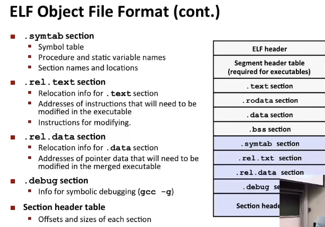

- linker symbols
  - global symbols全局符号
    - symbols defined by module that can be referenced by other modules
  - external symbols外部符号
    - global symbols that are referenced by module but defined by some other module
  - local symbols本地符号
    - symbols that are defined and referenced exclusively by module
    - E.g: functions and global variables defined with the **static** attribute
    - local linker symbols are **not** local program variables
    - 注意：链接器不管局部变量，这是由堆栈上的编译器管理的。但是局部static变量会存储在`.bss`或者`.data`中

- 如何解决symbol重复
  - 强符号：函数和已初始化的全局变量
  - 弱符号：未初始化的全局变量
  - 规则
    - 不允许多个同名强符号，否则linker error: multiple definition
    - 单个强符号和多个弱符号，linker将所有对该符号的引用关联到强符号
    - 多个弱符号会随机选一个，可以用gcc的`-fno-common`来覆盖（多个弱符号抛出错误）
  - **规则2和规则3会产生非常多奇怪的bug！**
  - 解决
    - 使用static或者extern
    - `GCC-warn-common`，多定义的全局符号会输出warning
  - C++和Java重载的时候采用**mangling毁坏**，即将函数名和参数列表组合编码。如`Foo::bar(int,long)`编码为`bar__3Fooil`，其中数字3为`Foo`名字长度，`il`分别是参数类型首字母

- 重定位

  - 重定位节和符号**定义**：将所有相同类型的节合成一个，并且给节和符号设置好存储器地址

  - 重定位节中的符号**引用**：修改引用的地址，依赖于**重定位条目relocation entry**

  - 编译器编译后的代码使用相对位置，对于最终位置未知的目标引用会生成一个relocation entry提示linker修改引用（放在`.rel.text`）

  - ```c
    typedef struct {
        int offset; // offset of the reference to relocate
        int symbol:24, // symbol the reference should point to
        	type:8; // relocation type
    } Elf32_Rel;
    ```

  - 重定位类型共11种，其中两种为：

    - `R_386_PC32`：重定位一个使用32位PC相关的地址引用
    - `R_386_32`：重定位一个使用32位绝对地址的引用
    - 具体参见书本

- 可执行目标文件

  - 格式类似于可重定位目标文件。另外包括**入口点entry point**即第一条指令的地址，`.init`包含`_init`程序初始化代码，不需要`.relo`节。**段头表**描述各个段。

  - 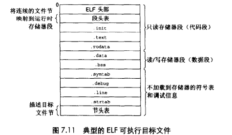

  - **加载**目标文件。使用**加载器loader**来运行可执行目标文件，任何Unix程序可以通过调用`execve`来调用加载器，加载器将代码和数据拷贝到内存中，然后跳转到入口点开始执行，也即符号`_start`的位置，其中启动代码对于所有C程序都相同，定义于`ctrl.o`中

  - 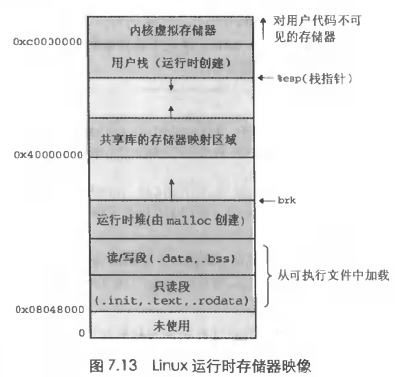

  - 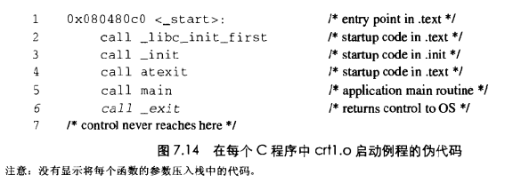

    启动代码先调用`.text`和`.init`中的初始化代码，然后调用`atexit`注册需要在exit之后执行的程序，然后执行`main`，之后`_exit`先执行`atexit`注册的函数，然后程序结束控制返回给OS

- 库的类型

  - 旧做法：static libraries静态库
    - `.a`文件，是`.o`文件的集合，每一个`.o`文件就是一个函数，并且可以知道每个`.o`文件的偏移，于是可以选择某个`.o`文件
    - linker解决外部引用的方法：根据命令行顺序扫描所有的`.o`和`.a`，然后建立**未解析符号表**，每次遇到新的`.o`或`.a`文件就去尝试解析**未解析符号表**中的外部引用，如果扫描完之后还有未解析的引用，就error
    - 命令行顺序：引用在前定义在后
  - 新做法：shared libraries
    - 静态库的缺点
      - 不同程序大量功能是重复的，但都放在text段中
    - 动态链接库，在windows中为`dll`，`.so`
    - 在运行时加载，称为**动态链接**，是由**动态链接器dynamic linker**来执行的
  - 注意：include是预编译，linker到达它的时候已经被处理过了

- 动态链接库

  - 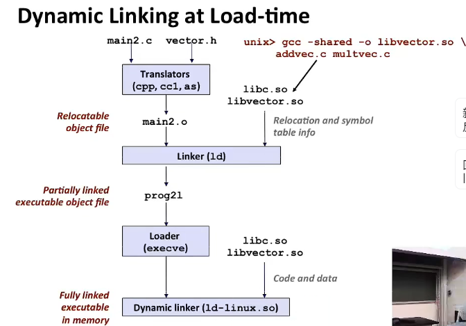

  - 创建可执行文件的时候，静态执行一些链接，而`.so`文件没有被拷贝到可执行文件中，但是可执行文件拷贝了一些重定位和符号表信息。

    在加载器加载和执行可执行文件的时候，它会注意到有一个`.interp`节，其中包含动态链接器的路径名，于是loader加载这个动态链接器

    动态链接器执行重定位：

    - 重定位`.so`文件的文本和数据，在Linux中shared libraries加载到从0x40000000开始的区域中
    - 重定位可执行文件中对`.so`定义符号的引用

    最后dynamic linker将控制传递给程序

  - Unix系统允许程序在运行时加载和链接共享库

    ```C
    #include <dlfcn.h>
    void *dlopen(const char *filename, int flag); // 成功返回句柄指针，出错则为NULL
    // Flag类型
    // 1. RTLD_GLOBAL: 用以解析对filename中的外部符号。如果可执行文件是-rdynamic编译的那么全局符号也可用
    // 2. RTLD_NOW: 告诉链接器立即解析对外部符号的引用
    // 3. RTLD_LAZY: 推迟符号解析直到执行到来自库的代码时
    // 上述后两个值任意一个都可以和RTLD_GLOBAL取或
    
    void *dlsym(void *handle, char *symbol); // 成功返回指向符号的指针，出错为NULL
    
    int dlclose(void *handle); // 成功为1，否则为0，如果没有其他共享库在使用这个共享库dlclose会卸载该共享库
    
    const char *dlerror(void); // 如果前面调用失败会得到错误信息，否则为NULL
    ```

    注：Java有Java本地接口（Java Native Interface，JNI），允许Java调用C和C++，基本思想是将C函数编译到共享库中然后利用`dlopen`等接口动态链接和加载共享库，然后调用C函数

- 与位置无关的代码（PIC）*

  - gcc使用`-fPIC`选项指定编译成PIC代码

  - 外部定义的过程调用和全局变量的引用一般不是PIC，需要重定位，其他一般是相对位置

  - PIC数据引用：全局变量

    - 代码段之后紧跟数据段，因此text中指令和data中任何变量之间距离是运行时常量，于是在数据段开始地方创建**全局偏移量表GOT (Gobal Offset Table)**

    - 用如下代码间接引用全局变量

      ```assembly
      	call L1
      L1:	popl %ebx
      	addl $VAROFF, %ebx
      	movl (%ebx), %eax
      	movl (%eax), %eax
      ```

      前两行是为了得到PC地址，然后加上一个常量指向GOT中某entry，然后间接得到全局变量

  - PIC函数调用

    - 代码

      ```assembly
      	call L1
      L1: popl %ebx
      	addl $PROCOFF, %ebx
      	call *(%ebx)
      ```

    - ELF编译系统使用**延迟绑定lazy binding**，有两个表GOT和**过程链接表PLT (Procedure linkage table)**，前者属于`.data`，后者属于`.text`。

      GOT和PLT通过配合使得第一次绑定完函数位置之后就不再需要绑定了，直接跳转，具体如下：

      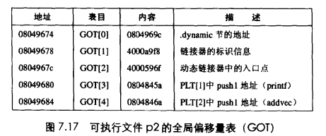

      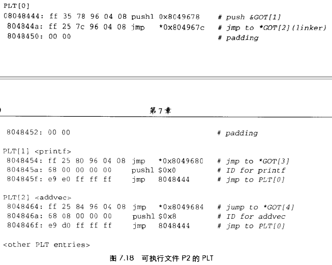

      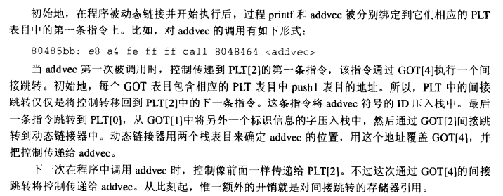

- 处理目标文件的工具

  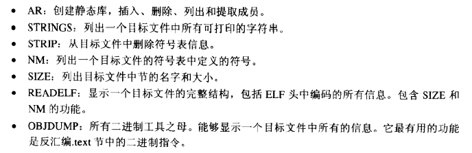

  Unix系统还有`ldd`可以列出一个可执行文件运行时需要的共享库

- 库打桩

## Exceptional Control Flow

### Exceptions and Processes

- 控制流
  - 实际执行的代码为物理控制流

- 异常表
  - 当发生异常的时候，跳转到异常表，每种异常有自己的异常编号然后再跳转到对应的异常处理程序中

- 异常类型
  - 异步
    - 中断
  - 同步
    - trap陷阱：程序故意引起的异常，例子：系统调用（类似调用函数，但是控制权转移给内核）。解决之后执行下一条命令。
    - Faults故障：有些可恢复，例如page fault（不在内存中，需要从磁盘读到内存）。发生故障之后可以重新执行当前命令或者终止
    - abort中止

- 进程
  - **正在运行**的程序实例
  - 两个抽象
    - 逻辑控制流：利用上下文切换
    - 私人地址空间：利用虚拟内存
  - 并发：一旦**逻辑控制流**重合就说两个进程是并发的
- 用户模式和内核模式
  - CPU使用某个控制寄存器中的一个方式位mode bit来控制当前的模式
  - Linux使用`/proc`文件系统使得用户模式进程可以访问内核模式数据结构中的内容，例如`/proc/cpuinfo`查看CPU类型，`/proc/<PID>/maps`查看某个进程使用的存储器段

- 上下文切换

  - 内核抢占当前进程并重新开始一个先前被抢占的进程，被称为**调度**，是由内核中的**调度器**的代码处理的
  - 系统调用发生上下文切换，等待某个事件发生而阻塞内核可以让当前进程休眠，切换到另一个进程。例如`read`和`sleep`。
  - 会导致cache被污染

- 进程控制函数

  - 必须检查返回值，-1为错误，除非返回void
  - `pid_t getpid(void)`获得当前进程PID和`pid_t getppid(void)`获得父进程的PID
  - 进程terminate的原因
    - 接受一个信号，其默认动作为terminate
    - 从main返回
    - 调用`exit`
  - 创建进程
    - `int fork(void)`，父进程调用一次，父进程返回子进程PID，子进程返回0
    - 子进程和父进程很像
      - 父进程虚拟地址空间的相同（但是separate）拷贝**副本**
      - 父进程打开文件的相同拷贝（可以访问父进程已打开的文件）
      - 和父进程PID不同
    - 创建多个子进程的时候会产生进程图

  - 回收reap子进程
    - 当一个进程结束的时候，系统保持它直到被回收（称为zombie），因为父进程想知道子进程的退出状态
    - `wait`或者`waitpid`来结束子进程，`int wait(int *child_status)`，其中`child_status`是一个返回值指示子进程terminate原因和exit status，父进程会等待其中一个子进程结束然后继续执行，返回值是结束子进程的PID
    - 当父进程terminate（例如被kill，但是主动exit的时候并不会回收子进程，造成内存泄漏）的时候还没有回收子进程，那么系统调用pid为1的`init`进程来回收
    - `pid_t waitpid(pid_t pid, int *status, int options)`
      - `pid>0`，就等待该子进程，若为-1就等待所有子进程（但是有一个结束就返回）
      - `options`为0，函数挂起当前的进程，还可以为`WNOHANG/WUNTRACED/WNOHANG|WUNTRACED`等
      - 返回值是结束子进程的PID
      - 其他具体见书

  - 在子进程中运行不同的程序
    - `int execve(char *filename, char *argv[], char *envp[])`
    - `filename`为可执行文件或者开头为`#!interpreter`的脚本，例如`#!/bin/bash`
    - `argv`参数列表，结尾是`NULL`，惯例`argv[0]`是`filename`
    - `envp`为环境变量列表，结尾是`NULL`，其中每个字符串都是形如`NAME=VALUE`的键值对
      - 获得环境变量`char *getenv(const char *name)`
      - 修改或添加环境变量`int setenv(const char *name, const char *newvalue, int overwrite)`（`overwrite`非0时发生修改）
      - 删除环境变量`void unsetenv(const char *name)`
    - 维持PID、打开的文件和signal context
    - `execve`调用1次并且**不返回**，除非出现错误
    - 一般操作是：先`fork`形成子程序，然后在子程序中`execve`
    - 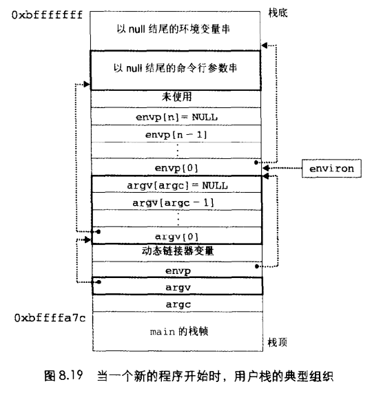

### Signals and Nonlocal Jumps

- Linux Process Hierarchy
  - pid=1为init进程，所有进程都是它的子进程
  - init进程下有Daemon守护进程以及login shell，后者为用户提供命令行接口，在命令行中输入指令时就会新建子进程来运行
- Shell Programs
  - 如果最后有`&`就会在后台执行
  - 可以设置后台执行完会发送**信号**打断shell，利用Exceptional Control Flow
- 信号
  - 信号是整数（1-30）
    - `SIGCHLD`一个子进程暂停或者终止
  - **发送**信号
    - 内核检测到系统事件发送给进程
    - 进程调用kill函数，要求内核发送一个信号给目的进程
  - **接收**信号
    - ignore——不属于**接收**
    - terminate——属于**接收**
    - catch信号然后交给用户级函数signal handler去处理——属于**接收**
  - 当信号被发送没有收到的时候就是pending，最多一个同类的signal，信号不是排队的，后续相同类型的信号直接discard掉（实际上是用pending bit vector其中一位来表示，当该位为1的时候表示信号发送，为0的时候表示接收到）
  - 信号可以被block，被block的信号可以发送但不会被接收（使用信号掩码，调用`sigprocmask`函数）直到取消block
    - 其他的support函数`sigemptyset/sigfillset/sigaddset/sigdelset`
  - 信号有默认action
    - terminate
    - stop
    - ignore
    - 可以用`handler_t *signal(int signum, handler_t *handler)`修改默认操作（除了`SIGSTOP`和`SIGKILL`），其中`handler`可以为`SIG_IGN`、`SIG_DFL`（变回默认操作）或者自定义的函数（**信号处理程序signal handler**）
- 进程组
  - 每个进程属于一个进程组，子进程继承父进程
  - `pid_t getpgrp(void)`和`pid_t setpgid(pid_t pid, pid_t pgid)`，后者将`pid`的进程组改成`pgid`，如果`pid`为0就用当前进程的PID，如果`pgid`为0就用PID作为组ID
  - 可以同时对一个进程组发送信号`kill -<signal> <pid>`和`kill -<signal> -<gpid>`
    - `int kill(pid_t pid, int sig)`
  - `ctrl-c`发送`SIGINT`给所有前台进程（结束），`ctrl-z`发送`SIGTSTP`给所有前台进程（暂停）
  - alarm: `unsigned int alarm(unsigned int secs)`返回前一次闹钟剩余的秒数，若以前没有设定闹钟就为0，到时间会发送`SIGALRM`，如果`secs=0`那就不会调度新的闹钟。注意：对`alarm`调用会取消任何pending的闹钟

- 处理信号

  - 当从kernel code转移回到user code的时候会先检查`pnb = pending & ~blocked`

  - 如果`pnb`非0，就从最小的非0位开始，强制process接收该信号，然后进程处理，之后循环处理所有非0位，然后往下执行下面的代码

  - **慢速系统调用**，`read/write/accept`等系统调用会阻塞较长时间，因此有些系统（非Linux，如Solaris）设置，当处理系统捕捉到一个信号之后，被中断的慢速系统调用在处理系统返回时**不再继续**（即中断就结束），立即返回错误条件，并将`errno`设置为`EINTR`。简单说，当前进程在等待命令行read的过程中收到signal，那么处理完signal，不再重启慢速系统调用。

  - 信号不可以对其他进程中发生的事件技术，因为会有信号阻塞不排队等问题。另外还有慢速系统调用被中断的情况。

    ```c
    // 尽可能多的回收zombies
    void handler(int sig) {
        pid_t pid;
        while ((pid = waitpid(-1, NULL, 0)) > 0) { // 注意是while而不是if
            printf("Handler reaped child %d\n", (int)pid);
        }
    }
    
    // 重启慢速系统调用
    int main() {
        while ((n = read(STDIN_FILENO, buf, sizeof(buf))) < 0)
            if (errno != EINTR)
                unix_error("read error");
    }
    ```

  - 可移植的信号处理

    - `int sigaction(int signum, struct sigaction *act, struct sigaction *oldact)`用来信号替换，以此解决慢速系统调用，如下
    - 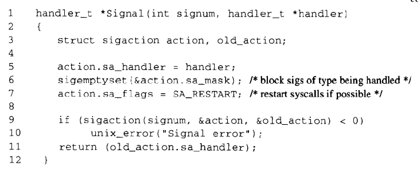

  - 显示阻塞信号

    - 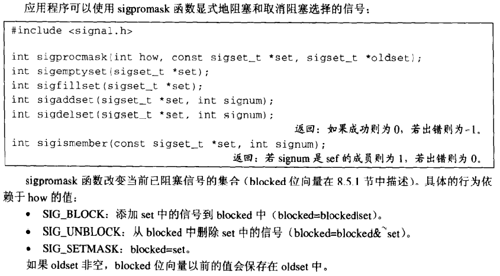
    - 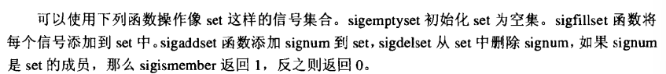

- 安全的信号处理程序

  - 参考书本addjob和deletejob的样例
    - 简单说就是防止子进程先执行完，在父进程中block所有信号，让子进程的信号处于发送状态，当添加完子进程之后再unblock信号来处理处于发送状态的信号

  - 尽量简单
  - 函数必须是异步信号安全的（可重入或者不被信号中断，可重入指的是所有变量都在stack中）
    - `printf/sprintf/malloc/exit`不安全
    - `_exit/write/wait/waitpid/sleep/kill`安全
  - 进入和退出的时候都要保存和恢复`errno`
  - 当访问共享数据的时候需要暂时block所有信号
  - 设置所有的全局变量为`volatile`，防止编译器将值放入寄存器中
  - 设置全局flag为`sig_atomic_t`

- 显示等待子程序结束发送信号的方法

  - 方法一：用全局flag来指示子进程结束

    ```c
    volatile sig_atomic_t pid; // 全局flag来指示结束子进程的pid
    
    void sigchld_handler(int s) {
        int olderrno = errno;
        pid = Waitpid(-1, NULL, 0);
        errno = olderrno;
    }
    
    int main() {
        ...
        while (1) {
            Sigprocmask(SIG_BLOCK, &mask, &prev); // BLOCK SIGCHLD
            if (Fork() == 0) {
                // child
                exit(0);
            }
            // parent
            pid = 0;
            Sigprocmask(SIG_SETMASK, &prev, NULL); // Unblock SIGCHLD
            // Wait for SIGCHLD to be received (wasteful!)
            while (!pid);
            ...
        }
    }
    ```

  - 方法二：`pause`表示当前进程睡眠，直到获得信号，但是这个信号可能不是`SIGCHLD`，所以要继续循环判断全局flag，存在的问题：如果在判断`pid`之后要进入循环，还没有`pause()`之前，收到了信号，那么`pause`就错过了我们想等的`SIGCHLD`，我们需要在下次获得信号的时候再判断然后退出循环。

    ```c
    while (!pid) pause(); // race!
    while (!pid) sleep(1); // too slow!
    ```

  - 方法三（**正确版本**）：

    - `int sigsuspend(const sigset_t *mask)`

    - 上面的函数相当于下面的原子版本，即原子地处理下一个信号（避免上面的race）

      ```c
      sigprocmask(SIG_BLOCK, &mask, &prev);
      pause();
      sigprocmask(SIG_SETMASK, &prev, NULL);
      ```

    - 正确的版本

      ```c
      while (!pid) Sigsuspend(&prev); // prev取消对SIGCHLD的block
      ```

- 非本地跳转

  - 直接从一个函数转移到另一个当前正在执行的函数，不经过正常的调用返回序列，利用`setjmp`和`longjmp`（加了sig为信号版本）

  - ```c
    int setjmp(jmp_buf env);
    int sigsetjmp(sigjmp_buf env, int savesigs);
    
    void longjmp(jmp_buf env, int retval);
    void siglongjmp(sigjmp_buf env, int retval);
    ```

  - setjmp调用一次保存当前栈的内容以供longjmp使用，返回0；longjmp从env缓冲区中恢复栈内容然后触发一个最近一次初始化env的setjmp调用，并从setjmp位置返回，返回值为retval（相当于setjmp设置信标，然后longjmp之后跳转回来并提供另一个返回值）

  - 目的

    - 在深层嵌套发现错误立即返回普通的本地错误处理程序
    - 让信号处理程序分支到特殊的代码位置而不是返回信号达到时中断了的位置

  - 注：C++和Java的catch看做是setjmp的类似物，throw为longjmp的类似物

- 操作进程的工具
  - 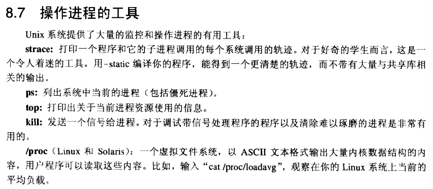
  - `strace`推荐

## System-Level I/O

- Unix I/O
  - `open()/close()/read()/write()/lseek()`
  - 注意Linux/MacOS用`\n`表示换行，而Windows是`\r\n`
  - `int open(const char *filename, int mode)`，后个参数可以用多个**或**起来，返回值是**file descriptor**，若为-1则表示error
    - 同时打开的文件是有限制的，可以用`limit`命令查看
    - 总有三个打开的文件：`stdin/stdout/stderr`，文件描述符分别是0/1/2
  - `int close(int file_descriptor)`，返回值为负表示error，出现在多线程关闭文件时
  - `ssize_t read(int file_descriptor, void *buf, int buf_size)`，返回为0表示EOF，负数为error，如果读取数量不足`buf_size`称为**short counts不足值**
  - `write`类似`read`
  - 注意系统调用会切换上下文，导致处理效率低

- RIO (robust I/O) package
  - `rio_readn/rio_writen`，无buffer
  - `rio_readlineb/rio_readnb`，有缓冲，前者为text后者是binary
    - 首先将文件读取多一点到buffer中，然后user code先尽量从buffer中读取，避免多次系统调用
  - 适用于网络编程

- Metadata, sharing, and redirection

  - 使用`stat`函数来查看文件元数据，也有`stat`指令，可以用`man stat`或者`man 2 stat`来看手册（Unix手册往往在第二章有详细解释）

  - 共享文件

    - 三种数据结构

      - 描述符表descriptor table，每个进程有独立的DT，DT表项**索引**为打开的文件描述符，DT表项**内容**是指针指向**文件表**的表项
      - 文件表file table，**所有**进程共享这张表，每个表项包含**文件位置**（表示当前读到哪，而不是存储位置）、引用计数以及一个指针指向**v-node表**，当计数为0时kernel删除这个表项
      - v-node表，**所有**进程共享，每个表项包含stat中大部分信息，包括`st_mode`和`st_size`和存储位置等

    - 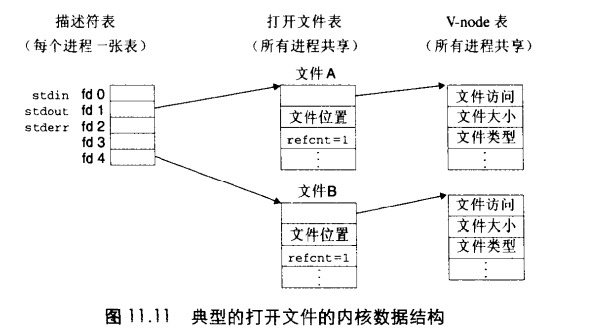

    - 允许从文件两个不同的位置（两个不同的文件描述符）开始读起

      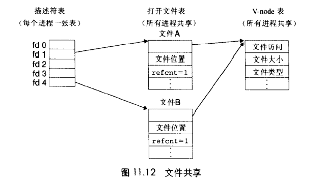

    - 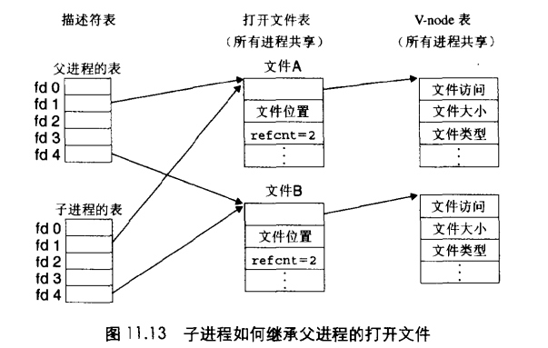

  - 重定向

    - 调用`dup2(oldfd, newfd)`函数，在描述符表中拷贝`oldfd`的内容到`newfd`的内容（即修改指向文件表的指针），如果`newfd`已经打开了就先关闭

- Standard I/O
  - 也有buffer，如`printf
