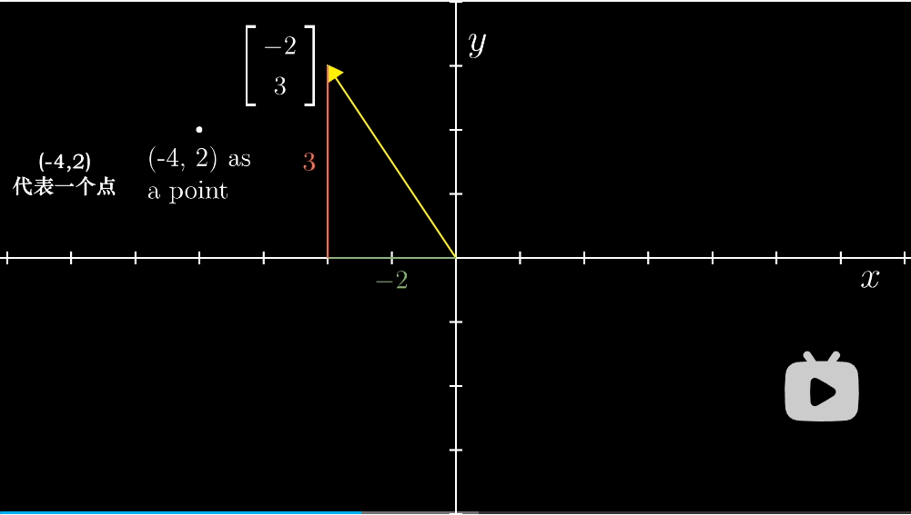
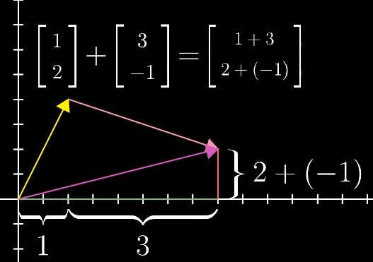

# 向量究竟是什么

- 向量的三种理解
  - 物理：长度+方向
  - 计算机：向量等价于数字列表
  - 数学：任何东西，只要两个向量相加、数字与向量相乘有意义
- 线性代数有关于向量加法与数乘
- 坐标轴
  - 
- 向量相加
  - 
  - 可以将向量理解成特定的运动，向某个方向运动某个距离
  - 向量的和等价于和运动
  - 
- 向量数乘
  - 就是距离的缩放 scaling
  - 数字就是标量 scaler
- 首先理解空间的变换，然后用计算机语言描述