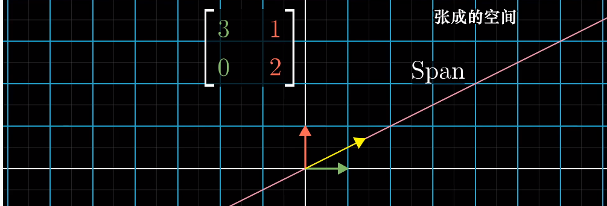
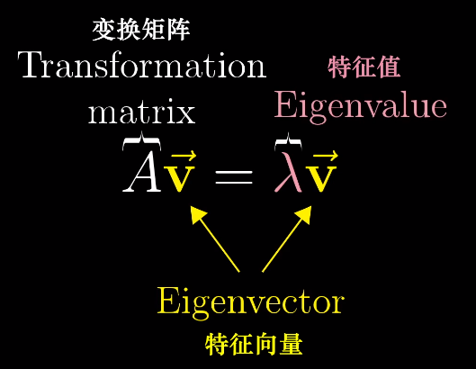
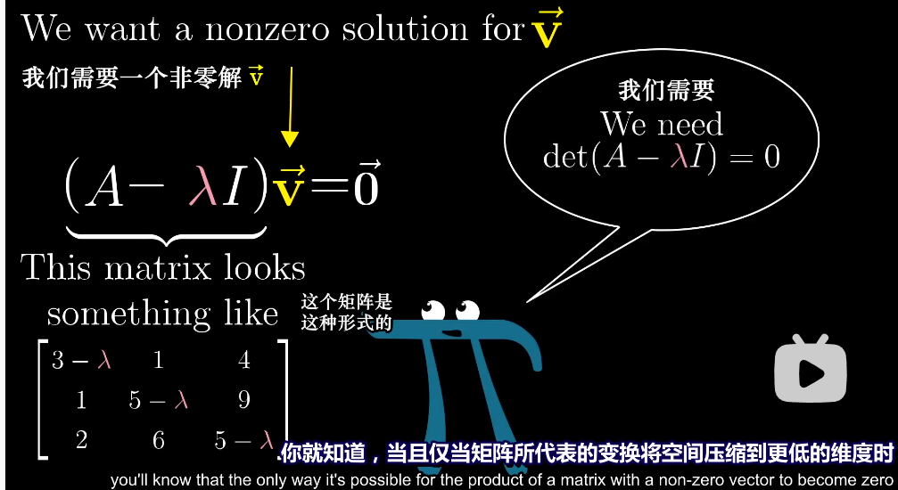
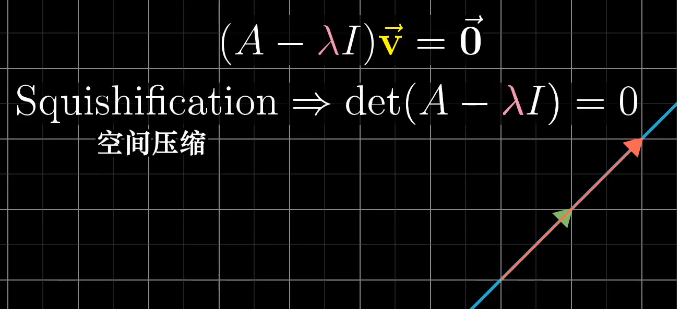
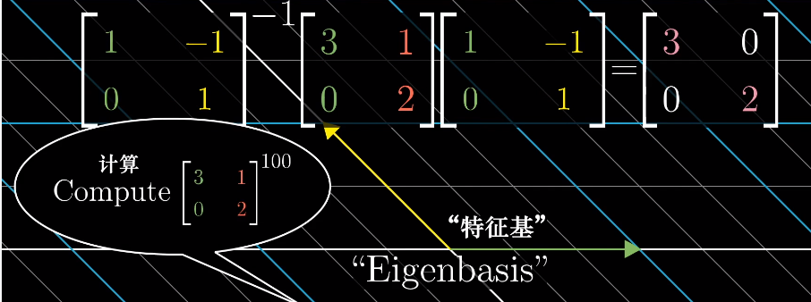

# 特征值与特征向量

- 考虑一个线性变换下的某个向量，它张成的空间在线性变换前后是否发生改变，就是这个向量所在的直线，大部分向量都离开它本来的直线，但是少部分依旧在它本来的直线上（意味着线性变换只是拉伸或者缩短了它）

  

- 这些不离开它本来方向的向量就是 **特征向量**，缩放比例就是 **特征值**

  

- 计算：

  $(A-\lambda I)\vec{v}=\vec{0}$永远有零解，所以我们想找非零解。我们知道只有矩阵所代表的变换能将空间压缩到更低维度的时候才有非零解。

  

  

- 二维矩阵可能没有特征值，例如旋转90度，所有向量都离开了它本来张成的空间。可能只有一个特征值，甚至有一个特征值对应不在一条线上的特征向量（例如缩放矩阵）

- 对角矩阵，所有基向量都是特征向量，矩阵的对角元是他们所属的特征值，做计算就比较简单。如果你的变换有足够多特征向量（能张成全空间），那你就可以变换坐标系使得特征向量就是基向量

  例如你知道变换$A$ 两个基向量 $[-1,1]$ 和 $[1,0]$，在你的语言中你想实现的变换是 $A$ 重复100次，那么你可以转换到对应矩阵（一定是对角矩阵），然后做100次再转回来：

  

- 并非所有矩阵都能对角化