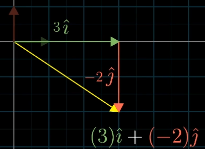
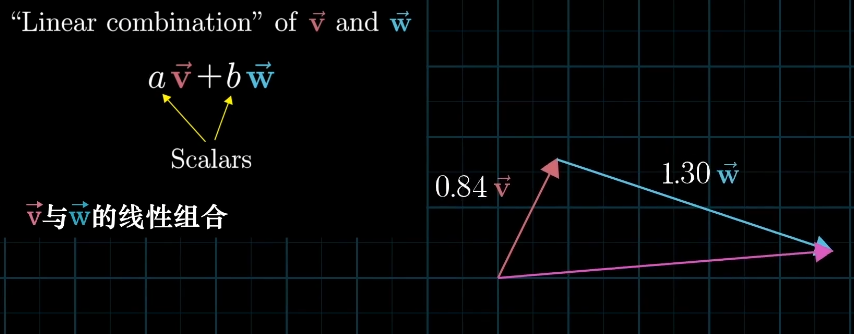
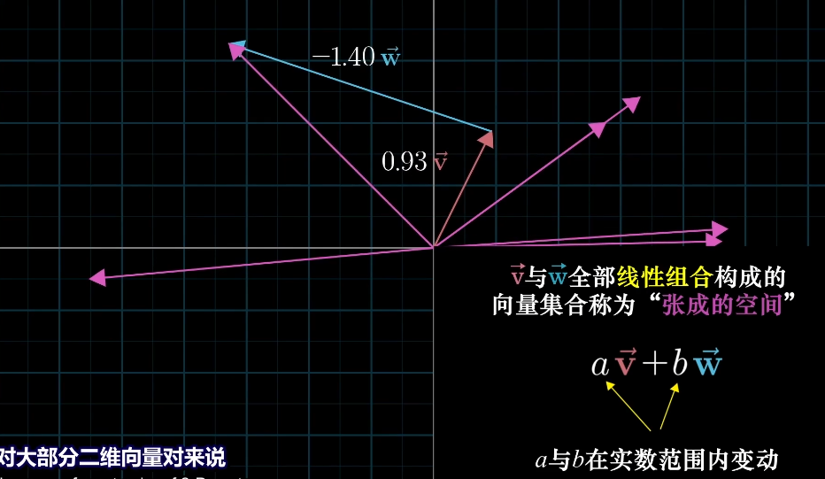
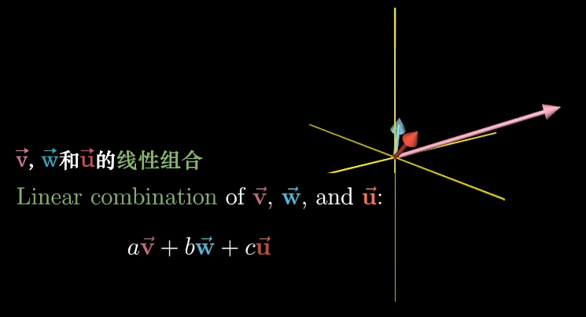
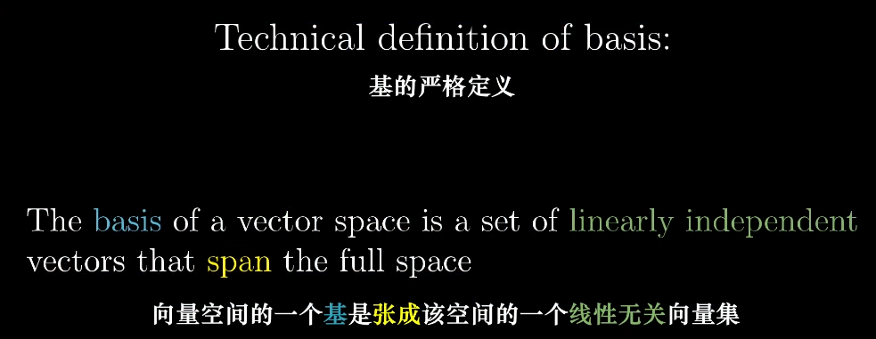

# 线性组合、张成的空间与基

- 将向量中的数字看做标量，然后分别加上$\hat{i},\hat{j}$（基向量） 得到对应的向量

  

- 我可以选择其他的基创建不同的坐标系，所以每个坐标都取决于其基

  

- 张成的空间：其实是向量仅通过相加和数乘所能得到的所有向量的集合

  

- 向量与点：单个向量看做箭头，多个向量看做点

- 3D张成空间

  

- 线性相关，某个向量已经在其他向量张成的空间内；如果一个向量给整个空间增加一个维度，那就是线性无关的

- 基

  

