# 矩阵与线性变换

- 变换 Transformation 就是函数，接受一个向量输出一个向量，但是它暗含了向量的运动

- 每个向量都通过这个变换移动到另一个位置

- 线性变换要求满足

  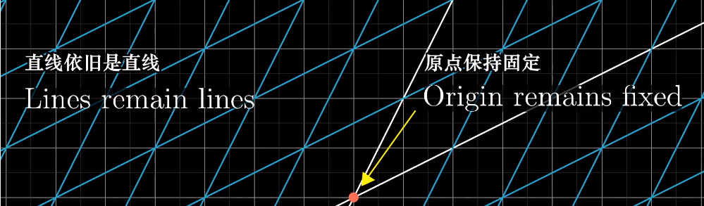

  可以认为是

  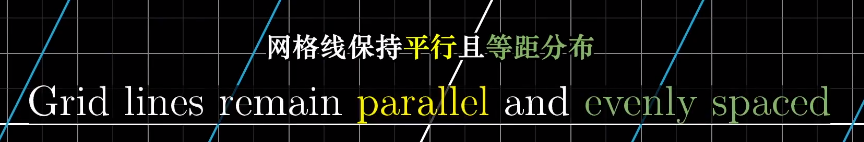

- 考虑线性变换只需要考虑基向量即可

  因为任意由基向量线性组合得到的向量变换之后依旧保持线性组合关系

  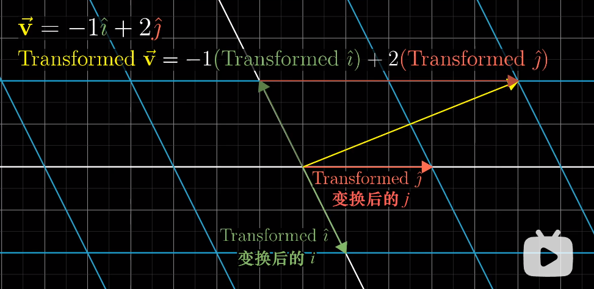

- 线性变化只有基向量的4个数字确定

  当$\hat{i},\hat{j}$变换到相应位置，$(x,y)$会按照如下规则变换

  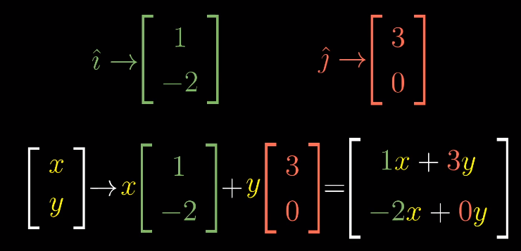

  我们将**基向量放在一起**写成矩阵（重要！）：

  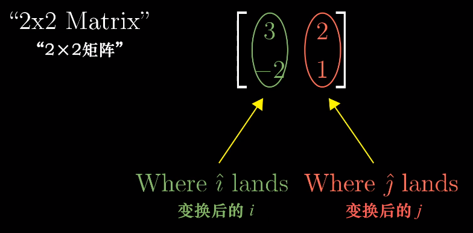

  二阶矩阵的作用方式就是上上张图的效果：

  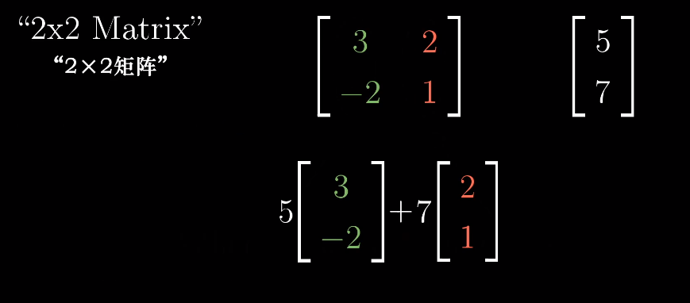

- 一般情况：$(a,c)$是第一个基向量落脚点，$(b,d)$是第二个基向量的落脚点

  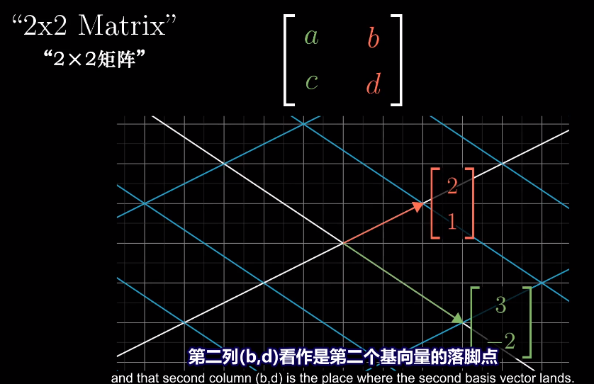

  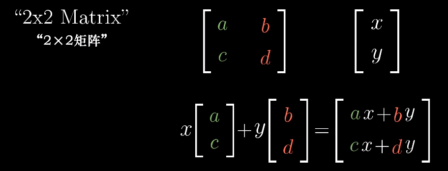

  我们可以将矩阵乘法看做是：基向量的线性组合

  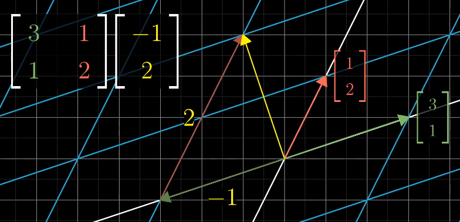

- 例子：逆时针旋转90度

  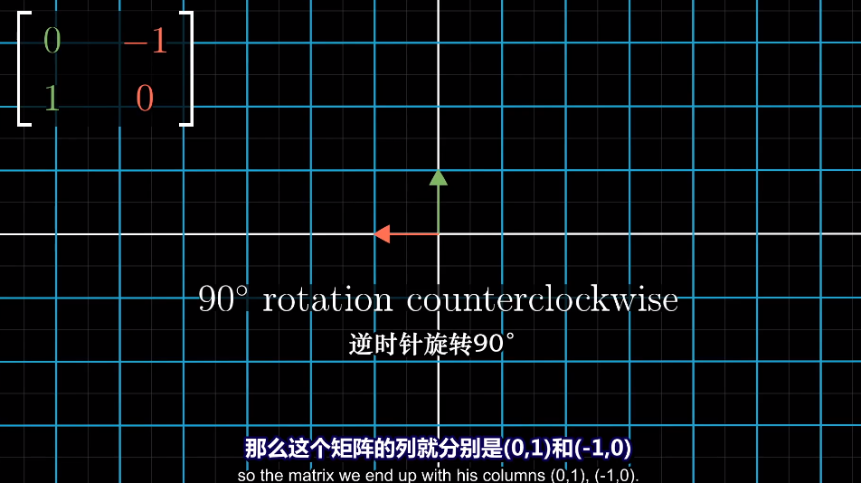

  要求任意一点变换后的位置只需要和左上角矩阵相乘

- 从矩阵到线性变换：如果是列线性相关，那么整个二维空间被挤压成了一条线

  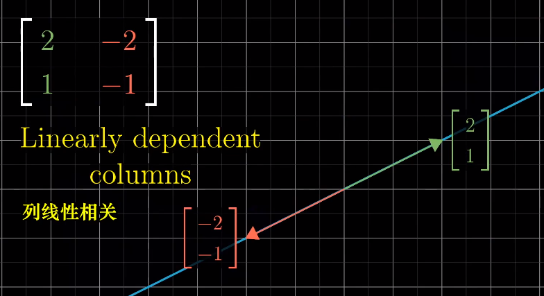

  