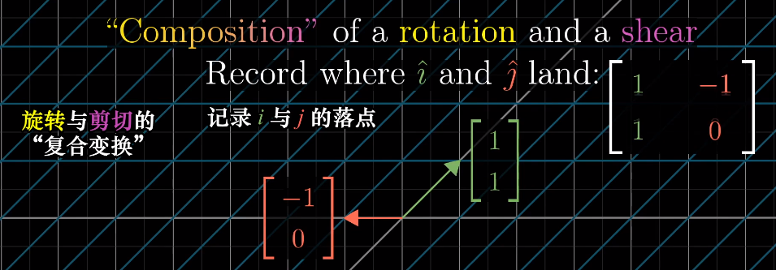
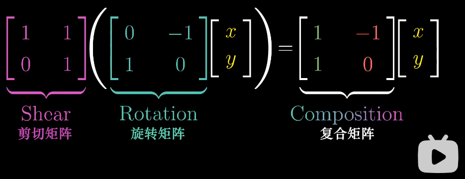
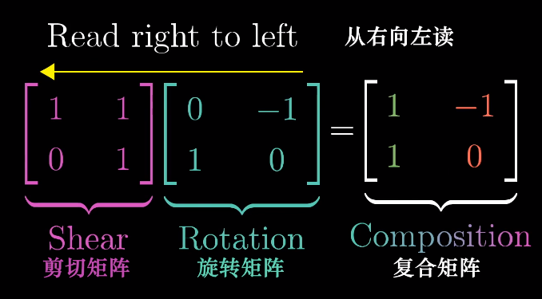
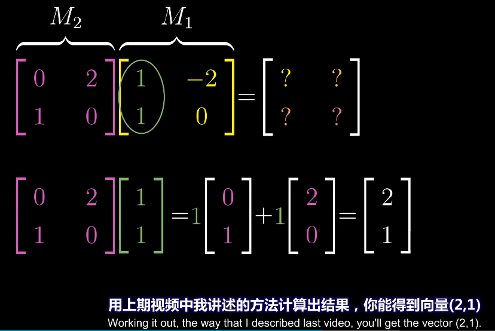
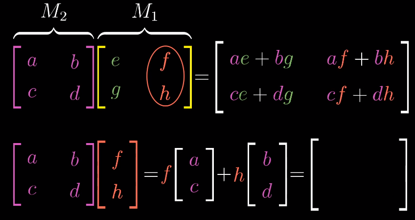

# 矩阵乘法与线性变换复合

- 回顾：矩阵表示线性变换，矩阵与向量的乘法表示将线性变换作用于向量
- 矩阵乘法：依次做多个线性变换（重要！）

- 例子：先旋转后剪切

  

  

  注意顺序：从右向左读

  

- 计算方法：

  首先获得$M_1$的第一列，就是 $\hat{i}$ 变换之后的坐标，然后再作用于$M_2$，计算的出的值就是复合矩阵的第一列

  

  一般化：

  

- 矩阵乘积的顺序count。$M_1M_2\ne M_2M_1$

- 矩阵乘法有结合律