# 行列式

- 有些线性变化拉伸空间，有些压缩空间，我们想知道空间到底被拉伸了多少。更具体就是测量一个给定区域面积增大或缩小的比例

- 例子：由基向量组成的矩阵就能看做面积的变化

  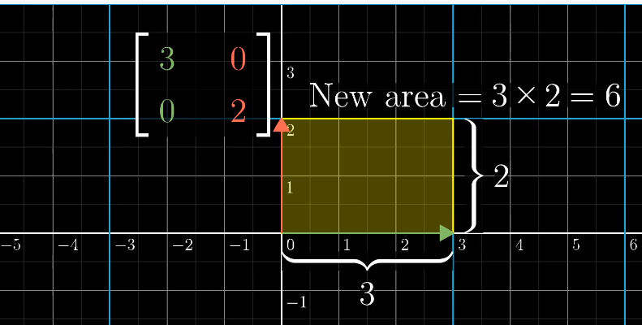

  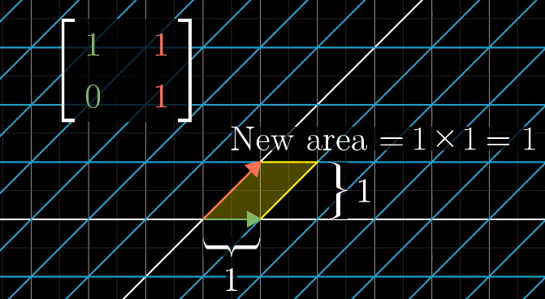

- 对于非规则的面积：可以将其拆分成小矩形，而这些小矩形遵循相同的缩放比例

  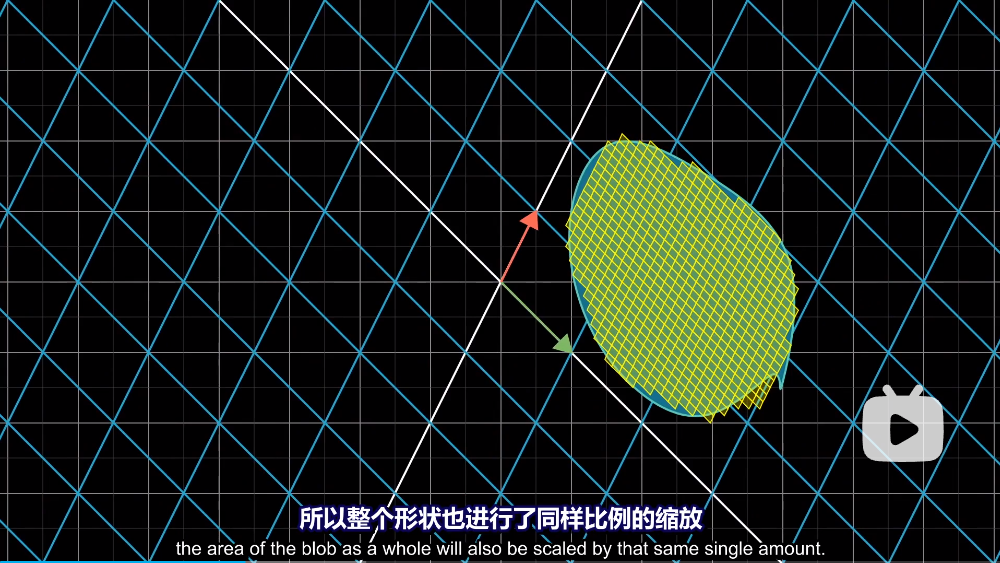

- 行列式：

  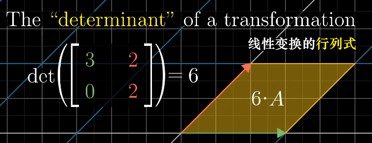

- 当压缩到一条线或者一个点的时候，行列式就是0

  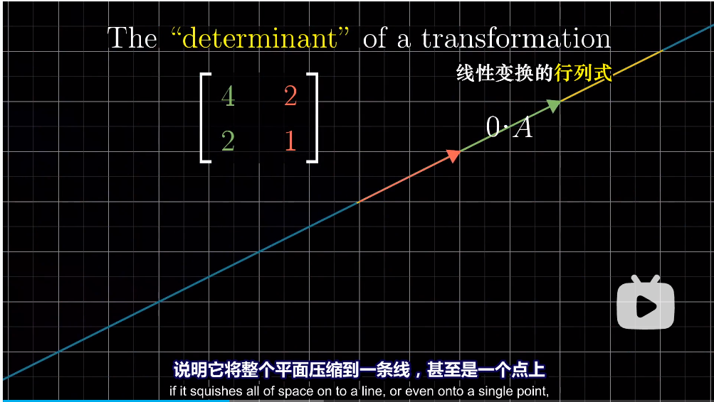

- 行列式是有负值的：就是空间被翻转了

  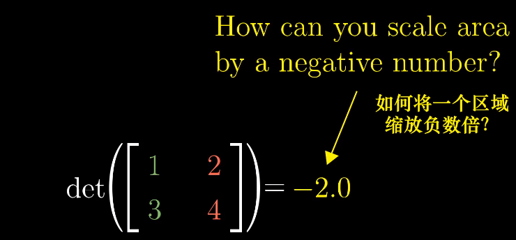

  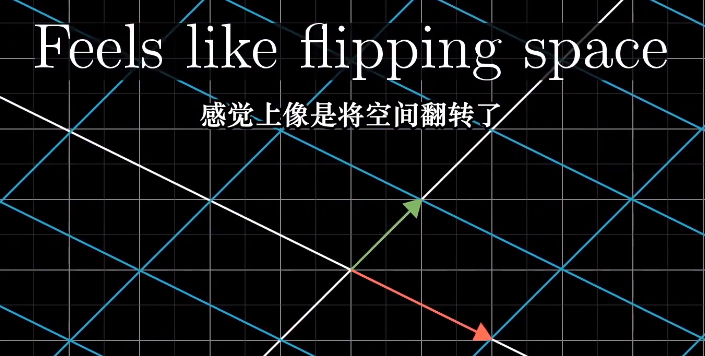

  例如 $\hat{i}$ 和 $\hat{j}$ 的左右方向被改变

  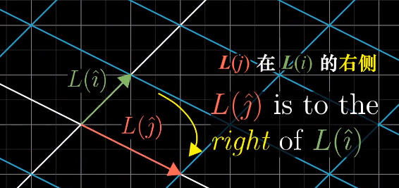

- 在空间中，行列式代表是平行六面体的体积

  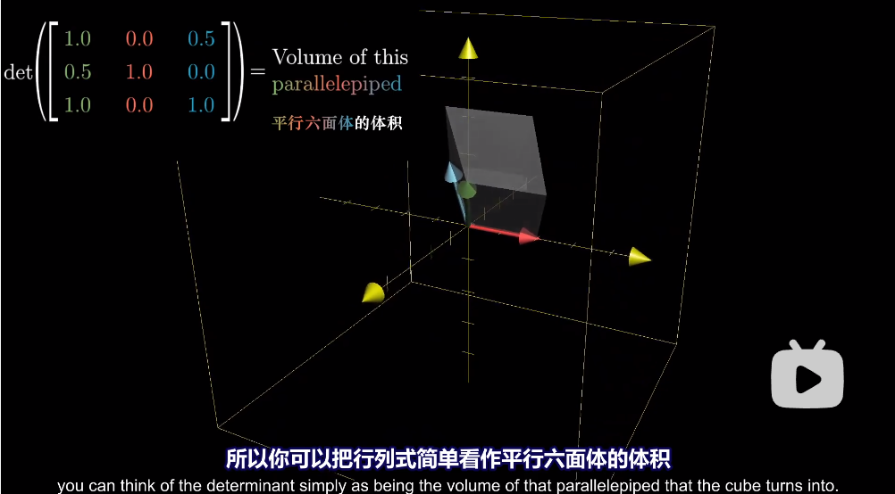

  在空间中行列式的正负可以解释成：

  先用右手定则确定基向量的方向，然后在变换之后，如果还能用右手定则表示，那么就为正；反之如果只能用左手，那么就为负

  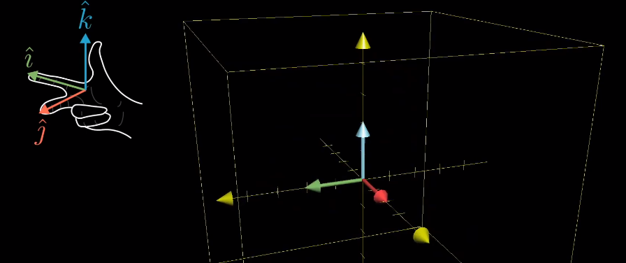

- 行列式计算

  二维：

  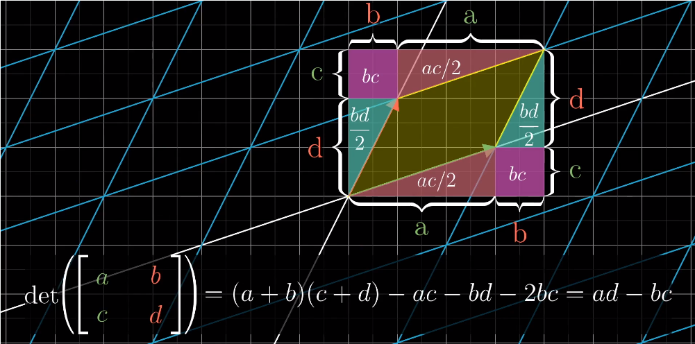

  三维：

  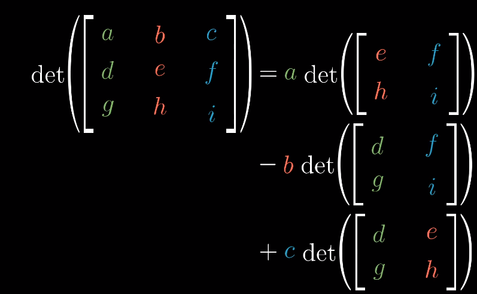

- 例题

  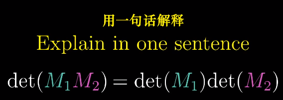

