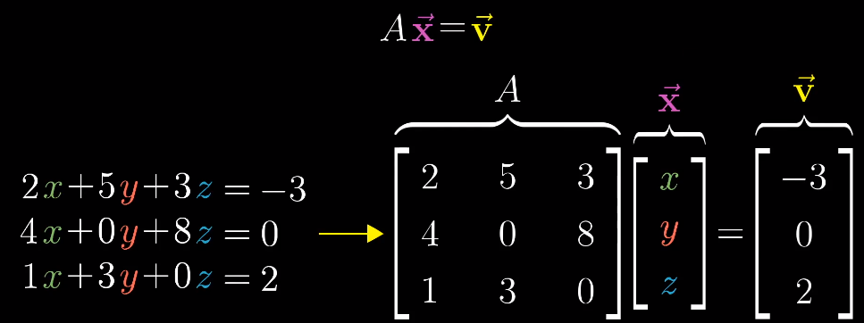
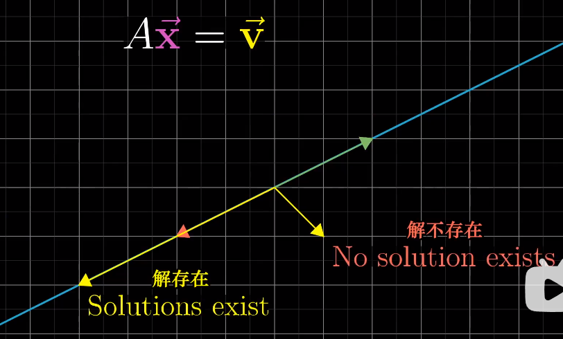
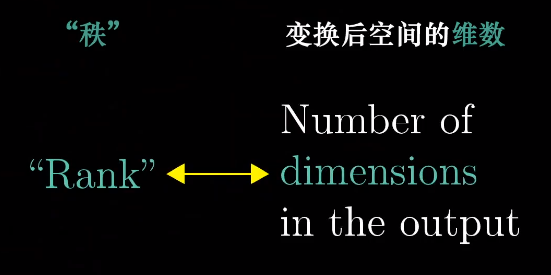
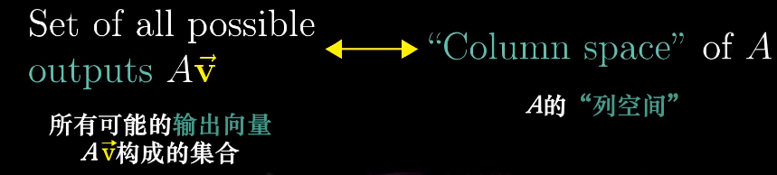
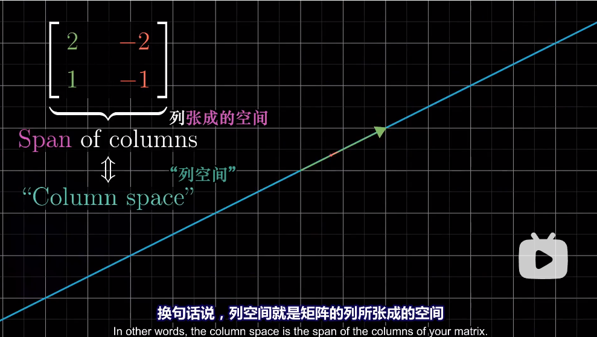
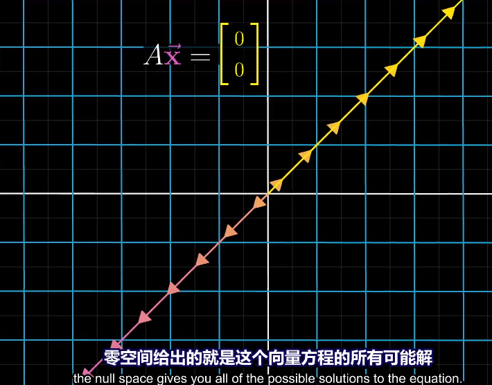

# 逆矩阵、列空间与零空间

- 矩阵用来解线性方程组

  

- $A\vec{x}=\vec{v}$ 的意义是找到一个线性变换使得 $\vec{x}$ 变换成 $\hat{v}$

- 当 $det(A)\ne 0$的时候，我们要找 $A^{-1}$

  

- 当 $det(A)=0$ 的时候，空间被压缩到更低的维度，所以没有逆变换，但是还是可能有解。

  例如 $\vec{v}$ 刚好就在这根线上。

  

  将3D空间压缩成2D平面相比压成1D点，解存在的概率高一些

- 秩

  变换之后所有向量都在平面上，该矩阵rank为2；都在线上，该矩阵rank为1

  

  2\*2矩阵的秩最大为2，即基向量仍能张成整个二维空间

- 列空间

  

  由于矩阵的列就是基向量，所以列空间等于列张成的空间等于基向量张成的空间

  

  秩是列空间的维数。当秩与列数相同（秩最大）时，称为满秩

  零向量一定在列空间中。对于满秩矩阵，唯一在变换后落在原点的就是零向量自身，对于非满秩矩阵，有很多向量变成了零向量（因为空间被压缩了）

- 零空间

  在变换之后变成零向量的向量的集合 称为 矩阵的**零空间**或者**核**

  就是 $A\vec{x}=\vec{0}$ 的解

  