# 点积与对偶性

- 点积：先做正交投影，然后相乘；如果投影方向相反结果为负。但是两个向量分别往对方做正交投影得到的点积结果都是相同的，为什么？

  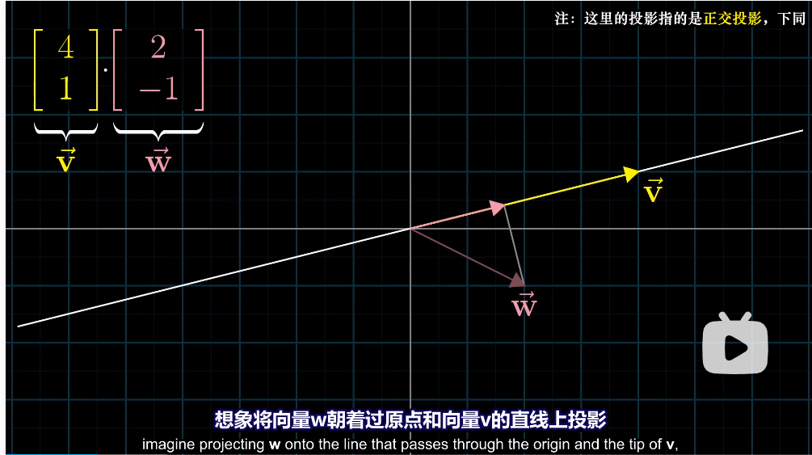

  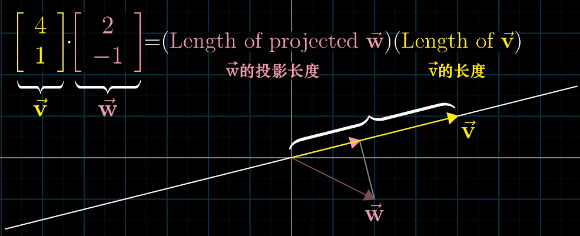

- 当两者长度相同的时候，互为镜像

  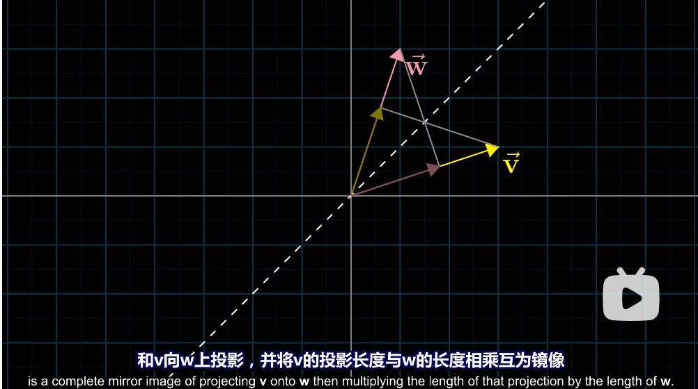

  当长度不同的时候：

  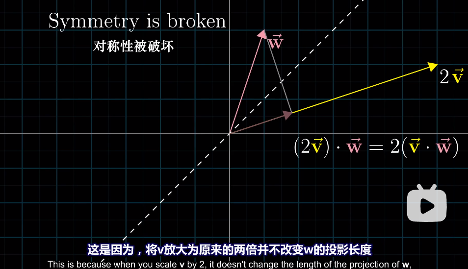

- 另一个问题：为什么投影 和 对应坐标相乘并相加 有关？答案是**对偶性**

- 首先来讨论多维空间到一维空间（数轴）的**线性**变换

  有很多二维输入一维输出的函数，但是**线性**有更严格的要求，那就是如下公式（但是我们可以先不管这些）

  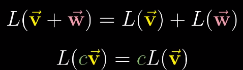

  从几何上看，线性函数要求：

  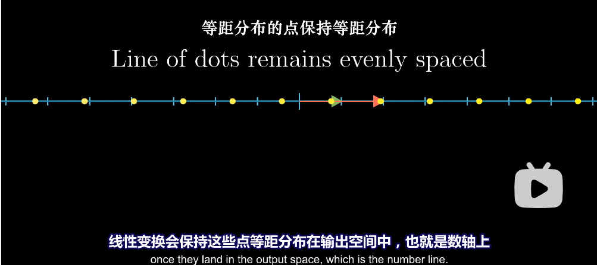

  下面是一个非线性的例子：

  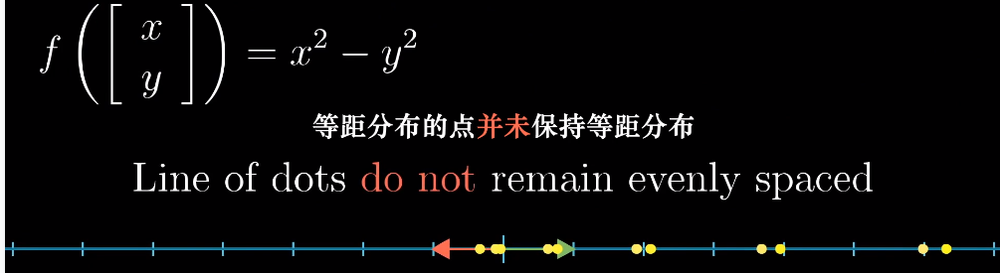

  线性变换代表的矩阵如下。由于变换到数轴上，所以 $\hat{i}$ 和 $\hat{j}$ 都变成一个数字

  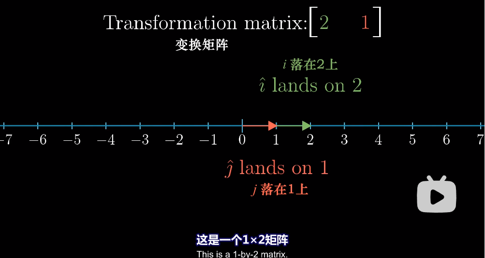

  例子如下。$\hat{v}=[4,3]$ 在 $1\times 2$ 的矩阵变换下得到的结果，这个公式和点积非常类似， $1\times 2$ 的矩阵就像一个倾倒的向量

  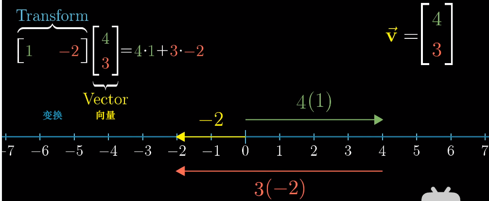

- $1\times 2$ 矩阵和二维向量有一一对应关系：将向量转换成数的线性变换和这个向量本身有某种关系

- 重要例子

  考虑二维空间内有一根数轴，数轴的单位向量是 $\hat{u}$，它在二维空间的坐标是 $(u_x,u_y)$

  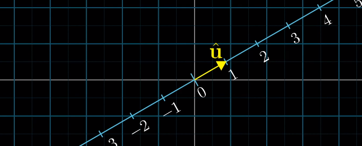

  我们定义一个二维向量到数的函数：任意一点正交投影到该数轴上，这个函数同时是线性函数，因为投影是等距的。而这个函数等价于一个 $1\times 2$ 尺寸的矩阵

  

  为了找到这个矩阵，我们需要知道变换之后 $\hat{i}$ 和 $\hat{j}$ 的位置，两个位置分别放到 $1\times 2$ 的矩阵中就得到了变换矩阵。例如对 $\hat{i}$ 做正交投影之后的值其实就是 $\hat{u}$ 在x轴上做正交投影的值即 $u_x$，所以 $\hat{i}$ 正交投影到 $u_x$，所以变换矩阵第一个值为 $u_x$，同理第二个值为 $u_y$

  

  当我们得到了这个投影矩阵之后，那么所有空间上的二维点的投影我们就知道了，而计算这个投影就是求点积

  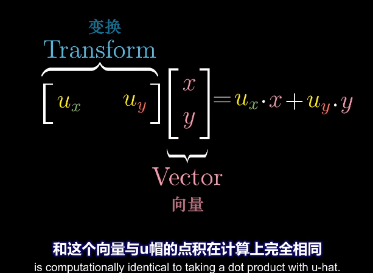

  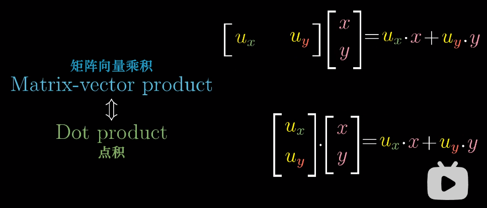

  所以（重要）与单位向量的**点积** 可以解读为 将向量投影到单位向量所在直线上所得到的**投影**值

  > 另一个问题：为什么投影 和 对应坐标相乘并相加 有关？答案是**对偶性**

  向量与非单位向量的点积 可以解读为 首先朝给定向量上投影然后将投影的值与给定向量长度相乘

- 总结：向量可以看做是一种线性变换，将空间投影到一维

  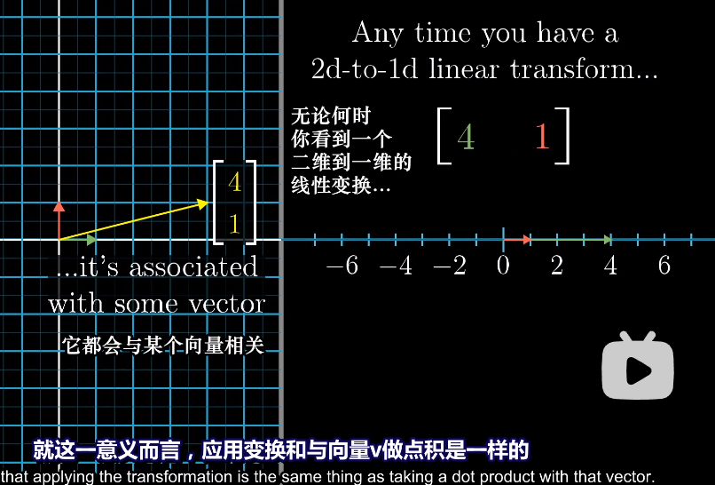

> 最终的目标：解答为什么点乘的代数定义（x1x2+y1y2）和几何定义（投影）等价。
> 具体过程：
> 1.提出点乘的两种定义方式，一种是代数方式，就是x1x2+y1y2，第二种是几何方式，就是他说的投影。
> 2.接着抛出一个问题，为什么第二种投影的方式等价于第一种，明明这两种方式的区别巨大并且不直观等价。
> 3.为了解答这个问题，可以先从1x2矩阵变换和向量点乘之间的关系入手。因为这两种的计算过程一摸一样的，都是x1x2+y1y2，似乎有某种联系在这之中，但这种联系并不明显。（当前并不能说直接等价，因为从意义来说，1x2矩阵是一种变换，【a b】中的a是i帽变换之后的一个数，b是j帽变换之后的一个数。而1x2矩阵的竖写只是一个向量）
> 4.接着是最关键的部分，将投影的过程用线性变换来表示，即找到一个效果等同于投影的1x2矩阵。视频中的u帽那条数轴代表着被投影的位置，例如将向量v投影到向量w上，这个u帽就代表了向量w所在数轴的单位向量。根据线性变换的本质，记录i帽和j帽变换后的位置即可以表达整个变换过程。则找到的【ux uy】（ux,uy肯定都是小于等于1的）这一变换刚好可以表达整个二维空间投影在u帽这条向量所在数轴的过程。所以这就完成了任一向量到目标向量所在数轴的投影过程。
> 5.所以通过这一串的说明，投影等价于1x2的线性变换，1x2的线性变换等价于点乘的代数定义，最终解释了为什么点乘的代数定义（计算过程）和几何定义（投影）是等价的。
