# 以线性变换的眼光看叉积

> 本视频有点复杂，可以看最后的解释

- 上节提到的行列式首列为基向量，非常奇怪

  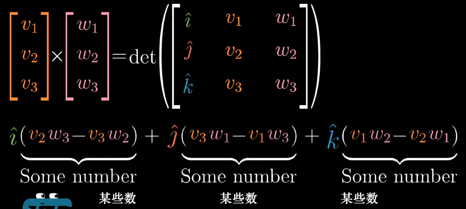

  老师会告诉学生这个结果会有以下几何性质：长度等于平行四边形的面积、方向垂直 $\hat{v}$ 和 $\hat{w}$，同时符合右手定则

  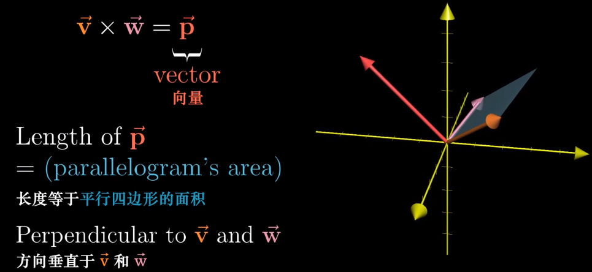

- 回顾点积：向量 和 空间到数轴的线性变换 是等价的

  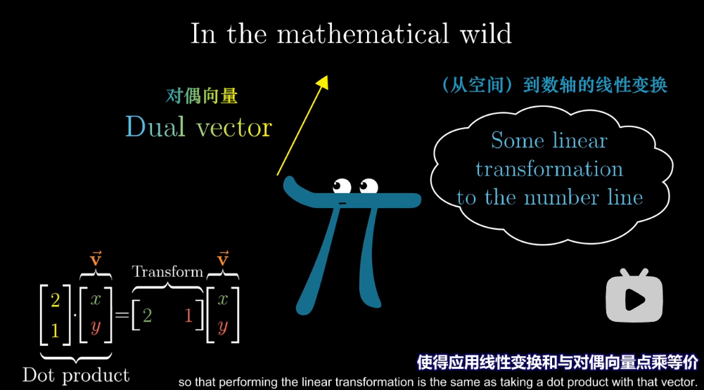

- 总体计划：

  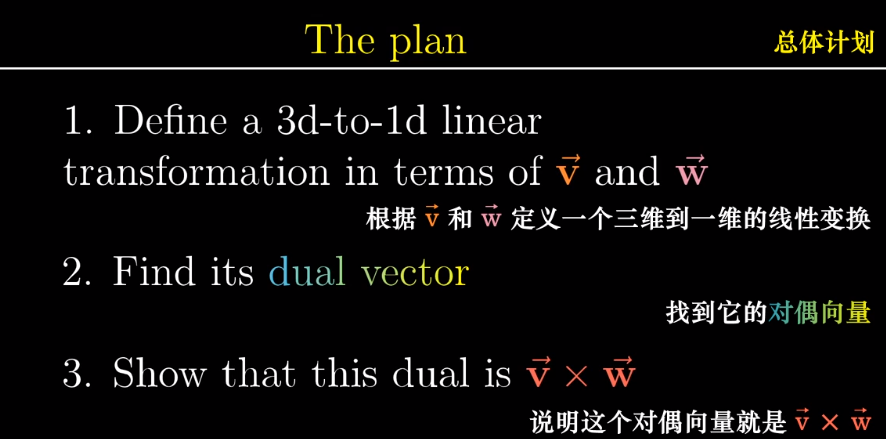

  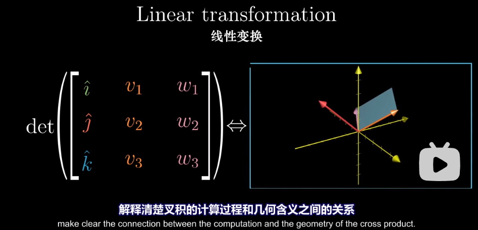

- 二维上叉积是平行四边形的面积：

  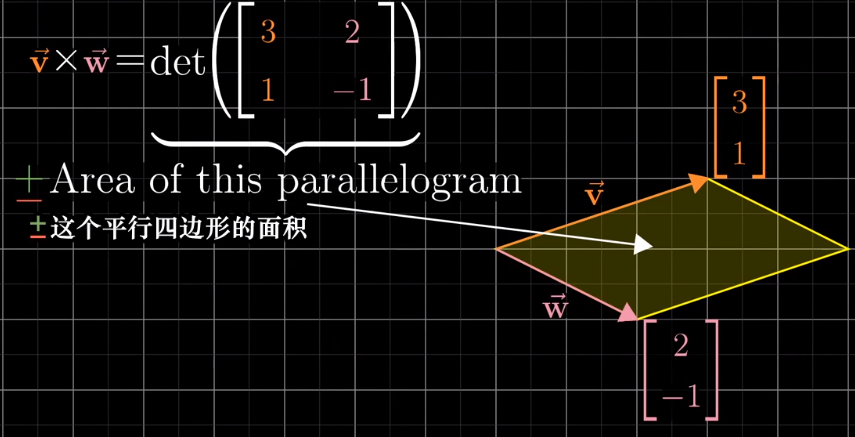

  我们由此猜测三维叉积是平行六面体的体积：

  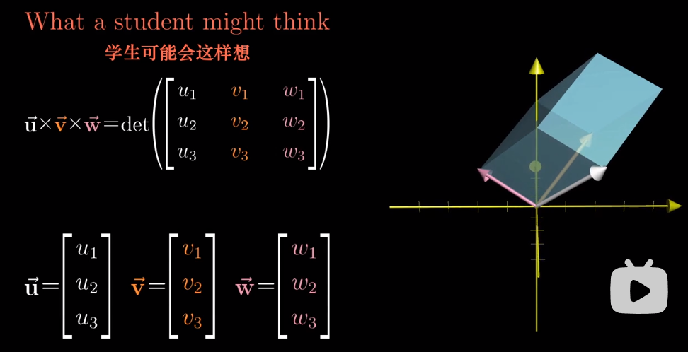

  但是实际上的叉积是向量。我们将首列看成是变量 $x,y,z$，我们构造出一个函数（这个函数是线性的）

  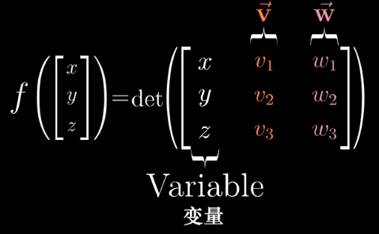

  > 1.易知，当u取原点时，这一变换会使之缩到原点，因为这个平行六面体已经没有高了
  >
  > 2.根据相似的原理，当u在一条直线上运动时，这个平行六面体的体积与u的长度成正比
  >
  > 3.所以在这条直线上等距取u时，这一变换会使得这些点在数轴上等距分布
  >
  > 4.根据前面点积的介绍，这是一个线性变换

  所以存在一个$1\times 3$的矩阵来表示这个变换

  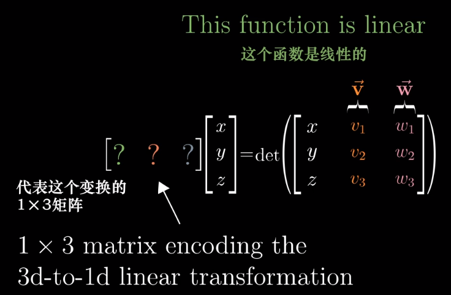

  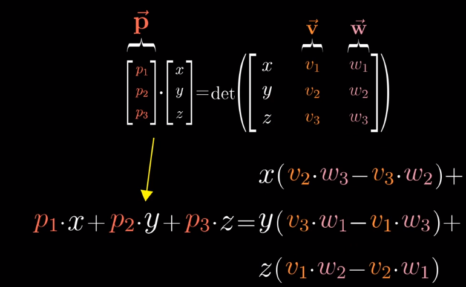

  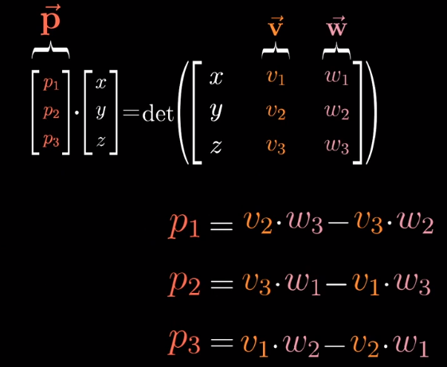

  联想之前的公式：其中的$i,j,k$只是告诉我们需要将这些系数解读为一个向量的坐标

  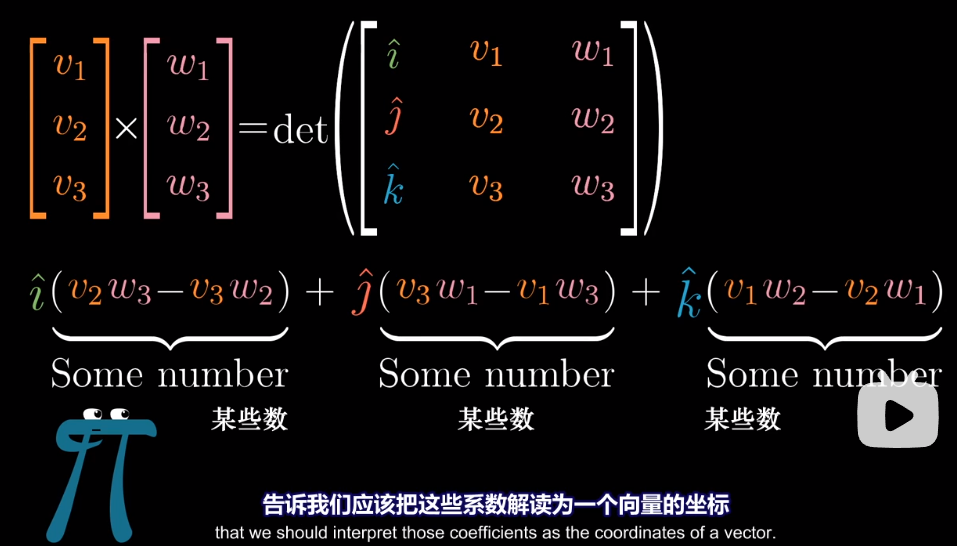

  所以上面这个奇怪的计算过程表示：

  找到一个 $\vec{p}$ 使得它和 $[x,y,z]$ 的点积是右边那个形式

  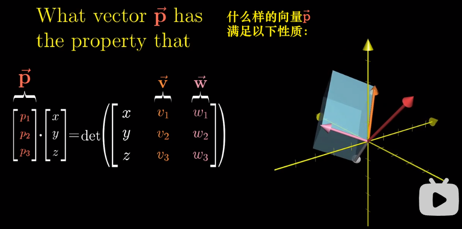

- 从几何角度找到这个 $\vec{p}$ 长度一定等于平行四边形面积，且 $\vec{p}$ 与 $\vec{v},\vec{w}$ 垂直：

  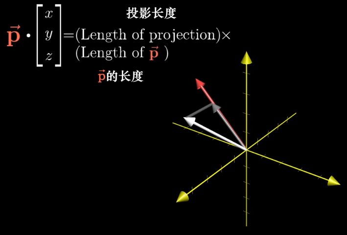

  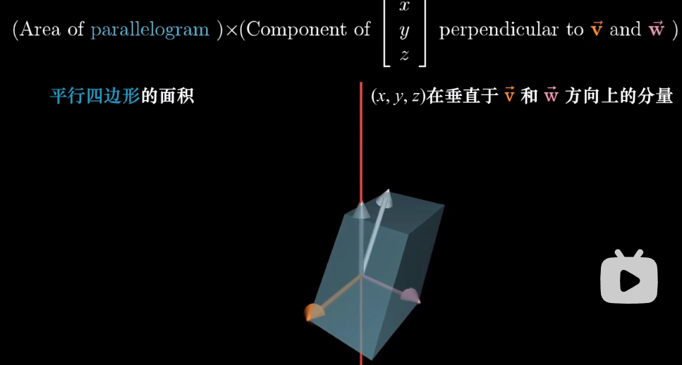

> 1、考虑一个三维到一维的变换，这个变换把任意的向量x变成它与给定vw向量的行列式（体积）
> 2、因为vw是常量，所以体积和第三个向量x之间满足线性关系，所以这是一个线性变换
> 3、根据对偶性，线性变换（仅限多维到一维）必然存在一个对偶向量p，p点积x 等于 线性变换作用在x上（求行列式），所以有   p\*x=det(xvw）
> 4、根据 p\*x=det(xvw) ，从数值计算角度可以求解出p的坐标
> 5、根据 p\*x=det(xvw) ，从几何角度可以获得一些p的性质
> 	5.1、已知：px点积=x在p上的投影乘p的长度
> 	5.2、已知：多边形的体积（行列式）=x在垂直vw平面的轴上的投影长度\*vw平行四边形
> 	5.3、因为“=”关系成立，可得
> 		①、p的长度=平行四边形面积
> 		②、p垂直与vw平面
> 6、通过4和5已经基本了解并且能计算出p的值，所以将数值计算p的过程（第4条）称为叉积，将p称为v和w的叉积结果。注意因果。