# 基变换

- 不同的基产生不同的坐标系

- 如果我们使用 $[1,0][0,1]$ 而 詹妮弗使用 $[2,1],[-1,1]$

  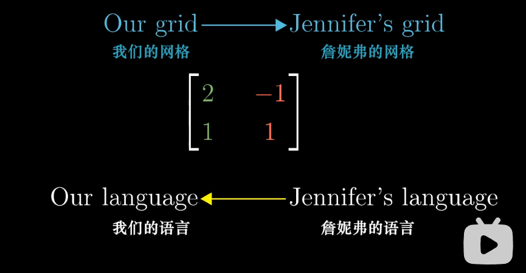

  所以詹妮弗的$[-1,2]$ 经过上述矩阵得到我们知道的 $[-4,1]$

  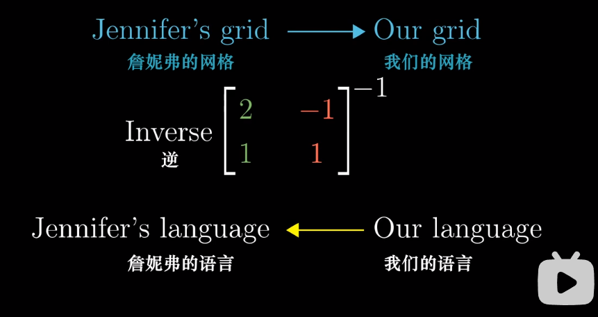

- 总结

  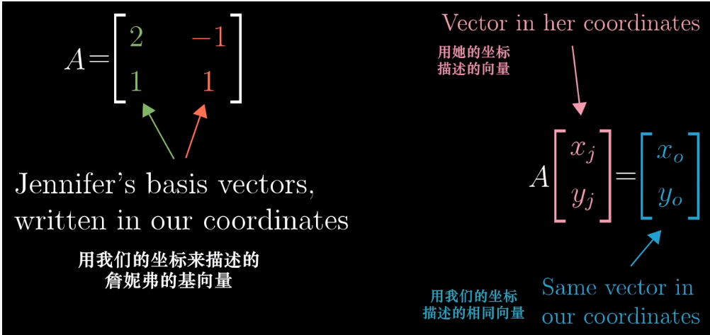

  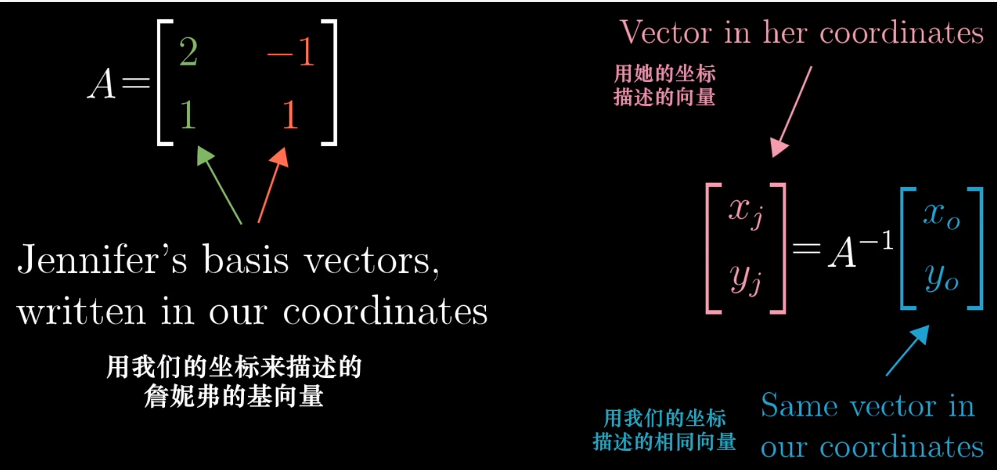

- 当詹妮弗想用她的语言表示她的旋转90度矩阵：

  我们假设詹妮弗语言中有一个向量 $[-1,2]$，我们先将其转换成我们的语言

  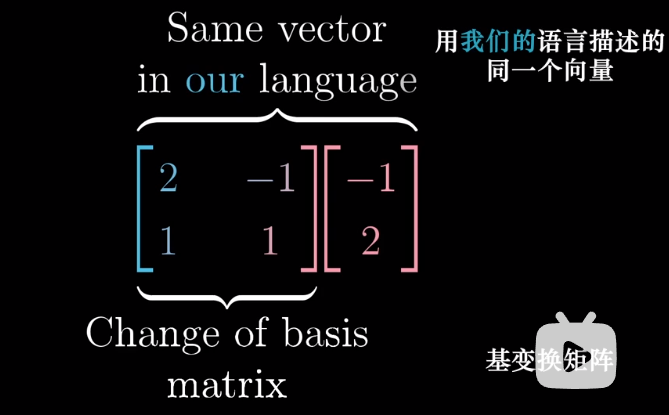

  然后用我们的语言做旋转：

  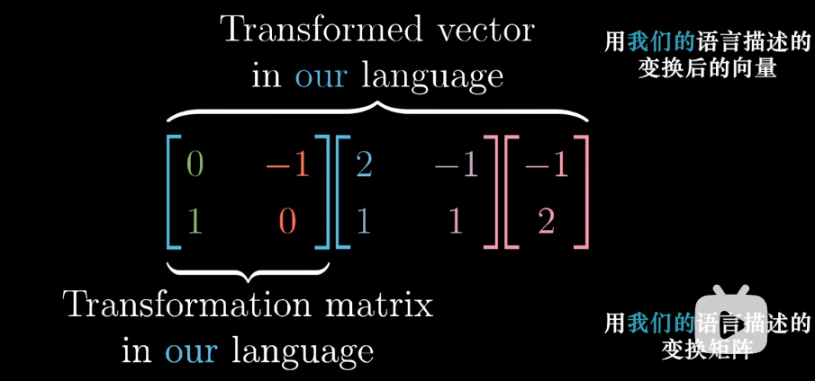

  最后转化到詹妮弗的语言：

  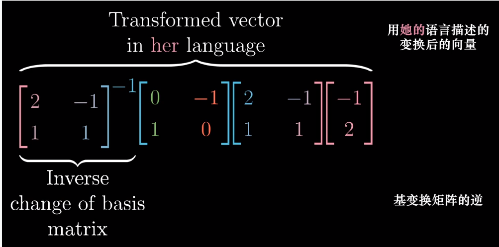

  最后我们就得到了用詹妮弗语言描述的变换矩阵：

  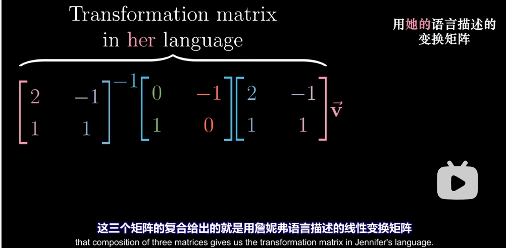

  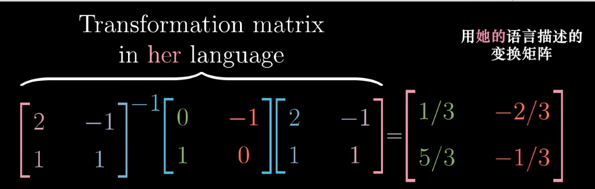

  所以如果用詹妮弗语言下的坐标乘以上述变换矩阵就能得到詹妮弗语言中的变换矩阵

  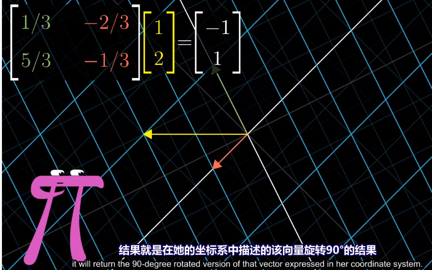

- 所以下式代表：你眼中的某种变换 在 别人眼中 是什么样的

  $M$是你语言下的变换，$A$是用你语言描述的别人的基

  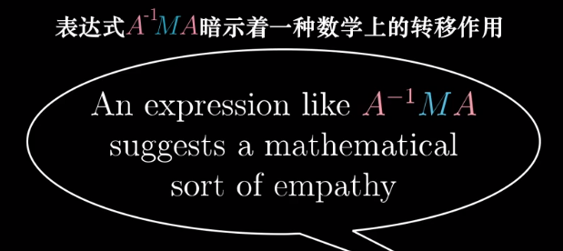