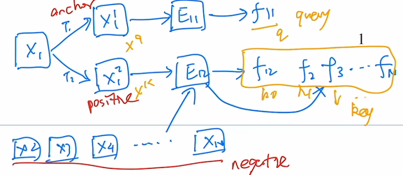
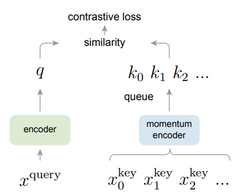
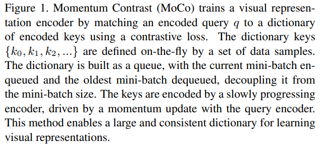
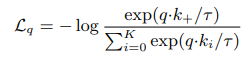
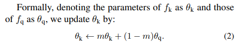
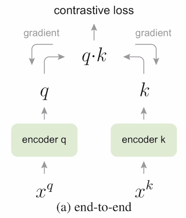
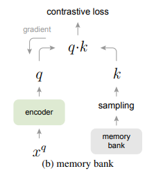
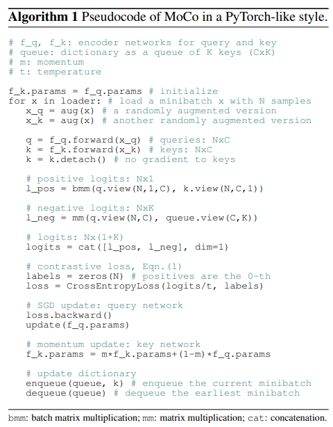

# MoCo

## 知识铺垫

- 对比学习
  - 三张图片：高兴的人、不高兴的人、狗，模型可以识别出前两者属于同一种类别
  - 将上述图片经过网络投影到特征空间，希望前两者向量尽可能拉近，而与第三张向量距离拉远（聚类）
  - 在CV中属于无监督，因为可以设计一些巧妙的代理任务pretext task，从而人为定义一些规则，来定义哪些图片是相似的哪些是不相似的
  - 最常用的代理任务instance discrimination个体判别，在数据集$N$中有如下图片$X_1,X_2,\dots,X_n$。然后从中随机选一张图$X_i$，并对该图做任意处理，例如裁剪等，得到$X_i^1,X_i^2,\dots$，这些处理后的被称为正样本，而数据集里其他任务都是负样本
  - 对比函数常用的loss函数有NCE Loss
  - 灵活性就是找到定义正样本和负样本的方法即可，NLP领域也有例如SimCSE，还有RGB图深度图当正样本，正面图和背面图当正样本，后来扩展到多模态，即CLIP模型

## 标题

- Momemtum Contrast for Unsupervised Visual Represententation Learning

- MoCo是CV领域使用对比学习的里程碑工作

- 无监督，在分类任务上逼近有监督的基线模型，而且在其他任务中甚至超越了有监督的预训练模型

- 动量：指数移动平均。$y_t$是当前输出，$y_{t-1}$是上一次输出，$m$是超参数动量，$x_t$是当前输入。当$m$趋向于1的时候函数变化慢
  $$
  y_t=m\cdot y_{t-1}+(1-m)\cdot x_t,m\in[0,1]
  $$

## 摘要

- 我们将对比学习看做是字典查询的任务
- 字典有两部分组成
  - 一个队列，不需要做梯度回传，所以可以放很多负样本，字典可以很大
  - 一个移动平均的编码器，让字典的特征尽量保持一致
  - 大的一致的字典对无监督学习有好处
- 主要介绍效果
  - 在ImageNet分类任务，linear protocol（freeze backbone，只修改全连接层）效果和有监督类似
  - MoCo学到的特征可以很好地迁移到下游任务，超越了很多有监督的模型

## 引言

- NLP领域的无监督学习效果很好，但是CV领域不行，原因可能是两者的信号空间不同。语言任务是离散的信号空间（词、词缀等），容易建立tokenized字典（表示某个词表示某个特征）。视觉是高维连续信息，没有很强语义信息，比较难浓缩，不简洁，不适合建字典

- 结构图：

  - 红色的字是对比学习范式内容。我们将$X_1$通过不同的变换$T_1,T_2$形成$X_1^1,X_1^2$，前者是anchor锚点，后者是正样本positive，其他样本是负样本negative。锚点和正样本分别通过编码器$E_{11}$和$E_{12}$得到特征$f_{11}$和$f_{12}$（这里的Encoder可以不一样，所以标号不同，但也可以一样，MoCo中不一样），然后负样本通过$E_{12}$得到$f_2,f_3,\dots,f_n$
  - 本文认为$f_{12},f_2,f_3,\dots,f_n$组成了一个字典，里面都是key，重新标号为$k_0,k_1,\dots$。而$f_{11}$称为query，标为$q$，于是对比学习变成字典查询问题。尽可能让$f_{11}$和它相近的特征接近。另外$X_1^1$表示为$X^q$，其他为$X^k$

  

- 字典要

  - 大：包含更多视觉信息
  - 一致：字典中的key要用相同或相似的编码器得到

- 框架：

  - 和对比学习最大的不同是queue队列。队列可以很大，但是每次更新可以只更新一个batch size。最旧的mini batch出队列，新的mini batch进入队列

  - 为了保持一直性，所有的key都通过相似的encoder，所以这里使用动量编码器。假设encoder的参数为$\theta_q$，动量编码器的参数是$\theta_k=m\cdot \theta_{k-1}+(1-m)\cdot\theta_q$

    

  

  

- MoCo很灵活，代理任务可以有很多选择，这里使用的是instance discriminaton。

## 结论

- MoCo从ImageNet-1M的数据集迁移到Instagram-1B的数据集上，效果没有显著提升，考虑修改代理任务，例如结合MAE

## 相关工作

- 无监督学习和自监督学习一般就考虑代理任务和loss函数
- Loss函数
  - 判别式：例如eight positions，将一张图打成九宫格，然后给定中间一格，然后预测给定格是在中间格的哪个方位，相当于八选一；代理任务变成了分类任务
  - 生成式：例如Auto Encoder，衡量原图和新生成图之间的差异
  - 对比学习：表示空间里各个样本对之间的相似性，对比学习与上面最大的不同是目标一直在改变，因为目标是encoder出来的key，encoder的参数在变化，所以目标也在变化
  - 对抗学习：主要是两个概率分布之间的差异
- 代理任务
  - 去噪重建整张图、重建某个patch、上色重建某个通道
  - 生成伪标签，数据增广、九宫格、聚类等
- 代理任务可以和对比学习Loss函数配对使用

## 方法

- 假设字典里对于query $q$ 只有一个正样本（之后任务证明使用多个正样本对有可能提升效果），称为$k_+$，这里使用的目标函数是 InfoNCE（NCE是Noise Contrasive Estimation）

  Softmax：
  $$
  \frac{\exp(z_+)}{\sum\limits_{i=0}^k\exp(z_i)}
  $$
  交叉熵：
  $$
  -\log\frac{\exp(z_+)}{\sum\limits_{i=0}^k\exp(z_i)}
  $$
  以上的 $k$ 表示数据集的类别。在代理任务 instance discrimination 中 $k$ 会达到几百万（ImageNet）

  NCE简化类别数量为两类，一个是data一个是noise，同时做估计近似（E表示estimation），字典越大能提供越好的近似。InfoNCE觉得二分类不够，所以就使用如下公式：

  

  $\tau$是温度超参数，用来控制分布形状，$\tau$大的时候分布变peek就越集中。温度太大，所有负样本都一视同仁，学习没有轻重；反之过小就会只关注特别特别困难的样本，导致模型很难收敛学到的特征不好泛化。这里的$K$是负样本的数量。

- 队列字典

  - 字典是队列的数据结构，每个mini batch编码后放进来，最老的就出去，这意味着字典里面的key有的是用不同的encoder编码的

- 动量更新

  - 当字典很大的时候，很难通过反向传播去更新key encoder（不理解）

    > GPT（不一定准确）：
    >
    > 当字典很大时，key encoder的参数数量会非常庞大，导致反向传播需要计算大量的梯度，计算量非常大。此外，由于key encoder是不可微的，因此无法通过自动微分来计算其梯度，而需要使用其他方法，如近似梯度或离散化梯度等。这些方法的精度和效率都不如自动微分，因此更新key encoder的效率会受到很大的限制。

  - query encoder一直在更新，但是key encoder不更新，所以简单的方法是将query encoder复制到key encoder中，但结果不好，作者认为是快速改变的key encoder破坏了一致性

  - 所以使用动量更新：

    

- 探讨之前的架构存在的dictionary size和consistency的问题

  - 端到端：字典大小和batch size相等，可以梯度回传，优点编码器实时更新一致性好，缺点是字典不能过大

    

  - memory bank：对整个数据集都抽特征（ImageNet有128万个样本，每个特征128维，仅需要600M大小），训练时随机抽样当做字典。

    训练的逻辑：128万维的memory bank中随机抽取几个key然后求loss反向传播更新key encoder，然后再重新算key更新memory中那几个key的值，导致一致性很低。同时memory bank过大导致训练每个epoch（遍历128万的特征）后再选的key是非常老的key。

    

- 伪代码：注意交叉熵这里有个`labes = zeros(N)`是因为0号位置上的是ground truth $k_+$。

  

- BN在90%的情况下都不好，且很难debug

## 实验

- Linear Classification Protocol
  - 在Freeze backbone的情况下，学习率设置成了30最优，所以无监督学习和对比学习可以考虑较大的学习率
- 在很多任务上都超过有监督模型，但是在实例分割和语义分割上不强，怀疑对比学习不太适合做dense prediction的task，就是每个像素点都要预测的任务，后来出现了dense contrast和pixel contrast等工作。