# 对比学习

## 阶段

- 百花齐放
- CV双雄
- 不用负样本
- Transformer

## 百花齐放

- InstDisc

  - 标题：Unsupervised Feature Learning via Non-Parametric **Inst**ance **Disc**rimination

  - 个体判别任务+Memory Bank

  - 想法：在有监督学习中，很多图片就是很相似，没有语义便签也可以

  - 学习到特征，然后让不同类别的图像在语义空间中尽可能分开

    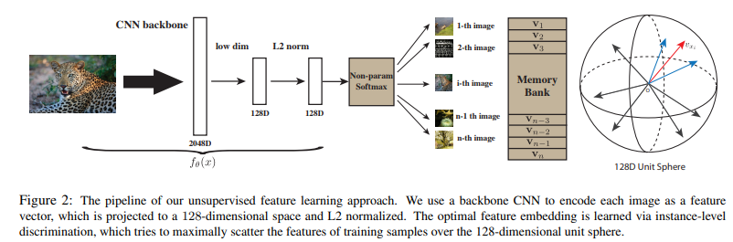

- InvaSpread

  - 标题：Unsupervised Embedding Learning via **Inva**riant and **Spread**ing Instance Feature

  - 被认为是SimCLR的前身

  - MoCo中提到的端到端的学习方式，只用一个编码器，在一个minibatch中找正负样本

  - Invariant相似图片特征不变形，Spreading不同图片特征不同

    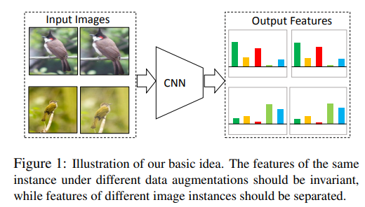

  - 也使用InstDisc个体判别的代理任务，主要是看正负样本的选择

    - 对于$x_1$，正样本是$\hat{x}_1$，其他未增强的和增强的图片都是负样本

    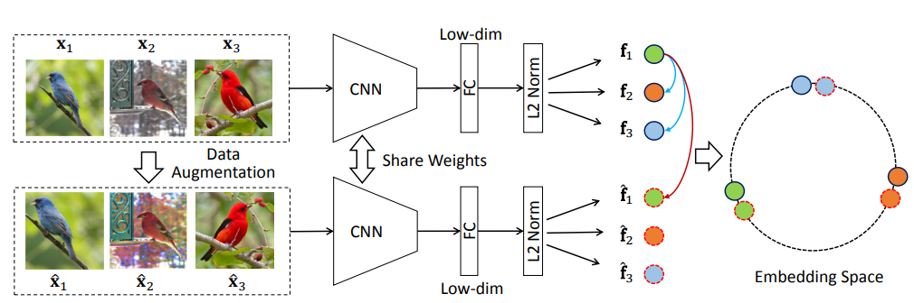

  - 没有SimCLR效果好的原因：字典不够大

- CPC

  - 标题：Representation Learning with **C**ontrastive **P**redictive **C**oding

  - 新的代理任务，个体判别是判别式任务，那一定存在生成式任务

  - 音频、图片、文字、强化学习都可以用

  - 思路：将之前的输入通过encoder变成特征$z_{t-3},z_{t-2},\dots,z_{t}$，然后喂给自回归的模型例如RNN或者LSTM，然后得到$c_t$（context representation，代表上下文的特征），这个上下文的特征应该可以预测$z_{t+1}$。

    对比学习：预测是query，未来时刻编码后的$z_{t+1}$等是正样本，任意输入通过编码器都是负样本

    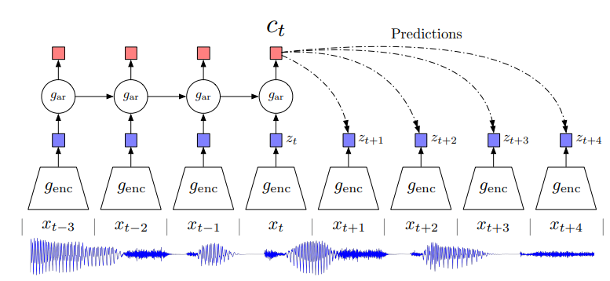

- CMC

  - 标题：**C**ontrastive **M**ultiview **C**oding

  - 一个物体的很多视角都可以当做是正样本

  - 摘要很好：人感知世界有非常多方式，视觉听觉等，我们希望能学习其中强大的mutual information（所有视角下的关键因素）

    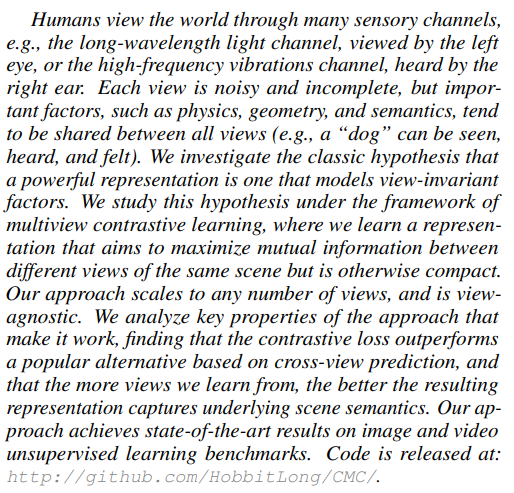

  - 例子：使用NYU RGBD数据集，其中包括原始图片、深度图、分割图等，这些互为正样本

    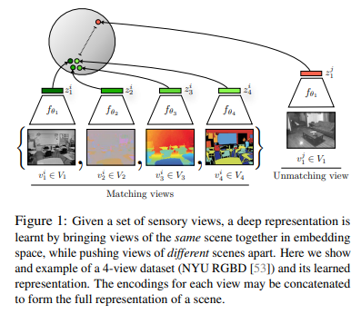

  - 很早做多视角的对比学习，证明多视角和多模态的可行性，后来OpenAI出了CLIP模型，图片和文本是正样本对。CMC原班人马做了一篇蒸馏的工作，无论使用什么样的网络，同一个图片都应该得到类似的特征，我们希望让teacher模型和student模型的输出尽可能相似，使teacher和student形成一个正样本对

  - 使用几个视角可能得配几个编码器，但是CLIP使用的是BERT+ViT（底层都是Transformer），所以可能Transformer能够统一处理不同类型的数据

## CV双雄

- MoCo

  - 将对比学习转化成字典查询问题
  - 使用Res50等

- SimCLR

  - 标题：A **Sim**ple Framework for **C**ontrastive **L**earning of Visual **R**epresentations

  - 方法：和InvaSpread非常类似，对于batch size $N$，正样本是数据增强的，负样本是数据增强和没有数据增强的，主要的不同是加了个投影层$g(\cdot)$，其实就是MLP，但是这一个层让效果提升10个点，但是这个projection只在训练的时候用，在下游任务的时候把projection去掉了

    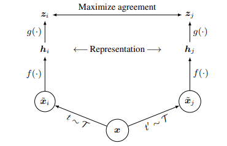

  - 和InvaSpread的区别

    - 数据增强：能用的方法都用了

      

    - 投影层：

      - MLP中是FC+ReLU是Non-Linear，只有FC是Linear，都不用是None，可以看到效果对比
      - 特征维度高没有必要

      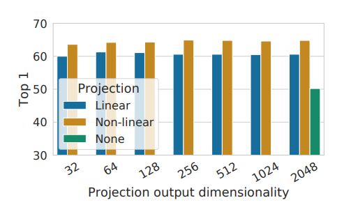

    - 更大的batch size和更久时间

- MoCo v2

  - 标题：Improved Baselines with Momentum Contrastive Learning

  - 作者发现SimCLR中的东西是即插即用的，所以直接加上，主要是MLP head和数据增强

  - 数据：

    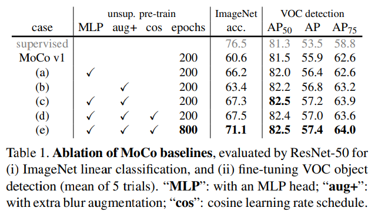

    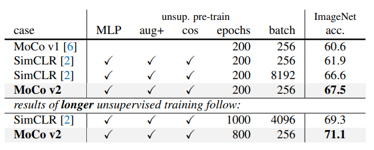

  - MoCo比SimCLR的优越性，就是硬件

    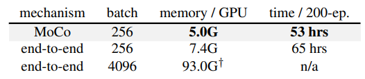

- SimCLR v2

  - 标题：Big Self-Supervised Models are Strong Semi-Supervised Learners

  - 大的自监督模型适合做半监督学习

  - 架构图

    - 左边（就是SimCLR v2）是用自监督对比学习的方法训练出一个大模型出来
    - 中间是用一小部分小的标签做有监督的微调，微调完获得一个teacher模型，然后teacher模型生成很多伪标签
    - 然后就可以在更多的数据上做无标签的自学习
    - 启发于google 19年一篇noisy student的工作：现在ImageNet上训练一个teacher模型，然后JFT 300M数据集上生成很多伪标签，然后一起训练了student模型，这个student霸占ImageNet SOTA 1年时间（被ViT打败）

    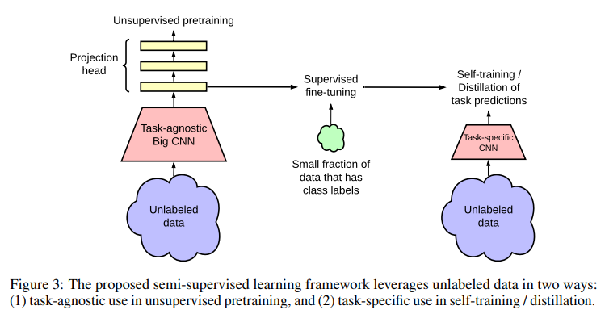

    > Task-agnostic在机器学习中指的是一种算法或模型，它不针对特定的任务进行优化，而是具有通用性和适应性，可以应用于多种不同的任务和领域。这种算法或模型通常具有更广泛的适用性和更好的泛化能力，因为它们不会过度拟合任何特定任务的特定数据集。例如，一些常见的task-agnostic模型包括线性回归、决策树、随机森林等。

  - 和SimCLR v1的区别

    - 更大的模型 Res152
    - MLP从一层变成2层
    - 动量编码器：提升不大，一个点，原因是本来minibatch就已经很大了，负样本已经相当多了

- SwAV

  - 标题：Unsupervised Learning of Visual Features by Contrasting Cluster Assignment

  - Sw是Swap，A是Assignment，V是Views

  - 希望用一个视角的特征去预测另一个视角的特征

  - 对比学习+聚类

  - 架构图

    之前的负样本只是近似（例如MoCo从128万个特征中取65536个做负样本），所以可以考虑和聚类中心比。

    聚类中心是Prototypes $c$，大小 $D\times K$（$D$是特征维度，$K$是聚类中心个数），$z$大小$B\times D$，$q$大小$B\times K$。

    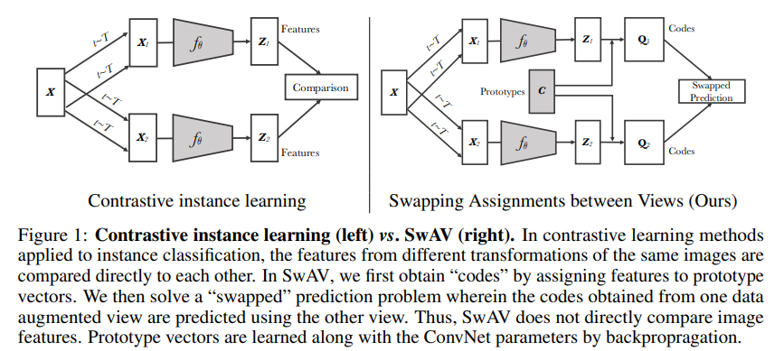

  - 聚类的方法使用的是deep cluster、deep cluster 2

  - 使用到一个trick：multi-crop，正样本取多个crop，现在取2个长宽160和4个长宽96的可以有提高

- CPC v2
  - 用了更大的模型，更大图像块，更多数据增强，BN换成LN
- InfoMin
  - 不能一味最大化mutual information

## 不用负样本

- BYOL

  - 标题：**B**ootstrap **Y**our **O**wn **L**atent: A New Approach to Self-Supervised Learning

  - Bootstrap改造，Latent特征。自己跟自己学，左脚踩右脚

  - 不使用负样本。在一般的对比学习中，如果没有负样本，那Loss Function的目的就是让所有正样本都相似，那么就存在一个捷径解，即无论给任何输入都返回相同输出，此时所有正样本一定相似，一旦模型躺平就称为model collapse / learning collapse。

  - 架构图

    - $f_{\theta}$和$f_{\xi}$是相同的模型，但是参数不同，后者使用动量更新
    - 匹配问题换成预测问题：对$z_{\theta}$作用$q_{\theta}$，然后来预测$z_{\xi}'$，自己预测自己就学起来了
    - 一个视角的特征去预测另一个视角的特征
    - 最后只留下$f_{\theta}$，以及输出$y_{\theta}$
    - Loss函数是MSE

    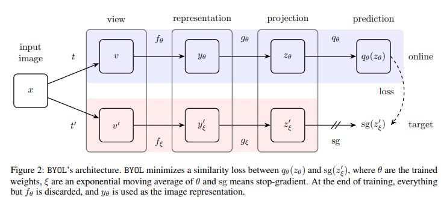

  - 博客解释：[Understanding Self-Supervised and Contrastive Learning with "Bootstrap Your Own Latent" (BYOL) - generally intelligent](https://generallyintelligent.com/blog/2020-08-24-understanding-self-supervised-contrastive-learning/)

  - SimCLR使用了BN且有两个

    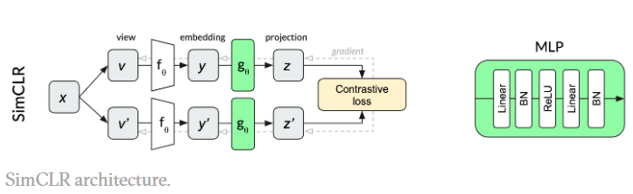

    MoCo没有BN

    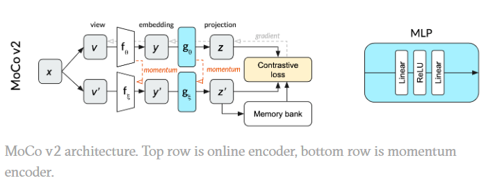

    BYOL：只有一个BN

    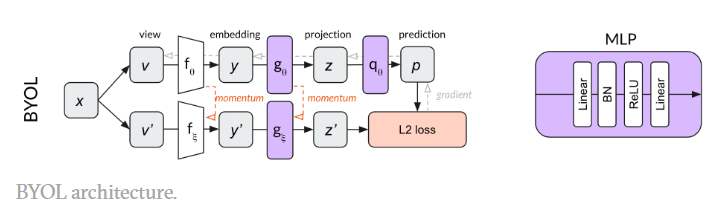

  - 消融实验证明是BN的效果

    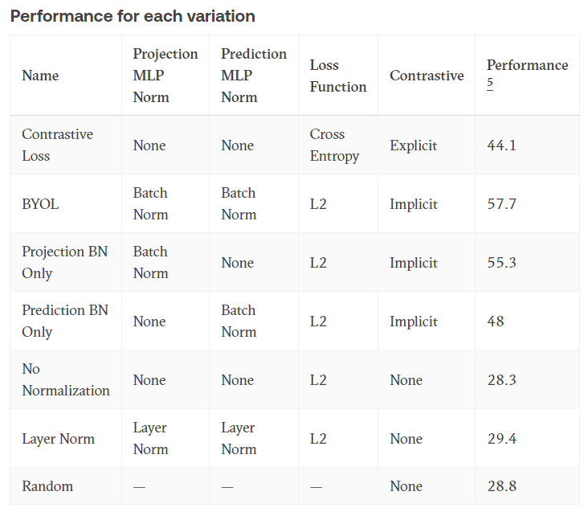

  - BN的效果是算Batch的均值方差，这意味着你在算某个正样本Loss的时候其实也看到了别的样本的特征，造成信息泄漏。所以BYOL也是对比学习，它的任务是正样本和平均图片之间的差异（相当于SwAV中的聚类中心）

  - 但是后来原作者又发了新的文章：BYOL works even without batch statistics

    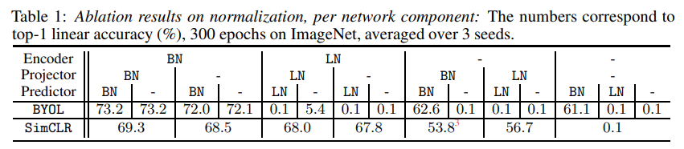

    当`-/BN/-`的时候训练失败；`-/-`的时候SimCLR也失败了，即用了负样本也训不出来

  - 后来达成一致：BN增加训练稳健性

  - 作者发现一开始初始化比较好不使用BN也可以。使用了Group Norm和Weight Standardization初始化，在BEiT中提出的，也是ResNet v2初始化方法

- SimSam

  - 标题：Exploring Simple Siamese（孪生网络） Representation Learning
  
  - 没有负样本、不需要大的batch size、没有动量编码器
  
  - 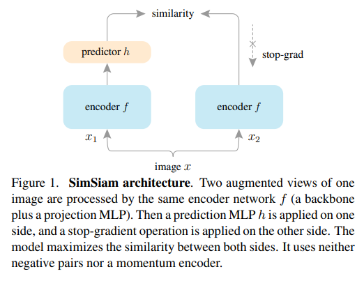
  
  - 孪生网络：编码器结构相同且共享参数
  
  - 和BYOL的区别，没有用动量编码器
  
  - 伪代码：$D$函数是计算MSE，可以用p1预测z2，也可以用p2预测z1
  
    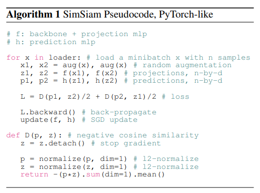
  
  - 主要是stop gradient的操作
  
  - 作者认为是EM算法，接近聚类
  
  - 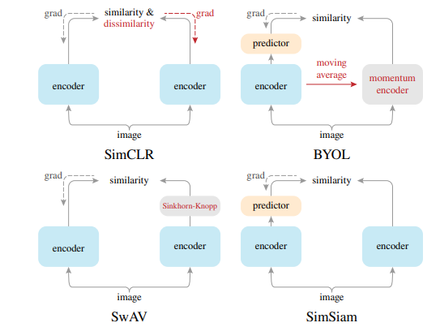
  
  - 动量编码器很可以提点，分类任务最强的是BYOL
  
  - 迁移学习是MoCo v2和SimSam最好，推荐用MoCo v2做基线模型，训练快训练稳

## Transformer

- MoCo v3

  - 标题：An Empirical Study of Training Self-Supervised Vision Transformers

  - 主要内容是如何提高ViT的训练稳定性

  - MoCo v3相当于v2和SimSam的合体

  - 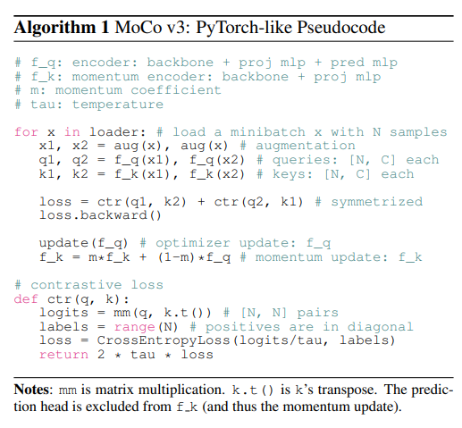

  - 两个编码器，query和key，后者是动量编码器，loss用的是对比学习的loss，看起来是MoCo v2。而query编码器还用了projection和prediction，相当于BYOL和SimSam。同时backbone骨干网络从残差网络换成了ViT

  - batchsize大的时候会突然下降

    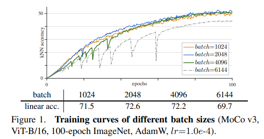

  - 作者检查了梯度，发现是ViT第一层patch projection发生梯度的波峰。相当于tokenization阶段，如何将图片打成patch然后给他一个特征，就是一个MLP，所以直接给一个random patch projecion层然后freeze，问题就解决了，发现这个trick对MoCo v3和BYOL都可以用

  - 如果不改Transformer，那就只有一开始的tokenization和最后的目标函数能改

- DINO

  - 标题：Emerging Properties in Self-Supervised Vision Transformers
  - 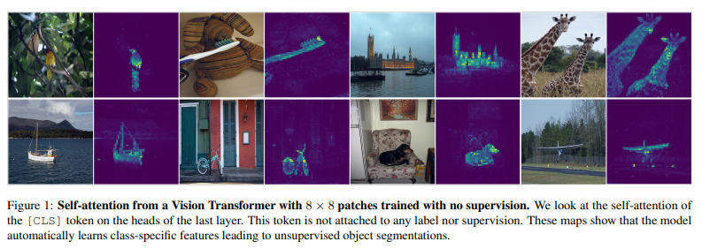
  - 作者发现ViT的自注意力图可视化能够非常准确地抓住问题轮廓
  - 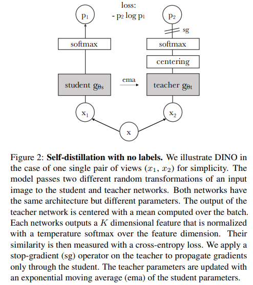
  - 名字来源于上图中的 Self-**d**ist**i**llation with **no** labels
  - 和BYOL一样，自己预测自己所以是自蒸馏
  - 为了避免坍塌，给所有样本算个均值 centering