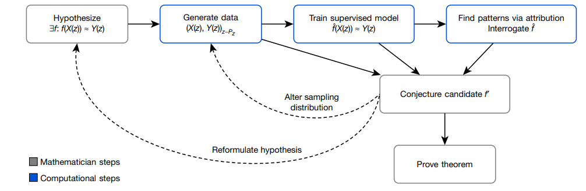

# AI-guided intuition

## 标题

- Advancing mathematics by guiding human intuition with AI
- AI指导人的直觉从而推进数学进展

## 摘要

- 应用机器学习发现数学规律，然后证明
- 本文发现并证明了拓扑中结的代数结构和几何结构之间的一个新的关系；由对称群的组合不变猜想预测而来的候选算法

## 框架

- 针对一个数学物体 $z$，分别有两种数学变换 $X(z)$ 和 $Y(z)$，使用机器学习去学其中的关系 $\hat{f}(X(z))\approx Y(z)$，如果存在即可开始证明
- 两种方式来帮助数学定理证明
  - 发现模式
  - 归因技术来理解模式，其实就是特征选择，找到哪些特征是有用的
- 归因技术是 gradient saliency，计算输出关于输入的梯度，如果比较大就说明该特征比较重要

- 

## 拓扑学

- 结
  - unknot就是圆环，如果扯一扯能变成圆环就说明和unknot等价，否则不等价。要求首尾相连，同时不能剪断

## 表示论

略

## AutoML

- autogluon