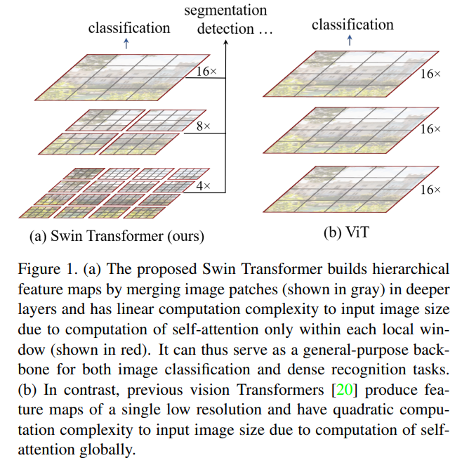
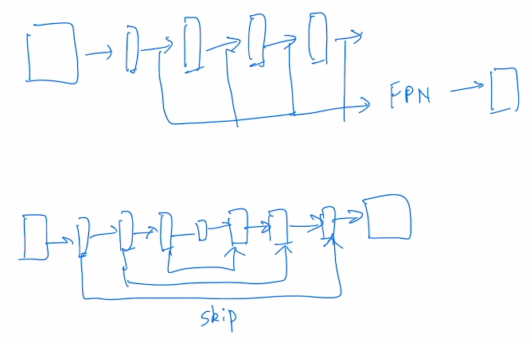
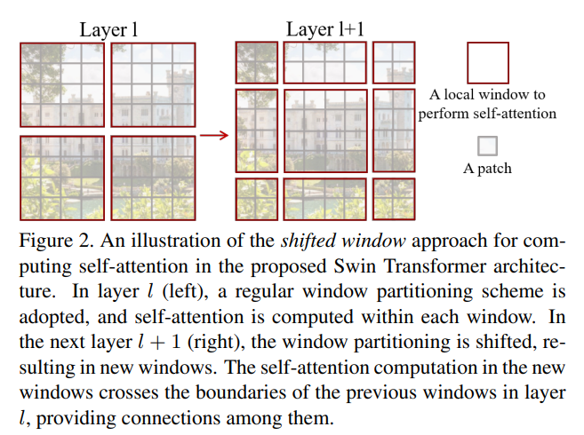
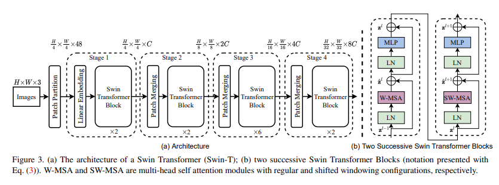
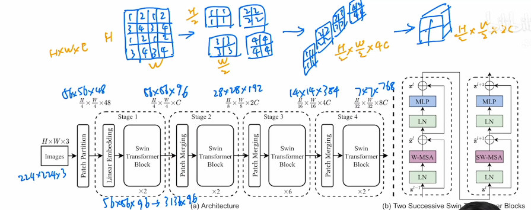
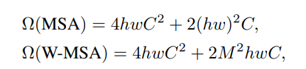
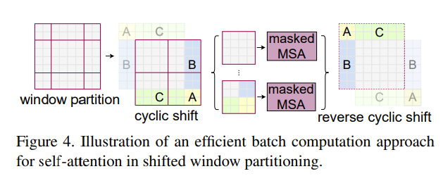
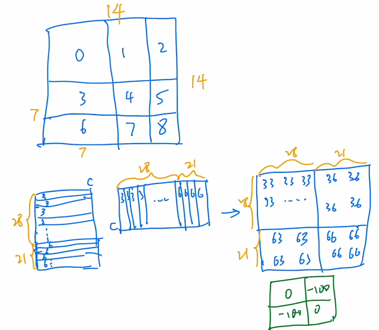
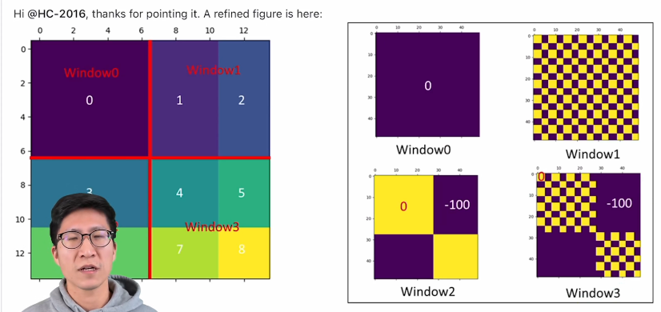

# SwinTransformer

## 标题

- Swin Transformer: Hierarchical Vision Transformer using **S**hifted **Win**dows
- 希望ViT也像CNN一样提取特征的时候有层级的概念

## 摘要

- ViT主要做了分类，将下游任务交给其他人做，本文证明ViT在其他任务中效果都很好——可以做**通用的骨干网络**
- 从NLP到CV领域迁移Transformer有两个挑战
  - 视觉物体尺寸大小的invariance很大
  - 图片的像素高：要么使用特征图，要么把图片打成patch，要么把图片化成小的窗口
- 本文使用移动窗口的方式学习。自注意力在窗口内计算（复杂度线性增长），移动能够让相邻窗口有交互

## 引言

- 

- ViT使用16倍的下采样率，虽然使用全局自注意力，但是对多尺度特征提取能力就差一些

- 下游任务如检测和分割（密集预测任务），多尺寸特征是至关重要的。目标检测用的最广的方法是FPN，feature pyramid network。物体分割最常用的是UNet。都会使用不同尺寸上的特征

  

- CNN中使用池化来增大感受野，SwinTransformer使用PatchMerging将相邻小patch合成大patch

- 有了多尺度特征就可以输给一个FPN做检测，或者扔给UNet做分割

- 移动窗口：灰色是小patch（4\*4），红色框内是有7\*7个小patch（下图仅为示意图），

  

## 结论

- 希望能用在多模态中，即在NLP中应用Shift Window

## 方法

- 模型总览图

  

- 老师：

  

  - 一开始的patch paritition分成了4\*4，然后通过Linear Embedding变成Transformer能接受的大小。
  - 上图中的Swin Transformer Block是在小窗口内做的，Transformer不改变输入的尺寸
  - patch merging：本来是$H*W*C$，然后行列各一位取得到 $\frac{H}2*\frac{W}2*4C$，然后为了和CNN一致（通道数翻倍而不是乘4）所以就再通过一个$1*1$的卷积将通道数降成$2C$
  - ViT加了一个CLS token让维度从196变成了197，但是本文没有加
  - 作者最后直接用全局池化操作 global average pooling 将最后 $7*7$ 变成了 $1*1$ 来做分类

- 计算复杂度

  

  上式是标准的多头自注意力，而下式是窗口多头自注意力

- 架构图中右侧是两个block合成一个计算单元，分别使用窗口自注意力和移动窗口自注意力

- 移动窗口的问题：移动之后变得不规则了（4个窗口变成了9个窗口），解决方法之一是直接pad但是计算复杂度变大了

  作者提出的方法：循环移位，窗口数量始终是4个，但是问题是ABC所在窗口内的patch有的是从很远的地方搬过来的并不相关，这里作者使用mask来处理，最后还要使用循环移位来变回去

  

  掩码操作：假设窗口是14\*14的大小，对于3和6区域，我们首先将3区域内的所有patch拉直，得到28\*C个向量，然后再接6号区域21\*C个向量拼在一起，然后转置相乘算自注意力，得到的结果中左上和右下区域是不需要的，最后会加上一个Mask矩阵，Mask矩阵的左上和右下都是很大的负数，经过softmax之后就没了

  

  

