# AlphaFold2

## 标题

- Highly accurate protein structure prediction with AlphaFold

## 摘要

- 通俗认识：蛋白质是一串较长的氨基酸序列（相当于代码），然后会形成独特的空间结构（相当于可执行文件），蛋白质结构预测主要是预测空间结构
- 知道结构的蛋白质有10万，而已知的蛋白质有10亿，目前看一个蛋白质结构需要数年或数月
- AlphaFold2预测精度是原子级别（建议讲实验结果的时候和绝对值比较）

## 模型

- 算法总览

  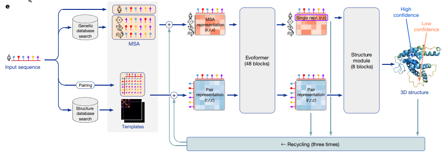

  - 第一部分：抽取特征
    - 在数据库中寻找类似的氨基酸序列形成MSA（Multi Sequence Alignment）
    - 形成一个二维矩阵表示两个氨基酸之间的关系
    - 额外去结构数据库中搜索，知道真实氨基酸在空间中的距离
  - 第二部分：Encode
    - 输入
      - MSA representation：一个 $(s,r,c)$ 的矩阵，$s$表示蛋白质种类（第一个是我们要预测的），$r$是氨基酸序列，$c$是每个氨基酸的向量表示
      - Pair representation：一个 $(r,r,c)$ 的矩阵
    - 输入进入一个 Transformer，称为Evoformer
      - 和普通Transformer的不同在于这里是二维矩阵，行上和列上都有相互关系
  - 第三部分：Decode
  - 另外还有一个回收机制，将编码器和解码器的输出都加入到编码器的输入，回收机制不参与梯度回传，降低训练压力

- 编码器

  - 和Transformer类似，区别是Pair会传到MSA，而MSA也会传到Pair。同时因为是二维矩阵，所以会处理按行信息以及按列信息

  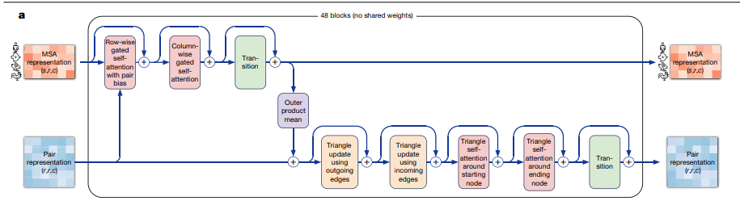

  - 补充材料：row-wise gated self-attention with pair bias

    上图中第一行的第二个block：

    row-wise表示按行，所以特征长度是$c_m$

    gated表示除了qkv之外加了一个linear+Sigmoid使之在0-1之间然后做一个按元素点乘实现门的效果（输出门）

    pair表示：假设计算第$i$个氨基酸为query，$j$个氨基酸为key，那么可以在pair representation中取第$i$行第$j$列通过线性投影到一维然后加上去（表示氨基酸之间的预设关系）

    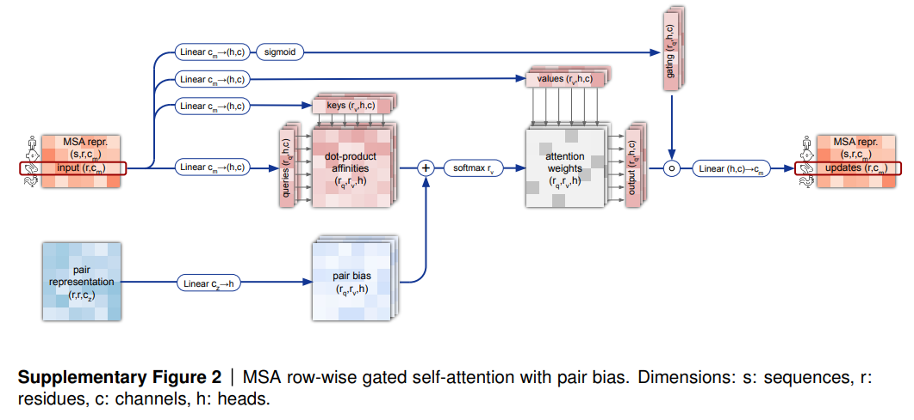

    - 伪代码： $m_{si}$表示第$s$个蛋白质第$i$个氨基酸对应的编码，$z_{ij}$表示第$i$个和第$j$个氨基酸之间的关系，长度都是$c_m$。

    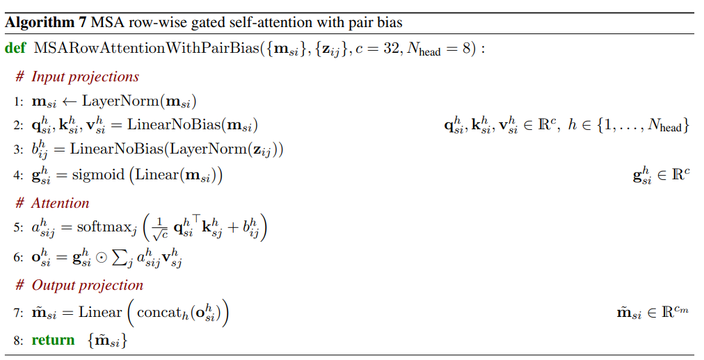

  - 编码器图第一行的第三个block：对列的特征提取

    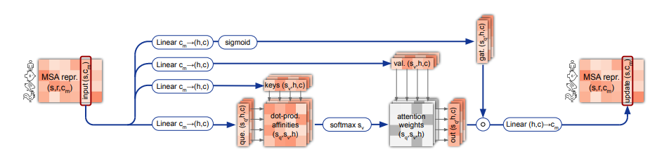

  - 编码器第一行第四个block：MLP

    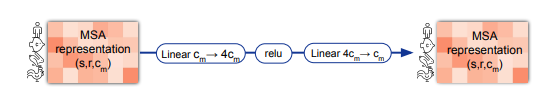

  - 编码器第一行和第二行之间的紫色模块

    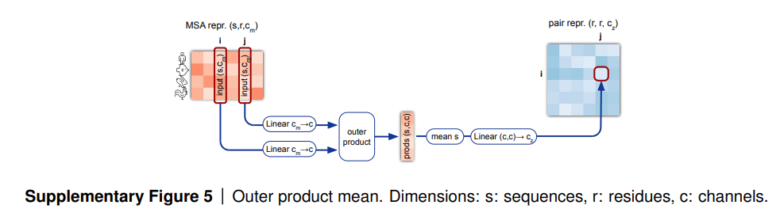

    在MSA中两个氨基酸对是一个矩阵，每个氨基酸是一个$s*c_m$的矩阵；在Pair矩阵中每个氨基酸对是一个$c_m$的向量，所以要把两个矩阵变成一个向量。

    这里outer product是将两个矩阵分别扩成 $(s,c,1)$ 和 $(s,1,c)$ 然后外积得到 $(s,c,c)$。

  - 编码器第二行第4/5个block

    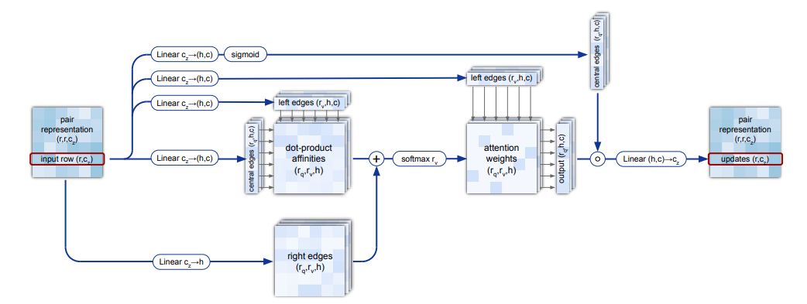

    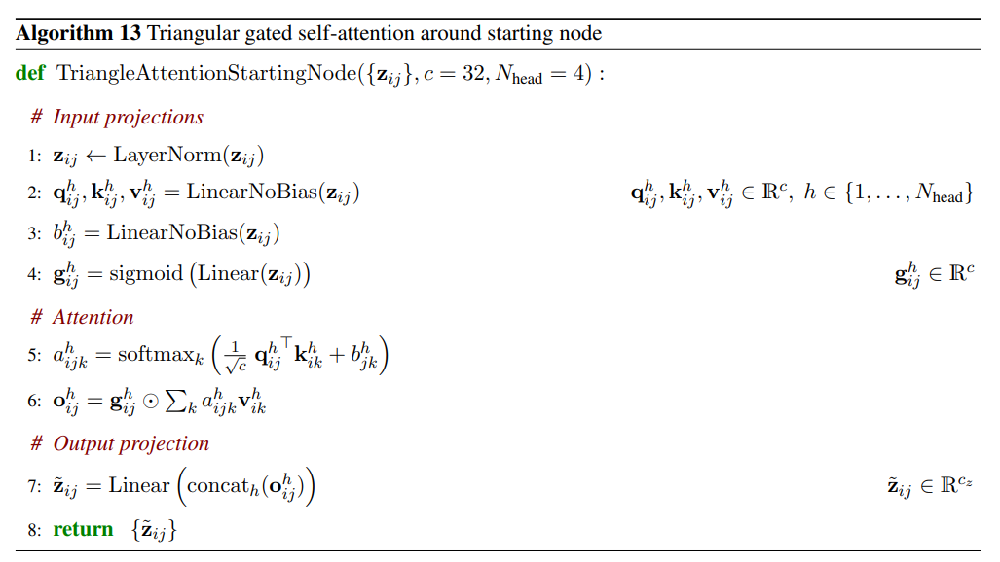

    这里称为 Triangular，是因为这里使用了 $i,j,k$ 三个氨基酸之间的关系

    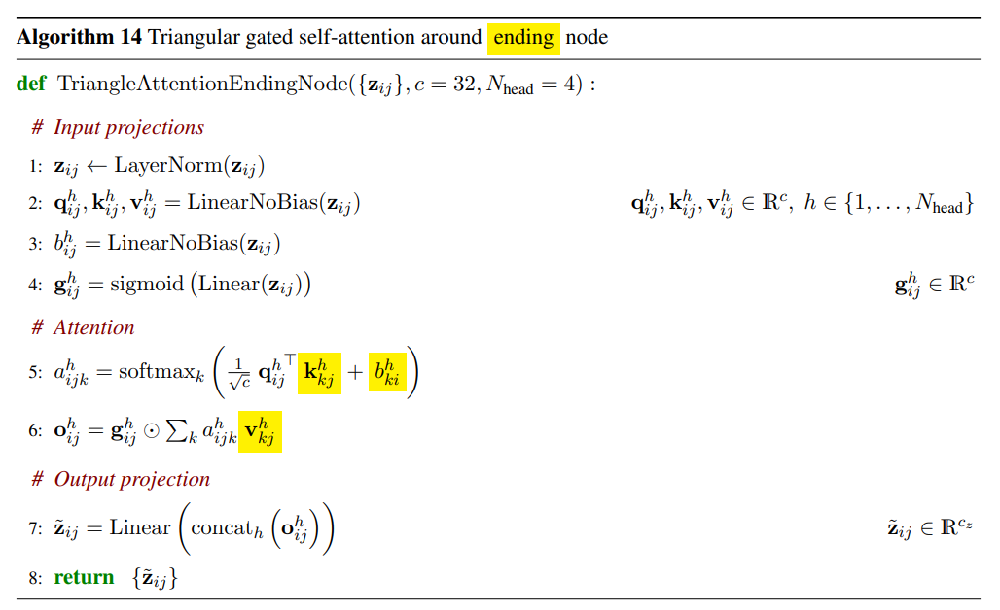

    这里矩阵是不对称的

  - 编码器第二行第2/3个block

    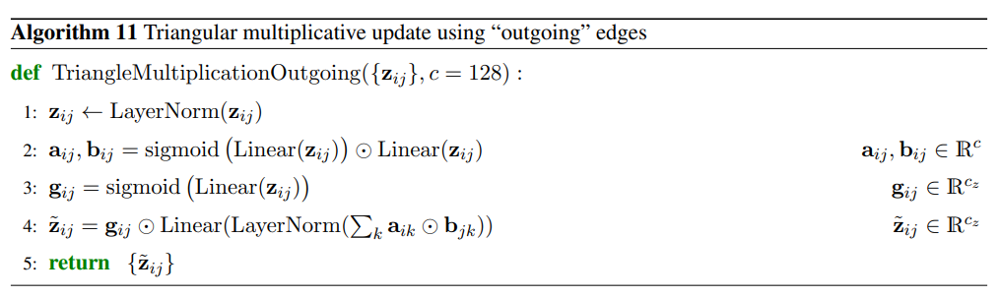

    为了计算$i$和$j$之间的关系，使用了所有$i,k$和$k,j$之间的关系，和图神经网络类似

    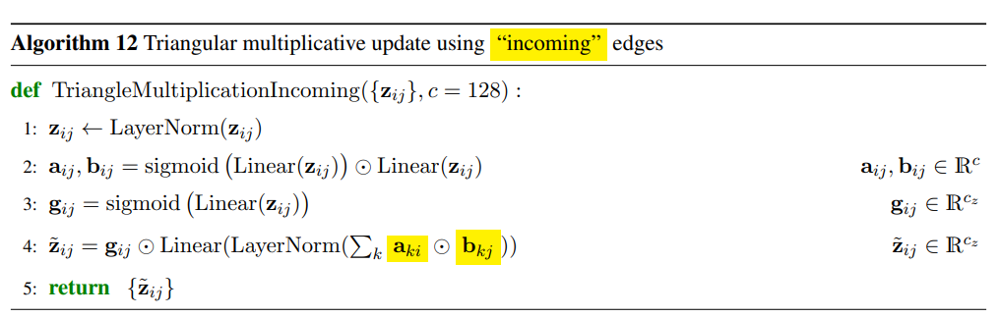

    outgoing和incoming，相当于汇聚出去和进来的边两种结构

- 解码器

  - 氨基酸在3D中的位置表示使用的是相对位置，即每个氨基酸的位置相对于上一个的相对位置

  - $Y^{3\times 1}=R^{3\times 3}X^{3\times 1}+t^{3\times1}$，因此主要需要预测 $R$ 和 $t$。

  - 需要符合生物和物理规则

  - 结构：先预测Backbone即蛋白质主干网络位置，然后预测枝干网络

    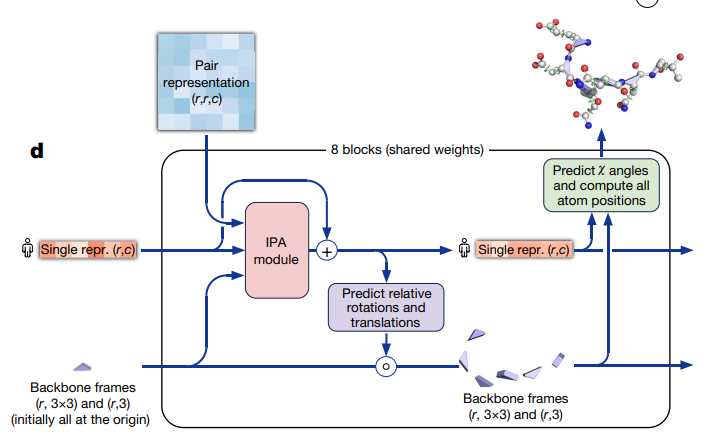

  - IPA拿到氨基酸对信息、不断更新的序列信息、主干网旋转平移信息

  - 类似RNN

  - IPA模块的算法：不动点的注意力

    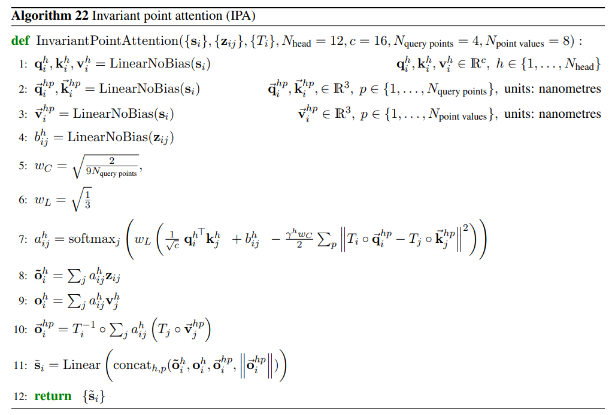

  - 后面太复杂了……略了