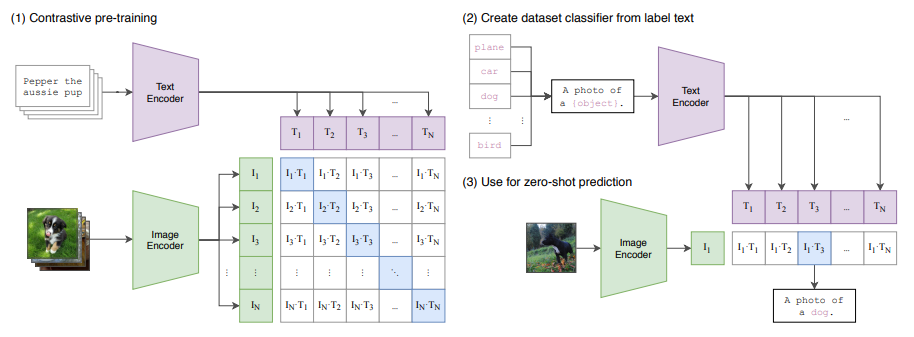
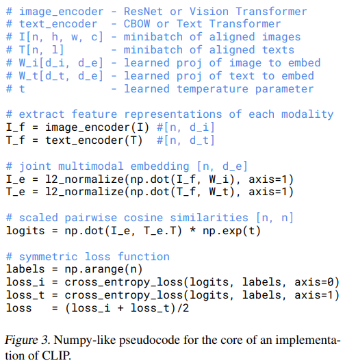
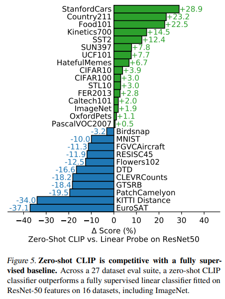
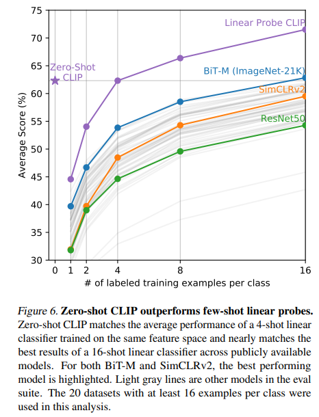

# CLIP

## 标题

- Learning **Transferable** Visual Models From Natural Language **Supervision**

- 利用自然语言监督的信号来训练一个可迁移的视觉模型

- 输入是文字和图片的配对，各自通过一个encoder得到特征，然后做对比学习（只需要有正样本和负样本的定义即可，配对的样本是正样本，即**矩阵中对角线**是正样本）

  

- 正常的CLIP是没有分类头的，因此要额外进行prompt template，即将类别转成一个句子（例如This is a dog）然后抽取文本特征，图片抽取特征，然后计算相似度

- zero shot：能够预测出不在ImageNet中的类别

- 将图片语义和文本语义联系起来，所以迁移效果非常好

## 摘要

- 传统数据集定义了类别，而使用自然语言的监督信号scale性好
- 预训练任务：图片和文本的配对

## 引言

- NLP领域已经常用无监督学习，而CV领域使用有标注的数据仍有诸多限制
- CLIP全称Contrastive Language-Image Pre-training
- 是ConVIRT的简化版本，但是在数据和模型大小上大大提高了

##  方法

- 我们的想法一点也不新，但是之前的工作说法混淆、规模不够大、NLP模型不够好，当Transformer解决NLP大一统问题之后容易获得语义特征了

- 多模态特征适合zero shot迁移

- 数据集：WIT（WebImage Text）

- 之前的预训练工作在ImageNet1K上就需要数十个GPU/TPU年的训练时间，而OpenAI注重效率，所以选择对比学习。而其他OpenAI工作都基于GPT，仅有CLIP基于对比学习

  - 一开始采用类似VirTex，图像CNN文本Transformer，给定图片预测其对应文本。但是图片的描述有很多可能，所以预训练非常慢
  - 当把预测型任务换成对比型任务，判断图片与文本是否是配对就比较简单（生成式变判别式），效率提高4倍

- 伪代码

  第一步抽取特征。第二步中会点乘一个$W$，这个投影是为了将单模态信息转成多模态信息，然后归一化。第三步算相似度。第四步算loss，正样本是对角线上，对称式的loss函数

  作者没有使用非线性投影层（之前的对比学习中提升了近10个点）因为作者发现多模态中提升不大

  只做了随机裁剪的数据增强

  

- 参考：[How to Train Really Large Models on Many GPUs? | Lil'Log (lilianweng.github.io)](https://lilianweng.github.io/posts/2021-09-25-train-large/)

## 实验

- 之前的自监督无监督学习到一个特征之后，还需要对下游任务做有监督的微调

- 图

  

- prompt engineering and ensembling

  - prompt的重要性：ImageNet中有两个类construction crane（起重机）和crane（鹤），文本多义性可能导致问题；另外输入输出要尽可能保持一致，避免distribution gap
  - 作者使用prompt template，类似`A phot of {label}`，还可以加一些例如`A photo of {label}, a type of pet`
  - ensemble，用多种提示模板，CLIP使用了80个模板

- 大规模迁移学习结果：

  这里是Linear Probe表示将前面的模型freeze掉只从中抽特征，然后训练一个FC来做分类任务。普通物体zero shot任务比较好，但是比较难的任务（DTD纹理分类，CLEVRCounts物体计数）。

  

  Few Shot的结果：BiT为Big Transfer本身就是谷歌为了迁移学习设计的

  

  所有数据：略

## 讨论

- 和人类对比
- 去重实验，证明泛化性强

## 局限性

- 目前和基线模型水平相近，但和SOTA水平还有差距，同时扩大CLIP规模也很难实现SOTA
- 在某些细分类任务或抽象概念效果很差，不知道什么是异常什么是安全
- 虽然zero shot在某些数据集还可以，但是如果推理和训练的数据差的太远，还是不行的，out-of-distribution（例如MNIST，原因是4亿数据集中都是自然图片，没有合成数字图片）
- CLIP需要给一个类别来判断，不能做到图片加caption这种生成。之后可能会把对比式和生成式的目标函数合在一起
- CLIP对数据利用效率不高
- CLIP存在bias，有用ImageNet test训练，27个数据集也用到了，最好有一个专门的用来zero-shot的数据集
- 数据从网上爬的，没有被清洗过，存在偏见和可能的不当使用
- 复杂的任务或概念不能用语言描述，所以做下游任务泛化的时候能提供一些训练样本（Few-Shot）也是有必要的，但是CLIP的提出不是为了Few-Shot，所以会有提供一些训练样本还不如zero-shot，和人不太一样

## 回顾

- 文本经过Encoder得到文本特征，图像经过Encoder得到图像特征，然后进行文本图像对的对比学习
- 做分类任务的时候：将类别通过prompt template通过文本编码器形成很多query，然后图像通过图像编码器得到一个图像特征，然后相当于依次问query，得到图像特征和文本特征之间的相似度
