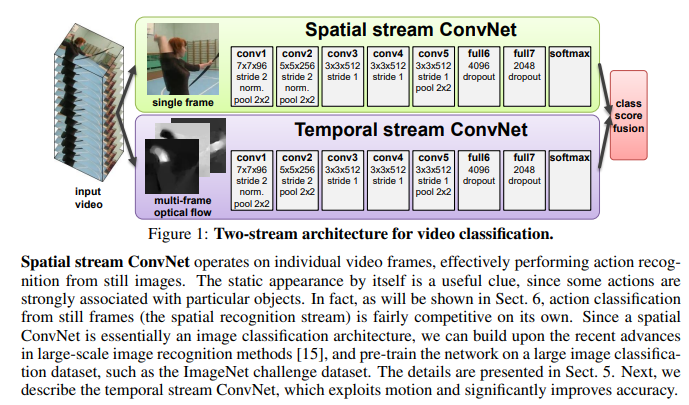
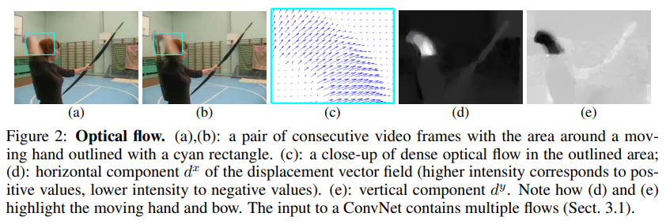
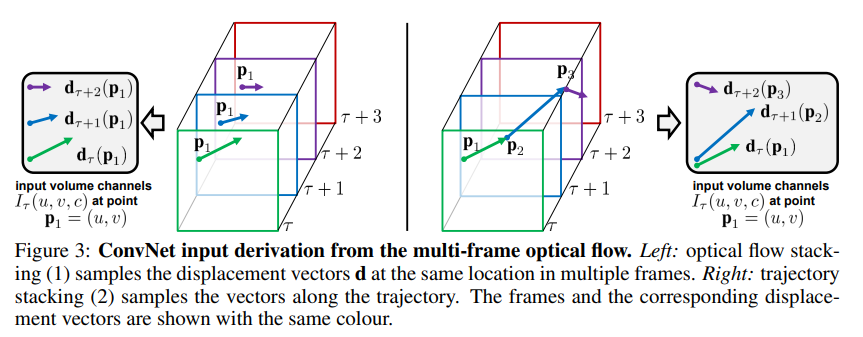
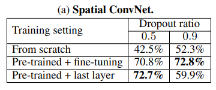
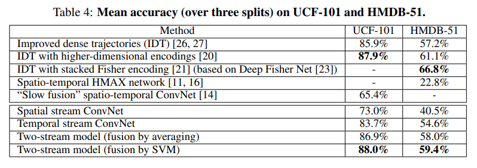

# Two-Stream

## 标题

- Two-Stream Convolutional Networks for Action Recognition in Videos

- 我们对视频中的动作识别比较感兴趣、收集容易、落地场景多

- 结构：

  作者认为卷积神经网络适合学习局部规律，但是不适合学习物体移动规律（Motion Information）

  由于物体不会学，那就教你学，直接先把运动信息抽取好（光流抽取），然后去学习映射

  上面一只为空间流CNN，下一只为时间流CNN

  

- 光流描述物体的运动

## 摘要

- 希望将手工设计的特征带到数据驱动的深度学习框架中

## 引言

- 视频天生有数据增强的效果
- 之前的手工设计的特征能够抓住光流信息
- 之前视频动作识别使用的是STIP（spatio-temporal interest point）特征，在局部做时空信息这种特征的学习；但是SOTA使用的是dense point trajectories，即视频前后帧点之间的关系得到的轨迹信息。方法是光流得到轨迹然后在轨迹附近抽特征，后来出现idt特征（improved dense trajectories）也非常强，19/20年论文还会和它比
  - 局部时空学习演变成了3D网络
  - 基于光流和轨迹的方法演变成了双流网络
- 之前的深度网络没有学习到时序信息，尽管有很大的数据集 Sports-1M

## 方法

- 结构图

  

  - 空间流使用单张frame，从静止的图片中做动作识别，其实就是图像分类，但是图像分类本身就和动作识别强相关（例如出现钢琴、篮球等），所以空间流已经非常有竞争力。甚至空间流可以做预训练

  - 时间流

    - 光流：水平和竖直上的位移。输入a和b都是240\*320\*3，光流图c是240\*320\*2（水平和竖直方向），光流图每个点都有值（dense optical flow）。视频L帧，光流L-1帧

      

    - 光流图希望能叠加起来，叠加有两种方式：直接叠加、根据光流轨迹进行数值相加。后者看起来更合理但是效果没有前者好

      

    - 双向光流：Bidirectional，同时计算前向光流和后向光流，即上面的向量可以取反向（一半帧计算正向，一半帧计算反向）

    - 最后光流图的大小是 $W\times H\times 2L$，如果视频帧是 $L+1$，作者一般使用的是11帧

  - 最后两个流使用的是softmax得到值取平均相加

## 实验

- 测试方法

  - 对于空间流：每次等间距取，一共取25帧。数据增强：一帧上crop取5块，然后翻转再crop出5块，每帧得到10张图（250view），这250个图结果取平均得到空间流结果

  - 对于时间流：取25帧每帧位置后面11帧，得到250张光流图
  - 后来测试方法取view数就很多样了，3D网络30view，Transformer有使用4或3view的

- 预处理光流

  - 机器耗时，数据dense占用空间（每个位置都有值）
  - 作者的方法是将数据rescale到0-255整数然后存成JPEG

- 消融实验

  - 空间流

    - 使用预训练模型，由于数据集小所以容易过拟合，所以Fine-tuning需要设置比较大的Dropout Ratio，而last layer就不需要设置较大的Dropout Ratio

      

  - 时间流

    - 发现简单堆叠效果更好。另外双向一般不会掉点

    

- 总对比

  - 时间流得到的正确率很高（不使用Pretraining），甚至超过空间流

  

## 结论

- 未来工作
  - 时间流能否使用预训练模型，或者使用更多光流数据
  - 基于轨迹的方法为什么表现不好
  - 相机自带移动会导致不准，作者简单的使用减全局平均来解决但是可能不是很好