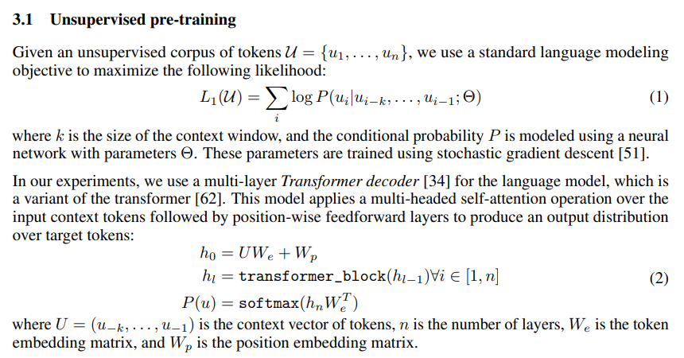
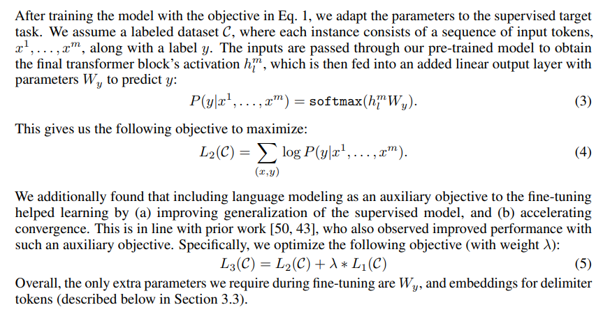
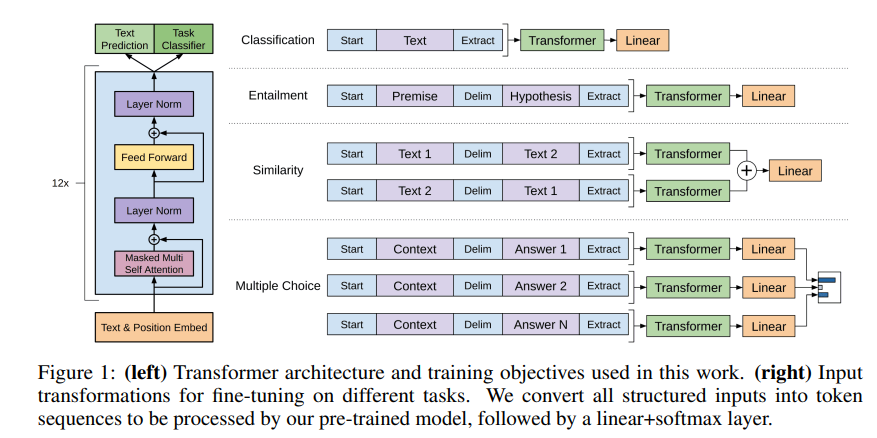
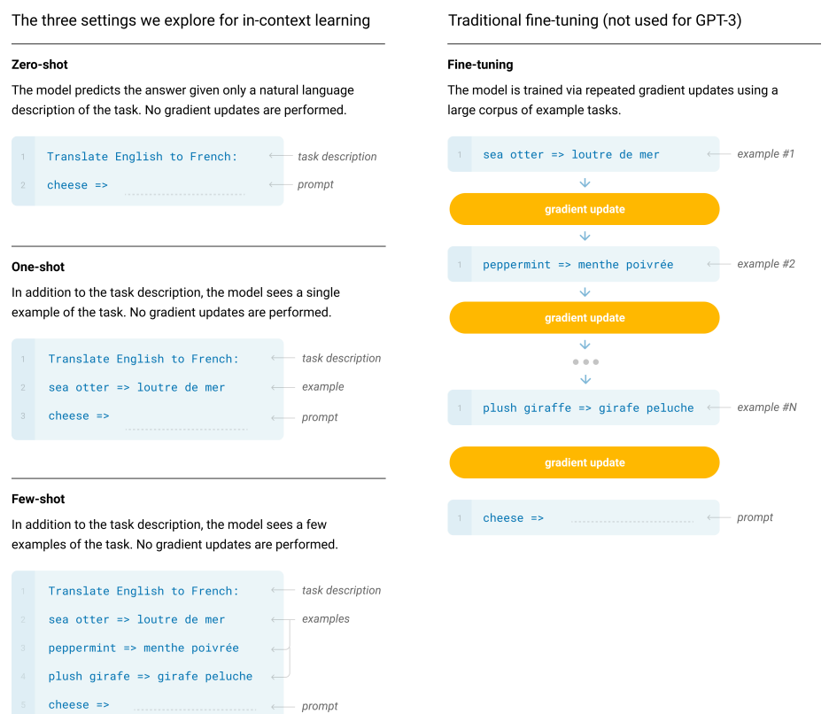

# GPT

## 历史

- GPT是把Transformer的解码器拿出来然后在没有标号的大量文本数据上训练一个语言模型
- BERT是把Transformer的编码器收集一个更大的数据集训练，实现BERT-Base和BERT-Large，前者就比GPT更强了
- GPT2收集一个更大的数据集以及实现一个更大的模型，比BERT-Large更大
- GPT3比GPT2在数据和模型上都大了100倍

## GPT1

- 标题：Improving Language Understanding by Generative Pre-Training

- 方法

  - 无监督预训练

    - 用前$k$个词预测下一个词
    - 使用Transformer的Decoder，和Encoder不同的是它用到了掩码使得当前词看不到之后的词
    - $W_e$ 是 token编码矩阵，$W_p$ 是位置编码矩阵

    

    - GPT的目标函数是预测未来，比BERT更难，所以在训练和效果比BERT差，但是能力更强

  - 微调

    - 输入是一串词 $x_1,\dots,x_m$ 以及label为$y$，然后给定一个序列去预测$y$，然后得到loss。这里预测的方法是看最后一个Transformer块对$x_m$的输出，然后接一个Linear Layer+Softmax得到概率
    - 
    - 预测下一个词 $L_1(C)$ 和 预测当前tokens对应label $L_2(C)$，这两个loss函数一起考虑效果最佳

  - 下游任务

    - 如何将下游任务表示成GPT形式

      

    - 分类：判断一段话的标号（例如评价是正面还是负面的），方法是前面加个start后面加个extract然后放到Transformer中，然后将extract的输出接linear

    - 蕴涵：判断premise中是否蕴涵hypothesis中假设的东西（例如premise是a给了b玫瑰花，hypothesis是a喜欢b，那么就是支持），其实是三分类问题，支持或反对或中立

    - 相似：对称关系

    - 多选题

## GPT2

- 标题：Language Models are Unsupervised Multitask Learners
- 主要亮点是zero shot
- 下游任务不需要加分隔符
- 数据来源于Reddit中收录的网页，用户已经读过并且觉得有价值

## GPT3

- 标题：Language Models are Few-Shot Learners

- 导言

  - NLP预训练的问题：需要一个下游数据集做微调

- 方法

  - 不做模型更新：所谓zero-shot / one-shot / few-shot都是in-context learning，直接在prompt里给

    

  - 大模型不容易过拟合

- 数据集收集

  - 将Reddit上的网页（精选）定义为正类，Common Crawl（多但脏）上的网页定义为负类，然后做二分类，获得更多的正类网页
  - 去重过程，使用LSH算法
  - 加了一些高质量数据集

