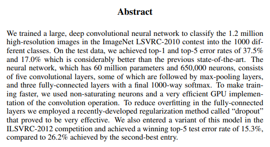
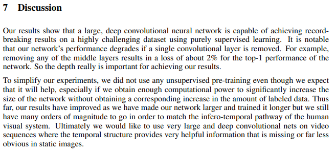
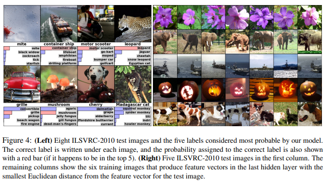
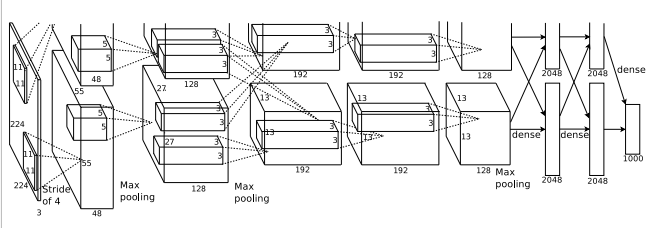
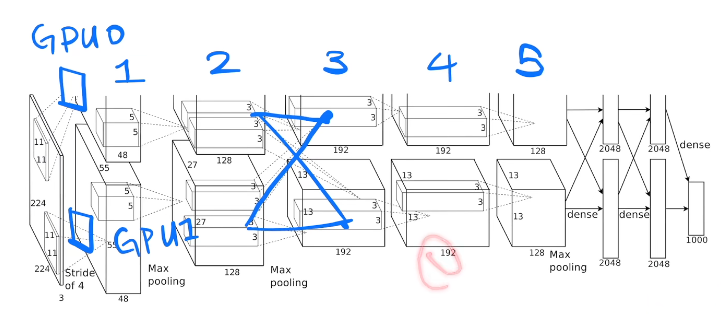

# AlexNet

## 第一遍

标题：ImageNet Classification with Deep Convolutional Neural Networks，ImageNet是当时最大的图片数据集

作者：Hinton当时机器学习的大牛

Abstract：重点介绍了AlexNet的效果，有点像技术报告

结尾不是Conclusion而是Discussion：提出深度和网络效果正相关，因为五层去掉一层效果降低2%（实际上是调参没调好，去掉一层影响不大，但是前面提到的深度和网络效果正相关是正确的，另外宽度也很重要）。使用Supervised Training（但是当时Hinton和LeCun都认为无监督学习才是最重要的，最近BERT和GAN让人对无监督又开始感兴趣起来了）。未来希望能够在video数据上训练（在video上一直都比较慢）。

图：

右边的图片是最后一层输出的向量，在数据集中找最相邻的图片，可以看到基本相似。这是最重要的一点，相似的图经过神经网络在语义空间里是相近的

由于该工作的正确率非常高，因此决定继续往下读。

## 第二遍

introduction：

- 当时认为正则很重要

> 在深度学习中，正则化（regularization）是一种用于减少模型过拟合的技术。正则化通过在损失函数中添加一个惩罚项，来限制模型参数的值域，使其不能过大，从而降低过拟合的风险。
>
> 正则化通常被应用于优化算法的损失函数中。它的目的是在保持良好的拟合能力的同时，降低模型的复杂度。常见的正则化方法包括：
>
> 1. L1正则化：在损失函数中添加L1范数惩罚项，使得模型的参数稀疏化，即将一些参数缩减为0，从而降低模型的复杂度。
> 2. L2正则化：在损失函数中添加L2范数惩罚项，使得模型的参数权重被限制在一个较小的范围内，从而降低模型的过拟合风险。
> 3. Dropout正则化：在模型的训练过程中，以一定的概率随机忽略掉一些神经元，从而使得模型不依赖于某些特定的神经元，提高模型的泛化能力。
>
> 正则化方法的选择取决于具体的问题和数据集。
>
> L1范数和L2范数是向量空间中常见的两种范数，它们都可以用来衡量向量的大小。在深度学习中，L1范数和L2范数通常被用来作为正则化方法的惩罚项。
>
> L1范数是指向量中各个元素的绝对值之和，也就是说，对于一个n维向量x，它的L1范数为：
>
> ||x||₁ = ∑|xᵢ|
>
> 其中，|xᵢ|表示向量x中第i个元素的绝对值。
>
> L2范数是指向量中各个元素的平方和的开方，也就是说，对于一个n维向量x，它的L2范数为：
>
> ||x||₂ = √(∑xᵢ²)
>
> 其中，xᵢ²表示向量x中第i个元素的平方。
>
> 可以看出，L1范数和L2范数都可以衡量向量的大小，但是它们的数值大小和性质不同。L1范数倾向于使得向量中某些元素变为0，从而得到一个稀疏的向量，适用于特征选择等需要稀疏性的场景。而L2范数倾向于使得向量中每个元素都变小，但不会减为0，适用于需要平滑性的场景。
>
> 在深度学习中，L2范数通常被用作权重衰减（weight decay）的惩罚项，以避免过拟合问题。L1范数也可以用作正则化方法，但由于它的导数在0点处不连续，不利于优化算法的求解，因此通常需要使用一些特殊的算法进行优化。

- 说当时大家都在用CNN，Fake！需要提一下其他流行的算法

Dataset：

- ImageNet的分辨率不同，我先都转成256\*256。多出来的以中心为界裁剪。直接在Raw RGB上训练，而不是SIFT之类的
- End-to-End：该论文没有指出端到端的价值，虽然它是端到端

Architecture：

- 我们使用了ReLU，一般用的是Sigmod和tanh。在当时更快一些，但是目前换成其他的也无所谓

- 多卡训练：工程细节可以忽略

- Local Response Normalization：避免饱和（饱和此时不理解），实际上目前有更好的Normalizatio的方法

- Overlapping Pooling：Pooling是什么？对传统Pooling做了一些修改

- Overall Architecture：

  CNN的长宽减小代表压缩信息，一个像素代表之前多个像素。通道数增加，代表观察的模式类型增加

  

  有两块GPU，将一张图分成两个部分分别卷积，在第2层和第3层之间做一次GPU通信。模型并行在AlexNet之后的七八年没有受到关注，但是最近也有收到关注（因为太大）

Reducing Overfitting：

- 数据增强：将图片人工变大，在256\*256扣出224\*224
- PCA，将图片略作修改
- Dropout：随机将隐藏层的数据以50%的概率设成0，等价于L2正则。目前CNN不会用那么多全连接，dropout在RNN还是很有用的

Details of learning：

- SGD：当时觉得很难调，但是现在发现其中的噪音对模型的泛化性有很大帮助，最主流的算法。weight decay很重要，其实是L2正则。momentum挺好。初始化权重是用均值为0，方差0.01的高斯随机变量来初始化（BERT也只用了0.02），
- 学习率的调整：ResNet就是每30轮下降常数，AlexNet是规则性地下降10倍（目前很少用），目前喜欢用平滑的曲线往下降，例如cos函数（先从很小的值开始，线性增加，然后用cos减小）

Result：

- 只有是大牛或者审论文或者复现的时候才去看他的exp
- ImageNet有120万图片，实际上它的完整数据集是890万张，用后者可能效果更好
- 经常混用val和test，一般来说val是能一直调参的，而test只能提交几次

- 作者说GPU0上和color有关，而GPU1上和color无关，实际上这可能是随机发生的