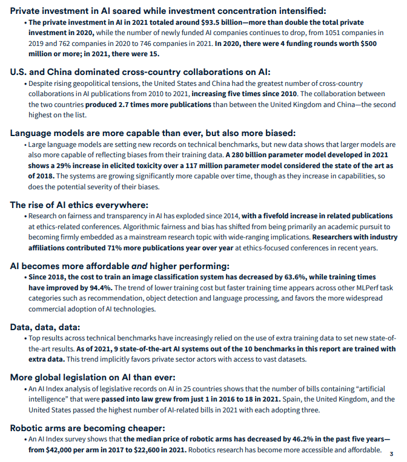

# 2022 Stanford AI Index Report

## Takeaways

## Technical Performance

- CV

  - Image

    - 图片分类

      ImageNet：使用额外训练数据有更好的结果

    - 图片生成

      STL-10数据集：使用FID分数评价生成图片和真实图片之间的区别

    - Deepfake Detection

    - 姿势识别

    - 语义分割

    - ...

  - Video

    - 行为识别

      Kinetics数据集、ActivityNet数据集（标出几秒到几秒是什么动作）

    - 物体检测

      COCO数据集

    - 数据常识推理

- NLP

  - 文本理解
  - 文本摘要
  - 自然语言推理，判断两句话的关系
  - 拓展推理
  - 情绪识别
  - 机器翻译

- 语言

  - 语言识别

- 推荐系统

- 强化学习

- 硬件系统

- 机器人