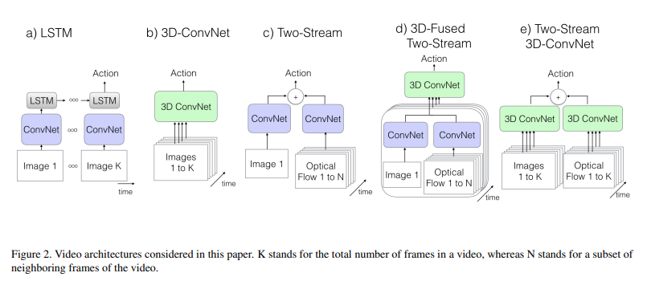
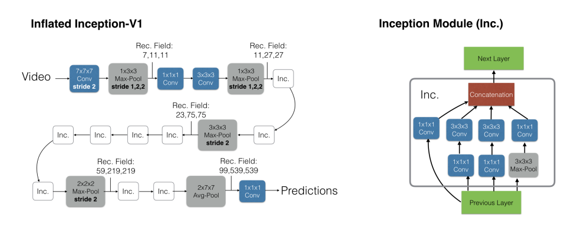
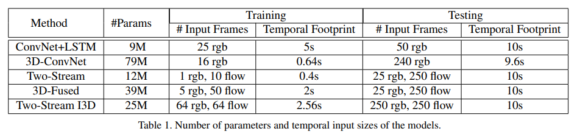
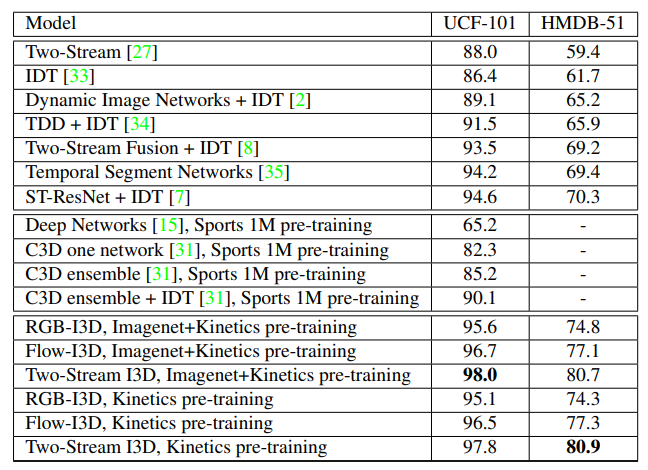

# I3D

## 标题

- Quo Vadis, Action Recognition? A New Model and the Kinetics Dataset
- I3D：Inflated 3D Network，将2D模型扩张到3D
- 卖点就是一个新模型和一个新数据集，但是这个数据集其实也并没有让模型很好地学习到时序信息，抽取整个视频的中间帧其实也就可以比较准确地预测结果

## 摘要

- 希望直接从二维的模型直接inflated到三维模型，例如将kernel核从3\*3变成3\*3\*3，最好能直接使用二维的参数，不需要做太多的消融实验

## 引言

- CV领域常用大规模数据集做预训练然后迁移到其他任务，但是视频领域还没有一个大的数据集
- 构建了Kinetics-400，每个class有400个例子
- 测试之前的网络

## 方法

- 各种方法对比

  - a：将每个帧通过CNN抽取特征，然后将特征放入LSTM加上时序信息，效果不好
  - b：将视频帧叠在一起直接放入3D CNN中
  - c：双流网络，最后是latent fusion（已经出结果了再融合在一起），将两个特征直接取平均相加
  - d：使用early fusion（还没出结果直接融合在一起），最后使用3D CNN
  - e：本文

  

- inflate

  - 将2D直接变成3D网络，不需要设计网咯

- bootstrap 引导

  - 用已经训练好的网络参数来做初始化，一般是两个完全一样的网络结构
  - 本文需要用2D预训练模型去初始化3D网络
  - 作者的方法是：如果两个模型的输入相同且输出也相同说明两个模型初始化一致，因此作者将图片复制很多帧形成视频，然后将图片喂给2D网络，给视频喂给3D网络

- 具体结构：最初使用Inception模型，因为当时比ResNet好一点，但是后来也换回ResNet了。Pooling层做了修改，时间维度上不要做下采样，即输入64帧输出64帧

  

- 5种网络架构的具体比较：（1秒25帧）

  测试的时候10s视频最好都囊括在内

  

## 实验

- 光流始终能提点

- 整体微调效果会更好

- 效果：

  - 可以不使用IDT等传统特征
  - 可以直接在Kinetics上训练而不需要ImageNet预训练，视频模型在视频训练集上训练

  