# Video Action Recognition

## 综述

- 标题：A Comprehensive Study of Deep Video Action Recognition
- 四个阶段
  - Hand-crafted -> CNN
  - 双流
  - 3D CNN
  - Video Transformer

## CNN

- Large-scale Video Classification with Convolutional Neural Networks

  - 提出Sports-1M数据集

  - 不同方法

    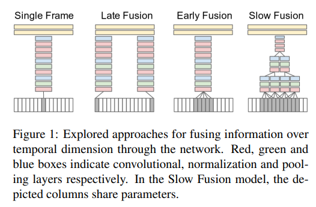

    Single Frame就是图片分类，后面三种使用到了时序信息。Late Fusion是两帧分别通过CNN然后将特征结合起来通过FC，Early Fusion是多帧一开始就直接叠加然后通过CNN，Slow Fusion是一开始四帧叠加进入CNN之后慢慢合并

    实际上不同方法效果差不多，同时在小数据集上训练之后比不过手工特征

  - 多分辨率CNN

    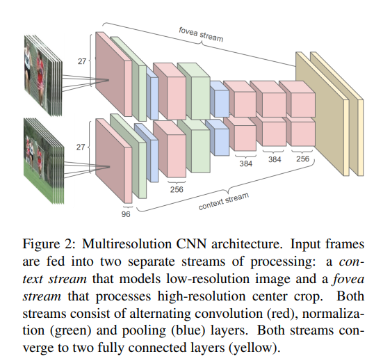

    fovea流的输入是图片中间的信息，context流是全局信息，效果研究不够好，迁移学习效果远不如手工特征

## 双流

- 之前的双流光流网络

  - Late Fusion，是否能够尝试别的Fusion方法
  - 中间的CNN是AlexNet的变体，能否使用别的网络
  - 抽取出的特征直接去做分类，是否能够通过RNN和LSTM来更好地抽取特征
  - 单帧和光流图片还是比较短，需要针对长时间视频

- Beyond Short Snippets: Deep Networks for Video Classification

  - 架构图

    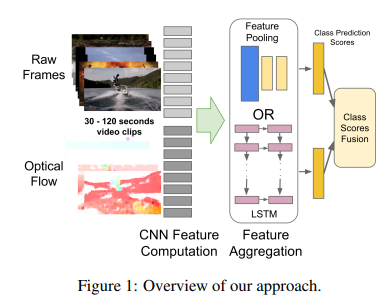

  - 抽取特征之后使用哪种Pooling，本文进行了深入的探索，发现Conv Pooling效果最好

  - 使用LSTM发现效果提升有限

  - LSTM：最底层是CNN抽取出的特征，然后接5层LSTM，最后Softmax输出

    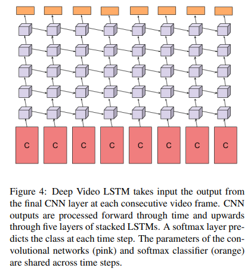

  - LSTM的输入必须有一定变化才能学到时间上的改变，如果视频比较短，那就没有效果了

- Convolutional Two-Stream Network Fusion for Video Action Recognition

  - 本文详细探索了不同Fusion的效果

  - Spatial Fusion

    保证时间流和空间流特征图在同一个位置产生的通道Response是能联系起来的，这样才算Early Fusion

    包括 Max Fusion / Concatenation Fusion / Conv Fusion / Bilinear Fusion / Sum Fusion，表现最好的是Conv Fusion

  - Fusion的阶段

    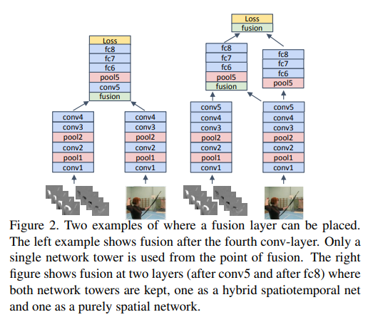

    作者总结了两种比较好的Fusion时机

  - Temporal Fusion

    作者尝试了3D Pooling和3D Conv+3D Pooling

  - 结论

    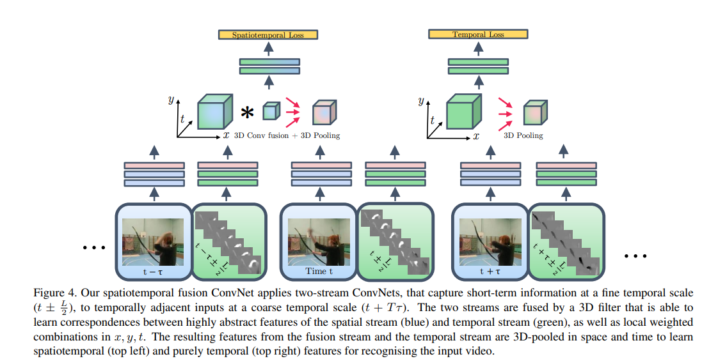

    作者的网络有两个分支，一个包括时空信息，而另一种只包含时间信息

    推理的时候用两个loss late fusion

  - 证明了early fusion和3D Conv的效果

- TSN

  - 标题：Temporal Segment Networks: Towards Good Practices for Deep Action Recognition

  - 能处理更长时间的视频，同时确定了很多很好用的技巧即Towards Good Practices

  - 长时间视频就先分段，然后在每段里随机抽取一帧，然后在之后几帧中计算光流，然后再通过共享参数的双流网络。作者认为虽然图片不同但是最高层语义信息相同，所以将空间流进行一个Segmental Consensus，可以做加法、乘法、LSTM等，然后两个Consensus做一个加权平均

    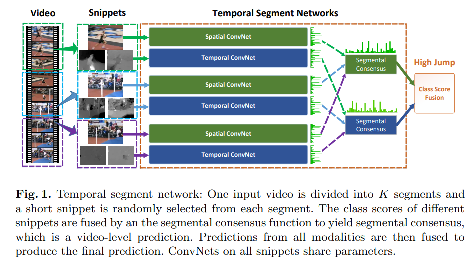

  - 技巧

    - Cross Modality Pre-training：ImageNet预训练模型如何迁移到光流图上，因为光流图有10张共20个通道，但是ImageNet预训练模型只接受3个通道。作者将第一个层的结构改变了，这里就先将三个通道的参数值取平均变成一个通道，然后复制20份形成20个通道，效果非常好
    - 模型正则化：BN导致严重的过拟合，这里使用partial BN，即打开第一层BN，freeze之后的所有BN
    - 数据增强
      - Corner Crop：正常的Random Crop一般都会在中间Crop，所以作者强制在边缘Crop
      - Scale-jittering：改变图片的长宽比

## 3D CNN

- 由于提前抽取光流非常耗时，不能支持实时光流抽取

- C3D

  - 标题：Learning Spatiotemporal Features with 3D Convolutional Networks

  - 最主要特点是使用大型数据集Sports-1M，网络更加深

  - 就是3D版本的VGG

  - 结构：作者发现FineTune效果并不好，不如直接从FC6抽取特征然后训练SVM，C3D特征指的就是FC6抽取出的特征

    

    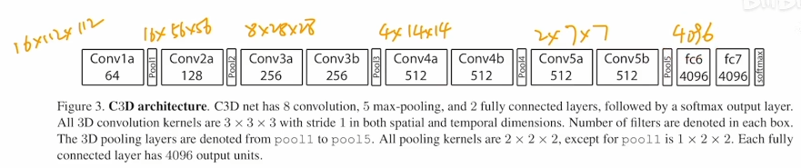

  - 后来很多任务都直接使用FC6特征然后做下游任务

- I3D

  - 降低了网络训练难度
  - 作者看到C3D效果并不太好，所以认为一定要有一个预训练模型，所以就想把2D网络扩展成3D网络
  - I3D还是用到了光流，且带来了提升，所以光流有用

- Non-local Neural Networks

  - 摘要：卷积和递归都是在局部区域中的feature，而非局部的信息可能对泛化有很多好处，所以这里实现一个Non-local的算子，这是一个即插即用的block，作用就是建模长距离信息，在各种任务中都很有效

  - 结构：

    时空算子，其实是标准的attention以及残差连接，为了适配3D所以这里2D操作都变成了3D

    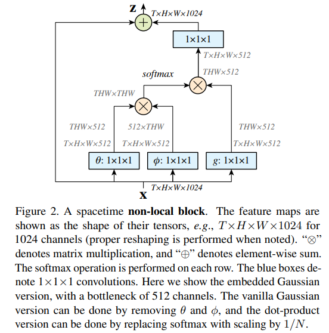

  - 消融实验比较重要

    - 一开始确定attention的操作：dot-product
    - 检测哪个ResNet Block之后插入这个算子效果最好：发现在非最后一个都还好，作者认为到后面没有很多空间信息了，也没有远距离信息可学；而太早做成本比较大
    - 尝试加多少：发现更多算子更有用
    - 时间是否有必要：发现在时空上做attention效果最好
    - 更长的视频：能有提升

  - 之后大家更不用LSTM了，Non-Local成为重要算子

- R(2+1)D

  - 标题：A Closer Look at Spatiotemporal Convolutions for Action Recognition

  - 测试2D和3D各种网络，最后发现将3D卷积拆分成空间上的2D和时间上的1D效果最好

  - 架构比较

    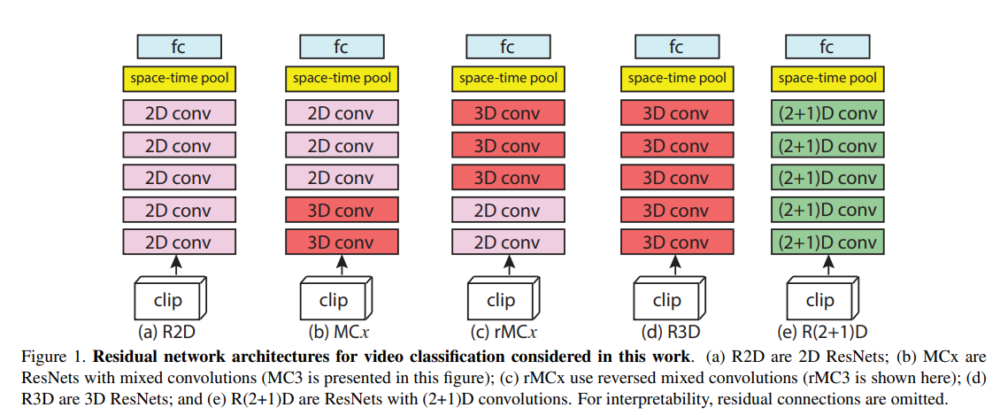

  - R(2+1)D

    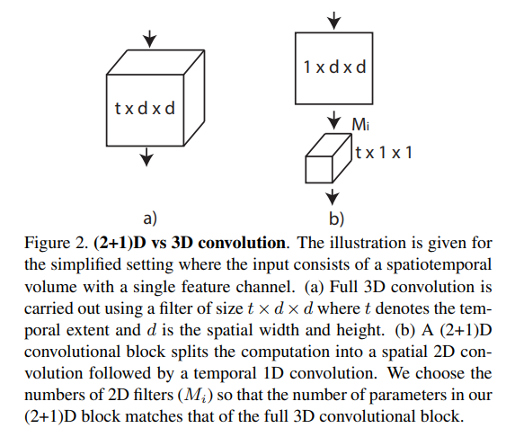

  - 比之前好的原因

    - 增加非线性，原来只有一个ReLU，现在有两个ReLU
    - 相对容易优化

  - 但是最终结果在UCF101和HMDB51比I3D差，在K400上单独的RGB / Flow效果比较好，但是合起来就比I3D差

  - 输入是112\*112而I3D的输入是224\*224，且前者不需要使用ImageNet预训练模型，同时R(2+1)D训练更容易

- SlowFast

  - 标题：SlowFast Networks for Video Recognition

  - 借鉴双流模型，但是不使用光流作为输入

  - 作者说来源于人有p细胞和m细胞，前者捕捉静态信息后者捕捉高频运动信息，前者占80%后者占20%，所以作者设计了两只网络，一个是Slow网络（I3D）输入少但是参数量大，另一个是Fast网络输入多但是参数量小

  - 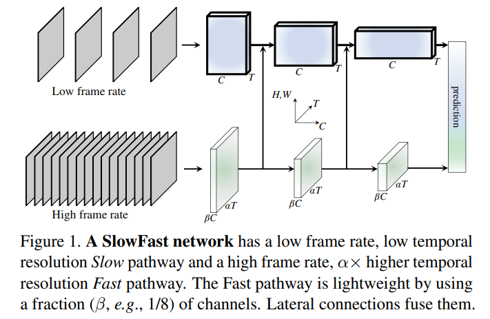

  - 具体网络结构

    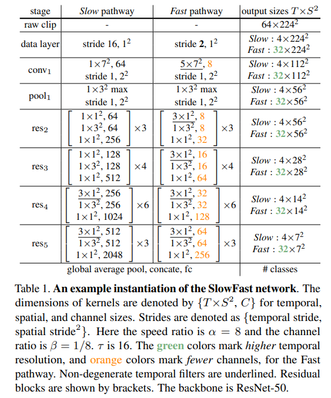

    快分支每16帧取1帧，慢分支2帧取一帧，所以快分支的通道数少很多，另外时间维度上不下采样

## Video Transformer

- Timesformer

  - 标题：Is space-time attention all you need for video understanding?

  - 实验性论文，探索如何将Transformer迁到视频领域

  - 架构对比

    - S：baseline
    - ST：最暴力的方法，直接将三个维度过attention层——GPU内存塞不下
    - T+S：时空分别做自注意力
    - L+G：局部算然后全局算
    - T+W+H：分别根据时间+宽度+长度维度做自注意力

    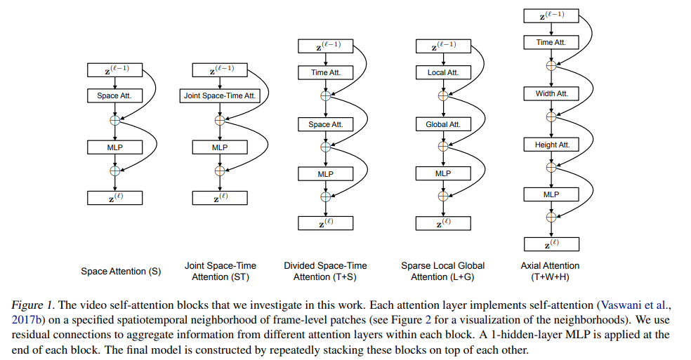

  - 更详细的attention设计方案

    - 蓝色patch是基准点，红色的patch是会和它做attention的patch

    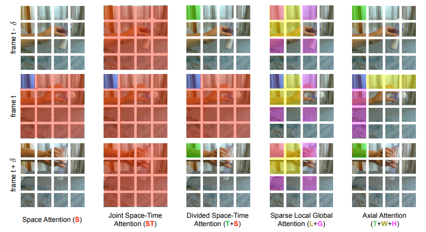

  - 最后最好的方案是Divided Space-Time Attention