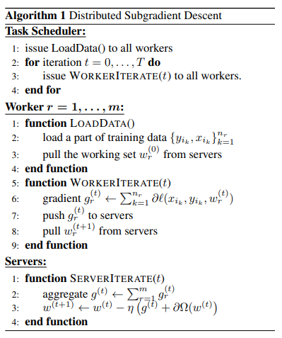
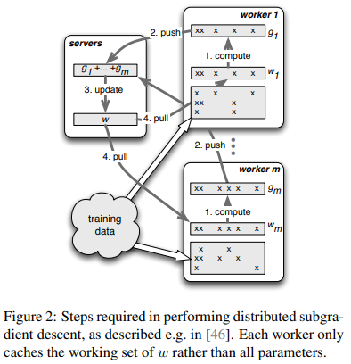
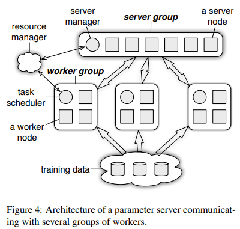
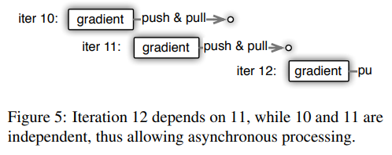
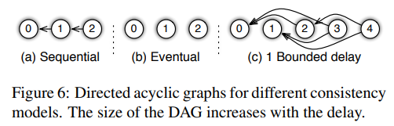
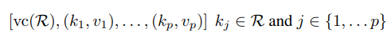
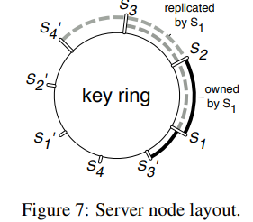
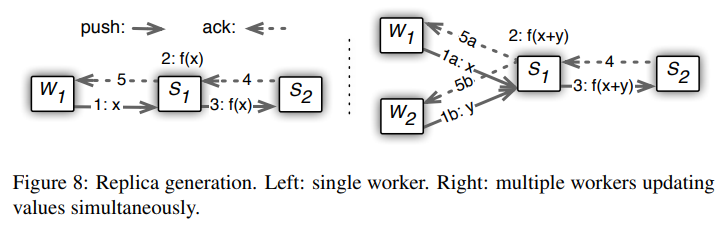

# ParameterServer

## 标题

- Scaling Distributed Machine Learning with the Parameter Server

## 摘要

- 提出一个参数服务器的框架：数据和任务在工作节点上，服务器节点上维护一个全局共享的参数，这些参数表示为密集或者稀疏的向量或者矩阵

## 引言

- 痛点
  - 访问共享参数需要非常大的网络带宽
  - 机器学习算法是线性的，同步开销非常大
  - 容灾要求很高
- 贡献
  - 最初是李沐老板在Yahoo实现了第一代参数服务器框架，Jeff Dean实现第二代，本文实现第三代参数服务器
  - 更好的抽象，方便实现各种AI算法，且贴合真实工业界
  - Features：
    - 高效通信：异步通信，通信量压缩
    - 灵活的一致性模型：两个机器在同一时刻对某个值具有一致性，本文实现了弱一致性模型，但是之后深度学习希望有强一致性
    - 弹性地可扩展性：新的节点可以加进来而不让整个任务停止
    - 容灾：向量钟技术，使得整个系统发生非致命性错误1秒内能够恢复
    - 易用：提供了C++的向量和矩阵
  - 新颖度：使用正确的系统技术，将他们适配机器学习算法，并且修改机器学习算法使其更加系统友好
- 工程挑战
  - server node会维护全局共享的参数，可能参数很大，需要多台server node来存储
  - worker node计算节点会取参数中一块来做计算
  - 挑战：
    - 通信：之前的分布式系统使用key-value对来更新datastore里的参数（往往是逐一更新），但是机器学习里往往是向量、矩阵、张量等结构的更新，同时还可能出现稀疏矩阵的情况
    - 容灾：会对每个节点的参数有实时的复制

## 机器学习

- 分布式算法

  - Task Scheduler负责通知Worker做计算
  - Worker读取自己的训练数据，然后拉去服务器端的参数（不是全部参数，所以这里标为working set），然后做梯度计算并迭代
  - Server汇总梯度计算然后更新所有参数 $w$

  

- 流程

  注意图中的训练数据可能是稀疏的，所以它有些 $w$ 参数是不需要pull到的

  

## 架构

- 架构图

  - 多个worker group的目的是可以训练多个有交集的任务、或者提供多个线上服务例如inference接口

  

- 参数服务器对参数的抽象是 (Key, Value)

  - key简单认为是参数$w$的下标，但是下标不一定连续，往往是hash值
  - value可以是浮点数或者向量
  - key一般是int64或者int128（hash值），value是一个浮点数或者一串浮点数
  - 所以可以使用BLAS库等写矩阵乘法

- Range Push and Pull

  - 相当于参数可以将某个range内的key发送出去（或接受）

- server端用户设计函数

  - 服务器代码非常重要，挂了就很危险
  - 提供了一个接口，在安全性基础上，用户可以设置$w$怎么更新

- 异步任务

  - 一个任务通过一个RPC触发，这里会异步地触发任务，即让Worker0执行WorkerIterate，不等它执行完直接让Worker1执行WorkIterate
  - 但是有些任务是有依赖的，就是有顺序执行的要求
  - 下图 iter11 用的不是最新的 $w$，但是速度比较快

  

  - 顺序图 DAG 有向无环图

    

- 用户定义过滤器

  - 我们需要发送大量数据，但是某些数据发送是没有必要的，我们会通过一些过滤器让它少发一些东西
  - 例如significant modifier filter，如果在上一轮没有改变很多的情况下就不发了
  - 例如precision filter，压缩数据的精度，从32位到16位等

## 实现

- 向量钟

  - server需要维护每个节点访问参数 $w$ 的时间
  - 可以记录每个层的时间（利用上面提到的Range Push and Pull）

- 通信

  - 内容：如果数据在上一轮没有改变就不用发，就是看hash之后的key是否有改变

    

- 一致性hash ring

  - Key Ring：所有参数按照hash值排列成环，每个server占用一部分同时保存下**两**段的replica。因此允许两个server挂掉；如果要加一个节点，只需要在某段上加一个节点然后将原段分成两个

    

  - 流程：

    左边图表示：当worker获得ack的时候，它的server和备份节点都接收到了

    右边图表示：为了提高带宽可以做汇聚，将多个梯度累加然后不着急备份，但是延迟会增加

    机器学习关注带宽不关注延迟

    

- worker management

  - 容灾比较简单，如果挂了，server就ping一下，ping不到就直接发任务给别的worker