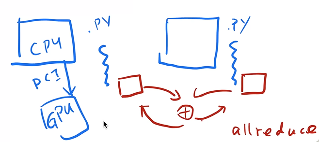
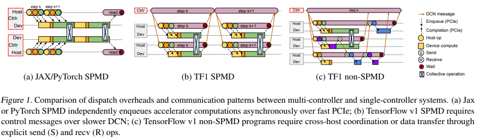
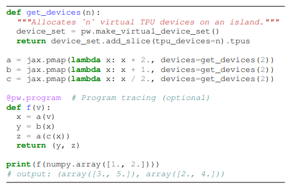
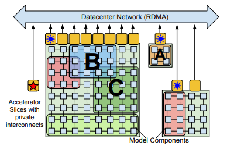
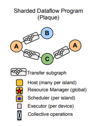
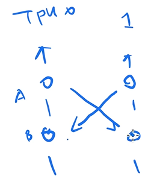
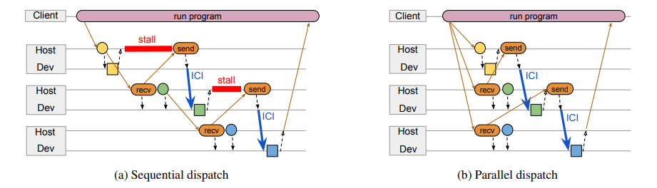

# Pathways

## 标题

- Pathways: Asynchronous Distributed Dataflow for ML

## 摘要

- 我们提出一个新的大规模的编排层的设计。编排层是云设计中，计算任务如何映射到底层计算资源

  > 编排层是计算机网络中的一种抽象层级，主要负责对网络数据进行编排和排序，以保证数据在传输过程中的正确性和完整性。编排层通常包括以下功能：
  >
  > 1. 数据分段：将大块数据分成较小的数据块，以便在传输过程中更好地管理和控制。
  > 2. 数据排序：对分段后的数据进行排序，以保证数据在传输过程中的正确性和完整性。
  > 3. 流量控制：通过控制数据发送速率和接收速率，避免网络拥塞和数据丢失。
  > 4. 错误检测和纠正：对传输过程中出现的错误进行检测和纠正，以保证数据的完整性和正确性。
  > 5. 重传机制：在数据传输过程中，如果发生数据丢失或错误，可以通过重传机制重新发送数据，以保证数据的完整性和正确性。
  >
  > 编排层通常是网络协议栈中的一个重要组成部分，常见的编排协议包括TCP、UDP、SCTP等。

## 引言

- 本系统Pathways将被未来的ML所需要

- 当前的系统都是SPMD（Single Program Multiple Data），每台机器用一样的代码，算完自己的梯度然后调用AllReduce函数（MPI函数），等待所有机器都执行完这一步，然后将所有的梯度相加，BSP模型

  

- BSP模型会在新的语言任务上出现问题，数据在一个加速器上放不下，需要用Pipeline；另外模型有稀疏性

- 单台机器上的TPU/GPU比较快，但是不同机器之间数据传输比较慢，同时有异构存在，然后大家追求MPMD（不同机器的代码不同，调度优化不同）

- Foundation模型很大，且推理和训练可能同时使用

## 设计

- 动机：

  图(a)中Host表示CPU，Dev表示GPU

  图(b)中ctrl会派送任务到不同机器，报错信息比较难看

  图(c)即本文架构，用ctrl向不同节点派送不同任务，系统上称作dataflow。在dataflow中计算表示成图，每个计算为一个节点，箭头表示依赖。

  Transformer中矩阵乘法数量远超CNN，但是单个计算复杂度又不高，导致整个计算图多了很多边，通信成本增加非常多，本文希望在(c)架构上提升性能

  

- 例子：

  pathways提供额外的函数，能够分配虚拟TPU，然后计算逻辑先编译成计算图，然后发给TPU运行

  `@pw.program`将多个计算合并成一个program，可以直接编译成大的模块

  

## 架构

- 资源管理器

  - 蓝色小块就是一个TPU核，它和邻居之间（上下左右前后）高速连接，然后一堆蓝色小块连在一起就是一个Pod（一个Pod最多2048核）；Pod之间的网络带宽低很多；jax和TensorFlow一般会在Pod内划出一块矩形来运算，这样通信速度比较快

    

  - Pathways希望让多个pod之间的通信加速。我们称A/B/C为一个岛，我们目标是在三个岛上有效执行。

  - 资源管理器就是根据用户代码中的虚拟TPU要求去请求物理TPU，然后将虚拟TPU映射到物理TPU上，Pathways就先简单地直接分配然后一对一映射，未来可以支持动态加减

- 将代码编译到某个IR然后再优化？

  

- TPU可能会发送死锁：使用GangSchedule，每个岛有个调度器来排序

  

- 异步

  图(a)的流程：TPU0获得程序开始编译并执行，然后发送给TPU1要求它创建一块内存来等待接受TPU0的输出，同时TPU1也让TPU2开内存。当TPU0计算完的时候会send给TPU2，中间会有一个stall。

  图(b)的流程：客户端会有提前的调度同时发送给其他TPU开内存

  

## 评价

- 稍有失望，只是让TPU pod不再局限于2048核，没有实现最初愿景