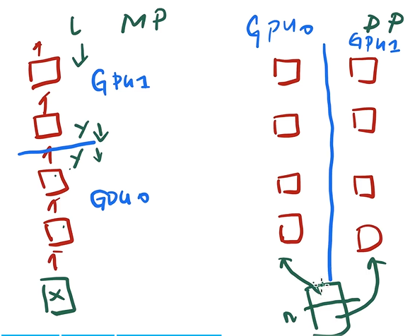
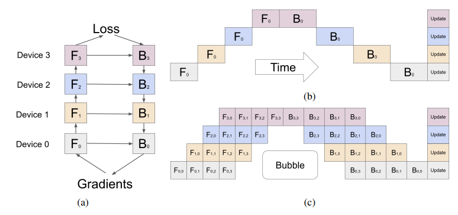
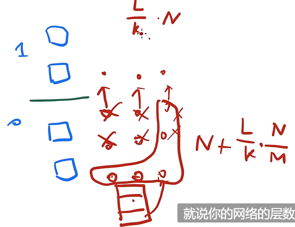

# GPipe

## 标题

- GPipe: Efficient Training of Giant Neural Networks using Pipeline Parallelism
- 参数服务器是数据并行，Pathways用到了流水线并行但是上次在实验部分跳过去了

## 摘要

- 模型增大之后，内存需求可能超过单个加速器的内存
- 我们提出一个流水线并行的库 GPipe，只要你的网络是一层层串联而成，就都可以使用这个库
- 加速器内存限制以及通信带宽要求我们对模型进行partition
- GPipe使用 re-materialization （将某些中间结果丢掉然后下次重新计算）和 micro-batch（微批，将batch做到更小的size）

## The GPipe Library

- GPipe基于Lingvo，后者是TensorFlow上的一个库（注重可重复性、可复现性，它会保存所有配置项）

- 假设神经网络是 $L$层，GPipe允许用户设置切的块数 $K$，然后开始做计算

- 第 $K$ 块放在第 $K$ 个加速器上——最简单的模型并行

- 模型并行和数据并行

  模型并行就是将不同层分给不同GPU，然后数据和梯度相互传递

  数据并行就是将输入的数据分成块然后在每个GPU上通过所有的层，最后加起来

  

- 模型并行的问题

  图(b)模型并行和单GPU运算是相同的，因为其他时间都在等待，其实就是内存翻4倍但是计算没有翻4倍

  图(c)就是流水线，具体就是数据切开成微批量，相当于数据并行和模型并行同时做，当切的微批量越多的时候就能让效率提的更高。注意使用批量归一化的时候需要对整个批量做一个均值和方差，而现在是做微批量，而Transformer是层归一化就无所谓了

  

  BubbleTime为 $O(\frac{K-1}{M+K-1})$，其中 $K$ 是流水线级数，$M$ 是指令数。作者发现 $M\ge 4\times K$的时候就可以忽略不计了

- 性能优化

  前向过程中中间值不能被丢掉，因为后面回传的时候可能会用到，导致activation memory比较大。GPipe使用 re-materialization 或者 active checkpoint

  在没有做re-materialization的时候，需要保存的数据量是 $O(\frac{L}{K}\cdot N)$（N是批量大小），做了re-materializaion之后只需要保留一开始的输入 $N$，而每层只需要保留微批量大小 $\frac{L}{K}\cdot \frac{N}{M}$，所以最后是 $O(N+\frac{L}{M}\cdot \frac{N}{M})$

  代价是慢一些，但是内存降低

  

