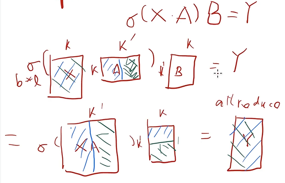
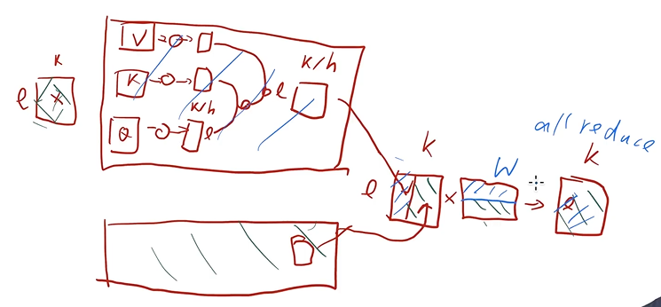
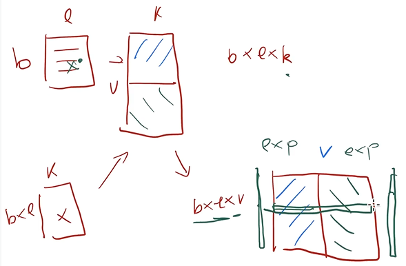

# MegatronLM

## 标题

- Megatron-LM: Training Multi-Billion Parameter Language Model Using Model Parallelism

- 针对特别大的语言模型，题目是模型并行，但是本文其实是张量并行

## 摘要

- 内存不够，本文提出层内模型并行，不需要新的包或者新的编译器，和之前的Pipeline是互补正交关系

- 之前的工作需要一个编译器或者一个framework，但是本文实现更加简单；但是牺牲的是通用性，本文只适合Transformer

## 方法

- Transformer的MLP：

  X是输入，A和B分别是两个隐藏层，本文探讨的问题是A和B很大需要拆分，所以就将A竖着拆分成两个模块，分别在GPU0和GPU1上，输入X在两块GPU上；然后各自得到一半的$XA$，然后将$B$横着拆分成两块在GPU0和GPU1上，然后各自计算，得到各自的$Y$，最后的结果就是两个$Y$相加即可。如果不考虑初始的$X$获取，两个GPU的通信之后最后的$Y$相加

  

- Transformer的Attention：

  多头就在不同的GPU上做运算，然后到MLP的时候就和上面一样

  

- 输入输出：$b$是batch数量，$l$是句子长度，$k$是每个词的向量表示长度，$v$是词典中词的个数

  输入是$b\times l$，然后去$v\times k$的词典里查询，每个词会对应一个$k$的向量，所以得到$b\times l\times k$，整个词典可以放在不同的GPU上，然后各自查询如果查询到就是$k$否则就是$0$，然后all reduce加起来就能得到词向量表示。

  输出的时候是$b\times l\times k$，然后也去查字典，得到 $b\times l\times v$，因为每个词会得到$v$长度的logits（表示和每个word的相似程度），然后要做 softmax，可以在两个GPU上分别做 exp以及求和，然后得到的竖着的向量再all reduce相加就可以得到最后的 softmax

  

  每一层做一次all reduce，通讯量为 $O(b\times l\times k\times n)$

