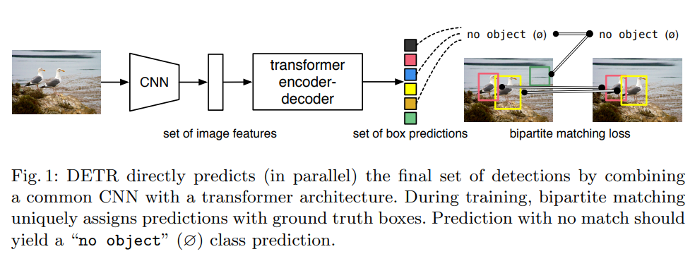
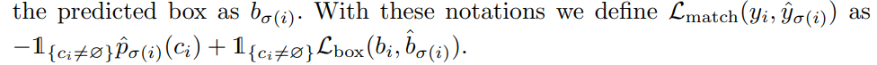
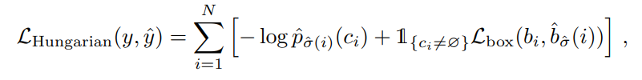
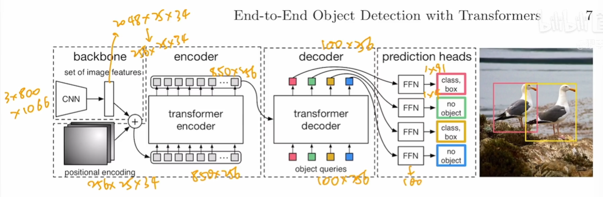

# DETR

## 标题

- End-to-End Object Detection with Transformers
- 目标检测很少有端到端的方法，一般都会在最后接一个NMS（Non-maximum Suppression非极大值抑制）
- 之前需要很多人工干预甚至使用一些普通硬件不支持的算子

## 摘要

- 本文将物体检测转变成集合预测问题
- 本来的目标检测问题：给定图片预测一堆框，然后每个框要知道坐标以及框内物体类别
- 本文提出一种新的目标函数，使用二分图匹配强制模型输出一个独一无二的预测，没有冗余的框；另外本文使用Transformer的Encoder和Decoder，Decoder还有一个输入learned object query，本文Transformer的输出是in parrallel即直接输出全部

## 引言

- 之前使用proposals / anchor / window center 等将问题变成回归和分类问题，导致会出现冗余的框（重复预测），然后就得用NMS来抑制掉这些框

- 架构

  训练：

  - CNN抽特征
  - Transformer Encoder学全局特征
  - Transformer Decoder生成很多预测框（默认100个）
  - 预测框和ground truth做匹配，只留下匹配上的框，然后在匹配的框上算loss

  推理：去掉上面第四步，取置信度大于0.7的物体

  

- 检查大物体效果好，原因可能是Transformer学习到了全局特征，而anchor会受限于anchor大小；但是检测小物体效果不太好。后来出现Deformable DETR出现利用多尺度信息解决了该问题，同时解决了DETR训练慢的问题

## 方法

- 集合目标函数

  - 模型生成100个框，而gound truth只有几个框，解决匹配问题——二分图匹配问题

  - 二分图匹配问题：

    例子，假如有3个员工和3个工作，每个员工对于不同工作有不同的cost（cost matrix），目标是进行分配之后总cost最低

    可以使用`scipy.linear_sum_assignment`解决这种问题，所以需要确定cost matrix中的cost怎么填，使用如下的公式：

    

    > 二分图匹配问题是指在一个二分图中，找到一种最大匹配方案，使得尽可能多的节点能够匹配成功。二分图是指一个图中的节点可以分为两部分，使得同一部分内的节点之间没有边相连，不同部分的节点之间有边相连。匹配是指将图中的边和节点配对，使得每个节点只能和一个边匹配，每个边也只能和一个节点匹配。最大匹配是指在所有匹配方案中，能够匹配成功的节点最多的方案。
    >
    > 二分图匹配问题可以通过匈牙利算法解决。匈牙利算法是一种增广路算法，通过寻找增广路来增加匹配的数量。具体步骤如下：
    >
    > 1. 初始时，所有节点都还没有匹配。
    > 2. 从未匹配的节点开始，按照某种顺序遍历所有未匹配的节点，对于每个未匹配的节点，尝试与其相邻的未匹配的节点进行匹配。
    > 3. 如果相邻节点还没有匹配，直接将它们匹配起来。
    > 4. 如果相邻节点已经匹配，那么就尝试将相邻节点的匹配对象换成当前节点。如果能够成功，就将原来的匹配关系断开，将当前节点和相邻节点匹配起来。
    > 5. 如果不能成功，就继续尝试与下一个相邻节点匹配。
    > 6. 如果所有相邻节点都尝试过了，还是没有匹配成功，就将当前节点标记为已经匹配过了，并返回上一层继续寻找未匹配的节点。
    > 7. 最终，所有节点都将被匹配或者标记为无法匹配。
    >
    > 通过匈牙利算法，可以求得二分图的最大匹配方案。

  - 最后的loss函数

    

  - 最优匹配之后再算loss

- DETR结构

  

  object query也是一个可学习的参数

## 实验

- Encoder学习全局特征，将物体分开
- Decoder去学习边缘和遮挡
- 可视化object query之后发现：每个query相当于一个问问题的人，不断地问某个位置是否有大/小物体。作者发现每个query都会问中间是否有个大物体，作者怀疑是COCO数据集物体都在中间导致的