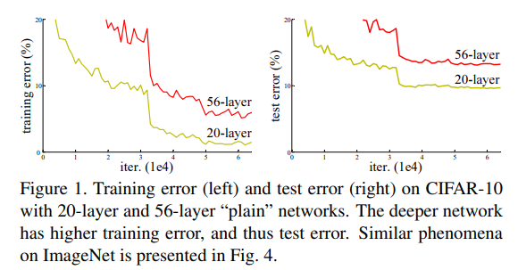
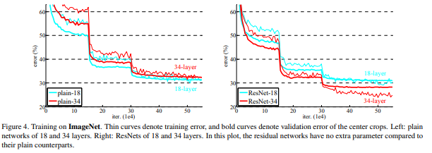
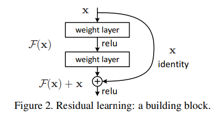
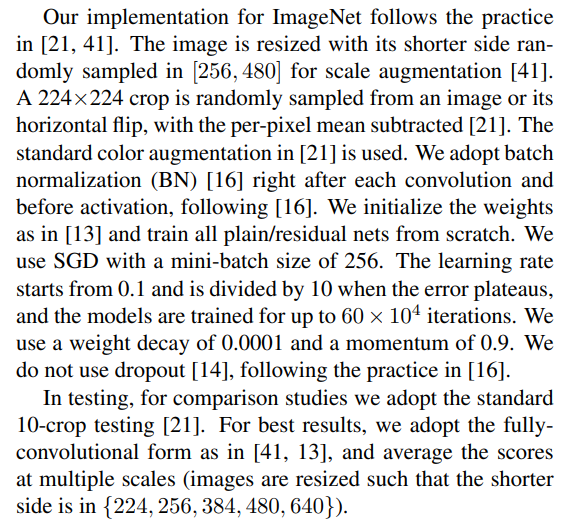
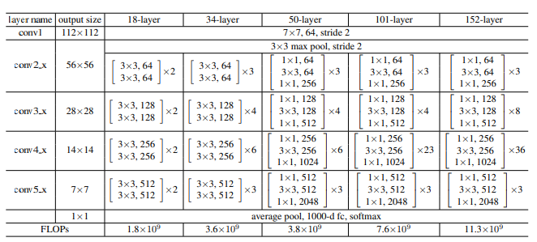
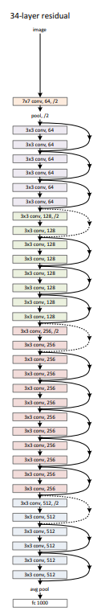
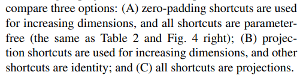
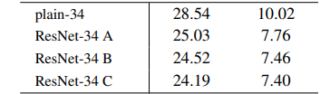
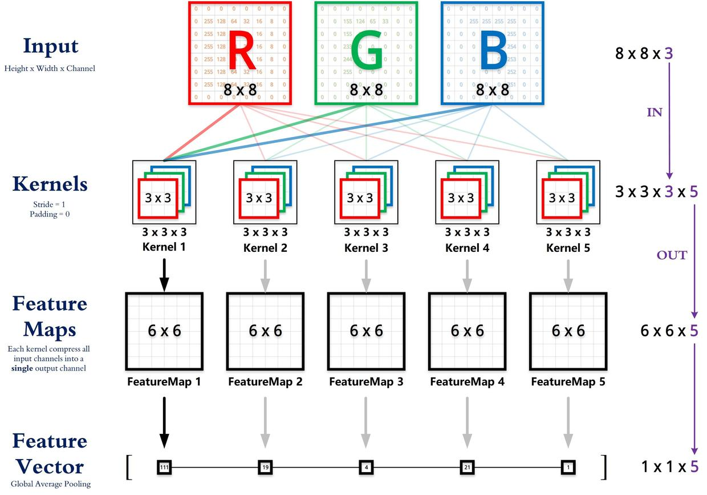
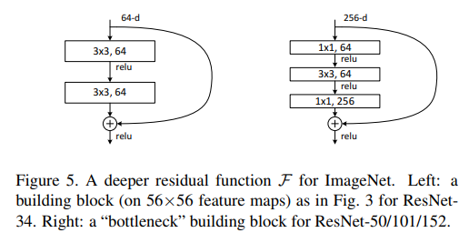

# ResNet

## 第一遍

Abstrat：深的神经网络训练很困难，我们使用残差网络来ease深度学习。深度152层，8倍于VGG，但是计算复杂度降低了。赢得了ImageNet和COCO第一，COCO是物体检测中最大的数据集

没有conclusion：因为CVPR限制论文在8页之内

图（一般第一页会放上好看的图，CG甚至会在标题上面放图）：

提出当深度增加的时候，error反而很高

## 第二遍

Introduction：

- 网络深的时候会发生梯度爆炸消失。解决方法：权重初始化，batch normalization

> Batch Normalization（批归一化）是一种用于深度神经网络中加速训练和减轻过拟合的技术。它通过对每个batch的数据进行归一化操作，使得模型的训练更加稳定和快速。
>
> Batch Normalization的基本思想是对每个batch的输入数据进行归一化处理，使得它们的均值为0，方差为1，从而使得输入数据分布更加稳定。具体来说，Batch Normalization包括以下几个步骤：
>
> 1. 对每个batch的输入数据进行归一化，使得其均值为0，方差为1。
> 2. 对归一化后的数据进行线性变换，包括缩放和偏移操作，使得模型可以学习到不同的特征组合。
> 3. 将线性变换后的数据输入到激活函数中进行非线性变换，从而得到网络的输出。
>
> Batch Normalization可以应用于网络的任意层，包括卷积层、全连接层等，可以有效地加速训练，减轻过拟合，同时可以使得学习率更大，从而更快地收敛。
>
> Batch Normalization的一个重要特点是可以减少对超参数的敏感性，例如学习率和权重初始化等。此外，Batch Normalization还可以被视为一种正则化方法，因为它对每个batch的数据进行了限制，从而使得模型更加健壮。

- 当网络深的时候观察到train和test的error都提高了，说明并不是overfitting

- 照理来说深的网络一定包含了浅的网络，直接做identical mapping，所以显示构造identical mapping

- shortcut connection

  

Related Work:

- gradient boosting

Deep Residual Learning：

- implementation：图片resize然后随机crop。使用BN。注意这里的iteration次数是和batch size相关的，所以一般不推荐写iteration，一般写的是遍历所有数据的epoch。没有全连接层，所以没有使用dropout

  

  > 在随机梯度下降（Stochastic Gradient Descent，SGD）算法中，batch指的是一批次（subset）的训练数据。具体来说，SGD将所有的训练样本分成若干个batch，每个batch包含了一定数量的训练样本，通常是2的幂次方，如32、64、128等。
  >
  > 在每次迭代中，SGD会从训练集中随机选择一个batch的数据进行训练，计算其梯度并更新模型参数。这样做的好处是可以减少训练过程中的内存占用，同时也可以提高训练速度，因为每个batch的数据量相对较小，计算梯度的时间更短，模型参数也更容易更新。
  >
  > batch size的大小通常是根据硬件设备的内存大小和训练集的大小来确定的。如果batch size太小，训练过程中的噪声会更大，但是可以更频繁地更新模型参数；如果batch size太大，训练过程中的噪声会更小，但是每次更新模型参数的时间会更长，训练速度也会减慢。
  >
  > 需要注意的是，SGD在每个batch上计算的梯度只是整个训练集上梯度的一个无偏估计，因此可能会存在一定程度上的不稳定性。为了解决这个问题，可以采用一些优化的算法，如Momentum、Adagrad、RMSProp和Adam等。

Experiments

- 池化层不带权重参数。可以对照下面两图中的34layer的图

  

  

- 结果：注意一开始train error比test error要大，因为使用了数据增强。突变是因为学习率乘以0.1，不推荐，一般前期尽量找到一个正确位置再跳。残差网络的收敛速度快很多。

  

- 当输入输出大小不一样的时候怎么做残差连接，即上上图中的虚线部分，这里用三种做法（填零，虚线projection，所有线都projection）。其中projection就表示用1\*1的卷积核来调整通道。最后推荐使用B，C的投影开销比较大。

  注意：ResNet中的通道数是一直在增加的

  

  

> 

- 如何构建更深的resnet：使用bottleneck，因为输入很大，为了降低复杂度就先降维，然后再升维

  

- ResNet计算快的原因：加法后面的梯度相对比较大
  $$
  \frac{\partial (f(g(x))+g(x))}{\partial x}=\frac{\partial (f(g(x))}{\partial x}+\frac{\partial g(x)}{\partial x}=\frac{\partial (f(g(x))}{\partial g(x)}\cdot\frac{\partial g(x)}{\partial x}+\frac{\partial g(x)}{\partial x}
  $$

- Failure is another way of convergence。SGD一般都能收敛但是要收敛到一个小的值，就是要一直有梯度，能跑得动。所以一般梯度够大就有比较好的结果

- 为什么ResNet在CIFAR10小的数据集上没有过拟合还是一个open question，可能是加了resnet降低了模型的复杂度，所以就会找到一个更简单的模型去学而不过拟合