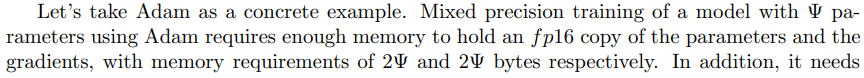
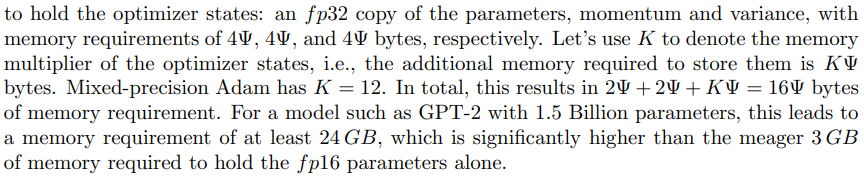
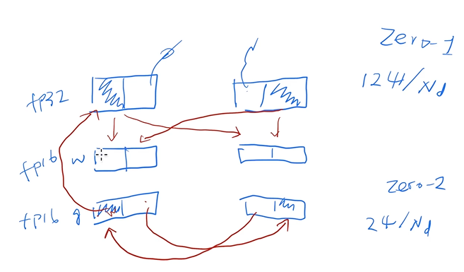
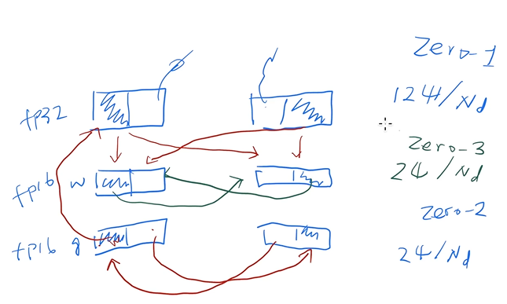

# Zero

## 标题

- ZeRO: Memory Optimizations Toward Training Trillion Parameter Models

## 摘要

- ZeRO：Zero Redundancy Optimizer，0冗余优化器，优化内存，数据和模型并行
- 超线性？

## 引言

- Megatron-LM在更多卡上通信量巨大，效率很低
- 首先看内存用在哪些地方：
  - 优化器状态、梯度、参数
  - 中间值，临时buffer，以及碎片化内存

## 内存

- 混精度训练：N卡在fp16上有很多优化，但是在梯度相加的时候会出现问题，所以梯度更新的时候用fp32，算完之后再变成fp16

  参数和梯度用fp16保存，这里需要使用$4\Psi$字节，另外Adam里需要用fp32保存，需要$12\Psi$

  

  

- pytorch会在计算中析构一些不使用的内存导致碎片化

## ZeRO: Insights and Overview

- 想法
  - 数据并行（DP）比模型并行（MP） scaling efficiency 高
  - 数据并行需要更多内存，因为模型需要都存一份
  - DP和MP都需要存很多中间状态，可以使用参数服务器只存一份在GPU上，其他需要用的时候去取
- ZeRO-R
  - 不重算，直接从参数服务器获取，当传输速度高于重算速度就划得来
  - buffer使用固定大小，提高效率
  - 内存碎片不断进行内存整理

## ZeRO: DP

- 三种分割方法：$P_{os},P_{g},P_{p}$，一般称为 $Zero_1,Zero_2,Zero_3$

- $Zero_1,Zero_2$

  假设两张卡（卡数记为$N_d=2$），一层网络。状态用fp32存（$12\Psi$），fp16的梯度（$2\Psi$），fp16的梯度（$2\Psi$）。

  将整个状态切成两半，一半留在GPU0（斜线部分），一半留在GPU1，另一半是不需要的，这称为$Zero_1$，所以内存开销为 $12\Psi/N_d$

  fp16的梯度切成两半，称为$Zero_2$，开销为 $2\Psi/N_d$

  假设 $w$ 是都保存在内存中，那么此时可以计算出一般状态对应的梯度，然后将这个梯度的一半发给另一个GPU的梯度加起来做all reduce。状态更新也是更新一半然后发给对方的参数

  

- $Zero_3$：将参数也分开，这里会产生一些额外通信，因为每次需要的时候需要从别的GPU上获取，可以做一定的异步

  

## ZeRO-R

- 使用Buffer
- 内存去碎片化