# DALLE2

## 标题

- Hierarchical Text-Conditional Image Generation with CLIP Latents
- Hierarchical 先生成64\*64，然后上采样到256\*256，再上采样到1024\*1024
- 先用CLIP找到图片和文本对之间的关系，然后给定一个文本通过CLIP文本编码器变成文本特征，然后DALLE2训练一个Prior模型（输入是文本特征，输出是图像特征），然后图像特征给解码器（Diffusion）得到图像

## 引言

- CLIP学到的特征很稳健，扩散模型多样性比较好且保真度一直在提高

- 结构

  虚线上方是CLIP模型，左边图片是文本通过Encoder到文本特征，右边图片通过Encoder得到图像特征，两者构成正样本；CLIP模型是锁住的

  用CLIP中的图像特征做Ground Truth，做预测任务

  本文称自己为unCLIP，相当于CLIP的反过程

  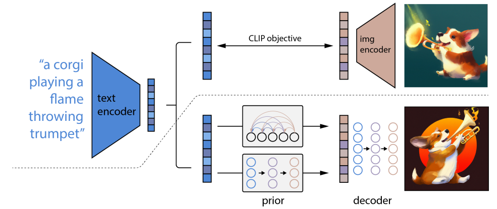

## 补充材料

- GAN

  - 问题是训练不稳定，生成多样性不高

- AutoEncoder

  - 原理：自己预测自己

    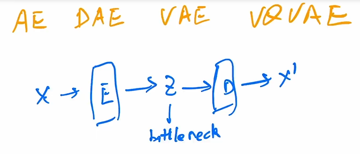

  - DAE先给输入一个打乱然后再给Encoder，让结果去重建原始的$x$，而不是扰动后的$x_c$，效果很好比较稳健。图片信息比较稳健，加一些noise不会有太多问题，和MAE原理类似

  - VAE架构：和之前的架构不同之处，在于之前的工作是学习Bottleneck中的特征，而本文是学习分布。作者假设是高斯分布，将Encoder输出的特征通过几个FC层来预测高斯分布，即均值和方差，然后采样出一个$z$然后做生成

    - 给定$x$得到$z$是 后验概率 $q(z|x)$，学出来的distribution是先验分布，给定 $z$ 预测一张图片 $x$ 是likelihood，所以就是maximize likelihood

    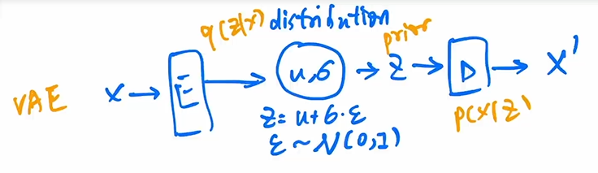

  - VQ-VAE

    VQ的含义是vector quantised，即给VAE做量化。VAE模型尺寸不好做大，分布不好学，所以不去做Distribution的预测，而是用Codebook代替，可以理解为$K$个聚类中心。然后将Encoder出来的特征图和Codebook中的聚类中心看距离的接近程度，选择接近的聚类中心放到$Z$中，然后用这些聚类中心形成新的特征图$f_a$

    这里特征是从Codebook中拿到的，所以不能做随机采样，因此不能生成，必须加一个Prior网络来做生成。这些特征本来是做high level任务的，例如分类检测等

    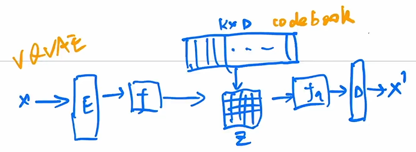

  - VQ-VAE2：模型变成层级式，除了局部建模还做全局建模，加上了attention。然后根据Codebook学了一个Prior网络（pixelCNN，这是一个自回归模型），生成效果很好

    > 自回归模型（Autoregressive Model）是一种时间序列预测模型，它假设当前时刻的值与前面若干个时刻的值有关。具体来说，自回归模型将当前时刻的值看做是前面p个时刻的值的线性组合，其中p称为模型的阶数。自回归模型常用的表示形式是AR(p)，其中p表示模型的阶数。自回归模型可以用于预测时间序列的未来值，也可以用于时间序列的分析和建模。

  - DALLE

    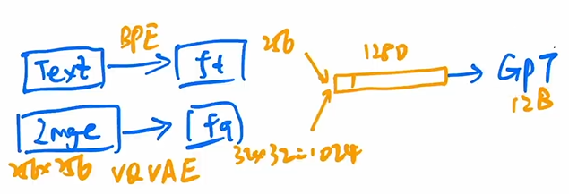

    OpenAI将上面的自回归模型pixelCNN换成GPT

- 扩散模型

  - 架构：前向过程，每次加一点噪声，如果$T$无穷大，那么就会得到各向同性的正太分布。

    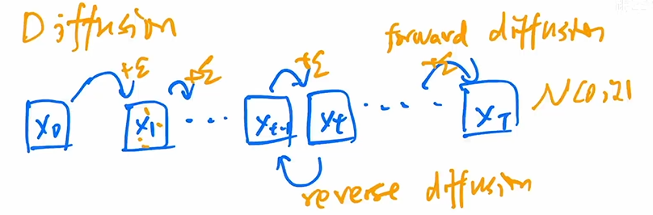

  - reverse diffusion使用的网络模型是UNet

    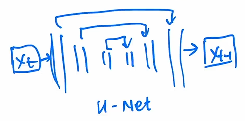

  - DDPM

    之前是从$x_t$预测$x_{t-1}$，作者认为可以只预测噪声$\epsilon$。UNet中要加上time embedding（正弦的位置编码或者傅里叶特征），我们希望反向过程中可以先学习低频信息生成物体轮廓coarse，然后最后学习到高频信息，而所有模型是共享参数的，所以需要用time Embedding来提醒模型做到哪一步了

    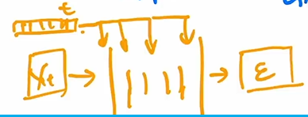

    预测正太分布其实都不需要学习方差，只学习均值就已经很好了，进一步降低了训练难度

  - Improved DDPM：继续学习方差发现效果不错；添加噪声的schedule从线性的schedule改成了余弦的schedule；Diffusion scale很好

  - Diffusion beats GAN：更大网络；新的归一化方式，adaptive group normalization，根据步数做自适应的归一化；使用classifier guidance的方法来引导模型采样和生成，加速反向生成过程

    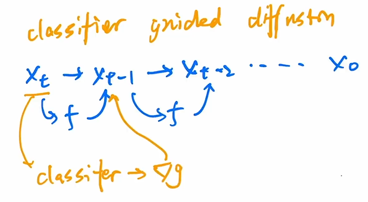

    在训练模型的时候加了一个分类器（简单的图像分类器，可以在ImageNet上预训练，但加了很多噪声），每次$x_t$都经过分类器算一个交叉熵然后算梯度再给$x_{t-1}$，目的是使其更接近某种物体，增加逼真度。

    其他guidance：除了使用简单的分类器做guidance，可以换成使用CLIP模型，另外可以在图像上做特征级别的引导、风格层面的引导，文本可以用LLM。这些引导都是下式中的 $y$

    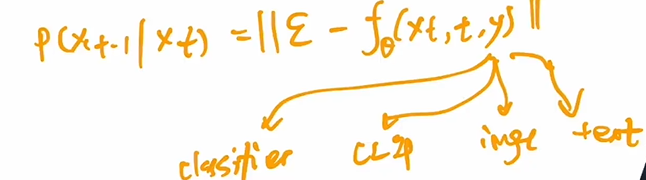

    缺陷是需要使用其他模型，要么自己训要么用预训练模型

    后续工作classifier free guidance（**GLIDE**，**DALLE2**）：假设我用text做guidance（下式中$y$），但是我随机去掉这个guidance（下式中为$\empty$），然后会有两个分布，我就可以得到一个方向，然后最后反向扩散的时候如果没有guidance也可以生成。但是这个方法很贵。

    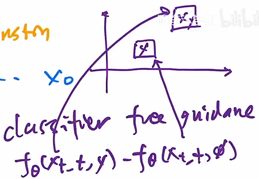

## 方法

- Decoder（图像特征到图像）：基于GLIDE，classifier guidance和classifier-free guidance都用到了

- Prior（文本特征到图像特征）：作者尝试了两种方法，自回归和扩散（两者都用到了classifier-free guidance，效果很好）。

  前者训练效率很低（输入是文本特征，有CLIP的图像特征做GT，然后就可以把图片遮住做自回归的预测）；

  后者在反向扩散的时候使用了Transformer的Decoder（因为输入输出都是Embedding所以直接Transformer，用UNet不太合适）。模型输入：文本、CLIP文本特征、步数Embedding、加过噪声的图像特征、Transformer自身的Embedding（例如CLS Token），而这个CLS Token就拿去预测没有加过噪声的CLIP图像特征。从DDPM开始大家都是预测噪声，但是本文发现预测图像特征在这个任务里效果更好

- DALLE2使用上述两阶段生成，但是ImageGen里用一个阶段且只用UNet效果也很好

- Scale Matters

## 局限性

- 不能很好地将物体和属性结合起来，例如方向位置等。可能是CLIP模型的问题，CLIP模型只看物体相似性，不了解方向等抽象概念

- 生成文字不对，可能是因为使用BPE编码导致，因为这是对词根词缀编码的
- 不能生成复杂场景，细节缺失比较严重