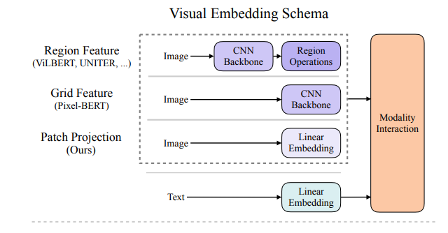
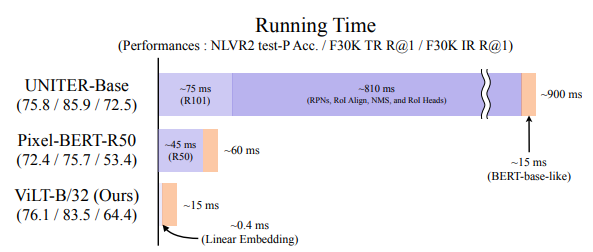
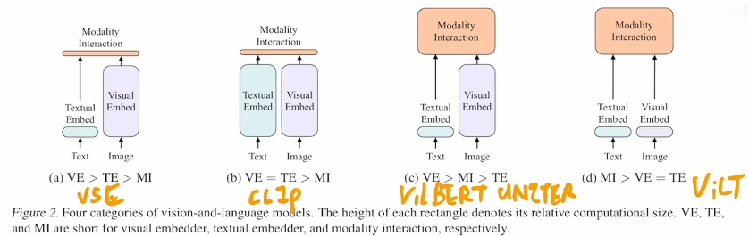
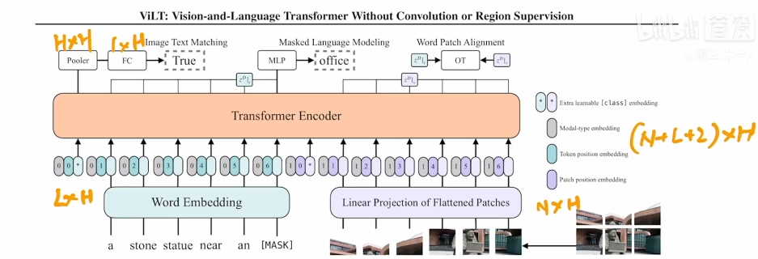

# ViLT

## 标题

- ViLT：Vision-and-Language Transformer Without Convolution or Region Supervision

- 将目标检测从多模态学习框架中去除

- 架构

  之前的模型一般都是文本处理比较简单直接将文本变成Embedding，然后直接和图片特征放到Transformer里做模态融合

  之前的工作Region Feature就像目标检测一样是抽取局部特征，先用CNN Backbone，然后再经过Region Operations获得很多框（使用目标检测的任务）

  

  之前的Region Feature在视觉这边占用时间极长

  

  ViLT的训练成本很贵且效果一般，但是运行时间非常快

- 标题中所以说without convolution and region supervision

## 摘要

- 之前的Vision-and-Language Pre-training（VLP），比较贵，效率低。甚至单模态的抽取时间比多模态的融合时间还长
- 目前目标检测数据集并不大
- 提出一个极简的Framework，直接让图片和文本一样直接都通过Linear Embedding

## 引言

- 预训练非常重要，出现了很多VLP模型，一般输入都是图像文本对，loss用的是图像文本match loss，并且使用BERT一样的掩码学习
- 语言只能用Transformer，但是图片不能直接丢到Transformer里因为太长了，需要提取更高的离散性的语义特征，ViT是分成patch，当时用的是预训练的目标检测器（图像变成bounding box，每个都是一个物体，有明确的语义信息，且离散，每个区域都相当于NLP中的一个word；另外当时的下游任务很多都和物体有很强的联系，例如VQA），一般是在Visual Genome上训练，这个数据集有1600个类400个属性，因为多模态希望图像能覆盖更多特征，能和文本匹配起来。目标检测非常贵
- pixel-BERT能够不用目标检测抽特征，直接用resnet的特征
- 作者认为上面的任务基本关注图像编码器的性能，而没有关注效率，推理开销很大
- 本文受启发于ViT，把图像打成patch，然后将patch变成linear embedding
- 模态融合的方法
  - single-stream：两种输入直接连接然后给模型
  - dual-stream：两种输入分别给一个模型然后在某个时候融合起来
- 本文三点贡献
  - 简单，推理速度快
  - 性能比较好
  - 使用数据增强，之前多模态学习用数据增强比较少，因为增强之后可能语义信息发生mismatch，作者发现数据增强还是比较好的

## 相关工作

- VLP模型分类

  - 

    上图VE表示视觉Embedding，TE是文本Embedding，MI是模态融合

  - CLIP适合抽特征，但是融合比较轻量就不太适合做下游任务，因为它的融合是不可学习的简单的点乘

  - 前两年主要研究的是方法c，模态融合也使用Transformer

  - 作者认为抽特征影响不大，模态融合比较重要

- 模态融合

  - single-stream：两个序列直接compact然后放到模型里
  - dual-stream：先各自通过模型然后在过程中融合
  - 作者认为第二种方法比较贵

- 语言特征抽取：一般都使用预训练的BERT

- 视觉特征抽取

  - 区域学习 Region Feature：Backbone抽特征（ResNet）+ RPN网络抽ROI，然后用NMS将ROI降低到固定数量 + RoI Head将bounding box变成一维向量

    > RPN网络是一种用于目标检测的神经网络，全称为Region Proposal Network。它是在Faster R-CNN模型中提出的一种新型网络结构，用于生成候选区域并对其进行分类，以提高目标检测的准确性和效率。RPN网络可以在一张图像中生成多个候选区域，每个区域都有可能包含目标物体，然后再通过后续的网络结构对这些候选区域进行分类和定位。RPN网络通常使用卷积神经网络（CNN）来提取特征，具有较高的计算效率和准确性。
    >
    > ROI（Region of Interest）在目标检测中是指感兴趣区域，即图像中可能包含目标的区域。在目标检测中，先通过一些预处理方法（如边缘检测、图像分割等）找到图像中的ROI，然后对这些ROI进行特征提取、分类等操作，以判断其中是否包含目标物体。ROI的准确性和有效性对目标检测的结果影响很大。

  - Grid Feature：比较贵且性能下降极大

  - Patch Projection：借鉴ViT，只使用patch

## 方法

- 模型结构：Transformer Encoder

  - 将图片和文本变成Embedding之后需要在前面加一些指示Flag，因为single-stream不能区分图像文本，所以需要在前面加0/1表示文本或图像；文本和图像最前面需要加CLS Token；另外需要加position embedding；注意这里三个Embedding是相加的而不是拼接

  

  - loss：Image Text Matching + Masked Language Modeling + Word Patch Alignment，最后一种用的人比较少，也是想算文本和图像特征相似度，利用Optimal Transport最优运输理论，简单理解是输出的文本特征和图像特征各有一个概率分布，作者计算了两个分布之间的距离。第二种loss就是BERT的完型填空

- Whole Word Masking

  - 之前用的是WordPiece Token，就是将一个word切成几份，如果中间mask掉一个的话，模型可以根据首尾几个字母直接猜出来，而不用去从图像中学，相当于一个Shortcut。所以直接将整个word去掉
  - 这个trick很有效

- 数据增强

  - RandAugment，但是不使用Color inversion和cutout

## 实验

- 预训练
  - 数据集：
    - MSCOCO：一个图片有5个Caption，标题比较长
    - VG：标题非常多，但比较短
    - GCC：一个图片一个标题，标题比较长
    - SBU：同上
  - 这四个数据集一般称作 4Million，因为这些图片相加数量大概是4M
  - 前两个图片在数据集里，后两个放的是URL导致很多图片失效了
- 结论：取舍比较好

## 结论和未来工作

- 未来工作
  - scalability
  - 图像完型填空，MAE非常有前途
  - 数据增强很有用
- 当你不知道做什么可以读最近的Future Work，主要担心手速