# CLIP串讲

## 总览

## 回顾

- 文本经过Encoder得到文本特征，图像经过Encoder得到图像特征，然后进行文本图像对的对比学习
- 做分类任务的时候：将类别通过prompt template通过文本编码器形成很多query，然后图像通过图像编码器得到一个图像特征，然后相当于依次问query，得到图像特征和文本特征之间的相似度

## 分割

- 分割和分类很像，相当于像素级别上的分类。Paperwithcode上分割论文最多，因为分类任务都能直接在分割上用

- **L**anguage-Driven Semantic **Seg**mentation

  - 架构：和CLIP非常像。图像特征变成了dense feature密集特征，然后做点积做融合

    图像Encoder使用的是DPT，相当于ViT+Decoder，将原图降维一些。不看上面的文本信息其实和分割模型是一样的。

    说是zero-shot但是是有监督的学习，不是对比学习（无监督学习）的loss

    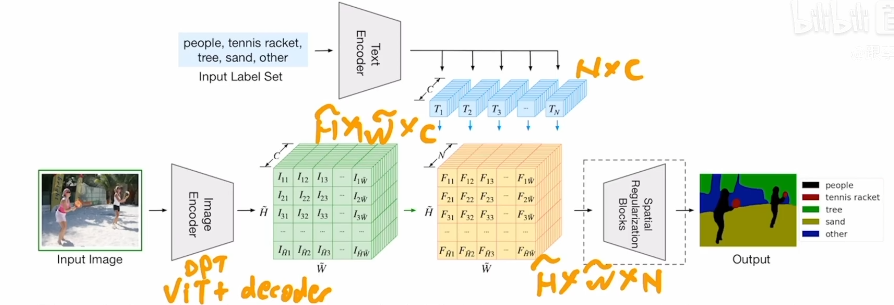

  - 训练：文本编码器就是用的CLIP，并且由于分割数据集小，所以freeze了整个文本编码器。图像编码器使用CLIP反而不行，用ViT更好，很难解释

  - Zero-Shot的效果比之前用ResNet的OneShot的效果差很多，提升空间很大

  - CLIP其实关注算图像和文本之间的相似性，所以如果把上面的标签other换成一些抽象的虚词也可以替代原来的other的效果，并不是真正的分类

- Group ViT: Semantic Segmantation Emerges from Text Supervision

  - 上面的工作还依赖于手工标注，如何做到无监督训练是更被关注的

  - 架构

    之前做无监督分割的时候经常用一种方法叫Grouping，如果有一些聚类中心点，然后从这个点开始发散，然后逐步扩充成一个Group，自下而上的方法，这个Group就相当于一个segmentation mask

    作者在ViT的框架中加上Grouping Block以及可学习的Group Tokens，在浅层的分割效果一般，但到上层效果就很好了

    一开始Group Tokens维度是64表示一开始有64个聚类中心（替代了之前一个CLS，因为之前想用一个Token来代表整个图片），384是ViT模型特征长度

    经过6个Transformer Layers之后然后进入Group Block，Group Block的作用是将图像特征进行一次Assign，相当于将图像特征cluster到一个聚类中心去，所以得到64个Segmentation Token

    

    具体的Group Block如下：类似自注意力。聚类中心的分配是不可导的（？），所以这里用一个gumbel softmax将此过程转变为可导的

    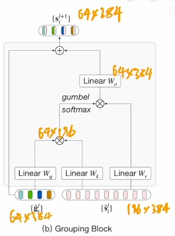

    之后再加新的Group Tokens，来进一步减少聚类中心，最后得到8个聚类中心

    loss使用CLIP的对比学习，文本直接得到文本特征，图像最后8个特征经过平均池化加MLP得到图像特征

  - zero-shot推理：就是图像有8个特征，然后文本一个特征算相似性，最大的局限是最多只有8类

    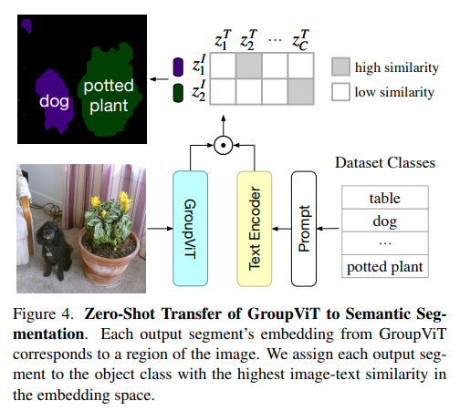

  - 背景类：设置前景的阈值，如果所有的Embedding都小于阈值则将其分给背景类。导致的问题就是如果图像内类别很多置信度就不够高。作者发现Group ViT分割做的很好，但是语义分割不太好，可能是因为CLIP只能学到物体语义信息非常明确的物体

## 目标检测

- Open-Vocabulary Object Detection Via **Vi**sion and **L**anguage Knowledge **D**istillation

  - CLIP当老师蒸馏网络，open-vocabulary就是任意类别

  - 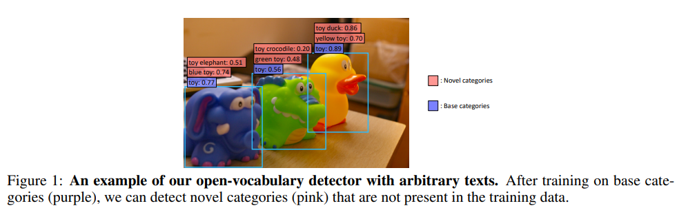

  - 方法

    - 架构对比：

    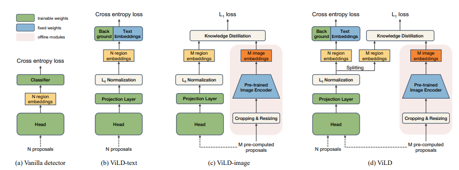

    - Baseline：相当于MaskRCNN，两阶段的分类器，第一个阶段会得到Region Proposal（第一阶段略了，最底下就是Proposal），然后通过Detection Head得到分类头，然后通过Classifier得到Bounding Box是什么类。一般分成两类，怎么定位（Bounding Box画的准不准）以及怎么分类（Bounding Box内物体判断准不准）。在基础类上做有监督的训练

      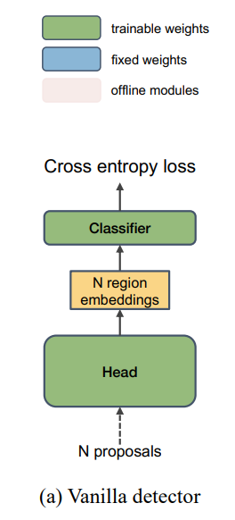

      > 目标检测中的proposal是指对输入图像中可能包含目标的区域进行预测和筛选，生成一组候选框，即候选区域。这些候选区域通常是在输入图像中的各个位置和尺度上生成的，可以包含目标或不包含目标。目标检测算法会在这些候选框中寻找目标，并进行分类和定位。生成proposal的方法有很多种，常见的包括滑动窗口、选择性搜索、快速RCNN中的候选框网络等。

    - ViLD-text：和CLIP一样，提取图像特征和文本特征，然后点乘算相似度。在基础类上有监督的训练，文本来自物体的类别，所以只是将两种特征进行关联，zero-shot能力较弱。由于是只用基础类，不在基础类的物体直接设为back ground

      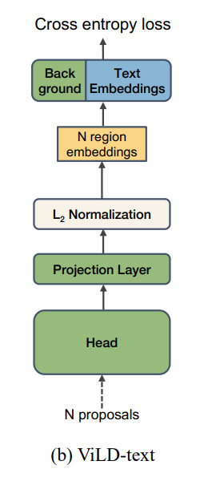

    - ViLD-image：知识蒸馏，将输入的Proposals通过CLIP得到图像特征，然后另一只学习Region Embedding尽可能和CLIP得到的文本特征相近。大大加强了open-vacabulary能力，但是注意输入是M个pre-computed proposals而不是n，但是CLIP使用的ViT-Large做前向过程非常贵，所以就预抽取特征

      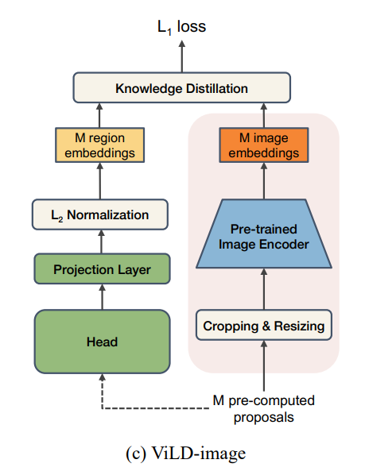

    - ViLD：测试的时候是不会用到右边一支的

      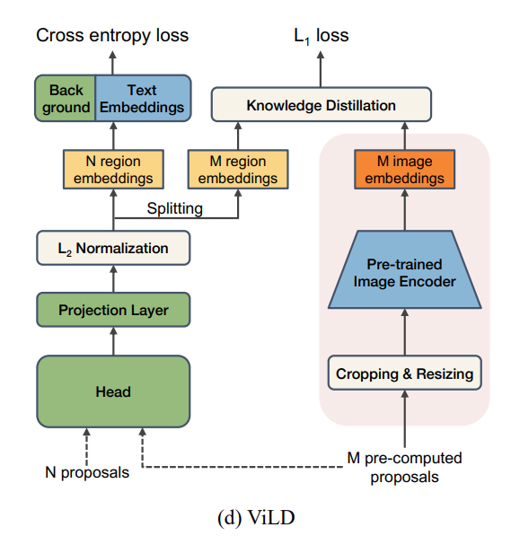

  - 模型总览图

    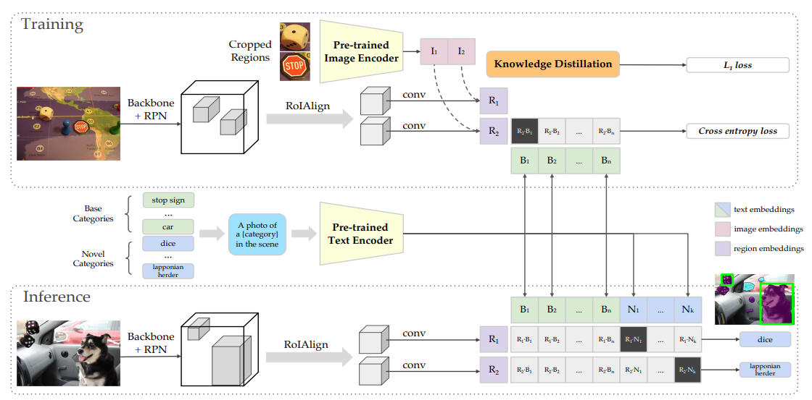

- GLIP

  - 标题：Grounded Language-Image Pre-training

  - 作者找到一类任务是Vision Grounding，将一句话中的物体在图片中找到，和目标检测类似，但是多一个文本信息，作者发现可以把Detection和Phrase Grounding**任务融合**起来从而获得了**更大的数据集**，另外可以使用伪标签等技术可以在没有标注过的图像文本对上生成Bounding Box标签从而扩大数据集数量

  - 背景：Vision Grouding任务和目标检测的任务的联系，目标检测的loss是分类loss+定位loss，Vision Grounding的定位loss是一样，但是分类loss不一样。目标检测的标签是一个或两个词，是one-hot标签，而Vision Grounding是句子

    目标检测的分类Loss：$O$是图片每个Bounding Box的特征 $N\times d$，$W$是分类器矩阵，得到$S$是logits，最后算一个Loss

    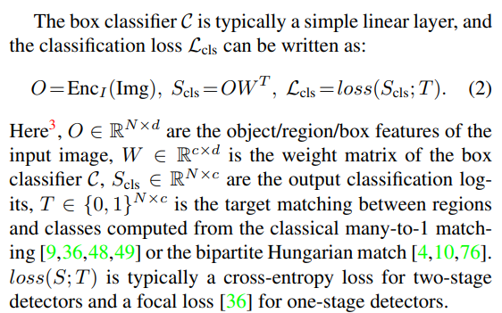

    Vision Grounding的分类Loss：计算图片区域和句子中的word匹配分数$S_{ground}$

    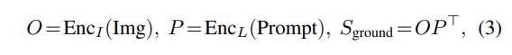

    Img通过Encoder得到Region Embedding，Prompt通过Encoder得到文本Embedding，然后算相似度。这块和ViLD-text一样

    接下来的任务就是如何将这两个任务统一起来，只要做一个小小改动即上面时候算是positive match，什么时候是negative match

    作者发现GLIP可以迁移到任何一个目标检测的数据集上，接下来就是看如何扩大数据集

  - 作者既使用Detection数据集又使用Grounding数据集做预训练。Detection用的是Object365，在Object365上做预训练然后在COCO上做微调一般都会非常好；Grounding用的是GoldG，有Bounding Box Annotation。作者还想要更大的数据集，于是引入unlabeled的Cap24M（图像文本对），但是需要知道Bounding Box和Box内物体的信息，所以作者使用伪标签，直接使用小模型（GLIP-T(C)）给这些图像文本对做推理打标签（Self-Training）。伪标签一般效果会更好

    > Bounding Box Annotation是指在图像或视频中对目标物体进行框选标记的过程，通常用于目标检测、物体识别、跟踪等计算机视觉任务中。这种标记通常用矩形框或正方形框来表示目标的位置和大小。在深度学习中，Bounding Box Annotation是训练物体检测和识别模型的重要步骤之一。对于每个目标，需要标注出其在图像中的位置、大小和类别等信息，以便模型能够从图像中正确地识别和定位目标。

  - 总体框架

    下图Matrix里是监督学习，我知道每个Bounding Box对应的文本，所以可以算相似度的Alignment Loss，另外有Ground Truth可以做Localization Loss。

    Deep Fusion阶段本来是获得了两种Embedding就直接算相似度矩阵，但是这里多加一些层数来使其进行融合，本文使用Cross Attention。这种Deep Fusion可以用到分割中，比如GroupViT有两个分支可以做EarlyFusion

    检测和分割都属于稠密预测，很多方法可以互相借鉴

    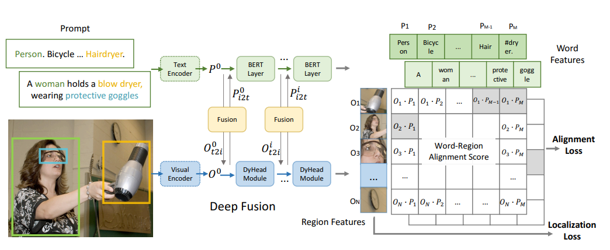

- GLIP v2: Unifying Localization and VL Understanding

  - 融合更多的任务和更多的数据集，将所有带定位（分割检测）和Vision-Language的任务都融合起来（VQA、Vision Grounding、Vision Caption）

  - 架构：统一框架，融合更多文本任务、数据集、模态

    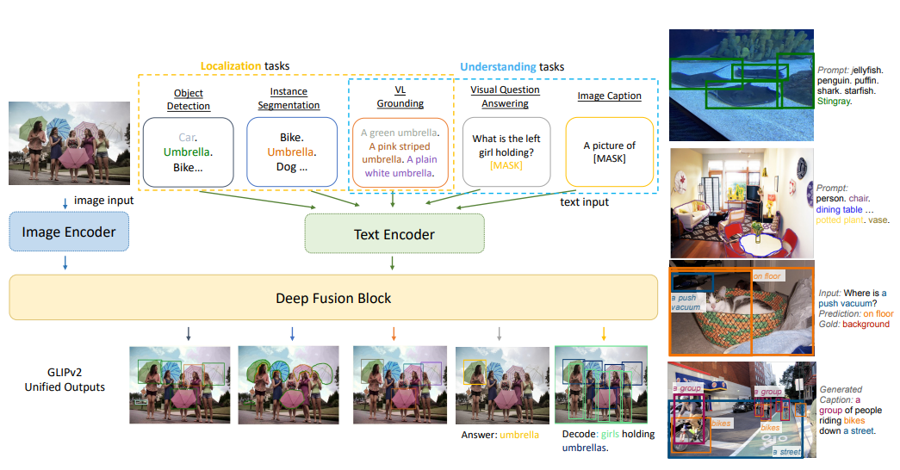

## 图像速写

- CLIPasson: Semantically-Aware Object Sketching（SIGGRAPH）

  - CLIP+毕加索，保持语义信息的物体速写

  - 之前的工作就是data-driven，抽象程度由数据集控制，数据集有如下：

    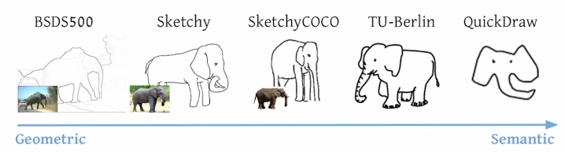

    但里面最大的数据集也就是QuickDraw，只有300多类

  - CLIP对物体的语义信息抓取的特别好，同时zero-shot能力很强，文献中提到CLIP抽取的特征特别稳健，不光在自然图像上，于是作者认为可以运用到简笔画上

    > CLIP is exceptional at encoding the semantic meaning of visual depictions, regardless of their style
    >
    > https://distill.pub/2021/multimodal-neurons

  - 本文可以根据笔画的多少来决定抽象的程度

  - 架构

    每张图是由Sketch组成的（$S_i$表示Sketch），每个Sketch是一条贝塞尔曲线，每条曲线由4个点决定

    本文主要的贡献是最初的初始化以及最后的训练，中间的光栅化器是之前的工作。主要思想也是利用CLIP特征的稳健性来进行知识蒸馏，作者认为风格改变不会影响前后两张图的语义信息，所以我需要将这两个特征尽可能接近，所以设计了第一个loss函数 $L_s$ 即 基于语义的特征；另外还需要几何上的一些限制即 $L_g$，用ResNet50前几层的图像做几何上的Loss，因为前面的特征图还有长宽概念，所以可以来做几何上的限制，而后面的特征已经只剩下语义特征了。

    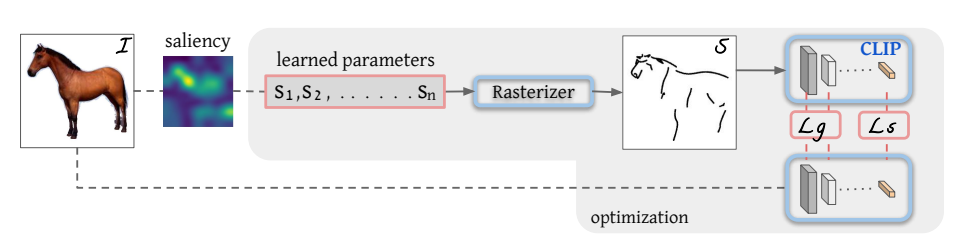

  - 作者发现初始化非常重要，所以作者提出基于saliency的初始化方式，使用ViT最后一层多头自注意力取一个加权平均得到saliency map然后看哪些区域更显著，在这些显著的区域行采点。其实就是已经知道物体的边界，在沿着边界画点了

  - 作者还加了一个后处理，每次生成3张简笔画，然后根据$L_g / L_s$然后返回最好的画

  - 局限性

    - 图像有背景就比较难做，可能是因为自注意力图上取点比较难，作者的方法是使用U2Net先抠图
    - 生成是一下子生成的，但是人画图是序列画出的，可以做成自回归
    - 控制笔画数需要提前指定，但是不同图片需要的抽象程度是不一样的

## 视频

- CLIP4Clip: An Empirical Study of CLIP for End to End Video Clip Retrieval

  - 任务是Video Text Retrieval，CLIP天生适合Retrieve / Ranking / Matching 相关任务，因为CLIP就是算Video和Text的相似性

  - 双塔结构

    图像和文本编码器分开，得到特征之后做点乘得到相似度，扩展性比较好，可以提前将大的数据集的特征先抽取好

    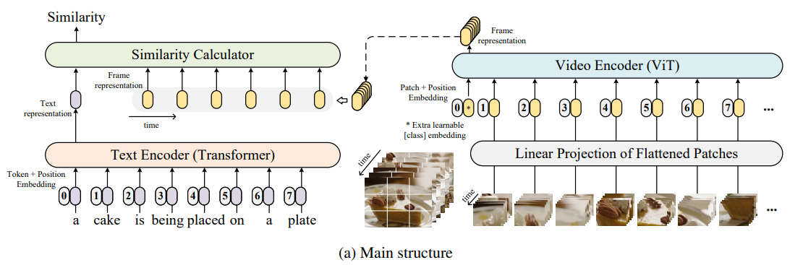

    文本直接放到Transformer得到一个CLS Token，图像多帧依次放入得到多个CLS Token。原来是一个文本特征对应一个图像特征直接做点乘计算相似度，现在是一文本特征对应十个图像特征，本文是empirical study，所以就尝试了各种方法来看哪个效果最好

    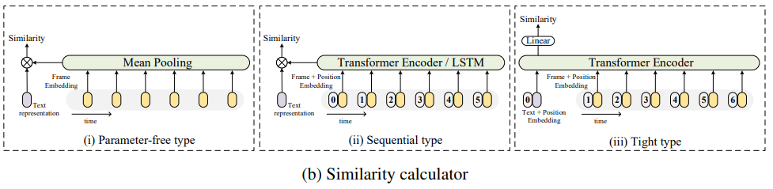

    - 平均池化（作者称为Parameter Free）：简单，但是没有考虑时序信息，例如做下和站起取平均是一样的，接受度最高

    - LSTM 或 Transformer+Positional Embedding

    - Early Fusion（作者称为Tight Type），之前的方法是Late Fusion即抽完特征考虑如何融合，这里是一开始就融合，直接用同一个Transformer

      > 机器学习中的Video Text Retrieval（视频文本检索）任务是指在视频中检索与文本查询相关的视频片段。具体来说，给定一个查询文本，该任务的目标是找到与该文本相关的视频片段。这些视频片段可以是包含查询文本中的关键词的视频，或者与查询文本语义相似的视频。该任务在视频内容分析、视频搜索和视频推荐等领域具有广泛的应用。
      >
      > 在机器学习和信息检索中，Recall（召回率）是指在所有相关文档中，被正确检索出来的文档数与所有相关文档总数之比。换句话说，召回率表示了检索系统能够找到多少与查询相关的文档。
      >
      > 公式表示为：
      >
      > Recall = TP / (TP + FN)
      >
      > 其中，TP表示真正例（被正确检索出来的相关文档数），FN表示假反例（未被检索出来的相关文档数）。
      >
      > 召回率越高，说明检索系统能够找到更多的相关文档，但同时可能会将一些不相关的文档也检索出来。因此，召回率与准确率（Precision）一起被用来评估检索系统的性能。

  - 实验

    - CLIP提点非常多，迁移能力很强
    - 少量数据集取平均是最好的，数据量大的时候用后面的方法比较好一些，数据量不大的时候不建议微调。平均其实工作挺好的
    - Tight Type最差，可能是下游数据集不够多

  - Insight

    - CLIP预训练之后再在数据数据集上post-pretrain一下可能迁移效果更好，但是计算代价比较高
    - 3D Linear Projection效果稍微好一些，融合了时序信息
    - 无监督训练好的模型参数做下游FineTune的时候会对学习率非常敏感（就像MoCo一样），各个模型能否成功很看学习率的设置

- ActionCLIP: A New Paradigm for Video Action Recognition

  - 视频领域更火的任务：动作识别，其实就是分类任务但是加上额外的时序信息

  - 之前的方法：

    视频通过Video Encoder得到输出，然后和Ground Truth做对比，然后就可以算起loss，但是问题是视频理解的标签不好标，one-hot label比较难代表其全部语义，动作识别的label是一个短语，label space很大，导致遇到新类效果不好。所以最理想是先学一个很好的特征，然后zero-shot或者few-shot去做下游任务是最理想的

    作者提出的方法和CLIP很像，VideoEncoder和CLIP4Clip很像；在batch比较大的时候同一行同一列里可能有多个正样本对

    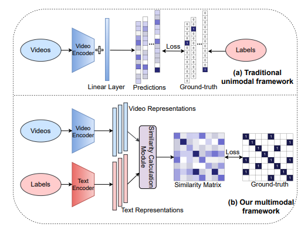

  - 模型

    - 文本Prompt见(b)，就是前缀、完型填空和后缀，和之前的prompt engineering一样
    - 视觉Prompt
      - (c) Pre-network Prompt：输入的时候加上时序信息
      - (d) In-network Prompt：利用Shift概念，在特征图上做各种移动，和Swin的Shift Window类似，增加TSM（temporal shift module），TSM主打zero cost
      - (e/f/g) Post-network Prompt：和CLIP4Clip一样，如何将视频多个特征融合成一个特征

    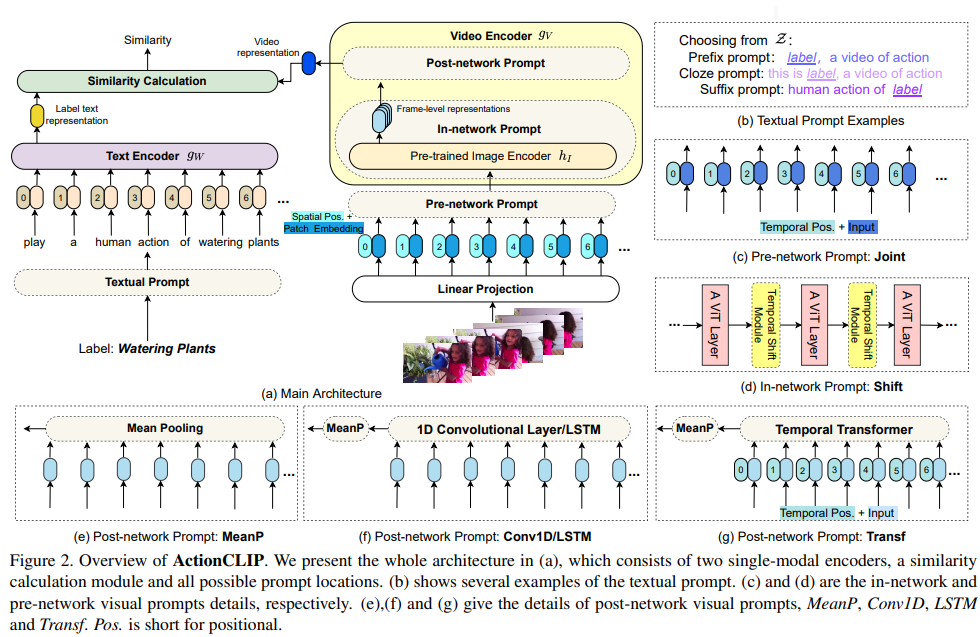

  - 实验

    - pre-train：发现文本随机初始化和CLIP初始化效果相近，所以大家都更关注图像（一般用ViT初始化，用BERT初始化效果就不太好）
    - prompt
      - 文本：效果不显著
      - 图像：有用的就是Post-network，和CLIP4Clip不同，mean pooling效果一般，原因可能是视频数据集非常大，用Transformer来做FineTune效果会更好

## Vision-and-Language

- How Much Can CLIP Benefit Vision-and-Language Tasks?
  - CLIP本身是多模态，一般大家都是放到别的领域去尝试，但是本文是用CLIP做多模态初始化看效果
  - 这也是Empirical Study，用CLIP作为视觉编码器的初始化做各种Fine-Tune看效果

## Audio

- AudioCLIP: Extending CLIP to Image, Text and Audio

  - 架构：仿照CLIP做对比学习，加入Audio模态

    

## 3D

- PointCLIP: Point Cloud Understanding by CLIP

  - CLIP学习到了很好的2D特征，作者想迁移到3D

  - 架构：将3D点云投影到2D深度图，由于CLIP支持各种风格，所以这种深度图也能支持。文本prompt改成了point clound depth map of

    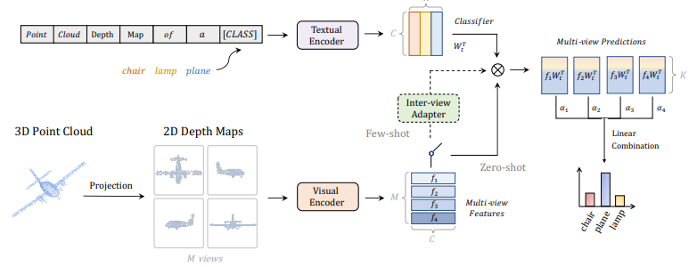

## 其他

- Can Language Understand Depth?

  - 深度估计任务

  - CLIP对概念理解不太好，因为对比学习不适合学概念，而深度信息就是概念。所以之前做optical flow和depth estimation和主流CV不太一样，往往不做初始化

  - 流程图

    作者将深度估计任务从回归问题看成分类问题，强制将深度分成了几类，和LSeg很像

    

    > 回归问题和分类问题是机器学习中两种不同的问题类型。
    >
    > 回归问题是指预测连续值的问题，例如房价预测、股票价格预测等。回归问题的目标是预测一个数值，通常是一个实数值。
    >
    > 分类问题是指将数据分为不同的类别的问题，例如垃圾邮件分类、图像分类等。分类问题的目标是将每个数据点分为一个或多个已知的类别中的一个。
    >
    > 回归问题和分类问题的区别在于它们的输出类型不同。回归问题的输出是一个连续值，而分类问题的输出是一个或多个离散的类别。此外，回归问题通常涉及到连续的输入变量，而分类问题通常涉及到离散的输入变量。

## 总结

CLIP的使用场景：

- 改动最小，只适用CLIP抽取的特征，加强之前的训练
- CLIP做teacher来蒸馏
- 不使用CLIP参数，借鉴它多模态对比学习的思想，然后我定义正负样本