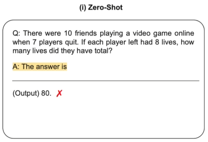
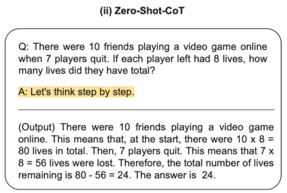
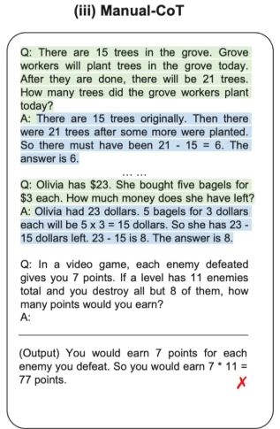
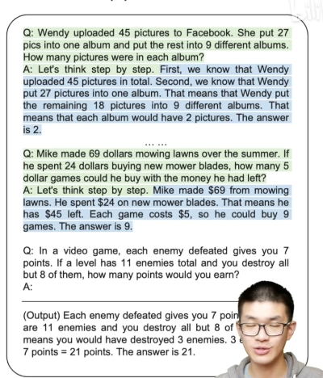

# ChainOfThought

## 标题

- Chain of Thought Prompting Elicits Reasoning in Large Language Models
- 科研梗：Let's think step by step，在Prompt中加上这一点就能涨点

## 背景知识

- Prompt类型

  - Zero-Shot

    

  - Zero-Shot-CoT

    

  - Manual-CoT：手动构造样例

    

  - Auto-CoT：Self-Training，先用Let's think step by step得到样例输入然后拼接在一起作为样例，然后接输入

    

## 引言

- System-1任务：LLM在分类任务上效果很好，这类很快完成并被人类理解的任务是System-1任务
- System-2任务：涉及逻辑数学和常识的推理任务，LLM很难完成。flat scaling curves：System-2任务不随参数量的增加而性能增强