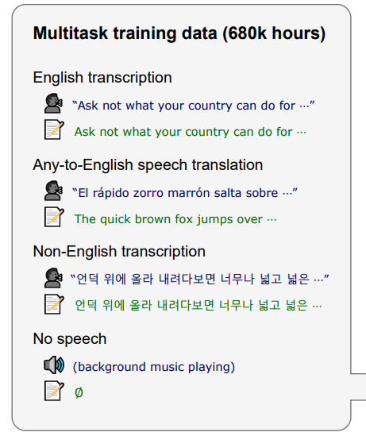
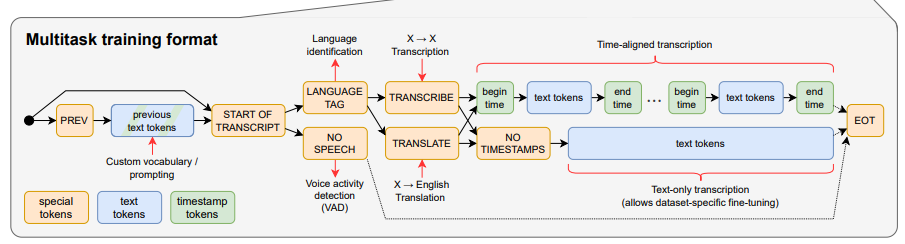
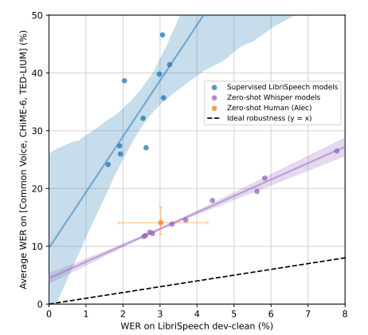

# Whisper

## 标题

- Robust Speech Recognition via Large-Scale Weak Supervision
- 弱监督：有标号但是质量一般
- 省流：OpenAI使用大量数据大量任务训练出来的大模型，zero-shot
- 训练材料68万小时

## 引言

- Wave2Vec使用对比学习，采样大量没有标号的wave之后使用例如挖空等方法做预训练Encoder，然后抽取特征在下游任务上做微调
- 作者认为之前的工作使用无监督学习，没有好的解码器，需要做微调，但是微调很花时间同时容易过拟合泛化性不好。所以作者认为编码器已经够好，但是解码器不够好（从wave格式转文字等）
- 目前的有监督训练集加起来大概5000小时，但是无监督训练集接近100万小时
- 作者提出一个训练集68万小时，多语言且有很多翻译

## 方法

- 数据处理

  - 使用过滤器去除机器生成的label；
  - 使用其他语音识别软件来判断语音和文本的语言是否一致（如果文本是英语就不判断音频的语言，因为有翻译任务）；
  - 文本去重
  - 先训练一个模型然后去推理，检查正确率低的样本发现很多语音和文本是对不上的，就把这些去掉

- 架构：就是Transformer，一开始使用卷积来抽取局部特征

  

- 这个大模型覆盖了多任务，但是会有缺陷，例如有些任务不希望推理成本过大、某个任务性能不好通过训练加强是否会影响其他任务性能。具体多任务包括：

  

  不同任务用的是不同token来区别，共用输出层：

  

## 实验

- zero-shot，为了符合某些数据集test的要求，手动做了一些normalize

- 比较：虽然是LibriSpeech上的WER别的模型已经刷到非常低了，但是迁移到别的数据集错误率非常高，而Whisper的迁移能力很强

  

- 发现对于中文、韩语、阿拉伯语，虽然数据比较多，但是效果没有那么好