# 多模块学习

## 背景

- 多模态的结构应该偏向c，但是Visual Encoder应该使用ViT去掉之前的目标检测，另外ViT之前使用WPA（Word Patch Alignment，启发于目标检测） Loss训练比较困难，可以换用MLM Loss（Masked Language Modeling）以及ITM Loss（Image Text Match），CLIP使用的是ITC（Image Text Contrastive对比学习），我们可以都用上这三种Loss

  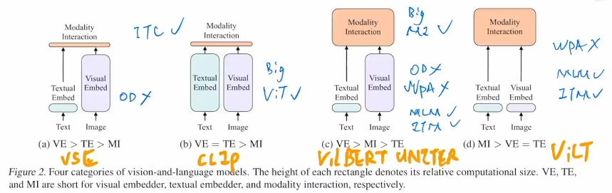

## Encoder架构

- ALBEF

  - 标题：Align before Fuse: Vision and Language Representation Learning with Momentum Distillation

  - 架构：

    图像使用12层Transformer编码器，文本把12层的BERT切成两个部分先6层Encoder然后6层多模态融合，符合：图像Encoder大于文本Encoder；模态融合模型要大

    Loss用的也是上面提到的 MLM / ITM / ITC

    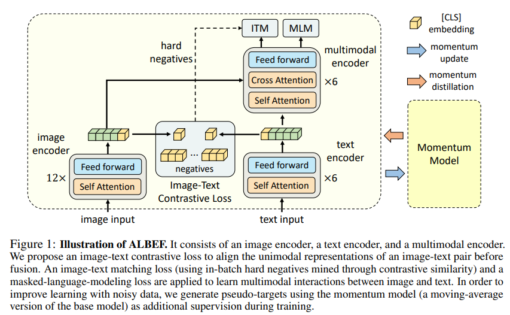

  - 摘要：

    - 作者对目标检测的态度和ViLT不太一样，后者觉得是推理成本大，而本文认为使用预训练的目标检测器直接抽特征，会和文本特征不够align，没有进行end-to-end的训练导致多模态编码器不好学。所以作者提出在Fusion（多模态编码器）之前就先用ITC对比学习进行Align（其实就是CLIP）
    - 数据从noisy网络上下载的（文本是AltText，搜索引擎上的文本对图像的描述能力不高，这就是noisy web data问题），为了提高学习，作者提出了momentum distillation，自训练，就是用伪标签，作者使用Momentum Model（回顾MoCo）生成伪标签
    - ALBEF比较亲民，适合做多模态

  - 方法：

    - 图片用的是就是ViT，而文本这边本来可以直接用BERT然后再在后面加个大的多模态Encoder，但是为了保持最优配比，即图像部分模型和多模态模型要大，所以这边就把BERT劈成两半，初始化用的就是BERT

    - 另外有一个Momentum Model，它的参数是旧的ALBEF参数，动量更新，moving average设的很高0.995使之不会很快更新，从而使得产生的特征更加稳定

    - Align阶段：抽完特征之后和MoCo一模一样，先downsample和normalization，然后将正负样本对比进行第一阶段的学习

      

    - 最后ITM其实就是二分类任务，在ALBEF后面加个FC来检查输入文本$T$和输入图像$I$是否是一对，但是这个任务难度很低，负样本和正样本的区别很大（可能经过ITC），很快就能让准确度提很高，所以这里给负样本加constraint，其实就是选择最接近正样本的负样本，选择的方法是选择同一个batch里在ITC中相似度最高的negative（称之hard negative，即已经非常相似我仍然认为其是negative）

    - MLM：完型填空，将文本masked之后变成$T'$，所以会发现该模型要做两次前向过程。多模态学习往往要做多种Loss所以可能要做多次前向过程来得到不同的Loss

      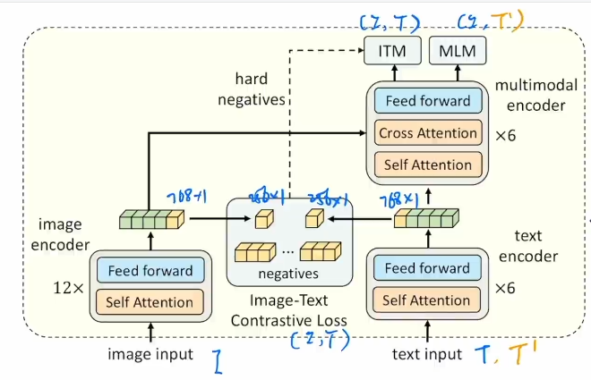

    - 动量蒸馏：原因是noisy data，文本中描述的不在图像里，图像的物体没有在文本中，导致ITC中negative可能也描述了文本内容（甚至描述的比Ground Truth都好，但是我们依旧认为它是negative），另外MLM完型填空的时候其实可以填很多单词。所以作者认为one-hot label（即一张图一个label）对ITC和MLM不好，作者另外使用一个Momentum Model来得到一些伪标签（非one-hot label，就是Softmax出来的softmax score）。这个Momentum Model是对目前的模型做EMA

      由于伪标签是Softmax Score，所以算的是KL散度，例如 ITC 的更新：

      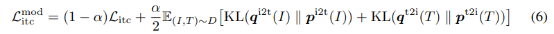

      ITM 没有使用动量更新，是因为 ITM 是二分类任务，就是需要知道Ground Truth

  - 实验：测试了五个下游任务，检索（图搜文、文搜图、图搜图、文搜文、看Recall，有R1 R5 R10）、视觉蕴涵Visual Entailment（前后两句话之间的关系，蕴涵矛盾中立，三分类问题）、视觉问答Visual Question Answering（有两种，闭集VQA即选答案，开集VQA即生成答案，用的是闭集VQA）、Visual Reasoning（一个文本能否同时描述一对图片，二分类任务）、Visual Grounding

    - 消融实验：ITC提升巨大，Hard Negative都有提升（Hard Negative在对比学习中很有效），Momentum Model一般（但是研究noisy data中提取特征是有趣的方向）
    - 图文检索数据集Flickr30K和MSCOCO已经都刷爆了，需要新的数据集，更大或者annotated更好的数据集，或者的视频文本检索数据集

- VLMo: Unified Vision-Language Pre-training with Mixture-of-Modality-Experts

  - 研究动机1：目前主流有两种结构

    - 像CLIP和ALIGN的双塔结构（文本和图像分开，只在上面做个简单的cosine算相似度融合）开销低适合大规模图像文本检索，但是交互比较弱，不适合做难的场景
    - Fusion就上面的ALBEF，检索等开销非常大
    - 所以作者希望能够融合这两种架构的优点，所以使用不同的FC产生vision expert / language expert / multi-modality expert
  - MOE结构（mixture of experts）
  
- 研究动机2：使用的目标函数也是上面三种，需要大量数据，但是当时多模态的数据不多，所以作者使用stagewise pre-training strategy，因为单模态的数据非常多，所以就让vision expert和language expert分别在各自数据集上训练，之后再在多模态上做训练，效果就很好
  
- 架构：
  
  每个Block和Transformer Block很像，之是最后用不同的FFN（Feed-forward Network），三个不同的FFN是不share weights，但是自注意力层是share weights（说明自注意力不挑输入形式，适合多模态学习）
  
  ITC就是CLIP，ITM是Fusion Encoder形式
  
  好处就是灵活
  
  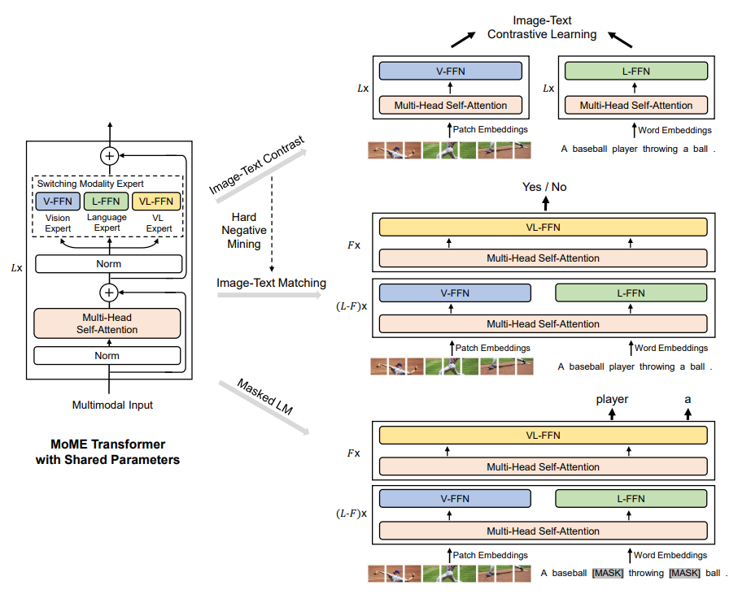
  
    > 
    > FFN和FC和MLP都是神经网络的类型，但它们有一些不同之处。
    >
    > FFN（Feedforward Neural Network）是一种前向传播神经网络，其输入只能从输入层到输出层流动，没有反馈路径。常见的FFN包括单层感知机和多层感知机。
    >
    > FC（Fully Connected）是一种全连接层，也称为密集层。在FC层中，每个输入神经元都连接到每个输出神经元，因此它可以学习输入和输出之间的复杂非线性映射。
    >
    > MLP（Multilayer Perceptron）是一种多层感知机，是由多个FC层和激活函数组成的神经网络。它可以用于分类和回归问题，并且可以处理非线性关系。
    >
  > 因此，可以说FFN和FC是MLP的组成部分，MLP包含了多个FC层和激活函数，而FFN是一种特殊的MLP，只包含一个输入层、一个输出层和若干个隐藏层。
  
- 分阶段预训练：
  
  Vision Pre-training使用自己的BEiT（Masked Image Modeling），Language Pre-training用的是Masked Language Modeling，最后VL Pretraining用的是上面提到的三个函数
  
  注意哪些是frozen的：一开始全部打开很正常，Language训练阶段注意自注意力层被frozen了直接用 Image 上训练的自注意力层（反过来不行，这个可以探索），最后就都打开了
  
  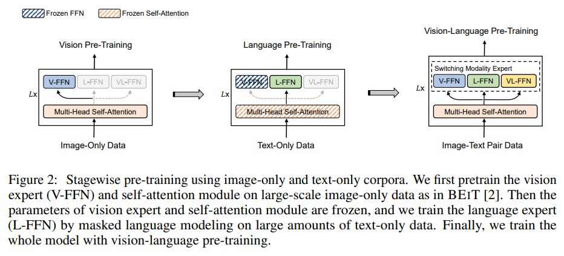
  
- 未来：
  
  BeiT——VLMo——VL-BeiT——BeiT v2——BeiT v3
  
  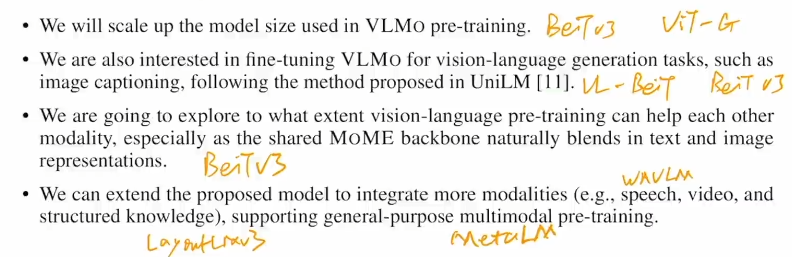

## Encoder+Decoder架构

- BLIP：Bootstrapping Language-Image Pre-training for Unified Vision-Language Understanding and Generation

  - 关键词：Bootstrap和Unified。Bootstrap表示从noisy data中训练一个模型然后通过一些方法得到更干净的数据，然后用更干净的数据train出更好的模型；Unified表示应用在多种任务上，包括Understanding任务（Retrieval / VQA / VR / VE）和Generation（Image Captioning生成字幕）生成式任务

  - 研究动机

    - 模型：之前的Encoder模型不能运用到生成任务中，而Encoder-Decoder不能做Image-text Retrieval的任务，这个动机和VLMo是一样的

    - 数据：通过数据集变大可以提高效果，但是在Noisy的数据集上预训练还是不好的（suboptimal，不是最优解），作者提出两个模块 caption 生成字幕，Filter删除不匹配的图像文本对

      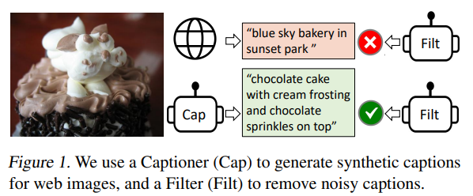

  - 背景：之前的ALBEF和VLMo，后者更加简单

    

  - 架构

    图像就是一个ViT，文本使用三个模型。不看文本的第三个，其实就是个ALBEF，只是文本Encoder更大且可以共享参数（借鉴VLMo）而不是劈开成两个；生成模型就是第三个文本模型，但是文本不能直接看全部，因为就是要生成这种文本（任务是像GPT一样的LM，不是MLM完形填空），所以使用causal self-attention因果自注意力层，使用相同参数会导致性能下降，因为这是在做不同任务

    prompt在最前面加上了`CLS / Encode / Decode`

    

  - Captioner-Filter

    网络下载的文本$T_w$质量差，而手工标注的$T_h$质量较好

    Filter就是将ITC和ITM部分的模型拿过来然后在COCO手工数据集上做Finetune作为Filter，进行数据清洗

    Captioner：作者发现Decoder能力很强，所以就在COCO上做微调然后变成Captioner，然后生成一些图像文本对

    生成Caption很有效

    

  - 实验：

    - Captioner更能让模型受益，因为大模型更需要数据

  - 应用：

    - Stable Diffusion生成Pokeman，有图但没label，用BLIP生成效果很好

    - LAION COCO数据集：从LAION 4B中取英语然后用一个BLIP两个CLIP做Cap-Filter得到COCO 600M。先用BLIP生成40个Caption，然后CLIP选最好的5个然后再用更大的CLIP选最好的。

      CLIP做Ranking / Retrieval 效果都挺好

      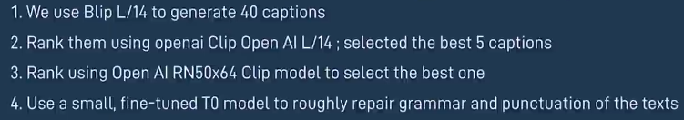

- CoCa: Contrastive Captioners are Image-Text Foundation Models

  - 看标题就知道使用了两种Loss：Contrastive Loss和Captioning Loss

  - 架构：

    和ALBEF很像，但是文本使用的是Decoder

    图像这一支用的是attentional pooling，是可学习的

    文本最后使用captioning loss，所以一开始的self-attention都是casual的（就是masked self-attention）。作者没有使用ITM Loss，是因为之前的工作要Forward很多次，训练时间过长，这里为了只Forward一次，所以输入的文本都是masked。由于模型在几十亿的数据上训练所以怎么masked都可以

    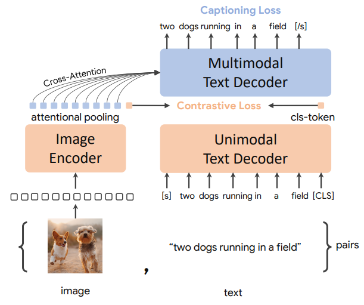

    > Casual self-attention layer是一种神经网络层，用于处理序列数据，例如自然语言文本。它是自我注意力机制的一种形式，允许模型在处理序列时关注先前的位置，但不允许模型查看未来的位置。这使得模型可以在处理序列时更好地捕捉上下文信息，同时避免了信息泄漏问题。Casual self-attention layer通常用于Transformer模型中，是其核心组件之一。

  - 效果

    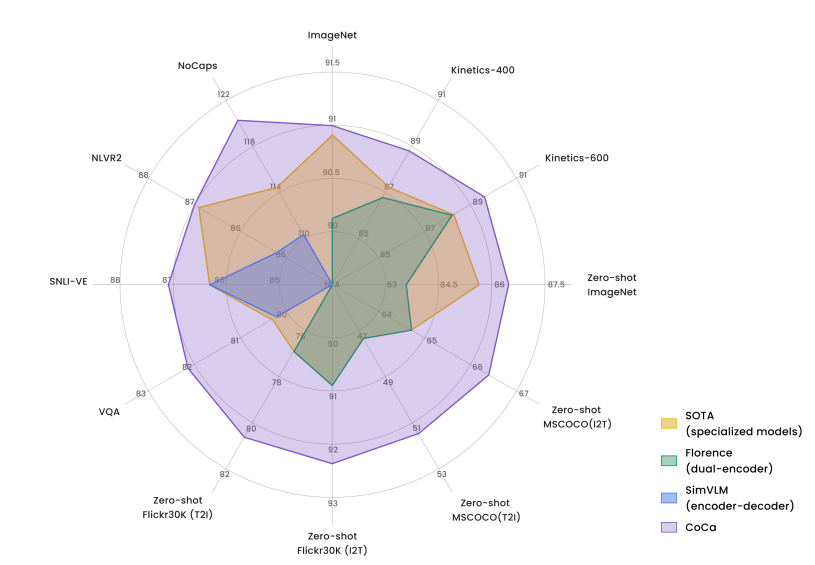

- BeiTv3

  - 标题：Image as a Foreign Language: BEiT Pretraining for All Vision and Vision-Language Tasks

  - 多边形图：超越CoCa

  - Public Dataset，只用一个Loss。所以不是更多Loss做Regularization就更好，需要看各种Loss是否有弥补性，另外就是当模型变大的时候是否需要其他的Loss函数，另外数据量也不是越多越好，CoCa的数据量是几十倍于BeiTv3的，所以数据质量很重要

  - 引言（做多模态必读）：Language / Vision / Multimodal 都出现Big Convergence趋势，大模型成为Foundation Model。讨论目前的多模态模型架构，作者认为目前的架构仍然需要根据下游任务做调整，所以作者希望能够进一步实现大一统。作者将图像看做一种foreign language，称为Imglish

  - 架构：就是VLMo，完型填空

    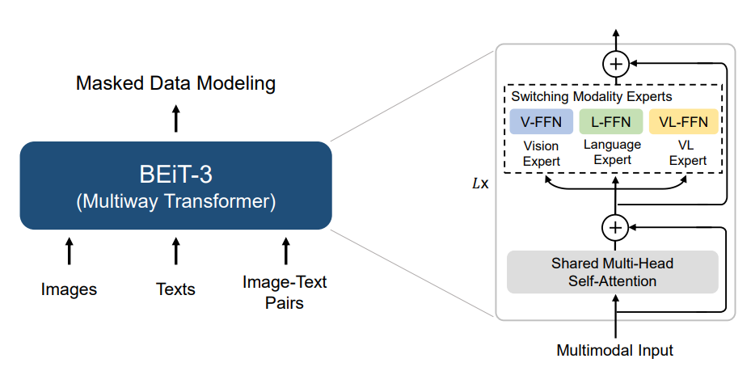

    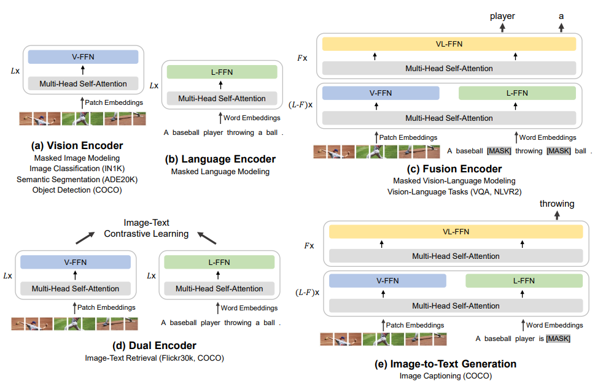

## 总结

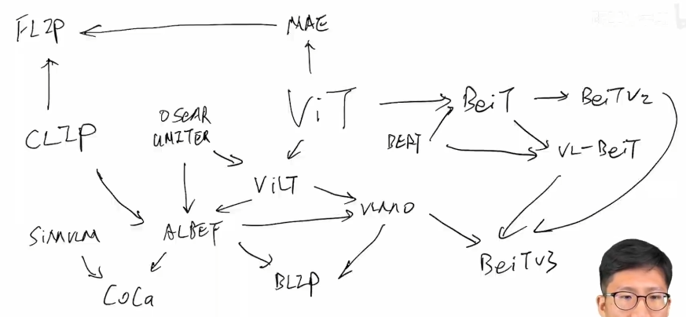

目前有两种模型想做更General的框架：

- Language Interface: MetaLM / PaLi，全部转成Text Generation的任务
- Generalist Model：通才模型，不根据下游任务加分类头等。Unified-IO / Uniperceiver / Uniperceiver-MOE / Uniperceiver v2
