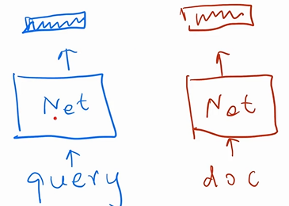
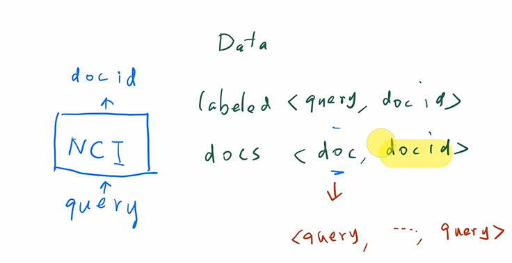
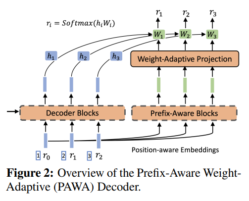
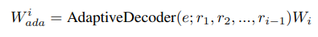
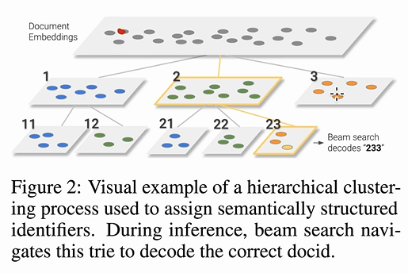

# Neural Corpus Indexer

## 标题

- A Neural Corpus Indexer for Document Retrieval （NCI）
- 该文将测试集和训练集有点搞混，导致结果偏高。自己的工作如果效果很好，需要先质疑，有可能发生数据泄漏等问题
- 另外有人质疑抄袭 DSI

## 摘要

- 目前文档检索的算法是基于索引的系统，索引就是每个文档做一个Hash或者是Embedding，但是很难做优化
- 我们用端到端的深度学习来统一训练和检索，来提高召回率
- seq2seq网络，生成相关文档的id

## 引言

- retrieval：找到query相关的所有的文档；ranking：给一个更加精确的分数。ranking阶段常常会用深度学习来预测query和文档的相关性，但是这比较贵，所以retrieval阶段需要比较高的召回

- 文档检索有两种方法：

  - term-based：倒排索引，高效但是语义搜索能力不强

  - semantic-based：query和document映射成一个向量，往往使用two-tower模型。然后搜索的时候用近似的K近邻算法，不适合exact match

    

## 算法

- 架构：

  

  

  用了个trick，除了Transformer本来的Decoder，这里另外加了AdaptiveDecoder

  

- 生成docid用的是 hierachical k-means，首先先做聚类，如果该类的数量过多就再做聚类。由于使用seq2seq，所以预测的时候先预测2然后再预测3然后再预测3

  