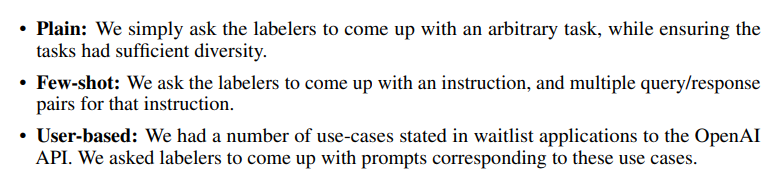
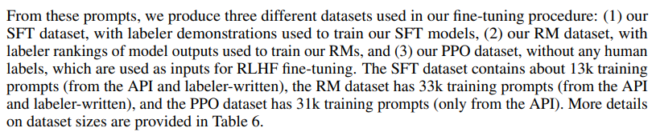
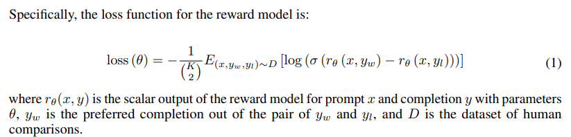
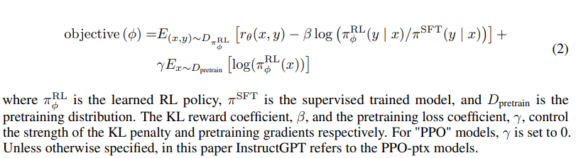
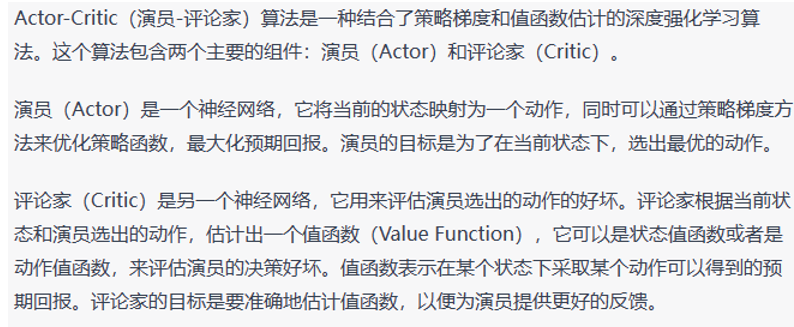
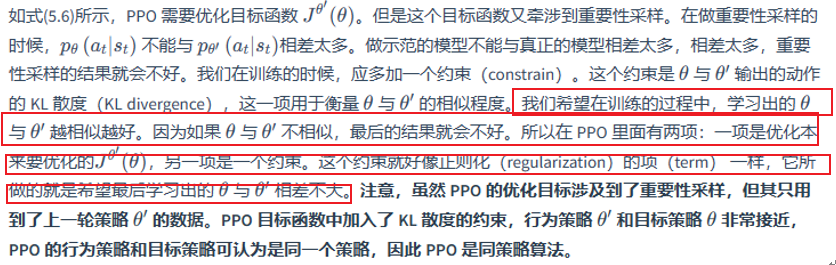

# InstructGPT

## 标题

- Training language models to follow instructions with human feedback
- 本文展示如何让语言模型和人类的意图之间做align对齐

## 摘要

- 主要工作：做两个数据集，一个是用问题和答案来训练模型，另一个是排序数据集做强化学习，结果发现InstructGPT参数量是GPT3的1%但效果更好

## 引言

- GPT的目标函数是预测下一个词，但是人类希望的是正确且安全地输出，所以作者认为语言模型的目标函数没有align

- 作者使用RLHF，原因可能是OpenAI是做强化学习出家的

- 方法

  - 第一阶段：**SFT**，Supervised FineTune，标注一些对话

  - 第二阶段：类似伪标签，让GPT生成多种输出让用户来选 Beam Search，人类进行答案排序，称为 **RM** 奖励模型

    > Beam Search是一种搜索算法，用于在图形或树形结构中寻找最佳解决方案。它是一种贪心算法，每次扩展搜索树时只保留一定数量的最优解，而不是全部扩展。这个数量称为Beam Width或Beam Size，通常设置为一个较小的常数。
    >
    > Beam Search的基本思想是在搜索过程中维护一个集合，该集合包含最有可能的解。这个集合会随着搜索的进行而不断扩大，但是集合中的解的数量不会超过Beam Width。每次扩展搜索树时，会考虑所有可能的扩展，然后选择一些最有可能的解作为下一步的搜索。这些解会被添加到集合中，并且根据它们的得分进行排序。然后，集合中的解就是下一步搜索的候选解。这个过程会一直重复，直到找到一个满足条件的解。
    >
    > Beam Search的优点是它能够在短时间内找到一个较好的解决方案，而不需要搜索整个解空间。缺点是它可能会陷入局部最优解，因为它只保留了一部分解。

  - 第三阶段：用一个新的prompt生成output给reward model计算reward，然后提高分数

  

## 方法

- 数据集

  - 首先用人标主的信息实现一个InstructGPT，标准包括：

    

    然后放到Playground里，然后收集用户的问题，然后再，过滤掉个人信息，并且训练的时候不使用同一个人文的很多问题（最多200个）

  - 三个dataset：SFT / RM / PPO，第三个数据集没有human label

    

- 模型

  - SFT：FineTune GPT3，用人工标注的数据，因为只有13K，所以只用了16epoch，但是发现只扫一边就过拟合了，但是这是为了初始化后面的模型，所以过拟合也没太大问题

  - RM：

    目的是训练另一个模型，拟合人对于prompt+reponse的评价（排序）

    使用6B的模型，从SFT开始去掉最后的Unbedding层（可能就是去除Softmax层，然后直接用线性层投影成一个值，将这个标量输出看作是reward），输入是prompt及其response。作者发现大模型不稳定，所以使用小的模型

    输入是排序而不是一个值，所以需要把顺序变成值，使用Pairwise Ranking Loss，简单的想法就是如果一个response比另一个的排序更高就让它的reward和另一个差更远。这里排序答案数量$K=9$，因为发现排序读题的时间更长，当$K$越大，得到的排序关系就越多；同时下式中$r_{\theta}$最贵，但是只用做$K$次RM，所以$K$越大省更多时间

    

  - RL：PPO是之前OpenAI的工作，就是在下面的目标函数上做梯度下降

    

    在强化学习中，模型称为Policy。我们要学习$\pi_{\phi}^{RL}$，初始化成$\pi^{SFT}$，$E_{(x,y)}$中的$(x,y)$就是第三个PPO数据集里的prompt $x$ 及其reponse $y$（$y$是用当前模型 $\pi_{\phi}^{RL}$ 算出来的），当模型数据更新之后，$y$是会改变的（即环境发生变化）。然后将$(x,y)$丢到RM模型里来算reward分数，我们希望让这个分数最大。

    RM模型其实相当于做一个AI判分，替代了人工判分，本来RLHF阶段应该是$x$通过模型得到$y$然后停下人工排序然后给分数，再更新模型，这里RM模型直接跳过人工排序步骤（在线）。如果人能直接标出$y$那就变成了有监督，可以放到SFT阶段

    但是$r_{\theta}$是基于$\pi^{SFT}$的，当$\pi^{RL}$在训练的时候会让输出$y$分布变化，使得$r$的分数估算逐渐变得不准，所以第一个中括号中的第二项使得新模型和之前的模型不要跑太远，其实就是KL散度，看两个模型输入同一个$x$输出$y$的概率值的KL散度（这个就是PPO思想）。最后一项是不光注重RLHF、防止遗忘之前的训练参数、多偏向原始数据，其实就是原始的GPT3的目标函数，加上最后一项称为PPO-ptx
    
    > 
    >
    > 
    >
    > https://datawhalechina.github.io/easy-rl/#/chapter5/chapter5
    
    
    
    
    
    