# Transformer

## Abstract

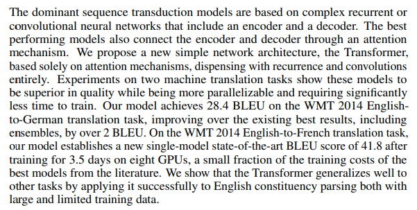

- sequence transduction序列转录模型，seq2seq，一段序列生成另一端序列，一般是用encoder加decoder
- 本文只适用attention，而不使用CNN和RNN

## Conclusion

- 我们只使用了attention
- 代码一般是直接放在摘要里的，本文是tensor2tensor

## Introduction

- RNN难以并行。时序长的前面的信息可能会丢失

  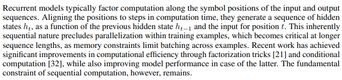

- 纯用attention并行度高

## Relation Work

- CNN只能看到序列中的一小部分，而attention能够看到所有的序列。卷积好的地方在于可以做多个输出通道，每个输出通道认为是识别一种特定的模式，本文提出多头的注意力机制
- 自注意力机制很重要，但并不是本文第一次提出

## Model Architecture

- 首先介绍Encoder和Decoder。编码器是整个句子拿到，而解码器是自回归的，一个词一个词的生成

  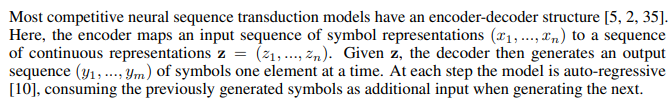

- 架构图：

  左边是编码器右边是解码器，解码器之前的输出作为当前的输入（所以这里最下面写的是output）

  Nx表示由N个Block构成，每个block里面有一个多头注意力层+前馈神经网络（基本是MLP）并使用ResNet。

  > MLP（Multilayer Perceptron，多层感知器）是一种基本的前馈神经网络，由多个全连接层组成。在每个全连接层中，每个神经元都与前一层的所有神经元相连，通过学习权重和偏置，实现对输入数据的非线性映射。
  >
  > MLP通常用于解决分类和回归问题，可以处理非线性数据，具有很强的适应能力和泛化能力。在训练过程中，MLP通过反向传播算法来更新权重和偏置，使得模型可以逐渐逼近真实数据的分布。
  >
  > MLP的网络结构通常包括输入层、隐藏层和输出层。输入层接收原始数据，并将其传递给第一个隐藏层；每个隐藏层通过学习非线性映射，将输入转换为更高层次的特征表示，并将其传递给下一个隐藏层或输出层；输出层根据不同的任务，可以采用不同的激活函数，如sigmoid、softmax等，将特征转换为输出结果。
  >
  > MLP在深度学习中具有重要的地位，是其他深度学习算法的基础。它可以通过堆叠多个隐藏层来构建深层神经网络，从而实现更强大的特征提取和学习能力。同时，MLP还可以与其他深度学习技术相结合，如卷积神经网络和循环神经网络等，构建更加复杂的神经网络模型。

  解码器中多了Masked Multi-head Attention

  与传统的Encoder-Decoder的架构的区别是Block的架构以及中间从Encoder到Decoder的输入。

  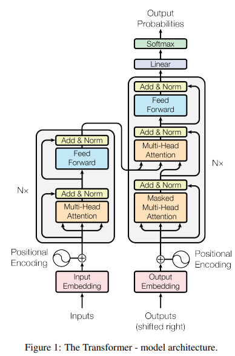

- Encoder：为了残差的方便，所有的维度都是512，没有做维度的减小或者增加。参数很少，就层数N和维度d。

  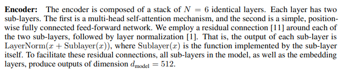

  - LayerNorm与BatchNorm，在变长的情况（文本不是统一长度）不使用BatchNorm

    对于BatchNorm，在train的时候，一般是取小批量里的均值和方差，在预测的时候用的是全局的均值和方差。[什么是批标准化 (Batch Normalization) - 知乎 (zhihu.com)](https://zhuanlan.zhihu.com/p/24810318)。二维情况（每个样本对应一个feature）在下图中BatchNorm是下图左边，LayerNorm的下图右边。

    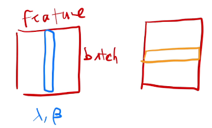

    三维情况（batch由样本组成，每个样本是seq长度的向量，每个词由一个feature向量来描述，feature长度是d，transformer中是512），蓝色是BatchNorm，黄色是LayerNorm。

    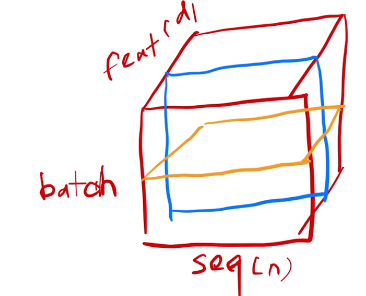

    句子长度是不同的，对于BatchNorm有很多零，导致均值方差抖动大，并且不一定能适合于长句子

    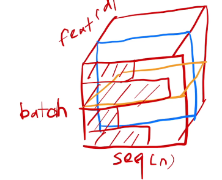

    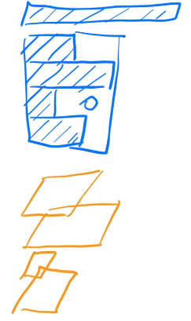

- 解码器：其中的masked multi-head attention，输入的时候在$t$时间不会看到$t$时间之后的输入（注意力机制中是可以看到完整输入的，所以要加masked）

  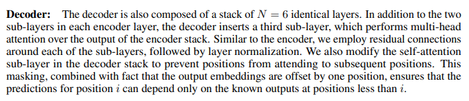

- Attention：注意力函数是从一个query和一系列键值对映射到output的函数，这些query、键值对都是向量，output是对values的加权求和，这些权重可以由query和对应key的关系计算出来（compatibility function相似函数），不同注意力机制有不同的计算方法

  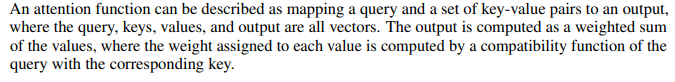

  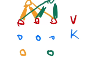

  上面黄色和绿色表示query，和蓝色越接近，对应的权重就越大

- Scaled Dot-Product Attention 最简单的注意力函数

  将query和key的内积作为相似度（cos），如果为0说明正交。第二段是矩阵运算来加速的方法

  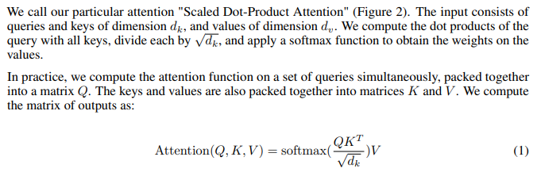

  query的数量可能有$n$个，key-value的数量是$m$个，但是query和key的长度都是$d_k$。最后结果每一行都是一个结果

  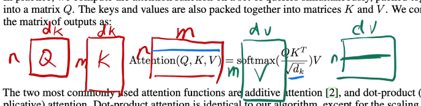

  其他人使用的注意力机制：additive attention（处理query和key不等长的情况）和dot-product attention（和本文相同，除了本文除了$\sqrt{d_k}$）

  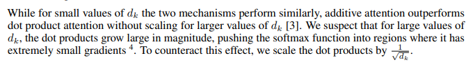

  除以这个数的原因是：当$d_k$比较大的时候，算出来的加权value值差距较大，经过softmax有些值变成1有些值变成0，所以要除

  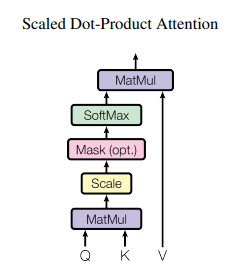

  上图masked表示对于$t$时间的query $q_t$，应该只看$k_1,k_2,\dots,k_{t-1}$。这里的解决方法是：将$k_t,\dots$换成非常大的负数，使得通过softmax都是0

- Multi-head Attention：将VKQ先投影到低维$h$次做内积然后再连接起来升维。原因：Scaled Dot-Product没有能学的参数（additive attention里有可以学的参数）

  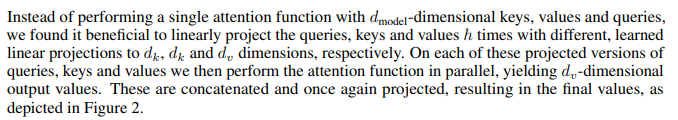

  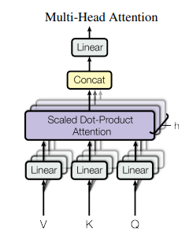

  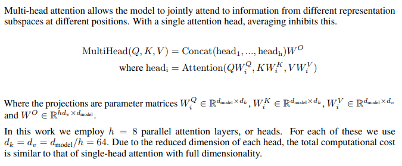

  Transformer输入输出维度一直是512，这里$h$用的是8，所以这里就让投影之后为64维，之后拼起来变成512维

  实现的时候可以一个矩阵乘法实现

- 注意力的application

  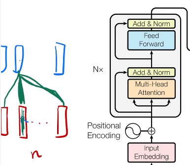

  第一个**自**注意力层：输入$n$个（句子中词的数量）长为$d$（每个词的feature）的向量。自注意力表示输入同时作为query和key和value。假设不考虑多头，那么会得到$n$个长为$d$的结果，每个结果都是所有value的加权和，而这个权重里，最大的就是自己和自己的权重

  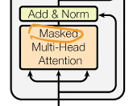

  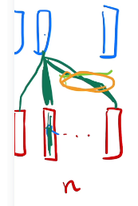

  第二个自注意力层：和上面基本一致，除了masked，所以上图中黄色画的线都要置成0

  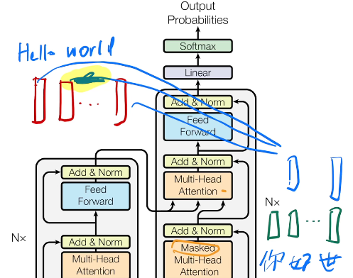

  第三个注意力层：key和value（$n$个长为$d$）来自Encoder，query（$m$个长为$d$）来自Decoder。例如Encoder中Hello和World分别对应一个长为$d$的向量即value，那么结果一定是这些value的加权求和，而这权重就是Decoder中query和对应key的相似度，例如“你”可能和"Hello"比较接近则权重更大。

- Feed-Forward Network

  就是MLP。特点是“applied to each position separately and identically”。下面$x$是512的向量，$W_1$将其投影到2048，$W_2$将其投影回到512，即单隐藏层的MLP。

  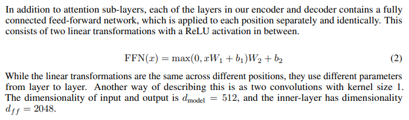

- 再看架构图

  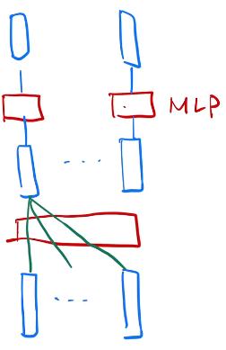

  下面的红色是attention层，上面是对每个position做MLP（尽管画了多个方块，但是每个position的MLP是相同的）。attention的作用是aggregate汇聚我所有感兴趣的信息，即完成了序列信息的汇聚，所以可以分开MLP

  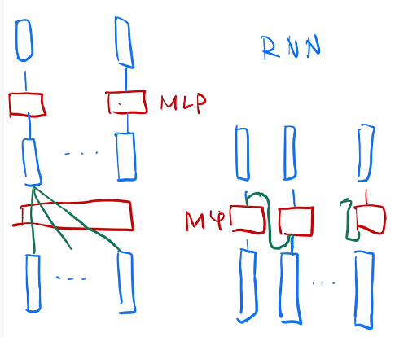

  右边其实和RNN很像，但是用的是attention抽取的序列信息。

- Embeddings and Softmax：编码input和output token，将其映射到$d$维。最后乘一个$\sqrt{d}$，因为维度大了之后，一旦正则，权重值小，所以需要乘以一个数。另外需要加Positional Encoding而这个东西不会因为Norm而变小所以两者需要在相近的scale上，所以乘了这个数

  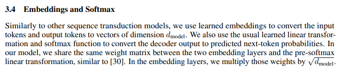

- Positional Encoding

  attention没有**时**序信息，句子打乱之后值不会变，这有问题。所以这里将位置1,2,3,4,5...加到句子里面。

  公式：

  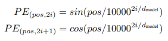

  使用上面的公式编码数字，然后加到Embedding之后的向量里。由于是使用sin和cos，这个位置编码是在-1到1之间的，所以上面的embedding要乘一个常数使其大致在-1到1之间

## Why Self-Attention

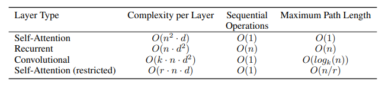

- 第一组是计算复杂度
- 第二列是顺序计算，越少并行度越高
- 第三列是信息从一个数据点到另一个数据点要走多远，越小越好。任何一个query可以和key直接做运算，path很短

## Training

- 学习率基本不调，使用的是Adam
- 使用大量的dropout
- label smooth：softmax的置信度设置成0.1，即达到0.1就算是正确