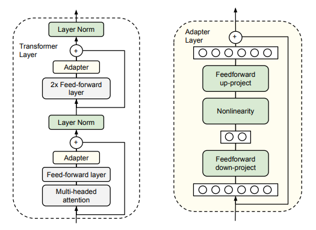
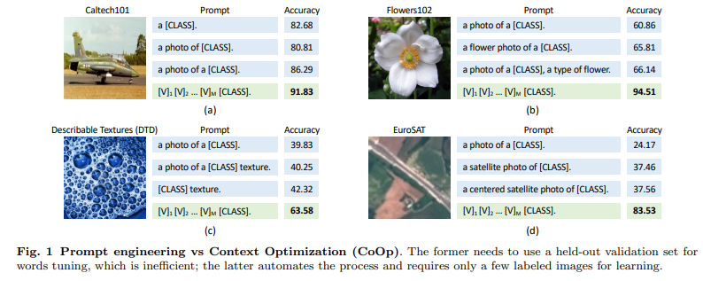
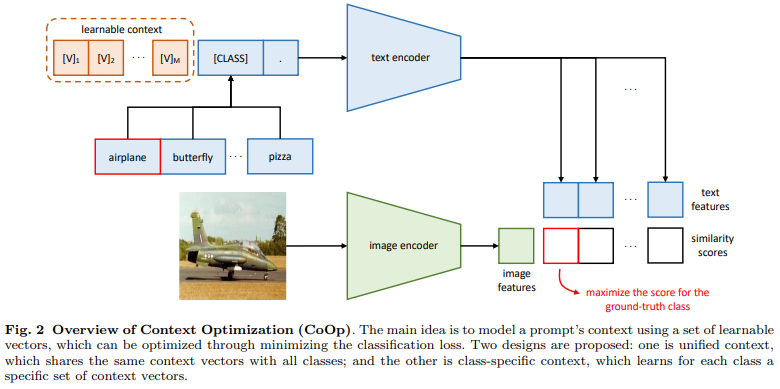
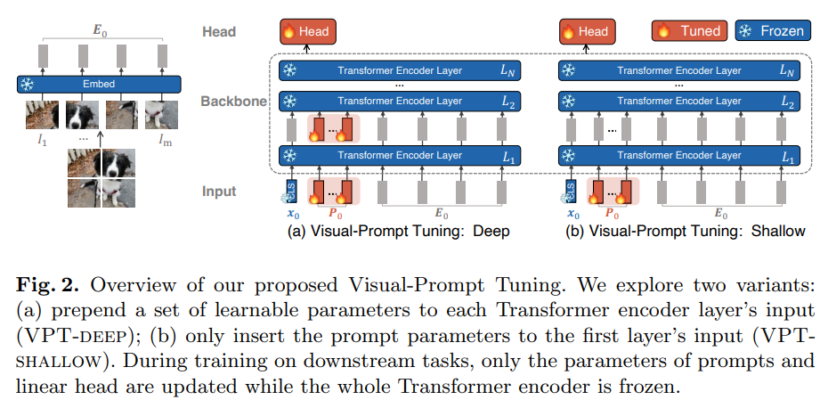
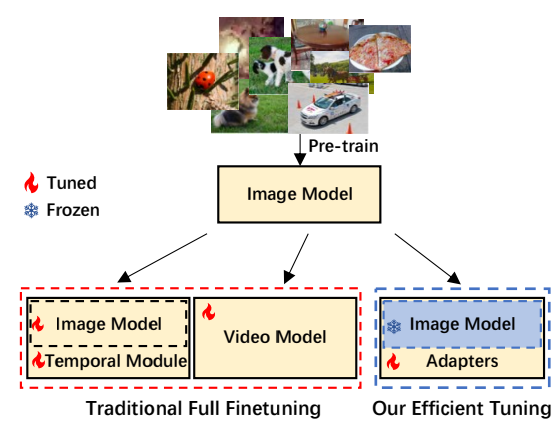
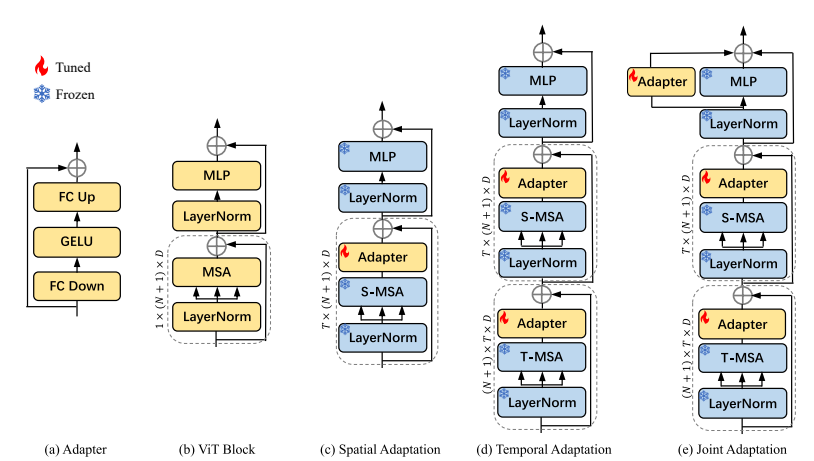
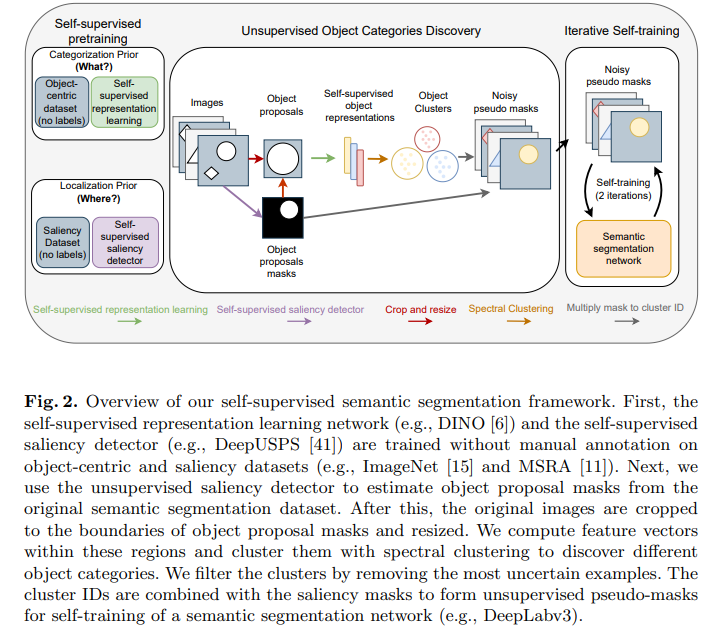

# 大模型时代的科研

## 方向

- Efficient
  - PEFT：parameter efficient fine tuning，做大模型的微调
- Exising stuff (pretained model) & new directions
  - 例如使用CLIP做各种应用
- Plug-and-play
  - 即插即用的模块，例如新的目标函数、新的loss和数据增强的方法，在能承受的baseline上做公平对比说明有效性
- Dataset, evaluation and survey

## Efficient

- Parameter-Efficient Transfer Learning for NLP

  - Adapter就是一个下采样的FC层+非线性层+上采样的FC层，在模型微调的过程是不会动Transformer Block中的其他模块的参数

    

  - Lora就使用了PFET方法

  - 相关论文：Towards A Unified View of Parameter-Efficient Transfer Learning

- 文本Prompt相关技术

  - 论文：CoOp（Context Optimization）

  - 标题：Learning to Prompt for Vision-Language Models

  - 

    CLIP的分类任务的推理，就是用各种标签（Prompt）和图片算相似度，这种Prompt可以修改格式，从而大幅影响模型的准确率

    人工写死的Prompt是hard prompt，而本文提出soft prompt可学习的prompt，就是一个learnable vector。将模型参数锁住，然后学习这个learnable vector

  - 架构：和CLIP不同的是text的输入是一个可学习的向量

    

- 视觉Prompt相关技术

  - 论文：VPT（Visual-Prompt Tuning）

  - 标题：Visual-Prompt Tuning

  - 架构

    - VPT Shallow，和文本端很像，在输入端加一个learnable prompt且加在原来的patch embedding之前，然后锁住整个模型只学习这两个prompt
    - VPT deep，每一层都使用prompt

    

- AIM: Adapting Image Models for Efficient Video Action Recognition

  - 视频动作识别

  - 之前有两种方法：首先我们都要有一个预训练的Image模型（2D）

    - 时空分开做（2D），在已有的Image模型（2D）上加时序处理模块，例如TSN将视频分成多段然后将视频抽取的特征做加权平均，TimesFormer先做TimeAttention再做SpatialAttention
    - 时空一起做

    - 时空一起做（3D），使用3D网络（输入是3D的，模型也是3D的），例如 I3D 等

  - 这两种方法成本都比较大，需要在视频数据上做FineTune，但视频数据集很大，数据 IO 有Bottleneck，导致训练时间极长，这些还已经是在预训练模型上FineTune，其他train from scratch的就更耗费时间了

    

  - 作者认为强大的图像模型抽取的视频特征已经很强了，同时下游任务数据集不够强可能会导致模型过拟合或灾难性遗忘，所以就打算直接锁住Image Model，然后在上面加Adapters

    本文提出三种Adaptation：

    - Spatial Adaptation：在Self-Attention后面加Adapter，不添加时序理解的能力，只是想把图像特征迁移到视频特征，尽量解决Domain Gap问题，发现这一步已经很有用了，但是缺少时序建模能力，在很多数据集上效果仍不好，比不过full fine tune model
    - Temporal Adaptation：复用MSA，参数相同且frozen，目的是想让一个MSA学Spatial，一个MSA学Temporal，方法是reshape，可以看到(d)中第一个MSA是在$T$上做，第二个是$N+1$（sequence length）维度上做自注意力，然后再加两个Adapter，此时性能已经达到Full Fine Tune水平
    - Joint Adaptation：最后再加一个Adapter去学Spatial Temporal Feature

    (e)就是一个ViT Block，重复12次得到Vit-Base

    

  - 发现如果Image Foundation Model变强，性能也会大幅提高

## Exising stuff (pretained model) & new directions

- zero shot > few shot > pretaining

- Unsupervised Semantic Segmentation With Self-Supervised Object-Centric Representations

  - 语义分割任务

  - Self-Supervised：使用预训练好的DINO网络等，不需要额外训练

  - Object-Centric Representation：比较新的赛道。之前大家关注图像整体层面的特征，这个赛道是提取物体层面的特征，因为人会先观察人再观察物体然后观察人与物体之间的交互。本文关注如何无监督或自监督地学习物体特征。

    首先先用DeepUSPS（给定图片会提取出显著物体的Mask）抽取saliency mask label，如此解决定位问题；然后解决分类问题，将扣出的这些图形之后然后resize成224\*224扔给DINO网络，得到representations；然后做无监督的聚类，得到pseudo masks（即能告诉你每个东西是类0或是类1或是类2，只是一个id）；有了图像和mask label就可以有监督地训练一个semantic segmentation network（例如DeepLab v3）

    

  - 最近该方向卷起来了，因为有CLIP的Language Guided Segmentation

  - 关注一些新的topic包括因果学习、Feedforward Network（FFNet）、In-Context Learning、Chain of Thought Prompting

## Plug-and-play

- 可以在ResNet后面加一个Non-Local，或者是一个loss例如Focal Loss，还有数据增强（可以不受限于任务和模态）例如MixUp
- 证明某个方法的有效性可以不刷榜（光刷榜还有可能是overfit），只需要证明在多个数据集上有提升有泛化性有合适分析
- MixGen: A New Multi-Modal Data Augmentation
  - 多模态的数据增强
  - 开题的时候，想的是Cross-Modality Distillation，就是VLMo证明图像和文本可以共享自注意力层，因为文本模型大而图像模型小，所以考虑将文本模型蒸馏成一个图像模型，或者反过来，发现提高很小且成本比较大
  - 后来发现多模态论文要么觉得数据集太大不需要做数据增强，要么去掉了一些数据增强（主要是Color Jittering和Random Flip，会导致颜色和方向对不上）。作者认为数据增强对CV是很有用的
  - 为了最大限度的保留信息：
    - 图像：MixUp，即将两张图直接做线性插值，虽然生成的图片很怪但是基本不会丢失信息
    - 文本：直接将两个文本拼接在一起，不会丢失任何信息
  - 审稿人提出意见：预训练的时候多模态数据集很多，但是下游任务数据少，可以考虑在下游任务FineTune时做数据增强。但是作者发现很多下游任务MixGen有点难，比如VQA是一个图像两个文本

## Dataset, evaluation and survey

- BigDetection: A Large-scale Benchmark for Improved Object Detector Pre-training
  - 做数据集不一定贵，本文将三个数据集合到一起

