# GNN

## 什么是图

- 我们关心V，E，U的attributes

  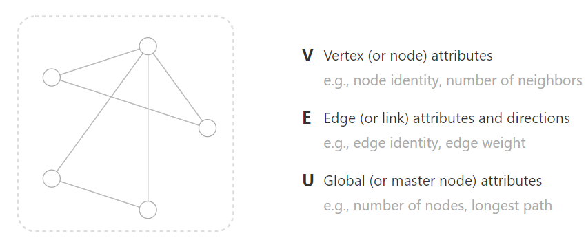

- 每个V，E，U都可以用一个向量表示

  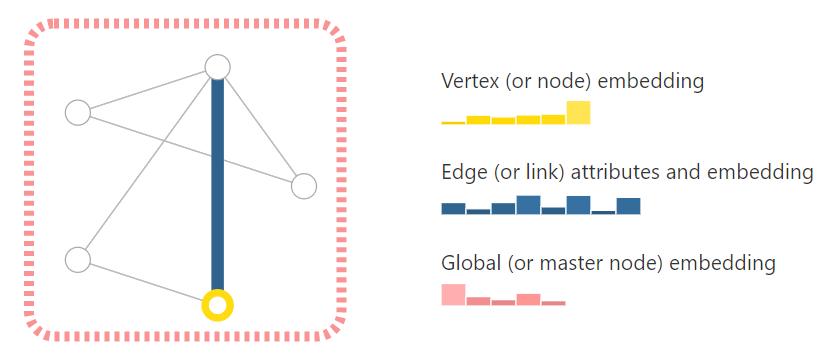

- 图片可以表示成图：相邻的像素都连接起来

  

- 文本可以表示成边

  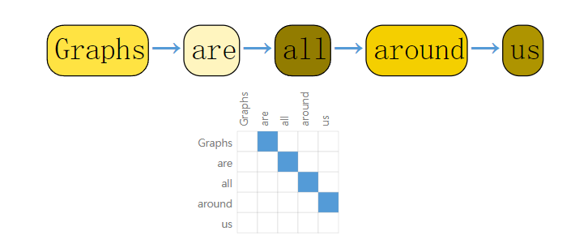

- 哪些问题有图结构的data

  - 图层面任务：例如判断一个图是否有环，可以不使用机器学习即可

  - 顶点层面的任务：两个顶点代表的人决裂之后，其他和他们两个有社交关系的人决定是否和他们一起

    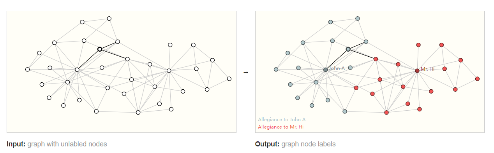

  - 边层面的任务：先对图进行语义分割，然后用图神经网络学习其关系

    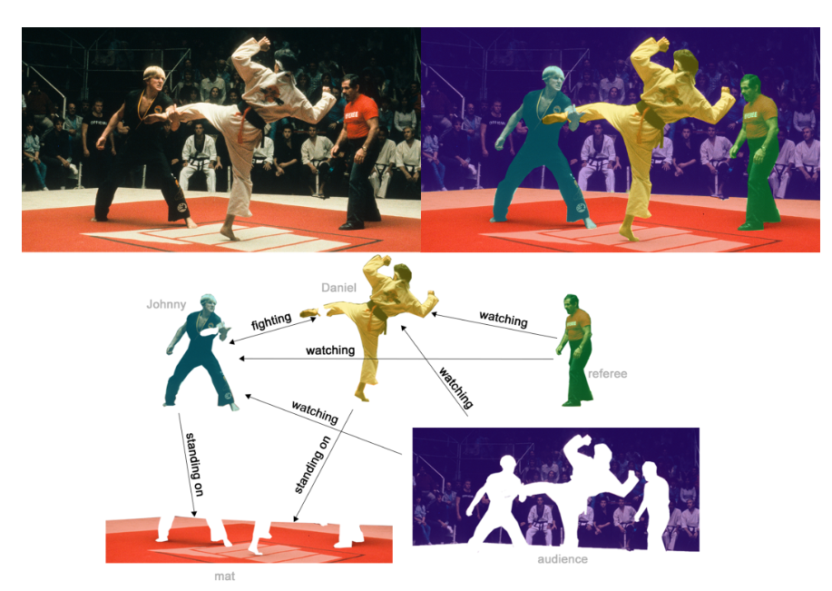

- 机器学习中使用图的挑战

  - 点、边、全局信息都是向量比较好处理，但是连通性如果用邻接矩阵开销就过于大了

  - 邻接矩阵可以有多种表达

    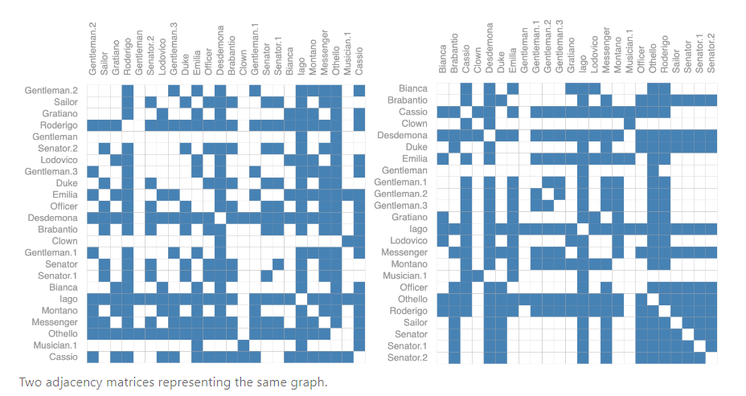

## 图神经网络

- 定义：重点是perserve graph symmetries。使用的框架是message passing neural network，图进图出，不会修改连通性

  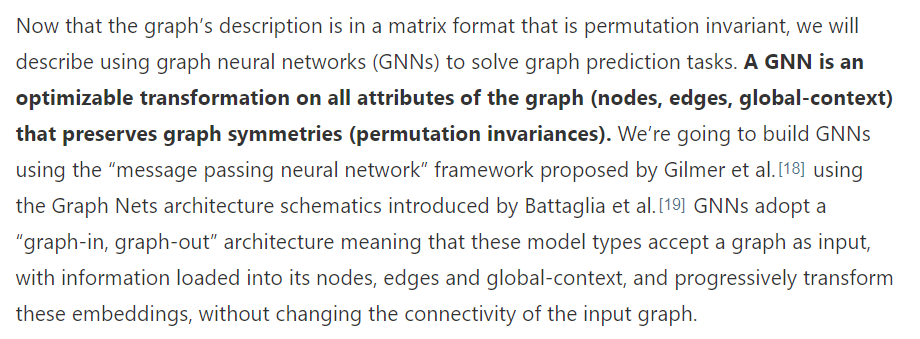

- 最简单的CNN：对顶点、边和全局各通过一个MLP构成了GNN的一个层

  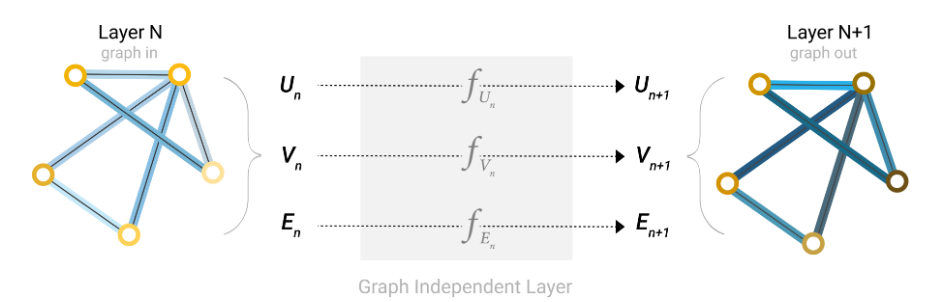

- 最后一层的输出得到预测值

  - 例：对每个顶点做预测。每个顶点都是一个向量，如果做二分类，就通过一个输出维度为2的全连接层，然后加个softmax得到输出

    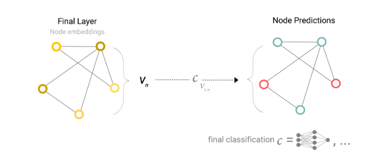

  - Pooling，如果某个点没有向量，那么就取它所有相邻边的向量以及全局向量相加，

    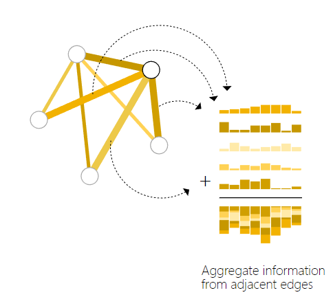

    所以如果没有边的向量信息，那么可以用点的向量信息来聚合Pooling。反之亦然

    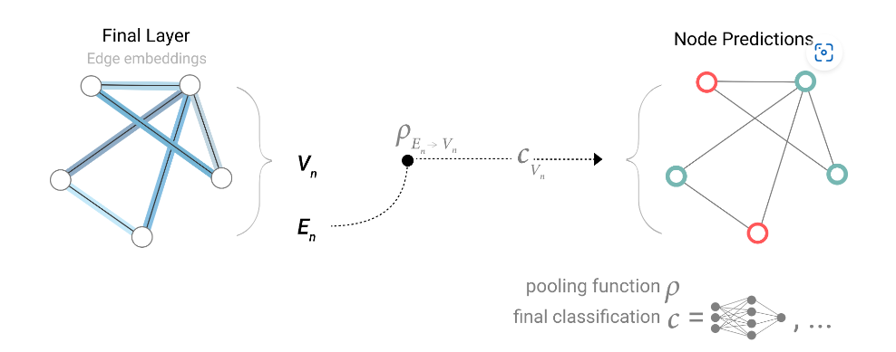

    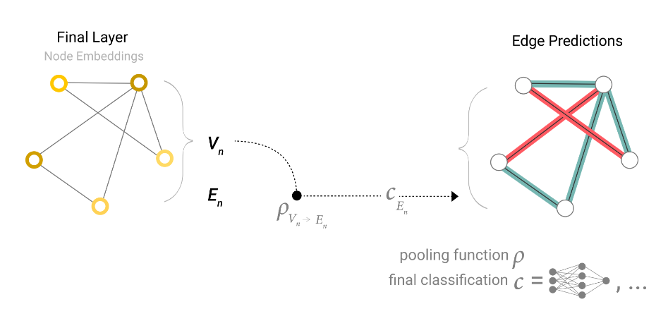

  - 网络结构：不同属性经过GNN层得到变化之后的图，然后用聚合操作得到希望预测的属性，然后通过全连接层得到最后的Prediction

    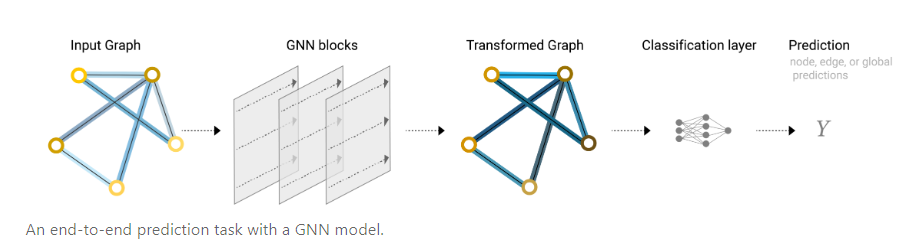

  - 上述结构存在问题，点与点的相邻关系等都没有包含进去

- Message passing信息传递

  - 进入MLP之前，输入点相邻的点也要输入到MLP中

    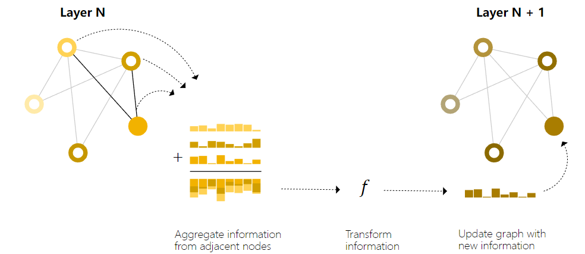

  - 信息传递最简单的是一近邻。

    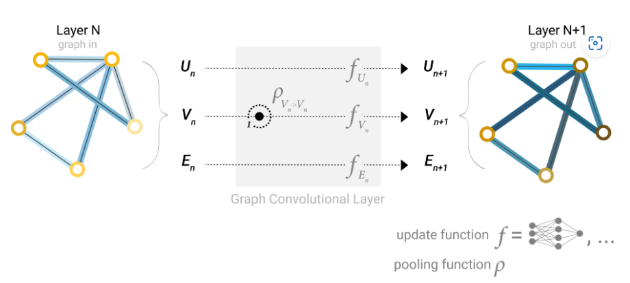

  - 另外可以不在最后一层做Pooling，可以提前在前面的层先汇聚起来

  - 例子：$\rho(V_n\rightarrow E_n)$表示将顶点信息汇聚到边上

    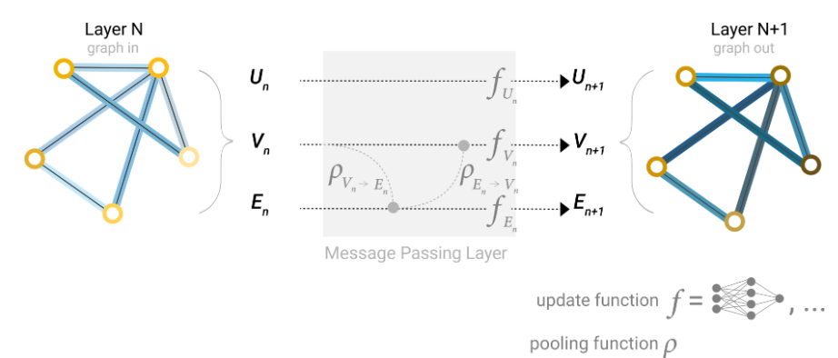

- 全局信息

  - 某些点相距较远，需要比较长时间才能传递到

  - 加入一个虚拟的点 master node或者叫 context vector

    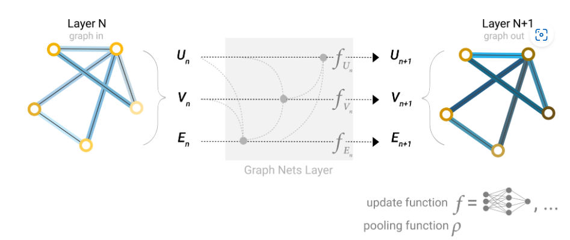

## 实验

略

## 相关技术

- 采样

  - CNN中会使用随机采样。GNN中使用的是如下策略

    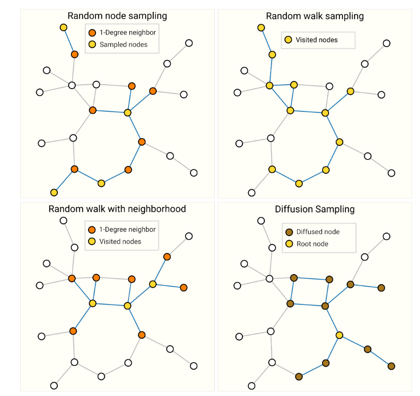

- GNN的假设：图的连通性

- GCN：图卷积神经网络，带汇聚的GNN

