# GAN

## Abstract

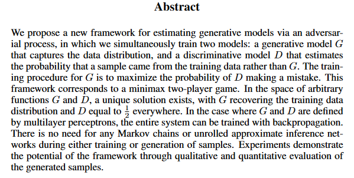

## Introduction

- 深度学习在生成上的问题

  > 深度生成模型的影响较小，这是由于在最大似然估计和相关策略中出现了许多难以近似的概率计算，并且很难利用分段线性单元在生成环境中的优势。我们提出了一种新的生成模型估计过程，可以避开这些困难。

- 生成模型：造假者；判别模型：警察

- 生成模型是一个MLP，通过随机噪音生成sample；判别模型也用MLP

## Related Work

- 之前的工作都是构造概率分布函数，然后提供参数供他学习，这些参数通过最大化它的对数似然函数来估计，但是这些计算比较困难。这种方法就是构造一个分布函数，然后计算出具体的均值方差等

  > 对数似然函数是一种用于最大似然估计的函数。最大似然估计是一种统计推断方法，用于估计参数值，使得给定观测数据的条件下，该参数下的概率密度函数或概率质量函数最大化。
  >
  > 在数学中，给定数据样本集合，对数似然函数是指这个样本集合的概率密度函数或概率质量函数的对数形式，这个函数的值越大，表示该参数估计值越优。
  >
  > 通常情况下，对数似然函数的形式是一个关于参数的函数，用参数的估计值代入函数中得到的结果最大化，即是最大似然估计的结果。
  >
  > 对数似然函数的使用可以简化计算，因为将似然函数取对数后，可以将连乘变为连加，减少了数值计算的复杂度。此外，对数似然函数还有其它一些优点，如避免数值下溢、易于求导等。

  > 生成模型是一种机器学习模型，用于学习样本数据的概率分布函数。与生成模型相对应的是判别模型，判别模型直接从输入到输出映射，不考虑数据的分布情况。
  >
  > 生成模型通常基于概率分布函数，用于生成与样本数据类似的新数据。因此，生成模型需要对样本数据的概率分布进行建模，以便生成新的数据。
  >
  > 对数似然函数可以被用来评估概率分布函数的质量，因为它是衡量模型对样本数据拟合的常用指标。通常，生成模型使用对数似然函数作为目标函数进行优化，以最大化对数似然函数的值。
  >
  > 具体来说，最大化对数似然函数可以使得生成模型的输出更加接近于样本数据的真实分布，从而提高模型的生成能力。此外，对数似然函数的优化通常可以通过梯度下降等优化算法进行，因此，可以使用数值优化方法来求解最优的模型参数，以最大化对数似然函数的值。
  >
  > 因此，生成模型通常会构造概率分布函数，并通过最大化对数似然函数来训练模型，以便生成与样本数据类似的新数据。

- 本文是构造一个模型来近似一个分布，坏处是不知道分布是什么样子

- 理论基础：对期望的求导等于对f的求导

  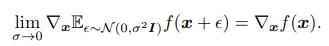

## 模型

- 一个比喻：现在有个游戏，它的画面是800万像素的图像，我要用生成器近似生成出这个游戏。生成器是一个概率分布$p_g$（即我们学出来的“假”游戏），800万像素的图片是目标 $x$，每个像素都来自于这个$p_g$。我们首先在一个输入噪音 $z$ （$z$ 可以是一个100维的向量，其中元素均值为0方差为1的高斯噪音）上定义一个先验的概率 $p_z(z)$，生成模型就是将 $z$ 映射成 $x$（我认为一个100维的变量就决定了这个游戏逻辑，实际上不知道真实游戏的代码），它有一个可学习的参数 $\theta_g$，我们可以将生成器定义为 $G(z;\theta_g)$。所以每次都随机一个 $z$ 去看生成的效果。

- 判别器是MLP到1或0的函数，1表示是真图，0表示假图

- 所以$G$要最小化 $\log (1-D(G(z)))$，让$D$尽量犯错，不让他分辨出来。

- 目标：$x\sim p_{data}(x)$ 表示 $x$ 是采样真实分布，第一项如果 $D$ 是完美的那么 $D(x)=1,\log D(x)=0$，否则为负数；第二项，采样噪音，如果 $D$ 是完美的，那么 $D(G(z))=0,\log(1-D(G(z)))=0$，否则为负数，所以要 $\max\limits_{D}$。

  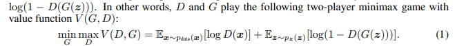

- 达到均衡就是纳什均衡

- 例子：下图黑点线$p_x$是数据真实分布，绿色线$p_g$是生成器的分布，蓝色点线是$D$是判别器的分布。图(b)中可以看到接近黑点线的时候，判别器靠近1，接近绿线靠近0，(c)中将绿线往黑点线靠近，使得判别器对两个区分很困难，最后图(d)中判别器永远给出0.5

  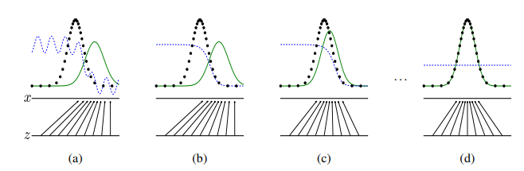

- 算法：每次迭代（最外层的for-loop）里，先进行$k$次$2m$大小的小批量采样（噪音样本和真实样本各一半），然后对$D$进行梯度更新，然后再采样$m$的噪音样本对$G$进行梯度更新。

  这里$k$是超参数，如果对$D$没有足够好的更新，那么下面一项中$D$没有升级，$G$的升级就没有意义反正总能糊弄过去；但是如果$D$更新的太完美，就会导致结果为0，没有梯度

  判断收敛比较难。

  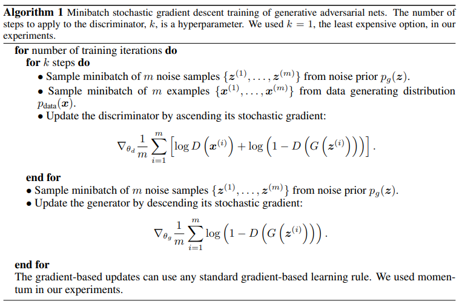

- 问题：一开始$G$很弱，很容易将$D$训练到完美，导致梯度消失，可以考虑最大化$\log D(G(z))$，但是$\log 0$会有数学上的问题，后来会有改进

  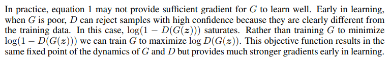

## 理论

- 下图中$p$表示概率分布（0到1的值），如果最后$p_{data}=p_{g}$那么$D^*_G=\frac12$，二分类器区分两个分布的很好的办法

  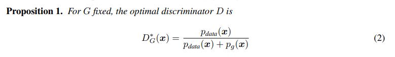

- 概率论期望的求解：
  $$
  E_{x\sim p}f(x)=\int_xp(x)f(x)dx
  $$
  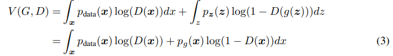

  注意：$g(z)=x$

  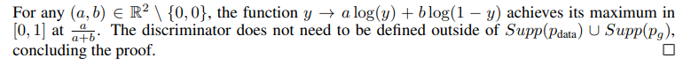

  对 $a\log(y)+b\log (1-y)$求导即可得最大值，它是凸函数

- 求出 $\max\limits_{D}$：

  

- 再求 $\min\limits_{G}$：

  首先要学习一下 KL 散度（暂时不会），$KL(p||q)=E_{x\sim p}\log\frac{p(x)}{q(x)}$，表示在知道 $p$ 的情况下至少要多少比特才能将 $q$ 描述出来

  两个KL散度可以拼成JS散度，KL散度是非对称的，JS散度是对称的

  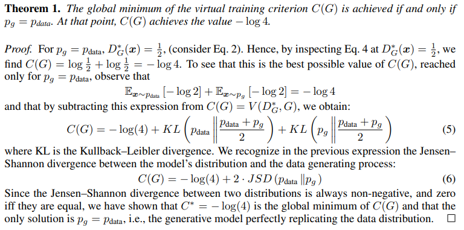

- 有人说因为GAN使用了对称散度所以训练简单，未来还有工作用更简单的目标函数

- 证明二：

  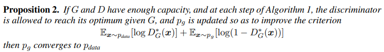

