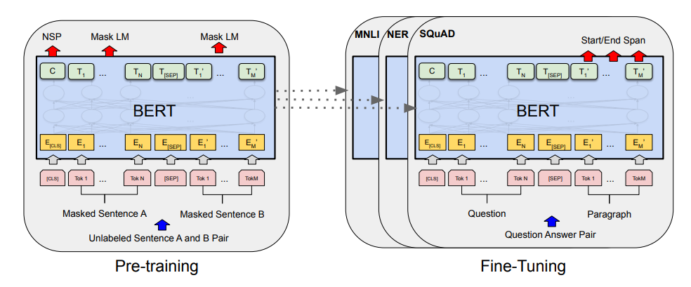
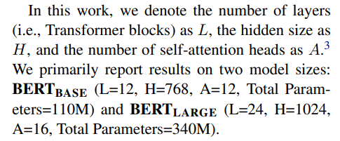
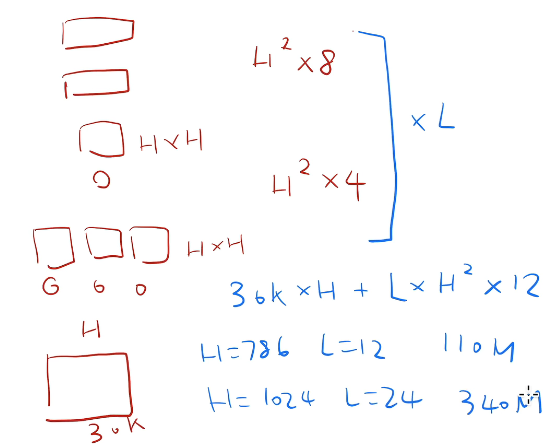
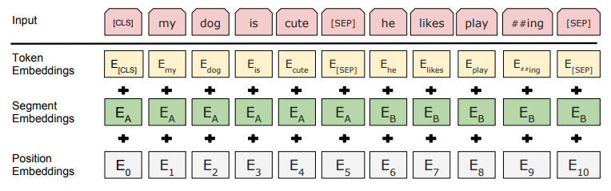
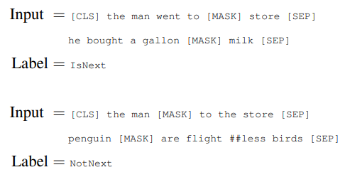

# BERT

## 标题

- BERT: Pre-training of Deep Bidirectional Transformers for Language Understanding
- 重点是Bidirectional 双向
- BERT全称 Bidirectional Encoder Representations from Transformers

## Abstract

- 工作来源于ELMo，这个是芝麻街中的人物，而BERT是其中另一个人物。后来芝麻街中的人物都被用了个遍
- BERT和GPT的区别是GPT只用了右侧信息，而BERT用了左右侧信息。ELMo是用RNN，下游任务需要微调架构，但BERT泛用性强
- 在11个任务中实现SOTA。介绍了绝对优势（正确率）和相对优势（正确率的提升）

## 导言

- 目前使用预训练模型到下游任务的有两种思路

  - feature-based

    例如ELMo，将预训练表示作为额外的特征输入到模型中。使用了双向信息但是用的是老的RNN

    > 预训练模型中的feature-based指的是使用预训练模型的中间层（通常是最后一层）的输出作为特征来进行下游任务。这些特征通常被称为“预训练特征”或“表示”。
    >
    > 预训练模型通过在大规模未标注数据上进行预训练来学习通用的特征表示，这些表示可以被用于各种下游任务，如文本分类、命名实体识别、情感分析等。在使用预训练模型进行下游任务时，可以将预训练模型的中间层输出作为输入特征，然后将这些特征提供给下游模型，如传统的机器学习算法或者其他神经网络模型，以完成具体的任务。

  - fine-tuning

    例如GPT，微调参数。只用了单向信息。

- 这两种方法都使用相同的目标函数，并且是单向的

- 很多语言任务并不一定是从左看到右，文本两个方向的信息都有用

- BERT思路：用mask掩码盖住部分文本做完型填空，可以看左右的信息；另外还训练了判断两个给定句子在原文中是否相邻

## 模型

- 预训练：没有标号的数据；微调：有标号的数据

  

- 对Transformer进行了调参

  

- 参数量的计算：最下面是嵌入层，字典为30K大小变成model大小为H。然后多头对query/key/value各有一个矩阵，矩阵大小为$H*H$（论文中写的$d_{model}*d_v*head$，而$d_v*head=d_{model}$），然后再变回去需要一个$H*H$。上面全连接层是$H*(4H)$和$(4H)*H$。然后有$L$个transformer block

  

  

  

- BERT输入是一个句子或者句子对（例如答案和回答作为一对输入），称为sequence。而Transformer是一个sequence对，因为encoder和decoder各需要一个sequence。

- 切词的方法是WordPiece。如果按空格切词，那么会导致嵌入层的参数量过大

  > WordPiece是一种用于自然语言处理中的分词方法，它将单词拆分成较小的子词或标记，这些子词或标记被称为WordPieces。WordPiece模型在训练过程中会根据语料库的频率和语言模型选择最优的WordPieces，这样可以更好地处理未知词汇和罕见词汇。WordPiece已被广泛应用于机器翻译、语音识别和文本分类等任务中。
  >
  > 
  > 以英语单词"unbelievable"为例，使用WordPiece分词方法可以将其拆分成较小的子词或标记，如下所示：
  >
  > un- ##be- ##liev- ##able
  >
  > 其中，"##"表示这是一个WordPiece的一部分。这样，单词"unbelievable"就被拆分成了四个WordPieces，这些WordPieces可以更好地处理未知词汇和罕见词汇，从而提高自然语言处理的效果。

- BERT在句子最前面加上了一个`[CLS]`的特殊标记表示Classification，在两个句子中间加上了`[SEP]`。将每个词都embed之后然后输入BERT，得到输出$C,T_1,\dots,T_N,T_{[SEP]},T_1',\dots,T_M'$，然后再接输出层。

  

  > 嵌入层（Embedding Layer）是深度学习模型中的一种常见层类型，用于将离散的输入数据（如单词、类别等）转换为连续的向量表示。它的作用类似于字典，将每个离散数据映射到一个唯一的向量，从而使得数据可以被神经网络处理。嵌入层的输出向量是根据输入数据在训练过程中学习到的，因此可以捕捉到数据之间的语义关系，例如相似性和相关性。在自然语言处理、推荐系统等领域中，嵌入层是非常常用的。

- 嵌入层的实现：

  

- Task1：Masked LM（MLM）

  对WordPiece生成的词元，有15%的概率随机替换成一个掩码$[MASK]$，让BERT来预测。而微调的时候没有这个掩码，可能会导致一些问题（不匹配）。解决方法：对于15%选中token。有时候并不是真的替换这个词为$[MASK]$（80%概率），剩下10%替换成一个随机token，剩下10%不变。

- Task2：Next Sentence Prediction （NSP）

  两种情况，A和B是相邻的，标上`IsNext`；A和B不相邻，标上`NotNext`。这能提高QA和推理的效果

  

- 微调BERT

  不能像Transformer一样做机器翻译