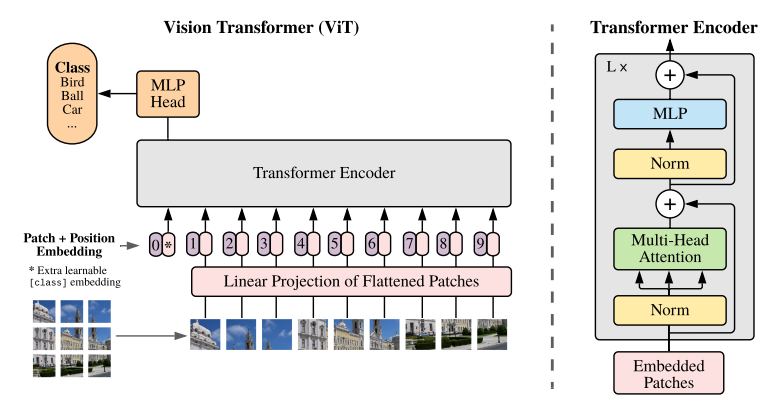
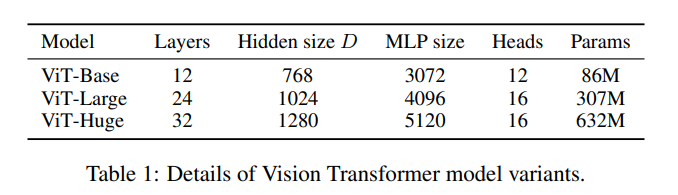
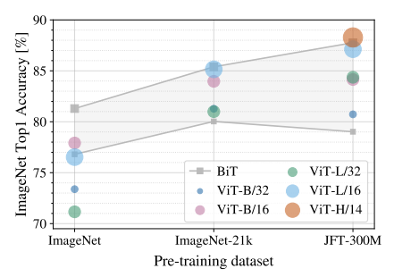

# ViT

## 标题

- An Image is Worth 16x16 Words: Transformers for Image Recognition at scale
- 这里是16x16表示的是图片可以看成16x16的patch组成的整体

## 摘要

- 单卡TPUv3训练需要2500天

## 引言

- NLP领域一般是在大规模数据集上做预训练，然后在特定领域的小数据集上做微调
- Transformer处理的是序列，因为要做序列元素两两运算，所以复杂度是$O(n^2)$，所以序列一般不会很长，BERT使用512长度，图片这里不能直接将2D拉成1D，需要降低序列长度
- 之前的工作有：
  - CNN和自注意力结合：在Res50最后一层的特征图加上attention，最后一层这个时候只有14*14了；
  - 替换掉整个CNN：孤立自注意力，取局部窗口；轴注意力，分别在高度和宽度上做一次自注意力。没有硬件优化，比较慢，所以模型比较小
- ViT是将图片的小patch通过全连接层得到一个linear embeddings，然后作为输入给Transformer，图片块当做是单词
- 有监督监督
- 结果：在没有强的约束的时候，在中等数据集上和同等大小的ResNet相比并不好，这是可预期的，因为Transformer没有CNN的归纳偏置 inductive biases（先验知识，提前的假设）
  - CNN的归纳偏置是locality和translation equivariance（后者是$f(g(x))=g(f(x))$，这里$g$是平移，$f$是卷积）
  - 当有足够数据预训练的时候效果就好（相当于要更多数据来学出这些归纳偏置）

## 结论

- 在CV领域用标准的Transformer
- 除了图片切割和位置编码用到了图像特有的归纳偏置，其他都没有，好处是对vision领域不需要有很多了解即可
- 其他CV任务也可以用包括分割和识别。后来做了ViT-FRCNN和SETR，Swin Transformer
- 自监督有用，但和无监督还是差很多
- 还能做的更大，后来提出ViT-G，刷ImageNet到90分以上

## 相关工作

- 写的非常详细，此处略

## ViT模型

- 整体架构图

  - 加入位置编码
  - 最后有很多输出结果，这里学习BERT，在最前面加一个`[CLS]`标记也就是下图中的`0*`，然后看这个token的最后结果，当做整个模型的输出

  

- 上面的全连接层称为 $E$，维度是 768\*768（图片原大小是224\*224，切成16\*16方格得到14\*14个patch即196，768是16\*16\*3是每个patch的大小）

- 每张图片（共196张）变成768长度的向量，前面再加一个`CLS`，得到Transformer输入长度197\*768

- 位置编码也是768长度的向量，然后相**加**，而不是拼接

- 位置编码选用1D和2D发现效果类似

- CLS的使用

  - 在Res50中，最后得到一个14\*14的特征图，然后会通过一个GAP（Global Average Pooling）得到一个向量来分类，为什么ViT不做GAP而用CLS？
  - 通过实验发现这两个方法都可以，但是作者是Transformer原教旨主义

- 位置编码

  - 1D位置编码
  - 2D位置编码，横纵坐标分别编码成768/2的长度然后拼接起来
  - 相对位置编码，用相对位置
  - 通过结果发现以上三种效果类似

- 微调

  - 预训练好的模型不太好调输入图片的尺寸，一旦图片增大序列长度就会增大（patch大小不变），虽然基本能用，但是提前训练的位置编码就没用了。
  - 解决上述方法是用插值，但是只是权宜之计

## 实验

- 自监督效果还可以，后来MAE使用自监督来训练ViT效果非常好

- 命名方法：

  

  ViT-L16表示，ViT-Large模型且patch size是16\*16

- 和CNN大模型比，分数都很高，而Transformer训练成本相对低一些

- 最重要的图：在小的数据集上ViT不如ResNet，在大数据集上相近

  