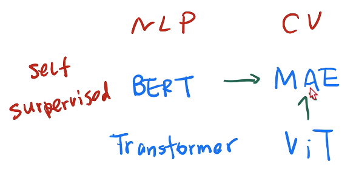
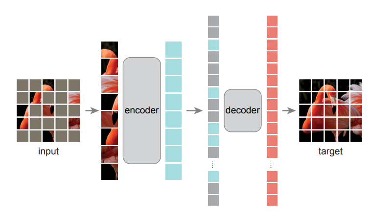

# MAE

## 标题

- 标题：Masked Autoencoders Are Scalable Vision Learners
- 东西快就是Efficient，东西大就是Scalable
- Auto表示标号和样本来自同一个东西，在语言领域基本都是auto，但是在CV领域比较难做到auto，因为一般是另外标注的内容，而本文标号就是图片本身
- 标题是一句浓缩后的结论比较客观，适合当标题

## 摘要

- MAE的方法很简单：随机盖住一些块，然后重建它们
- 两个核心设计
  - 非对称的编码器和解码器设计：编码器只对可见的patch做编码（能大幅加速计算），解码器能重构图片
  - 当输入图片mask的比例很高的时候，比如75%的时候，可以迫使模型去学习更有意义的特征

## 关键图

- 架构图

  - 这里Encoder画的比Decoder高，表示计算量主要在Encoder这里

  

## 导言

- 在Vision和Language领域Masked Autoencoder不同的原因
  - CNN中的掩码就是将部分像素置为特定值，但是卷积对边界并不敏感，这已经被ViT解决了
  - 两者的信息密度不同。语言高度语义化，但图片中有很多冗余甚至可以通过插值还原，方法就是高比例
  - 解码器的role不同。在语言中decoder只要一个全连接层就可以了，但是vision中就比较困难

## MAE模型

- 非对称结构：编码器只看到可见的块，解码器能看到
- 解码器可以看到
  - encoded visible patches：编码器对可见部分的浅表示
  - mask tokens：可以学习的向量
- 解码器也是一个Transformer，所以也需要给mask token加入位置信息（但是从编码器来的token没说要不要加入位置信息）
- 解码器最后一层是一个线性层，输出可能是256维向量然后reshap成16\*16
- 损失函数MSE
- 做正则化效果更好（均值变成0，方差变成1）

## 实验

- 使用ViT，之前说ViT必须要使用很大的数据集才有好的效果，但是其实加入一些正则项也能使结果变好，在ImageNet-1K的数据集上也能实现
- MAE对数据增强不敏感，随机crop效果就很好
- 随机采样效果最好